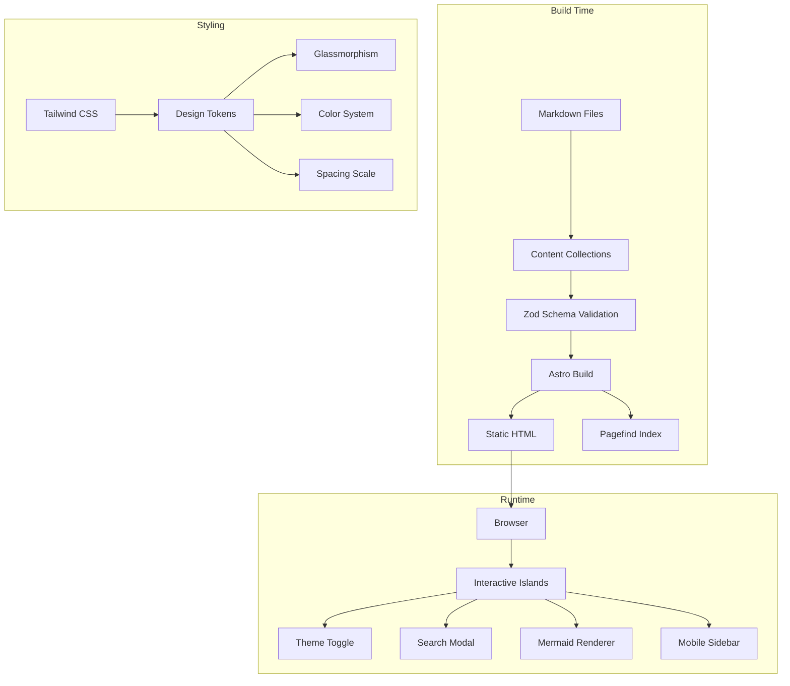
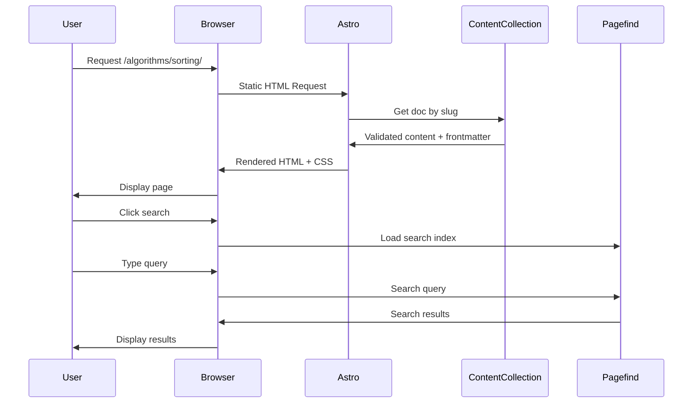

# Design Document: Astro Migration

## Overview

This design document outlines the technical architecture for migrating the existing VitePress-based Knowledge Wiki to Astro. The migration preserves the custom glassmorphism theme, Mermaid diagram support, auto-generated sidebar, and all existing features while leveraging Astro's island architecture for optimal performance.

The design follows a component-based architecture with clear separation between layout components, UI components, and content components. Astro's content collections provide type-safe content management, while Tailwind CSS handles styling with custom design tokens for the glassmorphism aesthetic.

## Architecture

### High-Level Architecture



### Directory Structure

```
astro-site/
├── src/
│   ├── components/
│   │   ├── layout/
│   │   │   ├── Navbar.astro          # Floating glass navbar
│   │   │   ├── Sidebar.astro         # Auto-generated sidebar
│   │   │   ├── Footer.astro          # Site footer
│   │   │   └── MobileMenu.astro      # Mobile hamburger menu
│   │   ├── ui/
│   │   │   ├── GlassCard.astro       # Reusable glass card
│   │   │   ├── ThemeToggle.astro     # Light/dark toggle
│   │   │   ├── SearchButton.astro    # Search trigger
│   │   │   └── Button.astro          # Base button component
│   │   ├── content/
│   │   │   ├── CodeBlock.astro       # Enhanced code blocks
│   │   │   ├── MermaidDiagram.astro  # Mermaid renderer
│   │   │   ├── ArticleMeta.astro     # Article metadata display
│   │   │   └── TableOfContents.astro # TOC component
│   │   └── interactive/
│   │       ├── SearchModal.tsx       # Search UI (React island)
│   │       ├── MermaidModal.tsx      # Diagram zoom modal
│   │       └── CodeModal.tsx         # Code zoom modal
│   ├── layouts/
│   │   ├── BaseLayout.astro          # HTML shell, head, scripts
│   │   ├── DocLayout.astro           # Documentation page layout
│   │   ├── HomeLayout.astro          # Homepage layout
│   │   └── TimelineLayout.astro      # Timeline page layout
│   ├── pages/
│   │   ├── index.astro               # Homepage
│   │   ├── timeline.astro            # Timeline page
│   │   ├── 404.astro                 # Not found page
│   │   └── [...slug].astro           # Dynamic doc routes
│   ├── content/
│   │   ├── config.ts                 # Content collection config
│   │   └── docs/                     # Symlink to /docs content
│   ├── styles/
│   │   ├── global.css                # Global styles, Tailwind
│   │   └── design-tokens.css         # CSS custom properties
│   └── lib/
│       ├── sidebar.ts                # Sidebar generation logic
│       ├── search.ts                 # Search utilities
│       └── utils.ts                  # General utilities
├── public/
│   ├── favicon.ico
│   └── logo.svg
├── astro.config.mjs
├── tailwind.config.mjs
├── tsconfig.json
└── package.json
```

### Data Flow



## Components and Interfaces

### Layout Components

#### BaseLayout.astro

The root layout providing HTML structure, meta tags, and global scripts.

```typescript
interface BaseLayoutProps {
  title: string;
  description?: string;
  image?: string;
  canonicalUrl?: string;
  noIndex?: boolean;
}
```

**Responsibilities:**
- HTML document structure with proper lang attribute
- Meta tags for SEO (title, description, Open Graph, Twitter Cards)
- Favicon and theme-color meta
- Global CSS imports (Tailwind, design tokens)
- Theme initialization script (prevents flash)
- Pagefind search script loading

#### DocLayout.astro

Layout for documentation pages, extending BaseLayout.

```typescript
interface DocLayoutProps extends BaseLayoutProps {
  frontmatter: {
    title: string;
    date?: string;
    category?: string | string[];
    tags?: string[];
    description?: string;
  };
  headings: { depth: number; slug: string; text: string }[];
  lastModified?: string;
  editUrl?: string;
}
```

**Responsibilities:**
- Navbar with current section highlighting
- Sidebar with auto-generated navigation
- Main content area with proper spacing
- Table of contents (desktop)
- Article metadata display
- Edit on GitHub link
- Footer

### UI Components

#### Navbar.astro

Floating glassmorphism navbar component.

```typescript
interface NavbarProps {
  currentPath: string;
  logo: {
    src: string;
    alt: string;
  };
  navItems: NavItem[];
  socialLinks: SocialLink[];
}

interface NavItem {
  text: string;
  link: string;
  items?: NavItem[]; // For dropdown menus
}

interface SocialLink {
  icon: 'github' | 'twitter' | 'linkedin';
  link: string;
  label: string;
}
```

**CSS Implementation:**
```css
.navbar {
  position: fixed;
  top: 12px;
  left: 16px;
  right: 16px;
  background: rgba(255, 255, 255, 0.75);
  backdrop-filter: blur(20px) saturate(180%);
  border: 1px solid rgba(255, 255, 255, 0.3);
  border-radius: 16px;
  box-shadow: 
    0 4px 30px rgba(0, 0, 0, 0.08),
    0 1px 3px rgba(0, 0, 0, 0.05);
  z-index: 100;
}

.dark .navbar {
  background: rgba(20, 20, 22, 0.85);
  border: 1px solid rgba(255, 255, 255, 0.1);
}
```

#### Sidebar.astro

Auto-generated navigation sidebar.

```typescript
interface SidebarProps {
  items: SidebarItem[];
  currentPath: string;
}

interface SidebarItem {
  text: string;
  link?: string;
  items?: SidebarItem[];
  collapsed?: boolean;
}
```

**Features:**
- Collapsible sections with 250ms animation
- Active item indicator (3px brand-colored border)
- Scroll position preservation
- Mobile overlay mode

#### ThemeToggle.astro

Light/dark mode toggle with system preference detection.

```typescript
// No props - self-contained component
// Uses localStorage key: 'theme'
// Values: 'light' | 'dark' | 'system'
```

**Implementation:**
- Inline script for immediate theme application (no flash)
- System preference detection via `matchMedia`
- Smooth transition on toggle
- Icon animation (sun/moon)

### Content Components

#### MermaidDiagram.astro

Server-rendered Mermaid diagrams with client-side interactivity.

```typescript
interface MermaidDiagramProps {
  code: string;
  id: string;
}
```

**Rendering Strategy:**
1. Build time: Render Mermaid to SVG using `mermaid` package
2. Runtime: Hydrate for click-to-zoom functionality
3. Fallback: Display source code if rendering fails

#### CodeBlock.astro

Enhanced code block with copy functionality.

```typescript
interface CodeBlockProps {
  code: string;
  lang: string;
  filename?: string;
  showLineNumbers?: boolean;
  highlightLines?: number[];
}
```

**Features:**
- Shiki syntax highlighting
- Line numbers (configurable)
- Copy button with feedback
- Language label
- Optional filename display
- Click-to-expand modal

### Interactive Islands (React/Vue)

#### SearchModal.tsx

Client-side search interface using Pagefind.

```typescript
interface SearchModalProps {
  isOpen: boolean;
  onClose: () => void;
}

interface SearchResult {
  url: string;
  title: string;
  excerpt: string;
  category?: string;
}
```

**Features:**
- Keyboard navigation (↑↓ Enter Esc)
- Debounced search input
- Result highlighting
- Category badges
- Recent searches (localStorage)

## Data Models

### Content Collection Schema

```typescript
// src/content/config.ts
import { defineCollection, z } from 'astro:content';

const docsCollection = defineCollection({
  type: 'content',
  schema: z.object({
    title: z.string(),
    description: z.string().optional(),
    date: z.coerce.date().optional(),
    category: z.union([z.string(), z.array(z.string())]).optional(),
    tags: z.array(z.string()).optional(),
    layout: z.enum(['doc', 'home', 'page']).default('doc'),
    draft: z.boolean().default(false),
    order: z.number().optional(),
    // Preserve existing VitePress frontmatter compatibility
    sidebar: z.boolean().default(true),
    outline: z.union([z.boolean(), z.array(z.number())]).optional(),
  }),
});

export const collections = {
  docs: docsCollection,
};
```

### Sidebar Generation Data Model

```typescript
interface SidebarConfig {
  sections: SidebarSection[];
}

interface SidebarSection {
  title: string;
  basePath: string;
  items: SidebarItem[];
}

interface SidebarItem {
  text: string;
  link: string;
  order: number;
  items?: SidebarItem[];
}

// Generated from file system structure
function generateSidebar(contentDir: string): SidebarConfig {
  // Scan directories
  // Read frontmatter for titles and order
  // Build hierarchical structure
  // Sort by order or alphabetically
}
```

### Theme Configuration

```typescript
interface ThemeConfig {
  colors: {
    primary: string;      // #5E5CE6
    secondary: string;    // #7B7BF7
    background: {
      light: string;
      dark: string;
    };
    text: {
      primary: { light: string; dark: string };
      secondary: { light: string; dark: string };
      muted: { light: string; dark: string };
    };
    border: {
      light: string;
      dark: string;
    };
  };
  glass: {
    blur: {
      navbar: string;     // 20px
      sidebar: string;    // 12px
      card: string;       // 16px
    };
    opacity: {
      light: number;      // 0.75
      dark: number;       // 0.85
    };
  };
  shadows: {
    sm: string;
    md: string;
    lg: string;
  };
  transitions: {
    fast: string;         // 150ms
    normal: string;       // 250ms
    slow: string;         // 350ms
  };
}
```

### Design Tokens (CSS Custom Properties)

```css
:root {
  /* Colors */
  --color-primary: #5E5CE6;
  --color-secondary: #7B7BF7;
  --color-bg: #FFFFFF;
  --color-bg-soft: #F5F5F7;
  --color-text-1: #1D1D1F;
  --color-text-2: #6E6E73;
  --color-border: rgba(0, 0, 0, 0.1);
  
  /* Glass Effects */
  --glass-blur-navbar: 20px;
  --glass-blur-sidebar: 12px;
  --glass-opacity: 0.75;
  --glass-saturation: 180%;
  
  /* Shadows */
  --shadow-sm: 0 1px 3px rgba(0, 0, 0, 0.05);
  --shadow-md: 0 4px 12px rgba(0, 0, 0, 0.08);
  --shadow-lg: 0 8px 30px rgba(0, 0, 0, 0.12);
  
  /* Spacing */
  --space-1: 0.25rem;
  --space-2: 0.5rem;
  --space-3: 0.75rem;
  --space-4: 1rem;
  --space-6: 1.5rem;
  --space-8: 2rem;
  
  /* Transitions */
  --transition-fast: 150ms ease-out;
  --transition-normal: 250ms ease-out;
  --transition-slow: 350ms ease-out;
  
  /* Border Radius */
  --radius-sm: 6px;
  --radius-md: 12px;
  --radius-lg: 16px;
}

.dark {
  --color-bg: #1C1C1E;
  --color-bg-soft: #2C2C2E;
  --color-text-1: #F5F5F7;
  --color-text-2: #A1A1A6;
  --color-border: rgba(255, 255, 255, 0.1);
  --glass-opacity: 0.85;
}
```


## Correctness Properties

*A property is a characteristic or behavior that should hold true across all valid executions of a system—essentially, a formal statement about what the system should do. Properties serve as the bridge between human-readable specifications and machine-verifiable correctness guarantees.*


Based on the prework analysis, the following properties have been identified as testable and non-redundant:

### Property 1: Frontmatter Schema Validation

*For any* markdown file with frontmatter containing title, date, category, tags, and description fields, the Content_Collection schema SHALL accept valid values and reject invalid types.

**Validates: Requirements 2.1, 15.1**

### Property 2: Content URL Routing

*For any* content file at path `docs/{category}/{subcategory}/{filename}.md`, the generated URL SHALL be `/{category}/{subcategory}/{filename}/` (matching existing VitePress structure).

**Validates: Requirements 2.6**

### Property 3: Code Block Rendering

*For any* code block with a specified language, the rendered HTML SHALL contain syntax-highlighted code with line numbers and a language label.

**Validates: Requirements 2.4, 13.1, 13.4**

### Property 4: Mermaid Diagram Rendering

*For any* valid mermaid code block (flowchart, sequence, gantt, state, class, or ER), the rendered output SHALL contain an SVG element.

**Validates: Requirements 3.1**

### Property 5: Mermaid Error Handling

*For any* invalid mermaid code block, the rendered output SHALL contain the original source code and an error indicator.

**Validates: Requirements 3.5**

### Property 6: Sidebar Generation from Folder Structure

*For any* content folder hierarchy, the Sidebar_Generator SHALL produce a navigation structure that mirrors the folder structure with correct nesting.

**Validates: Requirements 5.3**

### Property 7: Sidebar Active State

*For any* current page path, the corresponding sidebar item SHALL have the active class applied, and no other items SHALL have the active class.

**Validates: Requirements 5.5**

### Property 8: Sidebar Text from Frontmatter

*For any* content file with a frontmatter title, the sidebar item text SHALL match the frontmatter title; if no title exists, it SHALL use the first heading.

**Validates: Requirements 5.7**

### Property 9: Theme Persistence Round-Trip

*For any* theme value ('light' or 'dark'), setting the theme SHALL persist it to localStorage, and reading from localStorage SHALL return the same value.

**Validates: Requirements 6.3**

### Property 10: Color Contrast Compliance

*For any* text/background color pair defined in the design tokens, the contrast ratio SHALL be at least 4.5:1 (WCAG AA).

**Validates: Requirements 6.6**

### Property 11: Search Results Content

*For any* search query that returns results, each result SHALL contain title, excerpt, and category fields, with matching terms highlighted.

**Validates: Requirements 7.3, 7.6**

### Property 12: Timeline Chronological Sorting

*For any* set of articles with dates, the Timeline_Page SHALL display them in descending date order (newest first).

**Validates: Requirements 8.1**

### Property 13: Timeline Year-Month Grouping

*For any* set of articles, the Timeline_Page SHALL group them by year and month, with groups ordered chronologically.

**Validates: Requirements 8.2**

### Property 14: Timeline Entry Content

*For any* article displayed in the timeline, the entry SHALL contain title, date, category, and excerpt.

**Validates: Requirements 8.3**

### Property 15: Timeline Category Filtering

*For any* category filter applied to the timeline, only articles matching that category SHALL be displayed.

**Validates: Requirements 8.4**

### Property 16: Document Metadata Display

*For any* document with frontmatter, the rendered page SHALL display title, date, category, tags, word count, and estimated reading time.

**Validates: Requirements 9.1, 9.2**

### Property 17: Edit Link URL Generation

*For any* document at path `docs/{path}.md`, the edit link SHALL point to `https://github.com/chenweigao/blogv2/edit/main/docs/{path}.md`.

**Validates: Requirements 9.4**

### Property 18: Image Lazy Loading

*For any* image element in the rendered HTML (except above-the-fold images), the `loading` attribute SHALL be set to `lazy`.

**Validates: Requirements 11.4**

### Property 19: SEO Meta Tags

*For any* page, the rendered HTML SHALL contain title, description, canonical URL, Open Graph (og:title, og:description, og:url), and Twitter Card meta tags.

**Validates: Requirements 12.1, 12.2**

### Property 20: Single H1 Per Page

*For any* rendered page, there SHALL be exactly one `<h1>` element.

**Validates: Requirements 12.4**

### Property 21: Image Alt Text

*For any* `` element in the rendered HTML, the `alt` attribute SHALL be present and non-empty.

**Validates: Requirements 12.6**

### Property 22: Base Path in Links

*For any* internal link or asset path in the rendered HTML, the path SHALL be prefixed with `/blogv2/`.

**Validates: Requirements 14.3**

### Property 23: Markdown Highlight Syntax

*For any* markdown text containing `==highlighted text==`, the rendered HTML SHALL contain a `<mark>` element wrapping the highlighted text.

**Validates: Requirements 15.2**

### Property 24: Image Size Syntax

*For any* markdown image with size syntax (e.g., ``), the rendered `` element SHALL have the specified width and height attributes.

**Validates: Requirements 15.3**

### Property 25: Relative Image Path Resolution

*For any* relative image path in markdown, the resolved URL SHALL correctly point to the image location relative to the content file.

**Validates: Requirements 15.4**

### Property 26: Math Equation Rendering

*For any* LaTeX math syntax (`$...$` or `$$...$$`) in markdown, the rendered output SHALL contain properly formatted mathematical notation.

**Validates: Requirements 15.5**

### Property 27: Frontmatter Default Values

*For any* frontmatter with missing optional fields (date, category, tags, description), the system SHALL apply sensible defaults without errors.

**Validates: Requirements 15.6**

## Error Handling

### Build-Time Errors

| Error Type | Handling Strategy |
|------------|-------------------|
| Invalid frontmatter | Zod validation error with file path and field details |
| Missing required frontmatter | Build fails with clear error message |
| Invalid Mermaid syntax | Render source code with error message, continue build |
| Missing image | Warning in console, render broken image placeholder |
| Invalid markdown | Render as plain text, log warning |

### Runtime Errors

| Error Type | Handling Strategy |
|------------|-------------------|
| Search index load failure | Display "Search unavailable" message |
| Theme toggle failure | Fall back to system preference |
| Image load failure | Display alt text in placeholder |
| Copy to clipboard failure | Show "Copy failed" toast message |

### Fallback Strategies

```typescript
// Glassmorphism fallback for unsupported browsers
@supports not (backdrop-filter: blur(1px)) {
  .glass {
    background: var(--color-bg);
    opacity: 0.98;
  }
}

// Reduced motion fallback
@media (prefers-reduced-motion: reduce) {
  * {
    animation-duration: 0.01ms !important;
    transition-duration: 0.01ms !important;
  }
}
```

## Testing Strategy

### Dual Testing Approach

This project uses both unit tests and property-based tests for comprehensive coverage:

- **Unit tests**: Verify specific examples, edge cases, and error conditions
- **Property tests**: Verify universal properties across all valid inputs

### Property-Based Testing Configuration

- **Library**: fast-check (TypeScript property-based testing library)
- **Minimum iterations**: 100 per property test
- **Tag format**: `Feature: astro-migration, Property {number}: {property_text}`

### Test Categories

#### Unit Tests (Specific Examples)

1. **Configuration Tests**
   - Verify astro.config.mjs settings
   - Verify tailwind.config.mjs settings
   - Verify tsconfig.json strict mode

2. **Build Output Tests**
   - Verify sitemap.xml generation
   - Verify 404.html generation
   - Verify Pagefind index generation

3. **Component Structure Tests**
   - Verify navbar contains required elements
   - Verify skip-to-content link exists
   - Verify copy button in code blocks

#### Property-Based Tests

Each correctness property (1-27) will be implemented as a property-based test with:
- Random input generation for the domain
- Assertion of the property invariant
- Minimum 100 iterations

Example test structure:

```typescript
import fc from 'fast-check';

// Feature: astro-migration, Property 2: Content URL Routing
describe('Content URL Routing', () => {
  it('should generate correct URLs from file paths', () => {
    fc.assert(
      fc.property(
        fc.record({
          category: fc.stringOf(fc.constantFrom(...'abcdefghijklmnopqrstuvwxyz-'.split('')), { minLength: 1, maxLength: 20 }),
          subcategory: fc.stringOf(fc.constantFrom(...'abcdefghijklmnopqrstuvwxyz-'.split('')), { minLength: 1, maxLength: 20 }),
          filename: fc.stringOf(fc.constantFrom(...'abcdefghijklmnopqrstuvwxyz-'.split('')), { minLength: 1, maxLength: 20 }),
        }),
        ({ category, subcategory, filename }) => {
          const filePath = `docs/${category}/${subcategory}/${filename}.md`;
          const expectedUrl = `/${category}/${subcategory}/${filename}/`;
          const generatedUrl = generateUrlFromPath(filePath);
          return generatedUrl === expectedUrl;
        }
      ),
      { numRuns: 100 }
    );
  });
});
```

### Integration Tests

1. **Full build test**: Verify complete site builds without errors
2. **Link validation**: Verify all internal links resolve correctly
3. **Search integration**: Verify Pagefind indexes content correctly

### Visual Regression Tests (Optional)

- Screenshot comparison at key breakpoints (375px, 768px, 1024px, 1440px)
- Light/dark mode comparison
- Component state comparison (hover, active, focus)

### Accessibility Tests

- axe-core automated accessibility scanning
- Keyboard navigation verification
- Screen reader compatibility testing
