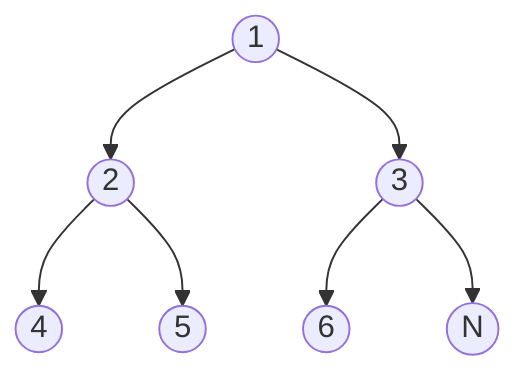

本文主要研究了：

- 二叉树的三种遍历方式：递归和迭代实现
- 二叉树相关的例题解析

<!-- more-->

## 二叉树的前序遍历

### 递归法

```python
# Definition for a binary tree node.
# class TreeNode:
#     def __init__(self, val=0, left=None, right=None):
#         self.val = val
#         self.left = left
#         self.right = right
class Solution:
    def preorderTraversal(self, root: Optional[TreeNode]) -> List[int]:
        def preorder(node):
            if not node:
                return
            res.append(node.val)
            preorder(node.left)
            preorder(node.right)

        res = list()
        preorder(root)
        return res
```

上述就是递归实现的而阐述的前序遍历。除此之外，还有一种不是很 Python 的但是较为通用、方便理解的方法：

```python
class Solution:
    # 前序遍历函数
    def preOrder(self, root: TreeNode, res):
        if root == None:
            return
        res.append(root.val)
        self.preOrder(root.left, res)
        self.preOrder(root.right, res)

    def preorderTraversal(self, root: TreeNode) -> List[int]:
        res = []
        self.preOrder(root, res)
        return res
```

其本质上就是把递归的结果收集 `res` 增加到了递归中去了。

我们还有一种很 Python 的实现方式如下：

```python
class Solution:
    def preorderTraversal(self, root: Optional[TreeNode]) -> List[int]:
        if not root:
            return []

        return [root.val] + self.preorderTraversal(root.left) + self.preorderTraversal(root.right)
```

是不是很优雅？哈哈，值得深入去理解！

### 迭代法

前序遍历的迭代实现依赖于栈结构，具体而言不是很好理解的，需要多加理解才可以，其实现如下：

```python
class Solution:
    def preorderTraversal(self, root: Optional[TreeNode]) -> List[int]:
        res = []
        stack = []
        while stack or root:
            while root:
                res.append(root.val)
                stack.append(root.right)
                root = root.left
            root = stack.pop()

        return res
```

从上述代码中可以看出来的规律如下：

1. stack 中自始至终只加入了 `root.right`
2. `root.left` 都是被遍历完毕了

## 二叉树的中序遍历

### 递归法

二叉树的中序遍历递归解法参考如下：

```python
def dfs(root: Optional[TreeNode], res):
    if not root:
        return
    dfs(root.left, res)
    res.append(root.val)
    dfs(root.right, res)
```

### 迭代法

```python
class Solution:
    def inorderTraversal(self, root: Optional[TreeNode]) -> List[int]:
        stack = []
        res = []
        while stack or root:
            while root:
                stack.append(root)
                root = root.left
            root = stack.pop()
            res.append(root.val)
            root = root.right
        return res
```

这种方法理解起来并不是很直观，我们需要加深对“中序遍历：左 -- 根 -- 右” 的理解，就是说我们先遍历左子树，然后遍历完之后再走到右子树。

我们可以举例说：



上述二叉树的中序遍历结果是 [4, 2, 5, 1, 6, 3]

我们第一趟的时候，栈内元素是 [1, 2, 4], 然后 root 指向了 Null, 这时候我们给结果里面增加元素，到 root.right 不是 Null 了，再继续找。

同样的，我们可以根据中序遍历的应用题目 [面试题 04.06. 后继者](https://leetcode.cn/problems/successor-lcci/) 来加深印象。

代码实现如下，用了比较巧妙的双指针方式。

```python
# Definition for a binary tree node.
# class TreeNode:
#     def __init__(self, x):
#         self.val = x
#         self.left = None
#         self.right = None

class Solution:
    def inorderSuccessor(self, root: TreeNode, p: TreeNode) -> TreeNode:
        stack = []
        pre = None
        while root or stack:
            while root:
                stack.append(root)
                root = root.left
            root = stack.pop()
            if pre and pre.val == p.val:
                return root
            pre = root
            root = root.right
        return None
```

类似的题目还有：530. 二叉搜索树的最小绝对差 https://leetcode.cn/problems/minimum-absolute-difference-in-bst/description/

```python
class Solution:
    def getMinimumDifference(self, root: Optional[TreeNode]) -> int:
        result = float('inf')
        pre = None
        cur = root
        stack = []
        while cur or stack:
            while cur:
                stack.append(cur)
                cur = cur.left
            cur = stack.pop()
            if pre:
                result = min(result, abs(cur.val - pre.val))
            pre = cur
            cur = cur.right
        return result
```

递归方法实现参考：

```python
class Solution:
    def getMinimumDifference(self, root: Optional[TreeNode]) -> int:
        result = float('inf')
        pre = None
        def inorder(cur):
            nonlocal result, pre
            if not cur:
                return
            inorder(cur.left)
            if pre:
                result = min(result, abs(cur.val - pre.val))
            pre = cur
            inorder(cur.right)
        inorder(root)
        return result
```


## 二叉树的层次遍历

[LC102 - Binary Tree Level Order Traversal](https://leetcode.com/problems/binary-tree-level-order-traversal/)

代码实现如下：

[Code GitHub - binary_tree](https://github.com/chenweigao/_code/blob/master/python/binary_tree.py)

```py
def levelOrder(root):
    '''
    二叉树的层次遍历
    '''
    if not root:
        return []

    result = [[root.data]]  # 存储层次遍历的结果
    current = [root]  # 存储当前层次内的节点，在循环里面更新

    while True:
        node_list = []  # 临时存储节点
        for node in current:  # 循环内遍历
            if node.left:
                node_list.append(node.left)
            if node.right:
                node_list.append(node.right)
        if node_list == []:
            break
        vals = [node.data for node in node_list]  # 拿出当前层次的节点的值
        result.append(vals)
        current = node_list  # 更新层次
    return result
```

这是目前可以写出的比较高效的一个算法，应当牢记。

也可以参考下面的解法：

```python
class Solution:
    def levelOrder(self, root: TreeNode) -> List[List[int]]:
        if not root:
            return []
        q = collections.deque([root])
        res = []
        while q:
            # 这个 node 已经取出了
            size = len(q)
            tmp = []
            for _ in range(size):
                # 在 for 循环中把 q 这个队列拿空
                # 第一次 for 迭代循环的是 root 节点
                node = q.popleft()
                if node.left:
                    q.append(node.left)
                if node.right:
                    q.append(node.right)
                tmp.append(node.val)

            if tmp:
                res.append(tmp)

        return res
```

也可以使用递归的方法：

```python
class Solution:
    def levelOrder(self, root: TreeNode) -> List[List[int]]:
        if not root:
            return []

        res = []

        def dfs(root: TreeNode, res, level: int):
            if len(res) == level:
                res.append([])
            res[level].append(root.val)
            
            if root.left:
                dfs(root.left, res, level + 1)
            if root.right:
                dfs(root.right, res, level + 1)

        dfs(root, res, 0)

        return res
```

当遍历到一个新的深度 level，而最终结果 res 中还没有创建 level 对应的列表时，应该在 res 中新建一个列表用来保存该 level 的所有节点。

## 例题

### LC606 根据二叉树创建字符串（前序遍历）

<https://leetcode-cn.com/problems/construct-string-from-binary-tree/>

题目的大概意思是，前序遍历二叉树，但是给每个子节点都用括号包裹起来，如果子节点是空的话，就不用括号。是一道简单题。

这道题目的核心难点在于，如何包裹。解法给出了一个**讨论情况然后分别处理**的方法：

1. 左右节点都没有了，返回；
2. 左节点有，右节点没有，左节点包裹后继续递归；
3. 左节点没有，右节点有，左节点用空括号（题目要求），右节点递归
4. 左右节点都有，都递归

其实现方式如下：

```python
class Solution:
    def tree2str(self, root: Optional[TreeNode]) -> str:
        if not root:
            return ''
        
        res = str(root.val)
        if not root.left and not root.right:
            return res

        left = self.tree2str(root.left)
        right = self.tree2str(root.right)

        res += '(' + left + ')'
        if right:
            res += '(' + right + ')'

        return res
```

### LC101 对称二叉树

[101. 对称二叉树](https://leetcode-cn.com/problems/symmetric-tree/)

给定二叉树，判断二叉树是否镜像对称。

```txt
    1
   / \
  2   2
 / \ / \
3  4 4  3
```

#### DFS 解法

这是该题目的 DFS（递归）解法。

代码如下：

```python
class SolutionDFS:
    def isSymmetric(self, root: TreeNode) -> bool:
        # 反例 [1]
        if not root.right and not root.left:
            return True

        # if not root.left or not root.right:
        #     return False

        def dfs(left, right):
            # 递归终止条件，两个节点都为空
            if not left and not right:
                return True

            if not left or not right:
                return False

            if left.val != right.val:
                return False

            return dfs(left.left, right.right) and dfs(left.right, right.left)

        return dfs(root.left, root.right)
```

从代码中我们可以看出，我们定义递归终止条件：

1. 两个节点都为空，返回 True, 递归终止
2. 两个节点中有一个不存在，不对称，返回 False
3. 两个节点的值不相等，返回 False

在这些条件满足以后，我们对 `left.left` 和 `right.right`等分别递归即可求出结果。

#### BFS 解法

[101. 对称二叉树](https://leetcode-cn.com/problems/symmetric-tree/)

给定二叉树，判断二叉树是否镜像对称。

```txt
    1
   / \
  2   2
 / \ / \
3  4 4  3
```

可以看出，上述中就是一个对称的二叉树，我们得出一个简单的规律：

1. 对于某个节点，如果其没有左节点或者右节点，那么其肯定不是一个对称二叉树；
2. 对于某个节点，其兄弟节点的左右节点值要与自己的左右节点值对应相等。我们该如何保证这个呢？

其对应的代码如下：

```python
class Solution:
    def isSymmetric(self, root: TreeNode) -> bool:
        if not root:
            return False

        q = collections.deque([(root, root)])
        while q:
            left, right = q.popleft()
            if not left and not right:
                continue
            if not left or not right:
                return False
            if left.val != right.val:
                return False

            q.append((left.left, right.right))
            q.append((left.right, right.left))

        return True
```

这种解法的思路在于，在队列中同时取出两个节点 left, right，然后判断其值是否相等，再将他们的孩子中按照 `(left.left, right.right)` 一组，`(left.right, right.left)`一组放入队列中。

还有一种解法是，往队列中放 4 次元素，按照 `left.left, right.right, left.right, right.left` 的顺序，然后逐一判断即可。

### LC111 二叉树的最小深度

[二叉树的最小深度](https://leetcode-cn.com/problems/minimum-depth-of-binary-tree/)

🏀🏀🏀 我们根据“概览”中的原则对这个问题进行分析：起点就是 root 节点，终点就是最靠近根节点的那个叶子节点（叶子节点的左右子节点都是 null）。

#### BFS 解法

其使用 BFS 的解法如下：

```python
# Definition for a binary tree node.
# class TreeNode:
#     def __init__(self, val=0, left=None, right=None):
#         self.val = val
#         self.left = left
#         self.right = right
class Solution:
    def minDepth(self, root: TreeNode) -> int:
        if not root:
            return 0
        
        queue = collections.deque()
        first_node = (root, 1)
        queue.append(first_node)

        while queue:
            node, depth = queue.popleft()
            # 判断是否到达终点，终止条件
            if not node.left and not node.right:
                return depth
            if node.left:
                queue.append((node.left, depth + 1))
            if node.right:
                queue.append((node.right, depth + 1))

        return 0
```


### LC104 二叉树的最大深度

#### DFS 解法

[104. 二叉树的最大深度](https://leetcode-cn.com/problems/maximum-depth-of-binary-tree/)

💓💓💓 **思考** 🧡🧡🧡

如何用 DFS 的思维来思考这个问题呢？

假设我们已经知道了左子树和右子树的最大深度 `l`, `r`, 那么整个二叉树的最大深度就是根节点的深度 1 加上左右子树中的最大深度，用公式表达是：

$$depth = max(l, r) + 1$$

所以我们可以使用深度有限搜索来计算二叉树的最大深度，具体而言就是递归计算出二叉树左子树和右子树的最大深度，然后再使用上述公式直接计算出二叉树的最大深度。

而二叉树左右子树的深度也都可以通过相同的方法递归获得，递归在访问到空节点时退出。

**复杂度分析**

该问题使用 DFS 求解，其时间复杂度为 $O(n)$, 每个节点在递归中只被遍历一次。

其空间复杂度为 $O(height)$，与二叉树的高度有关。由于递归需要栈空间，而栈空间取决于递归的深度，因此空间复杂度等价于二叉树的高度。

**问题求解**


这个题目存在 DFS 和 BFS 解法，下面是这个题目的 DFS 解法：

- 解法：使用辅助函数来进行递归：

  ```python
  class Solution:
      def maxDepth(self, root: TreeNode) -> int:
          if not root:
              return 0
  
          def dfs(node: TreeNode):
              if not node:
                  return 0
  
              return max(dfs(node.right), dfs(node.left)) + 1
  
          return dfs(root)
  ```

  上述做法使用了一个 `dfs()`辅助函数进行递归，我们也可以不使用辅助函数。

- 解法：直接递归：

  ```python
  class Solution:
      def maxDepth(self, root: TreeNode) -> int:
          if not root:
              return 0
          return max(self.maxDepth(root.right), self.maxDepth(root.left)) + 1
  ```

  这个不带辅助函数的解法是比带辅助函数的解法稍慢的，但是代码更加简洁。

#### BFS 解法

对比求二叉树的最小深度，其代码如下：

```python
class Solution:
    def maxDepth(self, root: TreeNode) -> int:
        if not root:
            return 0
        q = collections.deque([(root, 1)])
        res = 1
        while q:
            node, depth = q.popleft()
            res = max(res, depth)
            if node.left:
                q.append((node.left, depth + 1))
            if node.right:
                q.append((node.right, depth + 1))
        return res
```

除此之外，该题目还存在 DFS 解法，可以参考上文。

### LC102 二叉树的层序遍历

[102. 二叉树的层序遍历](https://leetcode-cn.com/problems/binary-tree-level-order-traversal/)

二叉树的层序遍历也会使用到 BFS 的思想，这个题目存在以下几个难点：

1. 如何构造最终的结果，即类似于 `[[3], [9,20], [15,7]]` 这样的 List of List 的形式？
2. 能否继续使用上面的解法模板来求解这个问题？模板是否具有普适性？

#### BFS 解法

接下来看第一版本的代码：

```python
class Solution:
    def levelOrder(self, root: TreeNode) -> List[List[int]]:
        if not root:
            return []
        q = collections.deque([root])
        res = []
        while q:
            size = len(q)
            tmp = []
            for _ in range(size):
                # 在 for 循环中把 q 这个队列拿空
                # 第一次 for 迭代循环的是 root 节点
                node = q.popleft()
                if node.left:
                    q.append(node.left)
                if node.right:
                    q.append(node.right)
                tmp.append(node.val)

            if tmp:
                res.append(tmp)
```

可以看出：

1. 在每次迭代中，我们都保证了把同一层的元素进行迭代；即队列中存储的元素永远是在同一层的元素，然后计算出这些元素的个数，用 for 循环逐一进行遍历。

   ::: warning ❗❗❗ BFS 为什么要使用队列？

   在这里我理解了为什么 BFS 要使用队列这个数据结构，我们用 for 循环逐一进行遍历的时候，还没被遍历到的“上一层”元素都是在队列头部的，使用队列能保证这些上一层元素都被“踢”出去，而不影响本层新进来的元素。

   :::

2. 这个题目的关键就是用 for 循环保证了同一层元素的遍历。

### LC107 二叉树的层序遍历II

[107. 二叉树的层序遍历 II](https://leetcode-cn.com/problems/binary-tree-level-order-traversal-ii/)

这个题目不同于二叉树层次遍历的地方在于，**给定一个二叉树，返回其节点值自底向上的层序遍历。 **

为了达到这个效果，我们可以在每次遍历之后，将结果放在结果集的头部，这样就可以得到我们想要的输出形式了。

其相对于上述代码的不同在于：

```python
res = collections.deque()

# 向左端插入
res.appendleft(tmp)

# 返回时进行类型转换
return list(res)
```

当然也可以使用上面的代码直接将结果反转。

### LC103 二叉树的锯齿形层序遍历

[103. 二叉树的锯齿形层序遍历](https://leetcode-cn.com/problems/binary-tree-zigzag-level-order-traversal/)

这道题目是上面二叉树层序遍历的变种题目，题目的描述为：

> 给定一个二叉树，返回其节点值的锯齿形层序遍历。（即先从左往右，再从右往左进行下一层遍历，以此类推，层与层之间交替进行）。

我们对题目进行分析可以发现遍历顺序和层级的关系：

| 层数           | 遍历顺序 |
| -------------- | -------- |
| 第一层（root） | 从左往右 |
| 第二层         | 从右往左 |
| 第三次         | 从左往右 |
| 第四层         | 从右往左 |
| **奇数层**     | 从左往右 |
| **偶数层**     | 从右往左 |

我们发现遍历的顺序是和层级有关的，因此我们可以根据层级来确定遍历顺序：

🔴🔴🔴 **遍历顺序**，需要注意的是，我们一定要在队列中先添加左节点，再添加右节点，这个顺序需要保证，才能与后面的 `depth % 2 == 0` 配套。

```python
class Solution:
    def zigzagLevelOrder(self, root: TreeNode) -> List[List[int]]:
        if not root:
            return []

        q = collections.deque([(root, 1)])
        res = []
        depth = 1
        while q:
            size = len(q)
            tmp = []
            for _ in range(size):
                node, depth = q.popleft()
                # 注意遍历顺序
                if node.left:
                    q.append((node.left, depth + 1))
                if node.right:
                    q.append((node.right, depth + 1))

                tmp.append(node.val)
                
            if depth % 2 == 0:
                # 偶数层从右往左
                tmp.reverse()
            if tmp:
                res.append(tmp)

        return res
```

### LC543 二叉树的直径

<https://leetcode-cn.com/problems/diameter-of-binary-tree/>

```python
class Solution:
    def __init__(self):
        self.res = 1

    def diameterOfBinaryTree(self, root: TreeNode) -> int:
        def depth(node: TreeNode):
            if not node:
                return 0

            left = depth(node.left)
            right = depth(node.right)

            self.res = max(self.res, left + right + 1)
            return max(left, right) + 1
        depth(root)
        return self.res - 1
```

### 面试题 04.06. 后继者

[面试题 04.06. 后继者](https://leetcode.cn/problems/successor-lcci/)

> 设计一个算法，找出二叉搜索树中指定节点的“下一个”节点（也即中序后继）。
>
> 如果指定节点没有对应的“下一个”节点，则返回`null`。

#### 中序遍历

我们可以使用中序遍历的方法来求解这个问题，并且中序遍历过程中，维护上一个访问的节点。

中序遍历部分，可以直接套用迭代的中序遍历模板。

```python
class Solution:
    def inorderSuccessor(self, root: TreeNode, p: TreeNode) -> TreeNode:
        pre, cur = None, root

        stack = []

        while stack or cur:
            while cur:
                stack.append(cur)
                cur = cur.left

            cur = stack.pop()
            if pre == p:
                return cur
            
            pre = cur
            cur = cur.right

        return None
```

在实现这个代码的时候，有几点我没有理解透彻，导致写错：

1. `pre, cur = None, root` 初始值的赋值需要好好体会
2. `stack.append(cur)` 这边是 `cur` 入栈，入栈以后再遍历左边
3. `cur = stack.pop()` 出栈的步骤不要忘记

#### BST 特性解法

这道题目除了可以根据中序遍历来求解外，也可以根据 BST 的特点进行求解。

@todo 

