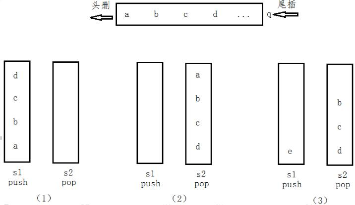

[[toc]]

## Abstract

todo

## Stack Problem

### Valid Parentheses(括号匹配)

堆栈在处理递归问题时非常有用，对于**括号匹配**，是栈应用的经典案例：

1. Initialize a stack S: 初始化栈

2. Process each bracket(括号) of the expression one at a time.

3. If we encounter an opening bracket, then we check the element on the top of the stack. (遇到左括号则入栈)

4. If the element at the top of the stack is an openning bracket **of the same type**, the we **pop** it off the stack and continue processing. (栈顶元素和外面相匹配，则出栈继续)

5. Else this implies an invaild expression.

6. In the end, if we are left with a stack still having elements, then this implies an invaild expression. (栈不空则表达式非法)

Implementation:

简单版本：

```py
def isValid(self, s: str) -> bool:
    stack = []
    for ch in s:
        if ch in ['(', '[', '{']:
            stack.append(ch)
        else:
            # for the case "]"
            if stack == []:
                return False
            if ch == ')' and stack[-1] != '(':
                return False
            if ch == ']' and stack[-1] != '[':
                return False
            if ch == '}' and stack[-1] != '{':
                return False
            stack.pop()
    return stack == []
```

优化版本，基本思路一致：

```py
def isValid(self, s: str) -> bool:
    stack = []
    mapping = {"]":"[", "}":"{", ")":"("}

    for ch in s:
        if ch in mapping.keys(): # 右括号，进行判断
            if stack == []:
                return False
            if stack.pop() != mapping[ch]:
                return False
        else:
            stack.append(ch) # 左括号，入栈
    return stack == []
```

[Solution of C++](https://github.com/chenweigao/_code/blob/master/cpp/stack_valid_parenttheses.cpp)

Explaination:

- 我们遍历字符串 s, 遇到左括号则入栈，遇到右括号 (keys) 则弹出栈顶元素进行比较（在栈非空的前提下）
- 最终返回值：栈空则合法，等价于 `return stack==[]`

### Validate Stack Sequence

给定入栈和出栈序列，判断是否合法：

```py
def validateStackSequences(pushed: 'List[int]', popped: 'List[int]') -> bool:
    i = 0
    stack = []
    for x in pushed:
        stack.append(x)
        while stack and i < len(popped) and stack[-1] == popped[i]:
            stack.pop()
            i += 1
    return stack == []
    # returen i == len(poped)
```

注意到我们不改变 `pushed` 和 `poped`, 而是使用一个 `stack = []` 作为辅助操作。

当没有找到与 `stack` 栈顶元素相等的元素时，不停地往 `stack` 中添加元素，

### Next Greater Element

[https://leetcode.com/problems/next-greater-element-i/](https://leetcode.com/problems/next-greater-element-i/)

这道题目的大意是给定两个 List, 比如：

`find_nums`: [4, 1, 2], `nums`:      [1, 3, 4, 2]

需要找出 `nums` 中 `find_nums` 对应的下一个比它大的元素，未找到就返回 -1, 在这个例子中的结果是：

`res`:       [-1, 3, -1]

```py
def nextGreaterElement(find_nums, nums):
    # [4, 1, 2]
    # [1, 3, 4, 2]
    # [-1, 3, -1]

    stack = []
    dic = {}

    for num in nums:
        while stack != [] and stack[-1] < num:
            dic[stack[-1]] = num
            stack.pop()
        stack.append(num)

    res = []
    for find_num in find_nums:
        res.append(dic.get(find_num, -1))
    return res
```

当栈顶元素小于 `num` 时，在字典中添加栈顶元素, `num` 表示栈顶元素的 next greater element 是 `num`

`stack` 在上述例子中的顺序变化为：[1] -> [3] -> [4] -> [4, 2]

`dic` 为 {1: 3, 3: 4}


### 用两个栈实现一个队列

这是面试中的经典问题，应当熟练掌握。

[Leetcode 232](https://leetcode.com/problems/implement-queue-using-stacks/)

所谓两个栈实现一个队列，应当是指实现队列的 **尾插** 和 **头删** 两个操作。

我们定义两个栈 S1 和 S2：

- S1：只进行插入数据
- S2：删除 S1 中的数据

！注意 S2 不为空时不要从 S1 中添加数据，类似于下图三的情况。



代码实现如下，思路就是使用两个栈，一个做插入，一个做删除：

```py
# -*- coding:utf-8 -*-
class Solution:
    def __init__(self):
        self.s1 = []
        self.s2 = []
    def push(self, node):
        self.s1.append(node)
    def pop(self):
        if self.s2 == []:
            while self.s1:
                self.s2.append(self.s1.pop())
            return self.s2.pop()
        return self.s2.pop()
```

### 用两个队列实现一个栈


### 括号匹配

### 后缀表达式
