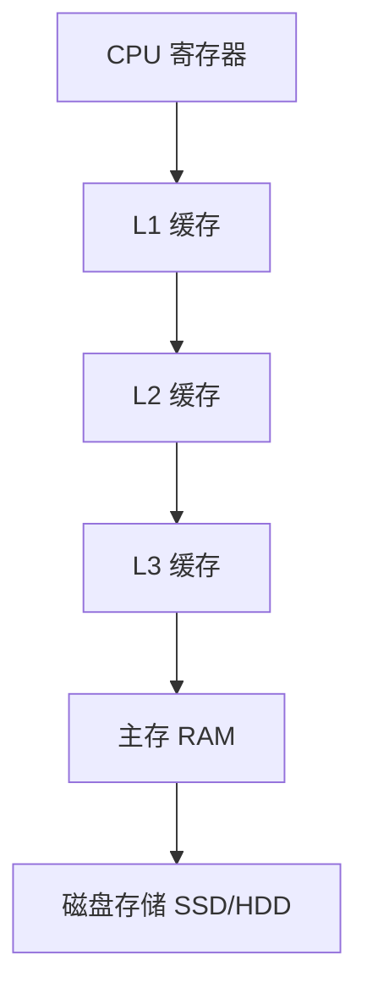
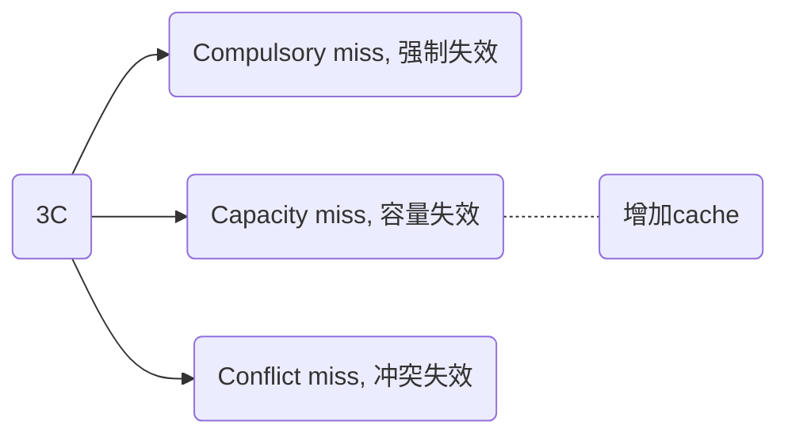

## 1. Abstract

缓存（Cache）是计算机体系结构中用于加速内存访问的重要组件。本文系统地研究了缓存的基本概念、局部性原理、缓存映射方式、替换策略、缓存未命中处理方法及多处理器环境下的缓存一致性协议。通过分析不同缓存策略对系统性能的影响，我们探讨了如何优化缓存设计，以提高数据访问效率，降低缓存未命中率（Miss Rate），从而提升整体计算机系统的性能。

## 2. Introduction

### 2.1. 研究背景

随着计算机硬件技术的快速发展，处理器（CPU）性能不断提升，但主存（DRAM）访问速度的进步相对较慢，导致“存储墙”问题（Memory Wall）。为了弥补 CPU 和内存之间的速度差异，现代计算机体系结构采用了分层存储结构（Memory Hierarchy），其中缓存（Cache）作为高速缓存存储器，减少了 CPU 直接访问主存的次数，提高了数据访问速度。

::: note 哲学含义

程序员总希望存储是无限的，我们通过一系列的技术手段让程序员产生这种错觉。

:::

### 2.2. 研究目标

本文主要研究存储层次结构中的 cache 环节，主要研究内容包括：

1. **局部性原理（Principle of Locality）**：分析时间局部性和空间局部性对缓存设计的影响。
2. **缓存结构**：探讨缓存行（Cache Line）及其存储管理方式。
3. **缓存映射方式**：研究直接映射、全相联映射和组相联映射的特点和应用。
4. **缓存替换策略**：对比不同的缓存替换算法，如 LRU、FIFO 和随机替换策略。
5. **缓存一致性协议**：讨论 MESI 一致性协议在多核系统中的应用。
6. **缓存性能优化**：分析缓存未命中的影响，并提出降低缓存未命中率的优化方法。包括两个重要的算法和通用的处理 cache miss 的方法。

### 2.3. Key Word

| key word              | means  | comments |
| --------------------- | ------ | -------- |
| memory hierarchy      | 内存层次结构 |          |
| principle of locality | 局部性原理  |          |
| temporal locality     | 时间局部性  |          |
| spatial locality      | 空间局部性  |          |
| Locality of reference | 访问局部性  |          |


## 3. 缓存基础知识

### 3.1. 局部性原理

缓存的高效性主要依赖于**局部性原理（Principle of Locality）**：

- **时间局部性（Temporal Locality）**：如果某个数据被访问过，它很可能在不久的将来再次被访问。例如，循环中的指令通常会多次执行。以 loop 为例, 被引用过一次的存储器位置在未来会被多次引用。
- **空间局部性（Spatial Locality）**：如果某个数据被访问，那么它周围的数据很可能在不久后也被访问。典型的例子就是数组。

总体而言，可以归纳为访问局部性，其含义是计算机科学领域的应用程序在访问内存的时候，倾向于访问内存中较为靠近的值。

::: note 存储层次结构如何利用时间局部性和空间局部性？

主要是 2 个：将经常访问的数据放在距离处理器更近的地方，将多个连续的“块”移动到上层存储中来利用空间局部性。

:::

接近处理器的存储是比较小和比较快的，除了成本考虑之外，接近处理器的存储比较小的话，其命中率也更高。

- 理解 hit rate, miss rate, hit time, miss penalty

局部性是计算机系统中的一种可预测的行为，系统的这种强访问局部性，可以被用来处理内核的指令流水线中的性能优化，如缓存、分支预测、内存预读取等。

### 3.2. 存储层次结构

现代计算机的存储层次结构通常包括：

1. **寄存器（Registers）**：最快速但容量最小的存储器。
2. **L 1 Cache**（一级缓存）：直接集成在 CPU 内部，访问延迟极低。
3. **L 2/L 3 Cache**（二/三级缓存）：容量更大，访问延迟相对较高。
4. **主存（Main Memory）**：通常为 DRAM，访问延迟较高。
5. **磁盘存储（Disk Storage）**：如 SSD 或 HDD，速度远低于主存。

层次结构可以用下图表示：



## 4. **缓存架构**

### 4.1. 缓存行（Cache Line）

缓存的存储单元被称为**缓存行（Cache Line）**，整个 cache 空间被分成了 N 个 line，line 是 cache 交换的最小单位，每个 cache line 通常是 32 byte 或者 64 byte,  cache line 包含的内容可以做如下划分：

| **字段**         | **描述**          |
| -------------- | --------------- |
| **Tag**        | 用于标识缓存数据对应的主存地址 |
| **Valid Bit**  | 指示缓存行是否包含有效数据   |
| **Data Block** | 存储具体的数据         |

参考 arm 官方的示意图：


有些时候也会用 tag, valid, block 表示，其中 block 表示 cache 中缓存的数据，tag 是该 cache line 对应的内存的地址，valid 表示该 cache line 中的数据是否有效。

也有如下的表示方法：

```
+-----------------+----------------------+---------------+
|      Tag        |        Data          |   Control     |
+-----------------+----------------------+---------------+
|      n bits     |        m bytes       |   k bits      |
+-----------------+----------------------+---------------+
```

在上述图中，cache line 被表示成了三个部分：

1. **Tag**: identify the memory address associated with the cache entry
2. **Data**: contains the actual data or instructions stored in the cache entry
3. **Control**: contains the control bits used to manage the cache entry, such as indicating whether the entry is **valid** or not, whether it has been **modified**, and whether it is available for use.

通过对比这两者的不同，我们明白，不同的体系结构中的 cacheline 设计都是存在差异的。

后面章节会展开解释一下 tag 和 valid 的作用[^1]。

### 4.2. Cache 作用

> Caching is perhaps the most important example of the big idea of **prediction**. It relies on the principle of locality to try to find the desired data in the higher levels of the memory hierarchy, and provides mechanisms to ensure that when the prediction is wrong it finds and uses the proper data from the lower levels of the memory hierarchy. The hit rates of the cache prediction on modern computers are often above 95%.
> 
> （翻译）缓存（Caching）或许是<font color="#f79646">预测（Prediction）</font> 这一重要概念最典型的应用。它依赖于局部性原理（principle of locality），通过在内存层次结构（memory hierarchy） 的较高层级中查找所需数据，以加速数据访问。同时，缓存也提供了相应机制，以便在预测失败时，能够从内存层次结构的较低层级找到并使用正确的数据。在现代计算机中，缓存预测的命中率（hit rate）通常高于 95%。

缓存的核心思想是基于**预测（Prediction）**，即假设某些数据很快会被再次访问，因此将其保留在访问速度更快的缓存中。计算机系统并不真正“知道”将来会访问哪些数据，而是通过**历史访问模式**进行推测，这种预测的成功与否直接影响了计算性能。

缓存之所以能够有效运作，主要依赖于局部性原理，即程序访问数据时往往存在时间局部性（Temporal Locality） 和空间局部性（Spatial Locality）。

现代计算机的缓存命中率通常超过 **95%**，这意味着绝大多数的内存访问可以在 L 1、L 2 或 L 3 缓存中完成，而无需访问主存（RAM）。这是至关重要的，访问 L 1 缓存的延迟通常为 **1~5 个 CPU 周期**，而访问主存的延迟可能超过 **100~300 个 CPU 周期**。现代处理器进一步优化了缓存，例如采用**硬件预取（Hardware Prefetching）** 和 **分支预测（Branch Prediction）**，以减少缓存未命中的概率。

总结来说，这句话从宏观维度总结了 cache 的一些作用：

- 预测大思想的完美应用
- 依赖了局部性原理

其本质就是试图在存储层次结构的更高层次找到想要的数据。

### 4.3. Cache 结构

下图是一个关于 cache 结构的全局示意图：


### 4.4. Way & set

Way 和 set 的区别是什么？本章将结合 ARM 官方的解释说明，展开这两个概念的具体细节。

> In a cache, a "way" refers to a set of cache entries that have the same index but different tags. ==The number of ways in a cache is **determined by the cache's associativity**==, which is the number of cache entries that can map to the same index. Each way contains a set of cache entries that are grouped together based on their index.
> 
> （笔者翻译）在缓存（cache）中，**“way”（路）** 指的是一组具有**相同索引（index）** 但 **不同标记（tag）** 的缓存条目（cache entries）。缓存的相联度（associativity）决定了缓存的 way 数量，即**多少个缓存条目可以映射到相同的索引**。每个 way 包含一组按索引分组的缓存条目。
> 
> In contrast, a "set" in a cache refers to a group of cache entries that share the same index. A set can contain multiple cache entries, with each entry having a unique tag. The number of sets in a cache is determined by the cache size and block size.
> 
> （笔者翻译）相比之下，**“set”（集合）** 指的是**共享相同索引**的一组缓存条目。一个集合可以包含多个缓存条目，每个条目具有不同的**标记（tag）**。缓存中的集合数量由**缓存大小（cache size）和块大小（block size）** 决定。

在缓存结构中，**way 和 set 是两个关键概念**，它们共同决定了缓存如何存储和查找数据。

- **Way（路）**：在组相联（set-associative）缓存中，多个缓存条目可以映射到同一个索引，但它们有不同的标记（tag）。这些条目就组成了缓存的 **way**。**相联度（associativity）** 决定了缓存的 way 数。例如，**4 路组相联（4-way set-associative）** 说明**每个索引下有 4 个不同的缓存条目**可供存储数据。处理器访问数据时，会检查该索引下的所有 ways，查看是否有匹配的标记（tag）。

- **Set（集合）**：**一个 set 代表所有具有相同索引的缓存条目**，而每个条目都有不同的 tag。**一个 set 中的缓存条目数量** 由相联度（way 数）决定。例如，在 4 路组相联的缓存中，每个 set 包含 **4 个缓存条目**。**缓存的 set 数量** 由缓存大小和块大小计算得出，决定了缓存可以存储多少不同的索引地址。

总而言之，Way 决定了缓存相联度（associativity），即每个索引下可以存放多少个条目。Set 代表了所有共享相同索引的缓存条目，其数量由缓存大小和块大小决定。更高的 way 数（如 8-way 或 16-way）可以减少缓存冲突（conflict misses），但查找数据时的开销（复杂度）也会增加。

再参考以下的引文[^2]：

> Suppose we have a **4-way set-associative cache** with 8 cache entries and a block size of 64 bytes. This means that the cache has 8 sets, each with 4 ways.
> 
> Here's an example of how the cache might be organized:
> 
> ```
> Set 0:
> Way 0: [Tag 0][Data][Control]
> Way 1: [Tag 1][Data][Control]
> Way 2: [Tag 2][Data][Control]
> Way 3: [Tag 3][Data][Control]
> 
> Set 1:
> Way 0: [Tag 4][Data][Control]
> Way 1: [Tag 5][Data][Control]
> Way 2: [Tag 6][Data][Control]
> Way 3: [Tag 7][Data][Control]
> 
> ...
> 
> Set 7:
> Way 0: [Tag 28][Data][Control]
> Way 1: [Tag 29][Data][Control]
> Way 2: [Tag 30][Data][Control]
> Way 3: [Tag 31][Data][Control]
> ```
> 
> In this example, each set contains 4 ways, and each way contains a cache entry with a unique tag, data, and control bits. When the processor requests data from memory, the cache uses the memory address to determine the index and tag of the requested data. The cache then checks the corresponding set and looks for the requested data in each way of that set until it finds the data or determines that it is not in the cache.

通常而言，一个 way 多个 cacheline.

> To add the cache line to the previous text figure, we can modify it as follows:
> 
> ```
> Set 0:
> Way 0: 
>     [Tag 0][Data][Control] 
>     [Tag 1][Data][Control] 
>     [Tag 2][Data][Control] 
>     [Tag 3][Data][Control]
> ```

上述的例子说明了：一个 way 是由很多个 cache entries 组成的（这点在下面的图中也可以得到印证）

以下是引用 ARM 官方的一个例子：

> *here's an example to illustrate the relationship between cache size, way, and set:*
> 
> （翻译，后文略）下面是一个示例，说明缓存大小、相联度（way）和集合（set）之间的关系：
> 
> Let's say we have a cache with a total size of 64 KB, a block size of 64 bytes, and a 4-way set-associative mapping.
> 
> 假设我们有一个总大小为 64 KB 的缓存，块大小（block size）为 64 字节，采用 4 路（4-way）组相联（set-associative）映射。
> 
> To determine the number of sets in the cache, we can divide the cache size by the product of the block size and the associativity. In this case, we have:
> 
> Number of sets = cache size / (block size x associativity)
> Number of sets = 64 KB / (64 bytes x 4)
> Number of sets = 256
> 
> This means that the cache has 256 sets. Each set contains four ways, as specified by the 4-way set-associative mapping.
> 
> 为了确定缓存中的**集合数（number of sets）**，我们可以将缓存大小除以**块大小与相联度的乘积**。
> 
> 在本例中：这意味着该缓存共有 256 个 sets, 由于采用 4 路组相联映射，每个集合中包含 4 个 way。
> 
> 计算方法是：缓存大小 64 KB / 块大小 64 bytes 得到总的块数量（下一段的缓存条目数），而 4 个块为一组，进而除以 4 得到有多少个组（set）。
> 
> To determine the number of cache entries in the cache, we can multiply the number of sets by the number of ways. In this case, we have:
> 
> Number of cache entries = number of sets x number of ways
> Number of cache entries = 256 x 4
> Number of cache entries = 1024
> 
> This means that the cache has a total of 1024 cache entries. Each cache entry consists of a block of 64 bytes, as specified by the block size.
> 
> 为了确定缓存中的**缓存条目数（cache entries）**，我们可以将集合数乘以相联度（way）。
> 
> 在本例中：这意味着该缓存共有 **1024 个缓存条目（cache entries）**。每个缓存条目包含 **一个 64 字节的块**，这由块大小决定。
> 
> When the processor requests data from memory, the cache uses the memory address to determine the index and tag of the requested data. The cache then checks the corresponding set and looks for the requested data in each of the four ways of that set until it finds the data or determines that it is not in the cache.
> 
> 当处理器从内存请求数据时，缓存会使用内存地址来确定数据所在的 **索引（index）**和 **标记（tag）**。然后，缓存会检查对应的集合，并在该集合的 4 个 way 中查找请求的数据，直到找到数据或确定该数据不在缓存中。
> 
> Overall, this example illustrates how the cache size, block size, and associativity determine the number of sets, ways, and cache entries in a cache, and how these components work together to efficiently cache frequently accessed data and reduce the time spent waiting for data to be fetched from main memory.
> 
> 总体而言，这个示例说明了**缓存大小、块大小和相联度**如何共同决定缓存的**集合数、way 数量以及缓存条目数**，以及这些组件如何协同工作，以高效缓存**经常访问的数据**，从而减少从主存加载数据所花费的时间。

下面是上文中的示例展开，说明缓存大小、相联度（way）和集合（set）之间的关系。

**缓存参数设定**：这里的缓存总大小为 **64 KB**，块大小为 **64 字节**，并且采用 **4 路组相联映射**。

**计算集合数**：由于缓存采用组相联结构，我们可以用如下公式计算集合数：

$\text{集合数} = \frac{\text{缓存大小}}{\text{块大小} \times \text{相联度}}$

$\text{集合数} = \frac{64 \text{ KB}}{64 \text{ bytes} \times 4} = 256$ 

这意味着缓存共有 **256 个集合**，每个集合由 4 个 way 组成。

**计算缓存条目数**：由于每个集合有 4 个 way，因此缓存总条目数为：$\text{缓存条目数} = \text{集合数} \times \text{相联度} = 256 \times 4 = 1024$。也就是说，该缓存共有 **1024 个缓存条目**，每个条目存储 **一个 64 字节的块**。

**数据访问过程**：当 CPU 请求数据时，缓存会根据内存地址确定数据所在的 **集合索引（index）** 和 **标记（tag）**。计算出的索引值用于定位到 **256 个集合中的某一个**。然后，缓存会在该集合的 **4 个 way** 中查找数据。若数据命中，则直接返回；否则，触发缓存未命中，数据需要从主存加载。

这个例子展示了缓存的基本组织方式，并说明了缓存大小、块大小和相联度如何决定缓存的结构参数。

::: warning

**高效的缓存设计可以减少 CPU 等待数据的时间，提高整体性能。**

:::

量化研究方法如下所描述：

> The set associative organization has **four sets with two blocks per set**, called two-way set associative.

***(笔者翻译）***“二路组相联”（two-way set associative）组织形式是缓存组织的一种方式。在这段文字中，描述了缓存的结构特征：它包含四个集合（sets），每个集合有两个块（blocks，就是 two-way）。二路组相联缓存是介于直接映射缓存和全相联缓存之间的一种结构。

### 4.5. Tag

> Because each cache location can contain the contents of a number of different
> Memory locations, how do we know whether the data in the cache corresponds
> To a requested word? That is, how do we know whether a requested word is in the
> Cache or not?
> 
> （翻译）由于每个缓存位置可以包含多个不同内存位置的内容，我们如何知道缓存中的数据是否与请求的字匹配？也就是说，我们如何知道一个请求的字是否在缓存中？

为了解决上述的问题（我们要访问的内容是不是在 cache 里面），我们使用了 tag 这个字段，原始的对于 tag 的定义可以如下所示：

> A field in a table used for a memory hierarchy that contains the address information required to identify whether the associated block in the hierarchy corresponds to a requested word.
> 
> （翻译）一个字段用于存储器层次结构，该字段包含地址信息，用于识别层次结构中关联的块是否与请求的字相对应。

其意思就是说对应了内存中的地址信息。

Tag 所需要使用的位数大小取决于微架构实际的设计，从设计原则来说，**Tag 存储的是地址的高位部分**，用于唯一标识缓存行对应的内存块，Index 和 Block Offset 已经覆盖了地址的低位部分：


从图（很重要，所以在本文中出现多次）中我们可以看出，我们取了虚拟地址的 19 位用于 tag 的匹配；而我们图中有 256 条 cache line, 其计算方式是根据 cache 的总大小 (32 KB/4 set) 除以每条 cacheline 的大小 (32 byte) 得到的。

我们简单来说：

- **Tag**：高位部分，用于唯一标识缓存行对应的内存块。
- **Index**：或者 set，中间部分，用于定位缓存中的特定行（即缓存行的索引）。
- **Block Offset**：低位部分，用于定位缓存块内的具体字节。

简化后的图示如下：

```
|--------- Tag ---------|---- Index ----|-- Block Offset --|
```

再举例说明 tag 位数的计算方式：

假设：

- 缓存总大小 = 32 KB
- 块大小（Block Size）= 64 B
- 地址位宽 = 32 位

则：

- **Block Offset** = $log₂(64) = 6$ 位（用于定位块内字节）。
- **Index** = $log₂(32 KB / 64 B) = log₂(512) = 9$ 位（用于定位缓存行）。
- **Tag** = 32 - 9 - 6 = **17 位**（剩余高位地址）。

在这个例子中，由于 Cache 总大小、块带下、地址位宽共同决定了 tag 的设计为 17 位。

::: tip **tag 匹配时需要全量比较吗？**

注意我们无论使用什么映射方式，要确定要访问的内存是不是在 cache 中，均是通过比较 tag 的方式来实现的。

这就意味着：我们**需要和所有的 entry 的 tag 字段进行比较**。通常而言，这个过程是比较耗时的；但是硬件设计通过一些优化的手段，可以加速或者并行这个比较的过程。

从另一个方面来说，cache 越大，那么我们需要比较的次数就越多；但是更小的 cache 会导致更高的 miss rate, 最终影响性能。

:::

### 4.6. Valid

> We also need a way to recognize that a cache block does not have valid information. For instance, when a processor starts up, the cache does not have good data, and the tag fields will be meaningless.

Valid 的存在是因为我们还需要标识 cache 中的信息是否有效，比如说这边举了一个例子，说的是如果处理器刚刚启动的时候，缓存中的数据肯定是无效的，valid 字段就是起到这样一个作用。

在缓存系统中，需要一种机制（通常称为 **有效位 / Valid Bit**）来标识缓存块（Cache Block）中的数据是否有效。这是因为：

- **初始化阶段**：处理器刚启动时，缓存中可能包含随机数据（如残留的旧数据或未初始化的状态），此时缓存块中的标签（Tag）和内容均不可信。
- **缓存未命中**：当缓存未命中（Cache Miss）时，新加载的数据需要覆盖旧数据，但旧数据可能已被标记为无效。

### 4.7. Data Block

剩下的是 data 或者 block 块，其实在实际的 cache 中，长这样（Intrinsity FastMATH data cache 为例）：

| valid | tag | block 1 | block 2 | …   | block n |
| ----- | --- | ------- | ------- | --- | ------- |
| 8     | 18  | 32      | 32      | …   | 32      |

在上述的例子中，block 有多个，实际构成了总的 data,  而每个 block 的定位是依靠地址中的某几个字节分配的偏移量决定的，比如我们一共有 16 个 block, 则地址字段需要分配 4 bit 用于表示偏移量，有些英文文档中称作 multiplexor，那么我们每个 cache line (entry) 中可以保存的总的数据量为：32 bit * 16。

我们举例一个地址字段来说明这个：

| 31 .. 14 | 13 .. 6 | 5.. 2                        | 1.. 0 |
| -------- | ------- | --------------------------- | ---- |
| tag      | index   | byte offset -> block offset |      |

这个例子中的 5.. 2 bit 就是用作定位偏移得的。

> Intrinsity FastMATH data cache  使用了数据 cache 和指令 cache 分离的设计。

上述的说明属于比较专业的说法，我们还可以使用较为简单的方式来进行理解（可能会缺少一些严谨性）

访存地址可以被分为两部分：**块地址+块内位移**。其中块地址用于查找该块在 cache 中的位置，块内位移用于确定所访问的数据在块内的位置。

:::note 分页 VS 分段

上述的访存地址计算的方式是适用于*页虚拟存储器*，对于段虚拟寄存器，可以用两个字来表示：段号+段内偏移。关于虚拟内存可以参考另外的一遍文章《Virtual Memory》

:::

## 5. Cache 映射方式

映射方式主要由以下几种：

1. 全相联 cachem, full-associative cache
2. 直接映射 cache, direct-mapped cache
3. 组相联 cache, set-associative cache

如果一个块可以放在缓存中的任意位置，那么就是全相联的；
如果每个块只能出现在缓冲中的一个位置，就说该缓存是直接映射的；映射的方式为 **（块地址）MOD （缓存中的块数）**；
如果一个块可以放在缓存中由有限个位置组成的组（set）中，就说该缓存是组相联的；在组内，这个块可以放在任意位置；如果组中 n 个块，就叫做 n 路组相联。

### 5.1. Full-associative

主存中的每个数据块可以存放到缓存的任何位置：

- **优点**：最小化冲突未命中。
- **缺点**：硬件实现复杂，需要并行比较所有缓存行。

这种方式有个优点就是内存中的每个 line (注意到内存中是块存储的，为了方便理解这里也说得 line) 可以映射到任意的 cache line 中，从这个角度看，full-associate 效率更好，但是其查找过于复杂。

### 5.2. Direct-mapped

主要的思想是把内存分为 N 个 page, 每一个 page 的大小和 cache 相同，page 中的 Line 0 只能映射到 cache 中的 Line 0, 以此类推；每个主存块只能映射到缓存中的一个固定位置：

- **映射方式**：Index = (Memory Address) MOD (Cache Size)
- **优点**：硬件实现简单。
- **缺点**：容易产生冲突未命中（Conflict Miss）。

其示意图如下所示：


直接映射意味着确定的映射方式，如图中的 0 x 00, 0 x 40, 0 x 80 都只能映射到 Line 0 中。

### 5.3. Set-associative

缓存被分成多个组（Set），每个组包含多个路（Way）：N 路组相联（N-Way Set Associative）表示每个组包含 N 个缓存行。

**2 路组相联示例**：

```
Set 0:  | Way 0 | Way 1 |
Set 1:  | Way 0 | Way 1 |
...
```

Direvt-mapped 的方式是处理器上比较常用的，但是在某些特定的情况下会存在很大的缺陷，所以现代的商用处理器都是用 set-associative cache 来解决这个问题，这也是我们这节要研究的。

Set-associative 将 cache 分成了多个 way, `direvt-mapped == 1 way set-associative`，使用多少个 cache way 也是一种权衡的结果。

举例，以下是四路组相联的结构（一路是直接映射）：

| set | tag   | data  |     | tag   | data  |     | tag   | data  |     | tag   | data  |
|:---:| ----- | ----- | --- | ----- | ----- | --- | ----- | ----- | --- | ----- | ----- |
| 0   | way 0 | way 0 |     | way 1 | way 1 |     | way 2 | way 2 |     | way 3 | way 3 |
| 1   |       |       |     |       |       |     |       |       |     |       |       |
| …   |       |       |     |       |       |     |       |       |     |       |       |
| n   |       |       |     |       |       |     |       |       |     |       |       |

#### 5.3.1. Arm docs: Set associative caches

> With this kind of cache organization, the cache is divided into a number of equally-sized pieces, called *ways*.[^3]

Cache 被分割成为了一些相同大小的块，称作 ways.

> A memory location can then map to a way rather than a line. The index field of the address continues to be used to select a particular line, but now it points to an individual line in each way. Commonly, there are 2- or 4-ways, but some ARM implementations have used higher numbers.


如上图所示，这是一个 2-way cache 的结构示意图；在上图中：Data from address `0 x 00` (or `0 x 40`, or `0 x 80`) might be found in line 0 of either (but not both) of the two cache ways.

#### 5.3.2. Arm docs: A real-life example


Figure: a 4-way set associative 32 KB data cache, with an 8-word (1 word equals 16 bits) cache line length. This kind of cache structure can be found on the Cortex-A 7 or Cortex-A 9 processors.

- Cache line 的大小是 32 bytes (8 word = 8 * 32 bits =32 bytes, 注意一个 word 在 arm 中是 32 bits)

- Cache 总大小为 32 KB

- 连接方式是 4 路组相连

由此我们可以计算出来，每个 way 的 cacheline 数量为：$32 KB/4/32=256$, 所以我们每个 way 会有 256 条 cacheline. 这就意味着我们需要 8 bits 来在 way 中索引，在途中就是用 [12:5] 来索引的；除此之外，我们需要使用 [4:2] 来索引 cache line 中的 8 个 word. 剩下的 [31:13] 用于 tag.

❤️ 有一点需要注意的是，图中出现了 4 个 way 叠加处理，每个 way 都是由 256 条 cacheline 组成的；图中并未体现出多个 set，只画了一个 set. 现在再体会一下这句话：A way is a subset of the cache entries in a set that have the same index but different tags.

#### 5.3.3. Arm 原文参考

> The cache line length is eight words (32 bytes) and you have 4-ways. 32 KB divided by 4 (the number of ways), divided by 32 (the number of bytes in each line) gives you a figure of 256 lines in each way. This means that you require eight bits to index a line within a way (bits [12:5]). Here, you must use bits [4:2] of the address to select from the eight words within the line, though the number of bits which are required to index into the line depends on whether you are accessing a word, halfword, or byte. The remaining bits [31:13] in this case will be used as a tag.

（翻译与理解）缓存行的长度为 **8 个字（words）**，即 **32 字节（bytes）**，并且缓存采用 **4 路（4-way）组相联（set-associative）** 结构。

计算缓存的每个 **way** 需要多少条缓存行（cache lines）：

$$\frac{32 \text{ KB}}{4 \text{ （way 数）} \times 32 \text{ （每行字节数）}} = 256 \text{ 行}$$

这意味着，每个 way 共有 **256 行（lines）**，因此需要 **8 位（bits）** 来索引 way 内的缓存行，即 **地址的 [12:5] 位** 作为索引（index）。

在 **缓存行内部（within a line）**，由于每行包含 **8 个字（words）**，我们需要使用地址的 **[4:2] 位** 来选择缓存行内的具体 word。具体来说，所需的索引位数取决于**访问的数据类型**：

- 访问 word（4 字节）：需要 3 位（bits [4:2]） 选择 8 个 word 之一。
- 访问 halfword（2 字节）：需要 4 位（bits [4:1]） 选择具体的 halfword。
- 访问 byte（1 字节）：需要 5 位（bits [4:0]） 选择具体的字节。

剩余的地址位 **[31:13]** 作为 **标记（tag）**，用于区分不同的地址映射到相同索引的情况。

#### 5.3.4. QA

1. 我们知道，cacheline 包括 tag, set index 和 offset bit, 其中 offset bit 用于定位数据在 cacheline 中具体的偏移，那么是如何仅根据一个 offset 就能确定具体的数据要取多少个 byte 呢？
   
   要解答这个问题，我们需要知道，在 ldr 或者其他访存类指令发出以后，CPU 是知道这次访问需要的数据大小的 (byte); 我之前想不明白的是，是如何知道的呢？其实很简单，我们在指令上已经指定了需要访问的数据大小，如 `ldr x 1, #234 ` 就是通过寄存器指定我们需要的访问是 16 字节。

### 5.4. Summary

三种方式的对比：

| 机制   | 组的数量              | 每组中块的数量     |
|:----:|:-----------------:|:-----------:|
| 全相联  | 1                 | cache 中块的数量 |
| 直接映射 | cache 中块的数量       | 1           |
| 组相联  | cache 中块的数量 / 相联度 | 相联度（通常 2~16） |

增加相联度的好处通常是降低失效率，失效率的改进来自于减少对于同一位置的竞争而产生的失效。

三种方式进行查找的对比：

| 机制   | 定位方法         | 需要比较的次数  |
|:----:|:------------:|:--------:|
| 全相联  | 查找所有 cache 表项 | cache 容量 |
|      | 独立的查找表       | 0        |
| 直接映射 | 索引           | 1        |
| 组相联  | 索引组，组中的元素    | 相联度      |

## 6. 处理 Cache Miss

Cache hit (命中)：读取时间 X 个 cycle

Cache miss：读取时间 XX 或者 XXX 个 cycle

所以 hit 和 miss 有很大的性能差距。

### 6.1. Why cache miss?

有三种情况会导致 cache misss:

1. **强制未命中（Compulsory Miss）**：首次访问某数据，无法命中缓存。必须的 miss，如第一次访问程序或者数据时，这些程序或者数据没有在 cache 中。
2. **容量未命中（Capacity Miss）**：缓存空间不足，导致数据被替换。Cache 容量满了的时候，新数据到来，需要重新搬移，就 miss 了；或者还存在一种情况是 cache 无法包含程序执行期间所需的所有块。
3. **冲突未命中（Conflict Miss）**：直接映射缓存中，不同数据块竞争同一缓存行。这种情况下，cache 可能还有空闲空间，但是这个地址对应的 cache line 已经被使用了，也会导致 cache miss.



---

### 6.2. 减少 Miss: 使用较大的 block

较大的 blocks 利用空间局部性原理来降低 miss rate, 通常而言，增加块的大小会降低 miss rate, 但是其存在一个阈值，如果 block 的大小成为缓存很大的一部分，最终 miss rate 反而会上升，这是因为缓存中可以保存的块的数量变少，导致了很多竞争。

除此之外，使用较大的 blocks 会造成 cache 未命中的时候的代价变大，主要是体现在 cache 加载的时候 (fetch the block), 这个过程分为两个部分：**the latency to the first word and the transfer**

🧡🧡🧡 我们可以获得一个启发：==如果我们可以设计方法降低较大的 block 的 transfer time, 那么我们就可以进一步改善缓存的性能。==

### 6.3. Hide Some Transfer Time

在使用较大的 block 时，我们可以通过**隐藏一些传输时间**的方法来减少未命中的惩罚。这种策略的核心思想是，在缓存未命中时，尽可能减少 CPU 等待数据的时间，使得数据传输和计算能够更好地重叠，提高整体性能。以下是两种主要的实现方式：

#### 6.3.1. Early Start（提前开始）

在传统的缓存加载过程中，整个 cache block（如 64 B 或更大）需要完全载入后，处理器才能开始使用其中的数据。但在 **early start** 方法中，我们在 block 还未完全传输完成时，就可以开始处理已经到达的部分数据。

**原理**：在从主存或更高级别缓存（如 L 2、L 3）加载数据时，数据通常是按 **burst mode**（突发模式）或多个小块传输的。在数据块的一部分到达后，处理器可以立即使用这些数据，而不必等到整个 block 全部加载完成。这样可以隐藏一部分传输时间，从而减少缓存未命中的性能损失。

**示例：**：假设 CPU 需要访问一个 64 B 的 block，但该 block 需要 8 个时钟周期才能完全传输完成。如果采用 **early start**，CPU 可以在第 2 个时钟周期时，就开始使用已经到达的 8 B 数据，而不必等到第 8 个时钟周期再使用完整数据块。

适用于 **顺序访问** 场景，例如流式处理、数组遍历等；除此之外，适用于 **预取** 机制，使得处理器在缓存未命中时，仍能尽早开始执行部分计算。

#### 6.3.2. Requested (Critical) Word First

在许多情况下，CPU 实际上只需要 cache block 中的某个特定字，而不是整个 block。如果 CPU 能够 **优先加载关键字（Critical Word）**，那么就可以大幅减少缓存未命中的影响。

**原理**：传统的缓存填充方式是 **whole block fetch**，即按照 cache block 大小（如 64 B）顺序加载数据。**Critical Word First** 策略改变了这一方式，使得 **CPU 需要的那个字**（critical word）被优先加载，并尽早提供给处理器，而其余部分可以稍后再填充。**Requested Word First** 是 Critical Word First 的一种特例，指的是仅加载请求的字，而不加载整个 block。

**示例**：假设 CPU 访问 64 B cache block 中的一个 4 B 字（word），但该 block 当前不在缓存中：

- **传统方式（Whole Block Fetch）**：从主存加载整个 64 B block，CPU 需要等整个数据到达后才能继续执行。
- **Critical Word First**：CPU **优先加载所请求的 4 B 字**，然后再继续加载剩余部分。
- **Requested Word First**：只加载所请求的 4 B 字，不填充整个 block（适用于某些特定架构）。

**适用场景**

- **随机访问** 模式，如指针操作、链表遍历等，某个 block 只可能用到部分数据。
- **存储带宽受限** 的场景，减少不必要的数据传输，提高缓存响应速度。

**总结**

​    •    **Early Start**：适用于顺序数据访问，使处理器可以尽早使用已到达的数据。

​    •    **Critical Word First / Requested Word First**：适用于随机访问，使 CPU 能尽快拿到所需数据，减少缓存未命中惩罚。

两者的共同目标是 **减少缓存未命中带来的 CPU 停滞时间，提高系统吞吐量**。

### 6.4. Handling cache misses

- 缓存处理起来 hit 的工作相比于 miss 是微不足道的。
- Cache miss handing 需要处理器控制单元和单独的控制器合作完成，这个单独的控制器启动内存访问、填充缓存
- 缓存未命中的处理会导致流水线 stall, 此时需要保存所有寄存器的状态
- 缓存未命中（处理指令未命中、处理数据未命中）会导致整个处理器暂停，冻结临时寄存器和程序员可见寄存器的内容，同时等待内存。（注意一下，乱序执行的处理器此时还可以允许执行指令）

处理缓存 miss 的步骤大概可以总结如下（主要研究指令 miss）：

1. 发送 PC 值到内存
   
   Since the program counter is incremented in the first clock cycle of execution, the address of **the instruction that generates an instruction cache miss** is equal to the value of the program counter minus 4.
   
   如何理解 the instruction that generates an instruction cache miss? 其实我们只要了解到，cache miss 以后，PC 寄存器向前走了，所以这时候我们需要向后走去找到这个 miss 的指令的地址，然后再去内存中找，就可以了！

2. 控制主存执行读取，并等待内存完成访问

3. 写入缓存，将内存中的数据放入缓存的数据部分，tag 写入地址（from ALU）的高位，并打开有效位

4. 重启指令的执行，这将重新读取指令，这是在缓存中就可以找到该指令

## 7. 缓存替换策略

当缓存满时，需替换某个数据块。常见策略包括：

| **策略**          | **描述**       |
| --------------- | ------------ |
| **LRU（最近最少使用）** | 替换最久未被访问的缓存行 |
| **FIFO（先进先出）**  | 替换最早进入缓存的缓存行 |
| **随机替换**        | 随机选择缓存行进行替换  |

LRU 我们使用的最多，并且性能也最好。

关于替换策略的选择，也有一些考量在里面，并不是 LRU 就一定是最好的，我们举例说明：

- 在相联度不低（2，4）的层次结构中实现 LRU 的代价太高，所以一般使用近似实现
- 随着 cache 容量变大，两种替换策略的性能差异也逐渐缩小
- 在虚拟存储中，使用 LRU 是因为失效代价很大，失效率的微小降低都显得十分重要；并且其失效相对不那么频繁发生，LRU 也可以由软件近似实现

## 8. Cache Write

所谓 cache 写，指的就是 cpu 修改了 cache 中的数据的时候，内存的数据也要随之改变。为了达到这个目的，cache 提供了几种写策略：

1. Write through
2. Write buffer
3. Write back

### 8.1. Write through

核心策略：每次 CPU 修改了 cache 中的内容，cache 立即更新（cache 控制器）内存中的内容。

这种方式会有大量写内存的操作，所以效率较低。

### 8.2. Write buffer

> A queue that holds data while the data are waiting to be written to memory.

Write buffer 中保存了准备写入内存的数据，处理器同时写入 cache 和 write buffer, 而在写入主存完成后，write buffer 中的数据就 free 掉了。

这种方法的缺点在于，如果这个 write buffer 已经满了，那么处理器来写这个的时候必须停止，等待 write buffer 中出现新的空位。

这个之中还有一个矛盾在于，如果处理器生成写入的速率大于内存可以完成的写入速率，那么拿什么 write buffer 都不会起作用的。

### 8.3. Write back: dirty

核心策略：CPU 或者内核修改了 cache 中的内容的时候，cache 不会立即更新内存内容，而是等到这个 cache line 因为某种原因需要从 cache 中移除的时候，cache 才去更新内存中的内容。

Cache 为了知道某个 line 的内容有没有被修改，于是增加了一个新的标志位：**dirty**, 增加以后的 cache line 结构如下所示：

| dirty | valid | tag | block |
| ----- | ----- | --- | ----- |

具体的 dirty 的用法如下：

- Dirty 位为 1, 表示这个数据已经被修改
- Dirty 位为 0, 表示这个数据和内存中的数据是一致的

程序 cache 不需要 dirty 标志位，数据 cache 需要 dirty 标志位。

几个特点：

> By comparison, in a write-through cache, writes can always be done in one cycle.

很多 write back 策略还包括着 write buffer 用于在 miss 的时候减少 miss 惩罚，是这么做的：修改后的块被移动到 write buffer 中，Assuming another miss does not occur immediately, this technique halves the miss penalty when a dirty block must be replaced.

### 8.4. Write miss

Write miss 这个第一眼看过去似乎是比较奇特的，写也会 Miss 吗？当然会了，这里的写 miss 指的是没有写在缓存里面。

考虑 write through 场景下的一个 write miss, 在 write through 中，有两种策略：

1. Write allocate
   
   在缓存中分配一个 block, 然后用内存中的 block 覆盖之。

2. No write allocate
   
   更新内存中的 block, 但是不放入 cache 中。这种场景可能适用于计算机清零某一页的内容这样的情况，有些计算机是允许按页更改写入分配策略的。

## 9. 多处理器缓存一致性

### 9.1. 缓存一致性问题

在多核处理器中，每个核心都有独立的缓存，可能导致数据不一致：

    -----------------------------------------
    |       多核处理器                       |
    | -----------------   ----------------  |
    | |     core 0     |  |     core 1    | |
    | |  cache 0 (x = 3)|  | cache 1 (x = 5)| |
    | ------------------  ----------------- |
    |-------------------------------------- |
    
        ------------------------------
        |     memory (x = 3)          |
        |                             |
        -------------------------------

Core 0 和 core 1 中的 x 容易出现数据不一致的情况，比如 core 0 将 x 进行了修改，但是 core 1 不知道 x 已经被修改了，还在使用旧值，这样就会导致数据不一致的问题。

处理器提供了两个操作来保证 cache 的一致性：

1. Wirte invalidate
2. Write update

### 9.2. Write invalidate

置无效，其核心思想为：当一个 core 修改了一份数据，其他 core 上如果有这份数据的复制，就置为无效。

这种方法的优点在于，比较简单，而且无效标志位 valid 在 cache line 中有对应的字段，这意味着置无效就是把 cache 的一个 line 直接写为无效了，这个 cache line 中其他有效的数据也不能被使用了。

大部分处理器都使用这个操作。

### 9.3. Write update

写更新：当一个内核修改了一份数据，其他的地方如果有这份数据的赋值，就更新到最新值。

其缺点是会产生频繁的更新动作。

## 10. Cache 一致性协议

### 10.1. MESI

主要研究基于 Write invalidate 的一致性协议。比较经典的协议就是 MESI 协议。

复习一下：cache line 中有两个字段是 dirty 和 valid, 分别表示数据是否被修改和数据是否有效。但是在多核处理器中，多个核会存在共享数据的情况，MESI 协议就可以描述这种共享状态。

MESI 协议中有 2 bit 用于 cache line 的状态位，如下表：

| 状态  | 全程        | 描述                                     |
| --- | --------- | -------------------------------------- |
| M   | Modified  | 这行数据被修改了，和内存中的数据不一致                    |
| E   | Exclusive | 这行数据有效，数据和内存中一致，数据只存在于本 core 的 cache 中 |
| S   | Shared    | 这行数据有效，数据和内存中一致，数据存在于很多 cache 中        |
| I   | Invalid   | 这行数据无效                                 |

M 和 E 需要重点理解一下，很明显这四个状态是互斥的，也就是说：

- 状态为 M 的时候，这行数据是 dirty 的，但是数据是这个 cache 独有的。除了这个 M 意外，其他的状态下数据都是 clean 的（无效状态是无效的）
- 状态位 E 的时候，这行数据是 clean 的，并且数据是这个 cache 独有的
- 状态位 S 的时候，这行数据是 clean 的，cache 可以从其他 cache 处同步数据，也可以从内存处同步，协议对此没有做任何要求。

在 MESI 协议中，**cache 控制器**是可以监听 snoop 其他的 cache 的读写操作。

### 10.2. Other MESI

AMD 演化了 MOESI 协议，多了一个 O 状态，这个状态是 S 和 M 状态的一种合体，表示本 cache line 中的数据和内存中的数据不一致，不过其他的核可以有这份数据的复制，复制了这份数据的核的这行 cache 的状态为 S.

Intel I 7 演化了 MESIF 协议，多的 F 状态表示 Forward, 其含义是可以把数据直接传给其他内核的 cache, 而 shared 则不能。

MESIX 统一都可以称为监听协议 (snoop)，监听协议的缺点在于沟通成本很高，所以有一种集中管理的目录协议，可以后续研究。

## 11. 片内可寻址存储器

在大多数处理器架构中，**缓存（cache）** 对程序员是透明的，处理器会自动管理缓存数据的加载和替换。然而，在 **DSP（数字信号处理器）** 等对性能要求极高的计算场景下，部分片内存储器不仅可以用作缓存，还可以作为**可寻址的存储单元**，允许程序员直接访问和管理数据。这部分可直接寻址的片内存储器，也被称为 **软件管理的 cache（Software-Managed Cache）**。

这种在做法可以有效地控制 cache miss, 所以我们也称片内可寻址寄存器为：**软件管理的 cache**.

在片内可寻址存储器架构下，程序员可以**显式控制数据的加载和存放**，比如使用 **DMA（直接内存访问，Direct Memory Access）** 在数据真正被 CPU 访问之前，将其**提前预加载**到片内存储器中。这种方式可以避免 CPU 访问数据时发生缓存未命中（cache miss），减少等待时间。也可以提升计算效率，特别是在需要高吞吐量的数据处理任务中，如 DSP、图像处理和 AI 计算等。

片内可寻址存储器的应用场景可能为：

1. **高性能计算（HPC）与 DSP 处理**： DSP 处理器在实时音视频处理、信号处理等领域被广泛应用，需要对数据进行**高速存取**。例如，在 **视频编码** 过程中，算法可以通过 DMA 预加载即将处理的图像块，而不是等到 CPU 访问时再从 DRAM 取数据，从而减少延迟。
2. **嵌入式系统和实时计算**：在嵌入式系统中，如 **汽车电子、工业控制和机器人**，任务具有严格的**实时性**要求。通过手动管理片内可寻址存储器，确保关键数据始终可用，避免因缓存未命中导致的**时间抖动**（Timing Jitter）。
3. **人工智能与深度学习推理加速**：在 AI 计算中，神经网络的参数和输入数据量巨大，而数据访存开销通常是瓶颈。许多 AI 加速器（如 TPU、NPU）都采用**片内高带宽存储器**（如 SRAM）作为可寻址 cache，通过软件预取数据，提升推理速度。

与传统缓存相比，**软件管理的 cache 需要程序员手动控制数据加载**，这带来了额外的编程复杂度。为什么会是软件去做这件事呢？因为程序是可以知道 CPU 什么时候将要访问数据的，而 cache 不知道。但是这种方法对软件的编写难度造成了很大的挑战。软件管理的原因大致有以下几点：

1. **CPU 了解数据访问模式，而缓存硬件不了解**：缓存硬件的工作方式是被动的——**只有当 CPU 访问某个数据时，它才会尝试从主存加载到缓存**。然而，**程序员可以提前预知哪些数据将在未来被访问**，从而通过 DMA 手动将数据搬移到片内存储器，提高访问效率。
2. **控制缓存替换策略，提高数据驻留时间**：在硬件管理的缓存中，数据的替换通常由**LRU（Least Recently Used）等策略**决定，程序员无法控制某些关键数据是否会被缓存淘汰。而在**软件管理的 cache** 中，程序员可以**确保关键数据不会被驱逐**，从而提高缓存命中率。
3. 尽管软件管理的 cache 提供了更高的控制能力，但它也增加了软件开发的复杂性，程序员需要**精确预测数据访问模式**，否则可能会导致不必要的数据搬移，浪费带宽。并且需要额外的 DMA 控制代码，使程序更难维护和优化。

## 12. Bypass

> In addition, some CPU instructions may be explicitly **designed to bypass the cache**. For example, some architectures have special **instructions** that allow the CPU to read or write data directly to main memory **without going through the cache**. These instructions are typically used for low-level system operations that require direct access to the main memory or for performance-critical applications where caching may introduce additional latency or overhead.

在 ARM 中，无需访问 cache 直接获取数据的指令有：

> The ARM architecture has several special instructions that allow the CPU to bypass the cache and access data directly from the main memory or peripheral devices. Here are a few examples:
> 
> 1. LDM/STM instructions: The Load Multiple (LDM) and Store Multiple (STM) instructions allow the CPU to load or store multiple registers directly to or from the main memory without going through the cache. These instructions are commonly used for low-level system operations such as interrupt handling and context switching.
> 2. LDR/STR instructions with the "B" flag: The Load Register (LDR) and Store Register (STR) instructions have a "B" flag that allows the CPU to bypass the cache and access data directly from the main memory. This flag is typically used for performance-critical applications where caching may introduce additional latency or overhead.
> 3. DMA instructions: The Direct Memory Access (DMA) instructions allow the CPU to bypass the cache and transfer data directly between the main memory and peripheral devices. These instructions are commonly used for high-speed data transfer operations such as video and audio processing.
> 
> Overall, the ARM architecture provides several special instructions that allow the CPU to bypass the cache and access data directly from the main memory or peripheral devices, depending on the specific requirements of the application or system.

## 13. Others

### 13.1. 内存对齐

为什么要内存对齐 (memory memory)[^1]：

1. 平台原因：不是所有的硬件平台都可以访问任意地址上的任意数据，某些平台只能在特定的地址处取某些特定类型的数据，否则抛出硬件异常。
2. 性能原因：如果访问未对齐的内存，处理器需要两次访存操作；而对齐的内存只需要一次访存操作。

## 14. Reference

[^1]: Computer Organization and Design_ The Hardware Software Interface_ ARM Edition
[一文轻松理解内存对齐](https://cloud.tencent.com/developer/article/1727794)

[^2]: [Set associative caches](https://developer.arm.com/documentation/den0013/d/Caches/Cache-architecture/Set-associative-caches)
