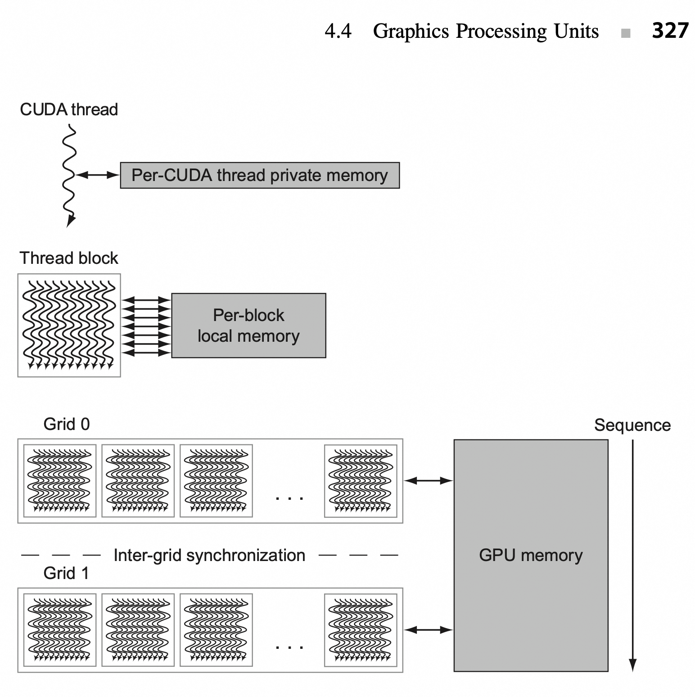

## 1. 量化研究方法

## 2. 4.4 图形处理器

CPU 程序员的挑战不只是在 GPU 上获得出色的性能，还有==协调系统处理器与 GPU 上的计算调度，以及系统存储器与 GPU 存储器之间的数据传输==。

GPU 中的并行：多线程、MIMD、SIMD 和指令级并行。

NVIDIA 将 CUDA 编程定义为 **SIMT** -- ==单指令多线程==。

并行执行和线程管理由 GPU 硬件负责，而不是由应用程序或者操作系统完成。[详解见 Q1](#3-q1-具体解释)

> The hardware Thread Block Scheduler assigns Thread Blocks to multithreaded SIMD Processors, and the hardware Thread Scheduler picks which thread of SIMD instructions to run each clock cycle within a SIMD Processor.

硬件线程块调度器（Thread Block Scheduler）将线程块（Thread Blocks）分配给多线程 SIMD 处理器（multithreaded SIMD Processors），而硬件线程调度器（Thread Scheduler）在每个时钟周期内选择要在 SIMD 处理器中运行的 SIMD 指令线程（thread of SIMD instructions）。详细解释见 [Q2](#q2)

## 3. Stream, kernel, device

这几个概念在 GPU 编程中很常见，其关系可以简单由下图表示：

```
+------------------+              +----------------+
|     Host (CPU)   |              |   Device (GPU) |
|                  |              |                |
|  Launch Kernel   | -----------> |  Kernel Grid   |
|                  |              |  Thread Blocks |
|                  |              |  Threads       |
+------------------+              +----------------+
         |                                 ▲
         |      控制流/数据拷贝              |
         |                                 |
         v                                 |
   +----------------+             +------------------+
   |    Stream 0    | ----------> |  Kernel A        |
   +----------------+             +------------------+
   |    Stream 1    | ----------> |  Kernel B        |
   +----------------+             +------------------+
```

**Device** 是指 **GPU 本身**，相对于运行主程序的 **host（通常是 CPU）**。

- 在多 GPU 系统中，每个 GPU 都是一个 device。
    
- 可以用 API 来查询和选择当前使用的 device（例如 cudaSetDevice () 或 hipSetDevice ()）。
    
- GPU 的内存（device memory）和 CPU 的内存是分开的，通常需要显式拷贝数据。

一个 GPU（device）内部通常包含多个 **SM（Streaming Multiprocessors）**，每个 SM 可以并发执行多个 **warp**（每个 warp 是 32 个线程的调度单元）。


**Kernel** 是运行在 GPU 上的 **函数**，由 host 发起调用。

- Kernel 是大规模并行执行的最小执行单元，多个线程并发运行同一个 kernel。
    
- 在 CUDA/ROCm 中，通过语法类似 `kernel<<<grid, block>>>(...)` 来发起执行。
    
    - Grid: 指的是 thread blocks 的网格布局
        
    - Block: 指的是 block 中线程的个数和布局
    
- Kernel 执行时的数据并行性由开发者设计。

一个 kernel 实际上被分割为多个 block，每个 block 被绑定到一个 SM，直到所有 block 执行完成为止。

**Stream** 是 GPU 上执行指令的 **执行队列**。

- 每个 stream 中的操作是 **顺序执行** 的，但不同 stream 可以并行执行。
    
- 可以利用多个 stream 来实现 kernel 执行和数据拷贝的并发（比如 copy + compute overlap）。
    
- 默认的 stream 是 0，叫 **default stream** 或 **legacy stream**。
    
- 非默认 stream 被称为 **explicit streams**，允许更细粒度的并发控制。

实际的硬件交互映射关系如下图所示：

```
+--------------------+            +---------------------------+
|   CPU (Host)       |            |         GPU               |
|--------------------|            |---------------------------|
| API: cudaMemcpy    |  ======>   | DMA Engine                |
| API: kernel launch |  ======>   | Command Processor (GPC)   |
|                    |            |  └── dispatch to SMs      |
+--------------------+            |     └── Warp Schedulers   |
                                  |         └── Threads       |
                                  +---------------------------+
```

再参考 GPU 的存储结构设计以加深印象：




## 4. Q1

> 并行执行和线程管理由 GPU 硬件负责，而不是由应用程序或者操作系统完成。

这句话的含义是：在 GPU 中，并行任务的执行和线程调度完全由硬件架构直接管理，而非依赖应用程序或操作系统的软件层面控制。这种设计使得 GPU 能够高效实现大规模并行计算，同时降低编程复杂度。

### 4.1. 具体解释

以下是具体解释：

**硬件直接管理并行执行**：GPU 通过 **SIMT（单指令多线程）** 架构实现并行性。其核心思想是：单条指令同时控制多个线程，这些线程**共享指令流但处理不同的数据**。例如，一个线程束（Warp）包含 32 或 64 个线程，由硬件调度器自动分配到流多处理器（SM）的计算单元上执行。同一 Warp 内的线程必须执行相同指令，但每个线程的数据路径独立，因此可以灵活处理分支逻辑（如条件判断）。
相比之下，CPU 的并行执行依赖操作系统的线程调度（如多核任务分配），而 GPU 的线程调度完全由硬件实现，无需软件介入。

**线程模型的硬件抽象**：GPU 的编程模型（如 CUDA）提供了线程网格（Grid）、线程块（Block）和线程（Thread）的逻辑划分，但实际的线程分配与执行由硬件完成：

- 线程网格（Grid）：由多个线程块组成，表示整个计算任务的规模。
- 线程块（Block）：一组线程的集合，绑定到一个流多处理器（SM）上执行。同一块内的线程可通过共享内存协作。
- 线程（Thread）：最小执行单元，由硬件直接调度。
程序员只需定义线程结构（如 `>>`），硬件自动将线程块分配到 SM，并通过线程调度器管理 Warp 的执行顺序，隐藏内存延迟。

**硬件资源的自动分配**：GPU 的硬件设计专门优化了线程管理：

- ==流多处理器（SM）==：每个 SM 包含多个计算核心（CUDA Core）、共享内存、寄存器文件等资源。SM 可同时运行多个线程块，通过上下文切换（Context Switch）高效利用硬件资源。
- 线程调度器：SM 中的调度器（如 Warp Scheduler）根据线程状态（如是否等待数据）动态选择可执行的 Warp，最大化硬件利用率。
- 内存层次：全局内存、共享内存等的访问由硬件自动优化，减少程序员对内存延迟的显式处理。

## 5. SM

### 5.1. SM 的发展

流多处理器（SM）架构随着 GPU 技术的发展不断演进，从最初注重并行处理基本功能，到如今在计算能力、存储管理、指令处理和能效优化等多方面全面提升，以适应日益复杂的计算需求。

1. **早期架构与并行处理基础构建（2000 年代初 - 2006 年左右）**：在 GPU 发展早期，SM 架构开始崭露头角。以英伟达早期产品为例，其主要聚焦于图形处理任务，架构设计围绕并行处理图形数据展开。此时的 SM 包含多个处理核心，能并行处理顶点和像素数据，不过==处理核心数量相对较少==，缓存和共享内存的规模有限，指令集也主要针对图形渲染优化，比如处理图形的几何变换、光照计算等。
2. **计算能力扩展与通用计算支持（2006 - 2012 年）**：随着通用计算需求的增长，SM 架构迎来变革。==*英伟达推出 CUDA 架构后，SM 开始支持通用计算*==。处理核心数量大幅增加，提高了并行计算能力，可处理复杂的矩阵运算、数值模拟等任务。共享内存容量显著提升，方便线程间数据共享，还引入了更灵活的线程调度机制，能够同时管理和执行大量线程，提高计算效率。
3. **架构优化与性能提升（2012 - 2018 年）**：这一时期，SM 架构持续优化。处理核心性能增强，在单位时间内可完成更多计算操作。缓存层次结构更加完善，增加了缓存容量，优化了缓存算法，提升数据访问速度。==*指令集进一步丰富，支持更多复杂的计算指令*==。此外，引入了更高效的内存管理机制，减少内存访问延迟，提高整体性能。
4. **面向深度学习的变革（2018 年至今）**：深度学习兴起，SM 架构再次升级。英伟达的安培架构中，SM 集成了专门的 Tensor Core，针对深度学习中的矩阵运算进行加速，大幅提升计算速度。引入稀疏计算支持，提高对稀疏数据的处理效率。在能效方面也进行了优化，降低功耗的同时提高计算性能，以满足大规模深度学习模型训练和推理的需求。

### 5.2. Tensor Core

SM（Streaming Multiprocessor，流多处理器）和 Tensor Core（张量核心）都是 NVIDIA GPU 中的关键组件，它们相互协作，共同提升 GPU 在不同计算任务中的性能。

**Tensor Core 是 SM 的组成部分**：在 NVIDIA 的 GPU 架构中，如 Volta、Turing 和 Ampere 等，Tensor Core 是集成在 SM 内部的专用处理单元。以 Volta 架构为例，一个 SM 由 4 个 Sub Core 组成，每个 Sub Core 内含有两个 4x4x4 Tensor Core 。Turing 架构的 SM 中，则包含 8 个 Turing Tensor Core。这表明 Tensor Core 是 SM 架构的一部分，依托 SM 的整体架构发挥作用。

**功能上相互配合**：SM 负责管理和执行大量线程，具备强大的并行数据处理能力，其中的 CUDA 核心能执行通用的并行计算任务，处理各种类型的计算指令。而 Tensor Core 是专门为加速深度学习中的矩阵乘法和累加操作设计的，在深度学习训练和推理任务中，当遇到矩阵运算时，Warp Scheduler（负责调度计算单元工作）会向 Tensor Core 发送矩阵乘法 GEMM 运算指令，Tensor Core 接收来自寄存器文件的输入矩阵，执行矩阵乘法操作，并将结果写回寄存器文件。这体现了 SM 的线程管理和通用计算能力，与 Tensor Core 的深度学习矩阵运算加速能力相互配合。

**共同提升计算性能**：SM 的架构设计为 Tensor Core 提供了运行环境和数据交互支持，如 SM 中的 L1 指令缓存、L1 数据缓存和共享内存等组件，保障了 Tensor Core 所需数据的读取和计算结果的存储。Tensor Core 的高效矩阵运算能力又提升了 SM 在深度学习任务上的处理速度，两者协同工作，使得 GPU 在通用计算和深度学习等多领域都能有出色的性能表现。

### 5.3. 举例：Grid/Block/Thread

关系的示意图如下所示：(图中表示 $A = B * C$, 两个向量相乘，每个向量的长度为 8192 个元素)。

1. 每个 SIMD 线程指令计算 32 个元素；
2. 每个线程块包含 16 个 SIMD 线程；
3. 网格包含 16 个线程块。


### 5.4. 与 CPU 的对比

CPU：依赖操作系统管理线程调度（如多核任务分配），线程切换和资源分配由软件控制，适合复杂逻辑和低延迟任务。

GPU：硬件直接管理线程，通过 SIMT 架构和大量线程掩盖内存延迟，适合数据并行任务（如矩阵运算、图像处理）。

总结：GPU 的硬件设计使得并行执行和线程管理成为“黑箱”，程序员只需关注任务的并行划分（如线程块大小），而具体的线程调度、资源分配和延迟隐藏均由硬件自动完成。这种设计大幅提升了并行计算效率，同时降低了编程复杂度。

**GPU 的硬件设计如何隐藏线程管理细节并提升并行计算效率**:

GPU（图形处理器）的架构与传统 CPU 有着根本性的不同，它专为大规模并行计算优化，能够同时运行成千上万个线程。GPU 之所以能够高效执行并行计算，关键在于其硬件设计隐藏了线程调度、资源分配以及延迟隐藏的复杂性，使得开发者只需要关注任务的并行划分，而无需直接管理底层的并行执行细节。

---

#### 5.4.1. GPU 线程管理的“黑箱”特性

在 GPU 上，程序员通常通过 CUDA（NVIDIA）或 HIP（AMD）等并行计算框架，定义计算任务的并行性。开发者需要做的主要工作是：

• 确定数据并行模式：任务如何划分为多个线程进行处理。

• 选择线程块大小（Thread Block Size）：GPU 计算通常基于“线程块（Thread Block）”的概念，程序员需要决定每个块中的线程数。

• 确定网格（Grid）结构：将线程块映射到更大范围的计算任务。

然而，一旦任务被划分好，线程的具体执行顺序、分派到哪个计算单元、如何进行调度、如何隐藏延迟等，完全由 GPU 硬件自动管理，这与**传统 CPU 上需要开发者手动优化线程调度**和同步的做法形成鲜明对比。

---

#### 5.4.2. GPU 自动完成的线程管理机制

GPU 硬件通过多个机制隐藏线程管理细节，从而优化计算效率：

**(1) 线程调度（Warp Scheduling）**：

GPU 的基本执行单元是“Warp”或“Wavefront”（如 NVIDIA 的 Warp 由 32 个线程组成，AMD 的 Wavefront 通常为 64 个线程）。GPU 的硬件调度器负责：

- 自动分配 Warp 到计算单元（Streaming Multiprocessors, SM）
- 在不同 Warp 之间交错执行，以最大化硬件利用率
- 屏蔽不同线程的执行细节，开发者不需要关心线程具体如何被调度

例如，在 CPU 上，如果多个线程争夺相同的核心，可能会导致复杂的上下文切换（context switch），而 GPU 通过“零开销线程切换”机制，在一个 Warp 执行遇到内存访问延迟时，硬件可以快速切换到另一个 Warp，隐藏延迟，从而提高计算效率。

**(2) 资源分配（Register & Shared Memory Management）**：

GPU 采用分层存储架构，包括：

• 寄存器（Register File）

• 共享内存（Shared Memory）

• 全局内存（Global Memory）

• 纹理/常量内存（Texture/Constant Memory）

不同线程块的资源分配由硬件自动管理：

- GPU 会根据线程块的大小，自动划分可用的寄存器和共享内存，**确保线程间不会发生资源冲突**
- 程序员无需手动管理内存访问模式，硬件会自动进行 **数据合并（Memory Coalescing）** 以优化内存访问

在 CPU 上，开发者需要手动进行缓存优化，而在 GPU 上，很多缓存优化（如 L2 Cache、共享内存）由硬件完成，大大减少了程序优化的复杂度。

**(3) 延迟隐藏（Latency Hiding）**：

CPU 主要依靠深度流水线（Deep Pipeline）和分支预测（Branch Prediction） 来减少指令执行的延迟，而 GPU 采用了**大规模线程切换（Thread-Level Parallelism, TLP）** 来隐藏延迟：

- 当某个 Warp 等待内存访问时，GPU 硬件会自动调度另一个 Warp 执行，避免计算单元空闲
- 这种策略能够充分利用 GPU 的超大存储带宽（如 HBM 高带宽存储），在数百至数千个线程间动态调度计算任务

这种延迟隐藏机制使得程序员不需要像在 CPU 上那样进行复杂的流水线优化、寄存器重命名等，而是交给 GPU 硬件自动优化。

---

#### 5.4.3. GPU 这种硬件设计的优势

**(1) 降低编程复杂度**

由于线程管理和调度均由硬件完成，开发者只需要关注：

• 如何划分计算任务

• 如何选择合理的线程块大小

• 如何优化数据访问模式（如避免共享内存冲突）

相较于 CPU 上需要手动管理线程、同步、缓存等，GPU 的这种设计大大降低了并行编程的门槛，使得更多开发者能够利用 GPU 进行加速计算。

**(2) 提升并行计算效率**

• 由于 GPU 能够同时管理数万个线程，并通过自动调度 Warp 来优化资源利用率，使得 GPU 在数据并行任务上展现出极高的吞吐率

• 通过零开销线程切换，GPU 在面对高延迟操作（如全局内存访问）时依然能够保持高效执行，而 CPU 可能会因为缓存未命中导致停滞

• 通过自动资源分配和寄存器优化，避免了 CPU 上需要手动进行的复杂优化

**(3) 适用于大规模计算任务**

GPU 的这种设计特别适合：

- 深度学习和 AI 训练（如 TensorFlow、PyTorch）：因为矩阵计算可以高度并行化

- 科学计算和 HPC（如气候模拟、基因计算）：涉及大量浮点运算的任务

- 大规模图形渲染（如游戏和视觉计算）：GPU 本就是为并行渲染设计的

- 数据库加速（如 GPU 加速 SQL 查询）：高吞吐率可以显著提升查询性能

---

#### 5.4.4. 结论

GPU 通过将**线程调度、资源分配、延迟隐藏等低层细节封装在硬件中**，使得开发者能够更专注于任务的并行划分，而无需关心具体的线程管理。这种“黑箱”设计使得 GPU 能够高效执行大规模并行计算任务，同时大幅降低了并行编程的复杂度，从而推动了 AI、HPC、图形渲染等领域的快速发展。

这种架构的核心理念是**让硬件管理并行性，让开发者专注于计算逻辑**，从而最大化计算资源的利用率，实现高效的并行计算。

## 6. Q2

> 硬件线程块调度器（Thread Block Scheduler）将线程块（Thread Blocks）分配给多线程 SIMD 处理器（multithreaded SIMD Processors），而硬件线程调度器（Thread Scheduler）在每个时钟周期内选择要在 SIMD 处理器中运行的 SIMD 指令线程（thread of SIMD instructions）。

这句话描述了 GPU 内部的线程块调度（Thread Block Scheduling） 和线程调度（Thread Scheduling） 两个层次的机制，并且强调了线程调度是逐个时钟周期进行的，也就是在每个 SIMD 处理器内部的指令选择是动态的。

### 6.1. 硬件线程块调度器 （Thread Block Scheduler）

1. 负责将线程块（Thread Blocks） 分配给多线程 SIMD 处理器（Multithreaded SIMD Processors）。
2. 在 GPU 计算模型（如 CUDA、HIP、OpenCL）中，一个计算任务通常会被划分成多个线程块，每个线程块内部包含多个线程（Threads）。
3. 由于 GPU 由多个 SIMD 处理单元（如 Streaming Multiprocessors（SM） 或 Compute Units（CU））组成，因此需要线程块调度器负责把任务均匀分配到这些处理单元上。

如果一个 GPU 有 8 个 SIMD 处理单元，而计算任务包含 64 个线程块，线程块调度器可能会将每个 SIMD 处理单元分配 8 个线程块，确保所有计算单元都参与计算，从而最大化吞吐量。

---

### 6.2. 硬件线程调度器 （Thread Scheduler）

- 负责在每个 SIMD 处理器内部，每个时钟周期（clock cycle） 选择一个要执行的 SIMD 指令线程（thread of SIMD instructions）。

- 由于 GPU 采用 SIMT（Single Instruction, Multiple Threads） 计算模式，每个 SIMD 处理单元可以同时执行多个 Warp（NVIDIA）/Wavefront（AMD），但由于计算资源有限，必须在多个候选线程中选择合适的线程执行。

**关键点：**

1. 多个 Warp/Wavefront 竞争执行权：在一个 SIMD 处理单元内部，可能有几十到上百个 Warp/Wavefront 处于就绪（ready） 状态，但一次只能执行一个 Warp/Wavefront 的 SIMD 指令。

2. 调度发生在每个时钟周期：线程调度器在每个时钟周期（clock cycle） 都会选择一个 Warp/Wavefront，执行它的下一条 SIMD 指令。

3. 影响调度决策的因素：

- 指令依赖性（Instruction Dependencies）： 如果某个 Warp/Wavefront 需要的数据还没准备好，调度器可能会跳过它，选择另一个 Warp/Wavefront。
- 寄存器压力（Register Pressure）： 如果某个 Warp/Wavefront 占用了太多寄存器，可能会降低调度器的灵活性。
- 内存访问延迟（Memory Latency）： 如果某个 Warp/Wavefront 需要访问 DRAM，调度器可能会选择另一个不受内存访问限制的 Warp/Wavefront 先执行。

### 6.3. 示例

假设一个 SIMD 处理器可以并行执行 32 个线程（即 1 个 Warp/Wavefront），但它可能维护了 64 个 Warp/Wavefront 在等待执行。

线程调度器会在每个时钟周期选择一个就绪（ready） 的 Warp/Wavefront，执行其中的 SIMD 指令。

如果某个 Warp/Wavefront 的内存访问未完成，线程调度器可能会选择另一个已经准备好执行的 Warp/Wavefront，以隐藏延迟（latency hiding）。

---

### 6.4. 总结

**Thread Block Scheduler（线程块调度器）**：

- 作用： 负责在多个 SIMD 处理单元（如 SM/CU） 之间分配线程块（Thread Blocks）。
- 目标： 确保所有 SIMD 处理单元都参与计算，提高吞吐量。

**Thread Scheduler（线程调度器）：**

- 作用： 负责在每个 SIMD 处理单元内部，每个时钟周期（clock cycle） 选择一个 Warp/Wavefront，执行其中的 SIMD 指令。
- 目标： 通过动态调度 Warp/Wavefront，最大化计算资源的利用率，同时隐藏内存访问延迟。

---

### 6.5. 直观比喻

可以把整个 GPU 计算过程比作工厂流水线：

1. Thread Block Scheduler 类似于车间经理，负责把不同的任务分配给多个生产线（SIMD 处理单元）。
2. Thread Scheduler 类似于生产线上的调度员，每秒钟（每个时钟周期）都要决定当前哪条生产线上的工作站（Warp/Wavefront）应该执行下一步任务。

这样，GPU 通过多层次调度，在硬件层面实现高吞吐量并行计算，有效地利用计算资源。

## 7. Explicit Predicate Registers（显式谓词寄存器）

Explicit Predicate Registers（显式谓词寄存器）通常出现在支持 VLIW（超长指令字） 或 SIMD（单指令多数据） 体系结构的 CPU 和 GPU 设计中，用于实现指令级并行（ILP） 和数据级并行（DLP）。它们的主要作用是存储和控制指令或数据的执行条件。

### 7.1. 什么是 Explicit Predicate Registers？

在计算机体系结构中，**predicate（谓词）** 是一个布尔值（0/1），用于指示某条指令是否应该执行。Predicate 允许在不需要分支指令（如 if-else 或 branch）的情况下，实现**条件执行**（conditional execution）。这在**减少流水线分支预测失败、提高指令并行度**方面非常重要。

**Predicate Registers（谓词寄存器）** 存储这些布尔值，每个谓词寄存器通常存储一个或多个谓词位。例如，在向量化执行时，每个 SIMD 线程可以有一个对应的谓词寄存器位，控制它是否执行当前指令。

**显式谓词寄存器（Explicit Predicate Registers）** “显式”指的是架构直接提供**专门的**谓词寄存器，而不是依赖通用寄存器或状态标志位。例如：

- Intel AVX-512: 提供 16 个 mask registers（k0-k15），用于 SIMD 向量化中的条件掩码。

- AMD CDNA / RDNA: GPU 采用谓词寄存器来管理 SIMT（单指令多线程）执行，控制哪些线程在 warp/wavefront 中生效。

- Itanium（IA-64）: 采用了大量的谓词寄存器（64 个），用于 VLIW 指令并行调度。

- ARM SVE（Scalable Vector Extension）: 提供了显式谓词寄存器 p0-p7，用于向量掩码操作。

### 7.2. 显式谓词寄存器的作用

**避免分支预测失败**：传统 if-else 代码会引入分支预测，而谓词寄存器允许**无分支执行**，减少分支预测开销。例如：

```asm
; x86 AVX-512
VPADDQ ZMM1, ZMM2, ZMM3 {k1}  ; 仅在 k1 掩码为 1 的位置执行加法
```

 **提高指令并行度（ILP）**：现代 CPU 会同时调度多个指令，使用谓词寄存器可以让不同指令并行执行，不必等待分支决策完成。

 **向量化计算（SIMD/SIMT）**：GPU 和向量指令集利用谓词寄存器进行**掩码计算**，控制哪些元素参与计算，例如：

```asm
; ARM SVE
ADD Z0.S, P0/M, Z1.S, Z2.S  ; 仅对 P0 掩码为 1 的元素执行加法
```

**减少控制依赖（Control Dependency）**：传统流水线 CPU 需要预测分支，而谓词寄存器让**所有指令都进入流水线**，只是在执行阶段选择是否生效，降低分支误预测的开销。

### 7.3. 典型应用

 **AI 和 HPC**: 深度学习推理（如 Transformer 模型）和数值计算中，经常使用 AVX-512、SVE、CDNA/RDNA 的 SIMD/矩阵运算，显式谓词寄存器用于掩码计算。

 **编译器优化**: LLVM、GCC 在自动向量化过程中，会利用谓词寄存器生成**无分支代码**，提升 SIMD 效率。

 **GPU Wavefront 处理**: AMD RDNA/CDNA GPU 使用显式谓词寄存器管理**Wavefront 屏蔽（Wave Masking）**，让 SIMD 线程更高效地执行 warp/wave 级分支。

::: tip 总结
**显式谓词寄存器**是一种专门用于**条件执行**的寄存器，广泛应用于 **VLIW、SIMD、SIMT** 体系结构。它们的优势包括**减少分支预测失败、提高指令并行度、提升向量化计算效率**，在现代 CPU/GPU 体系结构中扮演关键角色。
:::

## 8. NVIDA GPU 指令集体系结构

列举部分指令：


## 9. NV GPU 存储结构

### 9.1. Streaming Caches

> Rather than rely on large caches to contain the whole working sets of an application, GPUs traditionally ==use smaller streaming caches== and, because their working sets can be hundreds of megabytes, rely on extensive multithreading of threads of SIMD instructions to **hide the long latency to DRAM.**

这句话的意思是：

与其依靠大容量的缓存来容纳应用程序的整个工作集，GPU 传统上采用更小的流式缓存。由于 GPU 的工作集可能达到数百兆字节，为了掩盖访问 DRAM（动态随机存取存储器）时的长延迟，GPU 依靠大量的线程并行执行 SIMD（单指令多数据）指令来隐藏这些延迟。

1. **大缓存 vs. 小流式缓存**

- **CPU** 通常使用较大的缓存（如 L2/L3 缓存）来存储经常访问的数据，从而减少对主存（DRAM）的访问次数。
- **GPU** 则采用**小型流式缓存**（Streaming Cache）。它主要用于临时存储数据，通过高速缓存访问来减少访存延迟，但不会试图容纳整个应用的工作集。

2. **Workload 大小**：GPU 的应用场景（如图像处理、深度学习等）通常需要处理海量数据，其 Workload 可能达到数百兆字节，远超缓存的容量。

3. **隐藏内存延迟**

- 由于 DRAM 访问的延迟较长，GPU 不像 CPU 那样依靠复杂的缓存层级来降低延迟。
- GPU 采用**大量的线程**（通过 SIMT/SIMD 方式）执行，==确保在某个线程等待数据返回时，其他线程可以继续执行其他任务==。这种方法有效地**隐藏内存访问延迟**。

4. **SIMD 指令**：GPU 通过 SIMD 指令（Single Instruction, Multiple Data）执行一条指令，同时操作多个数据项。再结合超线程调度，多线程并行执行进一步提高了吞吐量。

GPU 的架构设计强调**吞吐量**而非**低延迟**。通过依靠**小型流式缓存**和**多线程掩盖内存延迟**，GPU 能高效处理大规模数据并执行并行计算。

> [!NOTE]
>
> 此处命名为 `数据`，但这里并没有提供具体数据集，而是提供了处理获取大规模数据的方法

## 10. Device and Stream

在 CUDA 编程里，`device`（设备）和 `stream`（流）是两个关键概念，它们存在着密切的联系，下面将为你详细介绍它们之间的关系。

### 10.1. 基本概念

- **Device**：在 CUDA 语境中，`device` 通常指的是 GPU。CUDA 程序可以在多个 GPU 设备上并行运行，每个 GPU 设备都有其独立的内存和计算资源。
- **Stream**：`stream` 是一系列按顺序执行的 CUDA 操作队列。同一流内的操作会按照顺序依次执行，不同流内的操作则可以并行执行，这样就能提高 GPU 资源的利用率。

### 10.2. 二者关系

- **设备包含多个流**：一个 `device`（GPU）能够同时管理多个 `stream`。借助多个流，你可以让不同的 CUDA 操作在同一个 GPU 上并行执行，以此提升整体性能。例如，在一个 GPU 上可以同时开启数据传输流和内核执行流，使数据传输和内核计算并行进行。
- **流在设备上执行**：所有的 `stream` 都必须依附于某个 `device`。当你创建一个 `stream` 时，实际上是在特定的 GPU 设备上创建了一个操作队列。不同设备上的流是相互独立的，不能跨设备共享。
- **通过流管理设备资源**：合理运用 `stream` 能够更好地管理 `device`（GPU）的资源。例如，你可以把不同类型的任务分配到不同的流中，像将数据传输任务和内核计算任务分别放到不同的流里，从而实现数据传输和内核计算的重叠，充分利用 GPU 的带宽和计算能力。

### 10.3. 示例代码

下面是一个简单的 CUDA C++代码示例，展示了如何在一个 GPU 设备上创建和使用多个流：

```
#include <cuda_runtime.h>
#include <iostream>

__global__ void kernel(float* d_a, float* d_b, float* d_c, int n) {
    int idx = threadIdx.x + blockIdx.x * blockDim.x;
    if (idx < n) {
        d_c[idx] = d_a[idx] + d_b[idx];
    }
}

int main() {
    const int n = 1024;
    const int blockSize = 256;
    const int gridSize = (n + blockSize - 1) / blockSize;

    float *h_a, *h_b, *h_c;
    float *d_a, *d_b, *d_c;

    // 分配主机内存
    h_a = (float*)malloc(n * sizeof(float));
    h_b = (float*)malloc(n * sizeof(float));
    h_c = (float*)malloc(n * sizeof(float));

    // 初始化主机数据
    for (int i = 0; i < n; i++) {
        h_a[i] = static_cast<float>(i);
        h_b[i] = static_cast<float>(i * 2);
    }

    // 分配设备内存
    cudaMalloc((void**)&d_a, n * sizeof(float));
    cudaMalloc((void**)&d_b, n * sizeof(float));
    cudaMalloc((void**)&d_c, n * sizeof(float));

    // 创建两个流
    cudaStream_t stream1, stream2;
    cudaStreamCreate(&stream1);
    cudaStreamCreate(&stream2);

    // 在流1中执行数据传输和内核计算
    cudaMemcpyAsync(d_a, h_a, n * sizeof(float), cudaMemcpyHostToDevice, stream1);
    cudaMemcpyAsync(d_b, h_b, n * sizeof(float), cudaMemcpyHostToDevice, stream1);
    kernel<<<gridSize, blockSize, 0, stream1>>>(d_a, d_b, d_c, n);
    cudaMemcpyAsync(h_c, d_c, n * sizeof(float), cudaMemcpyDeviceToHost, stream1);

    // 在流2中执行另一个任务（这里简单示例为同步操作）
    cudaStreamSynchronize(stream2);

    // 销毁流
    cudaStreamDestroy(stream1);
    cudaStreamDestroy(stream2);

    // 释放设备内存
    cudaFree(d_a);
    cudaFree(d_b);
    cudaFree(d_c);

    // 释放主机内存
    free(h_a);
    free(h_b);
    free(h_c);

    return 0;
}
```

在这个示例里，我们在同一个 GPU 设备上创建了两个流 `stream1` 和 `stream2`，并在 `stream1` 中执行了数据传输和内核计算任务。这样，通过使用流，我们能够更好地管理 GPU 设备的资源，提高程序的性能。

### 10.4. Stream 的进一步细分理解

从功能和操作类型角度，`Stream`内的操作可以更细致地划分：

- **内存操作流**：

	- **主机到设备的内存传输**：借助 `cudaMemcpyAsync` 函数，能把数据从主机（CPU）内存异步传输到设备（GPU）内存。比如在深度学习训练里，需把输入数据和标签从主机内存传至 GPU 内存，以开展后续计算。
	- **设备到主机的内存传输**：同样使用 `cudaMemcpyAsync` 函数，可将数据从设备内存异步传输回主机内存。例如在推理结束后，要把计算结果从 GPU 内存传回 CPU 内存进行后续处理。
	- **设备内的内存操作**：像 `cudaMemsetAsync` 可用于异步地将设备内存的某个区域设置为特定值，`cudaMemcpyPeerAsync` 能在不同 GPU 设备间异步传输数据。

- **内核执行流**：用于调度和执行 CUDA 内核函数。CUDA 内核是在 GPU 上并行执行的函数，可同时处理大量数据。例如，在矩阵乘法运算中，可编写一个 CUDA 内核函数，让大量线程并行计算矩阵元素的乘积和累加结果。
- **事件同步流**：CUDA 事件可用于记录流中特定操作的完成时间，并且能实现不同流之间的同步。例如，你可以在一个流中记录一个事件，在另一个流中等待该事件完成后再继续执行后续操作，以此确保不同流中的操作按特定顺序执行。

## 11. Cuda 内核

CUDA 内核是在 GPU 上并行执行的函数。它由大量线程组成，这些线程会被组织成线程块和网格。每个线程负责处理数据的一部分，众多线程同时运行，从而实现并行计算。以下是一个简单的 CUDA 内核示例，用于实现向量加法：

```
__global__ void vectorAdd(float* a, float* b, float* c, int n) {
    int idx = threadIdx.x + blockIdx.x * blockDim.x;
    if (idx < n) {
        c[idx] = a[idx] + b[idx];
    }
}
```

在这个示例中，`__global__` 关键字表明这是一个 CUDA 内核函数。`threadIdx.x` 表示线程在块内的索引，`blockIdx.x` 表示块在网格内的索引，`blockDim.x` 表示块的大小。通过这些索引，每个线程可以确定自己要处理的数据位置。
