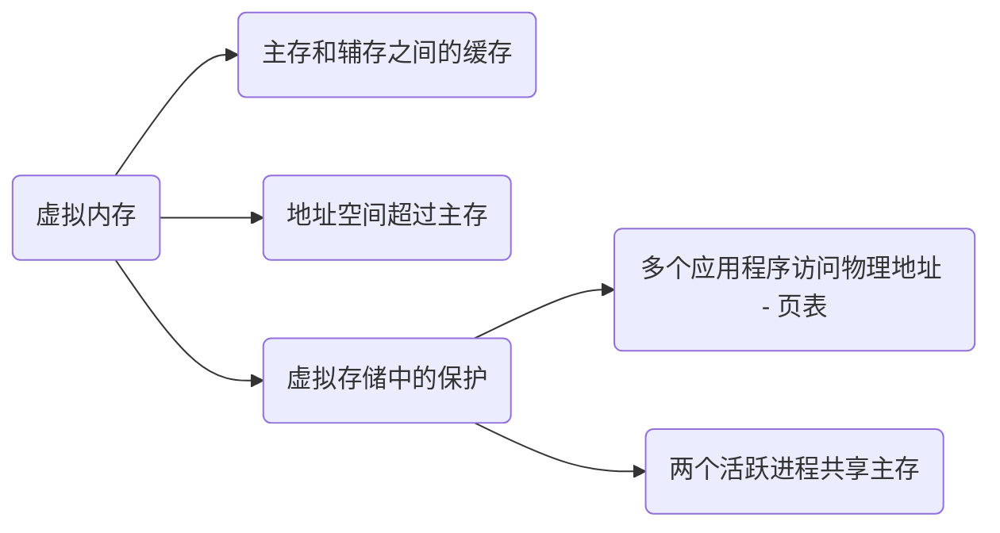

## 1. Abstract

本文主要讲述和理解虚拟内存（后文简称 VM， VA 等）、Page, TLB 的概念，行文可能较为跳跃，需要特别注意。

## 2. Virtual Memory

### 2.1. Abstract

> 什么是虚拟内存？
> 
> Virtual memory is a technique used by operating systems to enable programs to **use more memory than is physically available** in the system. When a program accesses memory, the address it uses is a virtual address, which is **translated by the hardware into a physical address** that corresponds to a location in physical memory. This **translation process can be slow**, especially if it has to be performed every time the program accesses memory.

1. 虚拟内存的存在使得程序可以使用比可用物理内存更多的存储空间（程序员想要无限多的存储空间）*-- use more memory than is physically available*
2. 虚拟地址是由物理地址转化而来的 *-- translated by the hardware into a physical address*
3. 这种转换过程一般会比较缓慢（引出后续 TLB）*-- translation process can be slow*

### 2.2. 虚拟内存与进程

:::tip

虚拟内存是保证进程之间隔离的重要机制之一。

:::

内核使用**虚拟内存和进程控制块**来保证进程之间的隔离。

对于虚拟内存而言，每个进程都有自己的地址空间，其中包含代码、数据和栈。这样，每个进程之间的内存空间都是相互隔离的，一个进程无法访问另一个进程的内存。

虚拟内存具体是如何实现进程之间的隔离的？虚拟内存为每个进程提供了**单独的地址空间**，以实现进程之间的隔离。这种隔离是把物理内存分成大小相等的**页**来实现的（从虚拟内存的角度看，页就是内存的最小单位）；当进程访问其虚拟地址空间中的某个页时，操作系统会加载虚拟页对应的物理页（MMU: 将虚拟地址转化为物理地址），在这个过程中，操作系统会检查当前进程是否有权限访问该页面。也就是说：一个进程无法访问其他进程的地址空间。 

> *问题：两个进程的虚拟地址空间可能会是什么样子的？*
>
> 进程 A 的虚拟地址空间：
>
> 0x00000000 ~ 0x7fffffff    用户空间
> 0x80000000 ~ 0xffffffff    内核空间
>
> 进程 B 的虚拟地址空间：
>
> 0x00000000 ~ 0x7fffffff    用户空间
> 0x80000000 ~ 0xffffffff    内核空间
>
> A, B 是两个独立的进程，所以虽然用户空间的地址范围相同，但是使用的虚拟地址是不同的；哪怕虚拟地址相同，也会对应不同的物理地址。


### 2.3. 页表

我们上面说，进程隔离的一个很重要的机制保证就是虚拟内存，那么从底层来看，是怎么实现的呢？答案是**页表。

1. 每个进程都拥有自己的页表；
   具体而言，Linux 为每个进程都维护一个 `task_struct` 结构体（进程描述符 PCB, 无论怎么称呼），task_struct -> mm_struct 结构体成员用来保存该进程的页表。

   > 在进程切换的过程中，内核把新的页表的地址写入 CR3 控制寄存器。CR3中含有页目录表的物理内存基地址，因此该寄存器也被称为页目录基地址寄存器 PDBR(Page-Directory Base address Register)[^1]

2. 每个进程（线程）绑定到自己的页表，页表不同意味着物理页不同（MMU 负责地址转换，不同的页表无法对应到一个物理页）

对于一个进程而言，操作系统如何保证其访问权限？检查当前操作系统进程是否可以访问目标内存地址，具体到指令级别：**验证当前指令是否允许访问特定内存地址；这个过程的实现是通过 MMU 来做的**：CPU生成一个虚拟地址，虚拟地址经过 MMU 进行转换，将虚拟地址分解为**页号和页内偏移**，然后 MMU 查找页表，计算出最终的物理地址，查找时会检测非法或者权限。

对于 4K 页表，网络上有一个非常好的解释如下[^2]:


> 页表的本质其实就是一个物理内存页，一张页表 4K 大小；也就是说，这 4K == 图中 1024 个 entry * 每个 entry 4B 大小。

更进一步，64 位系统使用 4 级页表的结构如下[^3]：


Linux 内存提供的**大页机制**，上图的 4 级页表中，每个 PTE entry 映射的物理页就是 4K，如果采用 PMD entry 直接映射物理页，则一次 Page Fault 可以直接分配并映射 2M 的大页，并且只需要一个 TLB entry 即可存储这 2M 内存的映射关系，**这样可以大幅提升内存分配与地址翻译的速度**。

:::note 
可以使用 perf 工具对比进程使用大页前后的 PageFault 次数的变化：
```bash
perf stat -e page-faults -p <pid> --sleep 5
```
:::

### 2.4. THP

目前内核提供了两种大页机制：**静态大页和透明大页**。

静态大页通常需要应用程序显式指定预留的大小和数量，而透明大页(THP, Transparent Huge Page) 的分配过程用户不感知，所以对用户透明，其过程如下：
在 THP **always 模式**下，会在 Page Fault 过程中，为符合要求的 vma 尽量分配大页进行映射；如果此时分配大页失败，比如整机物理内存碎片化严重，无法分配出连续的大页内存，那么就会 fallback 到普通的 4K 进行映射，但会记录下该进程的地址空间 mm_struct；然后 THP 会在后台启动 khugepaged 线程，定期扫描这些记录的 mm_struct，并进行合页操作。因为此时可能已经能分配出大页内存了，那么就可以将此前 fallback 的 4K 小页映射转换为大页映射，以提高程序性能。整个过程完全不需要用户进程参与，对用户进程是透明的，因此称为透明大页。

THP 还支持 **madvise 模式**，该模式需要应用程序指定使用大页的地址范围，内核只对指定的地址范围做 THP 相关的操作。这样可以更加针对性、更加细致地优化特定应用程序的性能，又不至于造成反向的负面影响。


OK，现在有一个很重要的问题：进程间通信的时候，我们都需要把数据 copy 到 kernel space, 因为进程的地址空间是隔离的，而 kernel space 是进程共享的；如果说，我们要绕过 kernel 直接进行进程间通信，需要解决以下问题：
1. 如何在用户态能看到其他进程的页表？（假设现在我们不用 Linux, 我们自己是可以实现这样的机制的）
2. 如果说直接访问其他进程的页表有安全隐患，那么我们是否可以在用户态创建一个共享的页表？


### 2.5. Summary




- 虚拟内存可以理解成在主存和辅存（磁盘、硬盘）之间进行数据缓存管理的一级存储层次。

  > Virtual memory is the name for the level of memory hierarchy that manages **caching** between the **main memory** and **secondary memory**.

  从这个原文中我们理解，其本质还是可以理解为一个 cache.

- 虚拟内存允许单个程序将其地址空间扩展到超出主存的限制。

  这句话我是这么理解的：虚拟内存一般可以设置为主存的 1.5 倍大小（建议值），主存也可以理解为辅存的 cache, 所以说虚拟内存在主存和辅存之间，其最大的大小限制应该是辅存的大小。

  虽然虚拟存储是为了小容量的存储看起来像大容量的存储，但是主存和辅存之间的性能差异意味着，如果程序经常访问比它拥有的物理存储更多的虚拟存储，程序运行会非常慢。这样的程序会不停的在主存和辅存之间交换页面，这种情况称作：**thrashing**

- 虚拟内存支持以**受保护的方式**在多个同时活跃的进程之间共享主存。

  为什么要用受保护的方式，其原因有 2 点：

  1. 保护多个应用程序不会同时访问到同一块物理地址。（官方行文：允许多个进程共享一个主存；保护机制确保：一个恶意进程不能写另一个用户进程或者操作系统的地址空间）
  2. 防止一个进程读另一个进程的数据

  

### 2.6. 进程与页表

在进程切换时，页表的处理是操作系统内存管理的重要部分。不同的进程拥有不同的虚拟地址空间，而页表用于将虚拟地址转换为物理地址，因此在进程切换时需要进行页表切换。具体的处理过程如下：

1. **保存当前进程的上下文**：当操作系统决定从当前进程 P1 切换到另一个进程 P2 时，需要保存当前进程 P1 的硬件上下文，包括：CPU 寄存器、程序计数器（PC）、页表基地址寄存器（Page Table Base Register，PTBR）或相关控制寄存器；这些信息被保存在 P1 的进程控制块（PCB）中。

2. **加载新进程的页表：** 当操作系统切换到进程 P2 时，需要恢复 P2 的上下文信息：
   - 从 P2 的 PCB 中加载页表基地址到 页表基地址寄存器（PTBR）
   - 如果系统支持多级页表或页表缓存在硬件中（例如 TLB 缓存），操作系统还需要清空或重新配置这些缓存。

3. **刷新 TLB：** TLB 用于缓存最近访问的页表项，加速地址转换。在进程切换时，由于不同的进程页表不同，TLB 中的条目通常会失效（因为它们对应的是旧进程的虚拟地址空间），操作系统通常通过 TLB 刷新 或 上下文标识符（ASID） 机制来确保页表转换正确。

4. **更新 MMU:**  现代 CPU 使用 内存管理单元（MMU） 完成地址转换，操作系统在进程切换时将新页表基地址通知 MMU，MMU 会自动根据新的页表基地址完成虚拟地址到物理地址的转换。

5. **地址空间的保护：** 由于不同的进程使用各自的页表，每个进程的虚拟地址空间是相互隔离的。页表的切换确保了进程只能访问属于自己的地址空间，以及防止跨进程的内存访问，从而提供内存保护。

不同的体系结构和操作系统对页表的处理可能有细微差别：

​	1.	x86 架构：页表基地址通过 CR3 寄存器加载，切换进程时修改 CR3，并触发 TLB 刷新。

​	2.	ARM 架构：类似地，使用页表基地址寄存器（例如 TTBR0/TTBR1）切换页表。

​	3.	上下文标识符（ASID）：一些硬件支持 ASID，可以减少 TLB 刷新的开销。

总结来说，进程切换时页表的处理步骤主要包括：

​	1.	保存旧进程的页表基地址（PTBR）和上下文。

​	2.	加载新进程的页表基地址到 PTBR。

​	3.	刷新 TLB 或使用 ASID 机制区分页表。

​	4.	通知 MMU 使用新的页表进行地址转换。

页表的切换是确保各进程虚拟地址空间隔离和正确运行的核心机制。


## 3. TLB

### 3.1. What is TLB?

> TLB stands for **Translation Lookaside Buffer**, and it is a **hardware cache** that is used in computer architecture to **speed up virtual memory access.**

> The TLB is a cache that stores recently used virtual-to-physical address translations, making it possible to **quickly retrieve the physical address** for a given virtual address. When a program requests a memory access, the hardware first checks the TLB to see if it contains the translation for the virtual address. If the translation is in the TLB, the hardware can use it to quickly access the corresponding physical address. If the translation is not in the TLB, the hardware has to perform the translation, which takes more time.

对上述描述的简单理解：

1. TLB 存储了最近使用过的 *virtual-to-physical* 地址转换；这也印证了为什么有些说法称 TLB 就像缓存中的一个条目，TLB 就是缓存了这一转换信息
2. 程序访存请求过来以后，硬件会首先检查 TLB, 命中的话，很快返回虚拟地址对应的物理地址；如果缺失的话，就需要花费较多的时间进行地址转换

也可以这么称呼：**加快地址转化：TLB**。TLB 的一些描述可以参考如下：

- 页表存储在主存中，所以程序的每次访存请求至少需要两次访问：查页表获得物理地址、获得物理地址中的数据。

- 现代处理器设计了一个特殊的 cache 用于追踪最近使用过的地址转化（应用局部性原理），这个 cache 结构称为快表（TLB）

  简而言之：TLB 作为页表的 cache 而存在（注意页表是在主存中，方便理解 ）

### 3.2. TLB Miss

> A TLB miss occurs when the hardware attempts to translate a virtual memory address into a physical memory address and **cannot find the translation in the Translation Lookaside Buffer (TLB)**. When this happens, the hardware has to **perform a full page table walk** to find the translation, which is a more time-consuming process than using the TLB.

TLB 失效，顾名思义就是 TLB 中没有表项能与虚拟地址匹配。按照上面的说法就是，TLB 失效是在 TLB 中没有找到地址转换。

TLB 失效表明两种可能性之一：

1. 页在内存中，但是 TLB 中没有创建
2. 页不在内存中，需要把控制权转接给操作系统处理缺页失效

> TLB misses can happen for several reasons. For example, if a **program accesses memory that has not been recently accessed**, the corresponding translation may have been evicted from the TLB due to space constraints. Similarly, TLB misses can occur when the **operating system swaps pages** in and out of physical memory, or when a program executes a system call that causes a context switch.

TLB 失效的原因可能是：

1. 程序访问的地址近期没有被访问过，由于 TLB 空间的限制，这个 translation 可能就没有被存储在 TLB 中（page 在内存中）
2. 操作系统 swap pages (page 没在内存中)

 这两者就可以对应上述两点 TLB 失效的两种可能。

:::note 如何处理缺页失效或者 TLB 失效？

核心：通过**例外机制**来中断活跃进程，将控制转移到操作系统，然后再恢复执行被中断的进程。

两个特殊的控制寄存器：SEPC 和 SCAUSE.

:::

除此之外，如果我们检测到某个系统的 TLB Miss 比较高的话，可以使用如下的措施：

> To mitigate the impact of TLB misses, modern processors often employ techniques such as **multi-level TLBs**, **TLB prefetching**, and **hardware page table walkers**, which can reduce the likelihood and latency of TLB misses. Additionally, operating systems can optimize memory management strategies to minimize the number of TLB misses, such as using **huge pages** or transparent huge pages to reduce the size of page tables and increase TLB hit rates.

1. multi-level TLBs (two-level page table structure in arm)
2. TLB prefetching
3. hardware page table walkers
4. huge pages, THP, hugetext..(reduce page table size, increase TLB hit)


### 3.3. TLB and L1 ICache(VIPT)


如图所示，解释一下 L1 ICache VIPT：
1. 64 位虚拟地址在逻辑上被分为虚拟页号与页内偏移：virtual pagenumber & page offset
2. 页内偏移的高位被发送到 L1 ICache 用作索引
3. 如果 TLB 匹配命中，则将物理页号发送到 L1 缓存标记(L1 cache tag), 检查是否匹配
4. 如果匹配，则是 L1 缓存命中
5. L1 Miss 的话则使用物理地址尝试 L2 缓存

### 3.4. TLB Walk vs. TLB Miss

**ITLB Miss**：ITLB 中没有找到所需的地址映射；

**ITLB Walk**：为解决 ITLB Miss 而触发的页表遍历过程；ITLB Walk 的触发必须是建立在 L1/L2... TLB Miss 的前提下，在 Intel 平台（8 代）由于是 L1 ITLB -> STLB 的架构，故发生 ITLB Walk 意味着在 STLB 也 Miss 然后触发了 Page Table Walk. 此时代价较大，需要多次内存访问页表，影响性能。

> (Intel) An instruction TLB miss first goes to the L2 TLB, which contains 1536 PTEs of 4 KiB page sizes and is 12-way set associative. It takes 8 clock cycles to load the L1 TLB from the L2 TLB, which leads to the 9-cycle miss penalty including the initial clock cycle to access the L1 TLB. **If the L2 TLB misses**, a hardware algorithm is used to **walk the page table** and update the TLB entry.==**L2 TLB Miss 导致 page table walk**==
>
> Sections L.5 and L.6 of online Appendix L describe page table walkers and page structure caches. In the worst case, the page is not in memory, and the operating system gets the page from secondary storage. Because millions of instructions could execute during a **page fault**, the operating system will swap in another process if one is waiting to run. Otherwise, if there is no TLB exception, the instruction cache access continues.


## 4. Page 进阶

### 4.1. 页面大小的权衡

页面大小是比较常见的体系结构参数。如果选择一个偏大的页面的话，其优点可以如下所示：

1. 页表的大小与页面的大小成反比；增大页面的大小可以节省存储器；
2. 较大页面可使得缓存更大；
3. 传递较大页面效率更高；
4. TLB 的条目数量有限，较大页面意味着可以高效地映射更多存储器，最终可以减少 TLB 缺失

较小页面则可以节省内存，防止内部碎片化；还有一个问题就是较大的页面可能会延长调用一个进程的时间，因为进程启动的时候，很多进程很小。

**页表和 TLB 的关系**：TLB 用于加速虚拟地址到物理地址的映射过程，而页表是实现虚拟内存管理的核心数据结构之一。如果 TLB 中没有缓存映射关系的话，CPU 就需要对页表进行查找，并将这个映射关系添加到 TLB 中以供下次使用。

### 4.2. Page Fault

- 如果 virtual page 的有效位无效，那么就发生缺页失效。其本质是程序在执行过程中中需要访问的某一页数据或者代码不在内存中。

- 缺页失效发生的时候，如果内存中的所有页表都在使用的话，需要选择一页进行替换。

- 替换的时候使用近似 LRU 算法，因为实现完整的 LRU 算法代价太高。ARM V8 使用了一个 access bit 来实现这个。

### 4.3. Virtual page number and Page offset

Virtual Address 可以分为两个部分：Virtual page number 和 Page offset, 可以翻译为虚拟页号和页内偏移量。

#### 4.3.1. Virtual Page Number

Virtual Page Number (VPN) 是用于标识要访问的 page, 这个字段会用于虚拟地址到物理地址的转换。

VPN 的大小取决于虚拟地址空间的和虚拟存储系统使用的 page 大小；举例而言，一个系统有 32-bit 虚拟地址，4KB page, 则 VPN 的大小为 $2^{20}$ bit,  其需要在地址空间中表示 $2^{20}$ 个 page. 对于为什么需要 20 bit, 其计算方法就是 $32 - 12 = 20$, 其中 4KB 的 page 占用了 12 bit 的标识，剩下的 20 位就留给了 VPN.

VPN 和 TLB 之间的关系需要加以理解：

> When a program accesses a virtual memory address, the processor extracts the virtual page number from the address and uses it as the index into the TLB cache. 

从上面可知：VPN 用于索引 TLB, 即 VPN -> PPN(Physical Page Number).


> [!info]
>
> 对于上面的解释，如果我们假定有 20 bit 用于 VPN,  那么 TLB 的 tag compare address + TLB index (这两个合起来就是 TLB entry) 的大小就为 20 bit.
> 
> (not sure) TLB index 的大小取决于 TLB 的映射方式，或者说，取决于 TLB entires 的数量 (*The TLB contains **entries** that map virtual page numbers to physical page numbers, along with other metadata such as access permissions and cache coherency information.*)。
> 
> 当 TLB index 确定的时候，TLB tag compare address 的位数也就确定了。


#### 4.3.2. Page Offset

Page Offset 用于确定页表中数据的具体位置，通常而言，其比 Virtual page number 要小。以一个 4KB 的 page 而言，其需要 12 bit 来标识在这个 4KB page 中的 byte offset.

### 4.4. 页表的映射方式？

页表通常选择使用全相联的方式，出于以下几个原因（页表使用全相联 + 额外的页表）：

1. 全相联具有优越性，因为失效代价比较高
2. 全相联允许软件使用负责的替换策略以降低失效率
3. 全相联很容易索引，并且不需要额外的硬件，也不需要进行查找

### 4.5. TLB 和 cache 的映射方式？

通常选用组相连，一些系统使用直接映射，看中其访问时间短并且实现简单。


[^1]: [知乎：操作系统中的多级页表到底是为了解决什么问题？](https://www.zhihu.com/question/63375062/answer/1403291487)
[^2]: 操作系统中的多级页表到底是为了解决什么问题？ - bin的技术小屋的回答 - 知乎 https://www.zhihu.com/question/63375062/answer/3158720655
[^3]: https://mp.weixin.qq.com/s/S0sc2aysc6aZ5kZCcpMVTw

