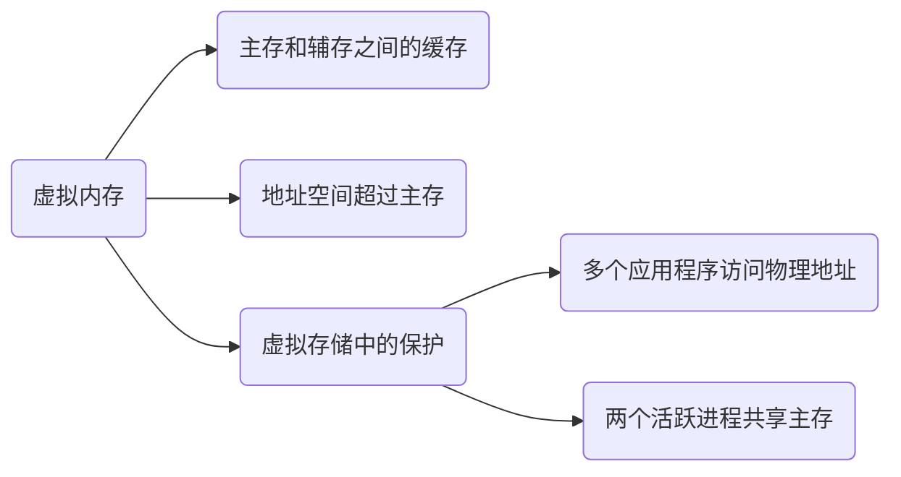

# Memory Hierarchy - Virtual Memory

## Abstract

本文主要讲述和理解虚拟内存（后文简称 VM， VA 等）的概念，行文可能较为跳跃，需要特别注意。

## QA

### 什么是虚拟内存？

- 虚拟内存可以理解成在主存和辅存（磁盘、硬盘）之间进行数据缓存管理的一级存储层次。

  > Virtual memory is the name for the level of memory hierarchy that manages **caching** between the **main memory** and **secondary memory**.

  从这个原文中我们理解，其本质还是可以理解为一个 cache.

- 虚拟内存允许单个程序将其地址空间扩展到超出主存的限制。

  这句话我是这么理解的：虚拟内存一般可以设置为主存的 1.5 倍大小（建议值），主存也可以理解为辅存的 cache, 所以说虚拟内存在主存和辅存之间，其最大的大小限制应该是辅存的大小。

  虽然虚拟存储是为了小容量的存储看起来像大容量的存储，但是主存和辅存之间的性能差异意味着，如果程序经常访问比它拥有的物理存储更多的虚拟存储，程序运行会非常慢。这样的程序会不停的在主存和辅存之间交换页面，这种情况称作：**thrashing**

- 虚拟内存支持以**受保护的方式**在多个同时活跃的进程之间共享主存。

  为什么要用受保护的方式，其原因有 2 点：

  1. 保护多个应用程序不会同时访问到同一块物理地址。（官方行文：允许多个进程共享一个主存；保护机制确保：一个恶意进程不能写另一个用户进程或者操作系统的地址空间）
  2. 防止一个进程读另一个进程的数据

  🟠🟠 这边还涉及到一个问题，就是进程切换的时候，页表是怎么处理的？

### 什么是页表？

💚💚💚💚 @todo 这边附上图 5-28

### 什么是 TLB？

**加快地址转化：TLB**

- 页表存储在主存中，所以程序的每次访存请求至少需要两次访问：查页表获得物理地址、获得物理地址中的数据。

- 现代处理器设计了一个特殊的 cache 用于追踪最近使用过的地址转化（应用局部性原理），这个 cache 结构称为快表（TLB）

  简而言之：TLB 作为页表的 cache 而存在（注意页表是在主存中，方便理解 ）

- TLB 的结构和原理如下图：

​	@todo 💚💚💚 TLB 结构图

### 什么是缺页失效？

- 如果 virtual page 的有效位无效，那么就发生缺页失效。

- 缺页失效发生的时候，如果内存中的所有页表都在使用的话，需要选择一页进行替换。

- 替换的时候使用近似 LRU 算法，因为实现完整的 LRU 算法代价太高。ARM V8 使用了一个 access bit 来实现这个。

### 什么是 TLB 失效

TLB 失效，顾名思义就是 TLB 中没有表项能与虚拟地址匹配。

TLB 失效表明两种可能性之一：

1. 页在内存中，但是 TLB 中没有创建
2. 页不在内存中，需要把控制权转接给操作系统处理缺页失效

### 如何处理缺页失效或者 TLB 失效？

核心：通过**例外机制**来中断活跃进程，将控制转移到操作系统，然后再恢复执行被中断的进程。

两个特殊的控制寄存器：SEPC 和 SCAUSE.

### 页表的映射方式？

页表通常选择使用全相联的方式，出于以下几个原因（页表使用全相联 + 额外的页表）：

1. 全相联具有优越性，因为失效代价比较高
2. 全相联允许软件使用负责的替换策略以降低失效率
3. 全相联很容易索引，并且不需要额外的硬件，也不需要进行查找

### TLB 和 cache 的映射方式？

通常选用组相连，一些系统使用直接映射，看中其访问时间短并且实现简单。

