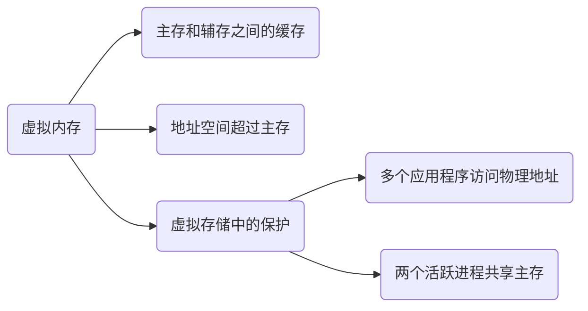

# Virtual Memory

## Abstract

本文主要讲述和理解虚拟内存（后文简称 VM， VA 等）的概念，行文可能较为跳跃，需要特别注意。

## Virtual Memory

### Abstract

> Virtual memory is a technique used by operating systems to enable programs to **use more memory than is physically available** in the system. When a program accesses memory, the address it uses is a virtual address, which is **translated by the hardware into a physical address** that corresponds to a location in physical memory. This translation process can be slow, especially if it has to be performed every time the program accesses memory.

:::details 自己的简单理解 2023-03-02

1. 虚拟内存的存在使得程序可以使用比可用物理内存更多的存储空间（程序员想要无限多的存储空间）
2. 虚拟地址是由物理地址转化而言的
3. 这种转换过程一般会比较缓慢（引出后续 TLB）

:::

### Understanding

- 虚拟内存可以理解成在主存和辅存（磁盘、硬盘）之间进行数据缓存管理的一级存储层次。

  > Virtual memory is the name for the level of memory hierarchy that manages **caching** between the **main memory** and **secondary memory**.

  从这个原文中我们理解，其本质还是可以理解为一个 cache.

- 虚拟内存允许单个程序将其地址空间扩展到超出主存的限制。

  这句话我是这么理解的：虚拟内存一般可以设置为主存的 1.5 倍大小（建议值），主存也可以理解为辅存的 cache, 所以说虚拟内存在主存和辅存之间，其最大的大小限制应该是辅存的大小。

  虽然虚拟存储是为了小容量的存储看起来像大容量的存储，但是主存和辅存之间的性能差异意味着，如果程序经常访问比它拥有的物理存储更多的虚拟存储，程序运行会非常慢。这样的程序会不停的在主存和辅存之间交换页面，这种情况称作：**thrashing**

- 虚拟内存支持以**受保护的方式**在多个同时活跃的进程之间共享主存。

  为什么要用受保护的方式，其原因有 2 点：

  1. 保护多个应用程序不会同时访问到同一块物理地址。（官方行文：允许多个进程共享一个主存；保护机制确保：一个恶意进程不能写另一个用户进程或者操作系统的地址空间）
  2. 防止一个进程读另一个进程的数据

  🟠🟠 这边还涉及到一个问题，就是进程切换的时候，页表是怎么处理的？

## TLB

### What is TLB?

> TLB stands for **Translation Lookaside Buffer**, and it is a **hardware cache** that is used in computer architecture to **speed up virtual memory access.**

> The TLB is a cache that stores recently used virtual-to-physical address translations, making it possible to **quickly retrieve the physical address** for a given virtual address. When a program requests a memory access, the hardware first checks the TLB to see if it contains the translation for the virtual address. If the translation is in the TLB, the hardware can use it to quickly access the corresponding physical address. If the translation is not in the TLB, the hardware has to perform the translation, which takes more time.

:::details 对上述描述的简单理解

1. TLB 存储了最近使用过的 *virtual-to-physical* 地址转换；这也印证了为什么有些说法称 TLB 就像缓存中的一个条目，TLB 就是缓存了这一转换信息
2. 程序访存请求过来以后，硬件会首先检查 TLB, 命中的话，很快返回虚拟地址对应的物理地址；如果缺失的话，就需要花费较多的时间进行地址转换

:::

也可以这么称呼：**加快地址转化：TLB**。TLB 的一些描述可以参考如下：

- 页表存储在主存中，所以程序的每次访存请求至少需要两次访问：查页表获得物理地址、获得物理地址中的数据。

- 现代处理器设计了一个特殊的 cache 用于追踪最近使用过的地址转化（应用局部性原理），这个 cache 结构称为快表（TLB）

  简而言之：TLB 作为页表的 cache 而存在（注意页表是在主存中，方便理解 ）

- TLB 的结构和原理如下图：

​	@todo 💚💚💚 TLB 结构图

### TLB Miss

> A TLB miss occurs when the hardware attempts to translate a virtual memory address into a physical memory address and **cannot find the translation in the Translation Lookaside Buffer (TLB)**. When this happens, the hardware has to **perform a full page table walk** to find the translation, which is a more time-consuming process than using the TLB.

TLB 失效，顾名思义就是 TLB 中没有表项能与虚拟地址匹配。按照上面的说法就是，TLB 失效是在 TLB 中没有找到地址转换。

TLB 失效表明两种可能性之一：

1. 页在内存中，但是 TLB 中没有创建
2. 页不在内存中，需要把控制权转接给操作系统处理缺页失效

> TLB misses can happen for several reasons. For example, if a **program accesses memory that has not been recently accessed**, the corresponding translation may have been evicted from the TLB due to space constraints. Similarly, TLB misses can occur when the **operating system swaps pages** in and out of physical memory, or when a program executes a system call that causes a context switch.

TLB 失效的原因可能是：

1. 程序访问的地址近期没有被访问过，由于 TLB 空间的限制，这个 translation 可能就没有被存储在 TLB 中（page 在内存中）
2. 操作系统 swap pages(page 没在内存中)

这两者就可以对应上述两点 TLB 失效的两种可能。

:::note 如何处理缺页失效或者 TLB 失效？

核心：通过**例外机制**来中断活跃进程，将控制转移到操作系统，然后再恢复执行被中断的进程。

两个特殊的控制寄存器：SEPC 和 SCAUSE.

:::

除此之外，如果我们检测到某个系统的 TLB Miss 比较高的话，可以使用如下的措施：

> To mitigate the impact of TLB misses, modern processors often employ techniques such as **multi-level TLBs**, **TLB prefetching**, and **hardware page table walkers**, which can reduce the likelihood and latency of TLB misses. Additionally, operating systems can optimize memory management strategies to minimize the number of TLB misses, such as using **huge pages** or transparent huge pages to reduce the size of page tables and increase TLB hit rates.

1. multi-level TLBs (two-level page table structure in arm)
2. TLB prefetching
3. hardware page table walkers
4. huge pages(reduce page table size, increase TLB hit)

## Page

💚💚💚💚 @todo 这边附上图 5-28

### 页面大小的权衡

页面大小是比较常见的体系结构参数。如果选择一个偏大的页面的话，其优点可以如下所示：

1. 页表的大小与页面的大小成反比；增大页面的大小可以节省存储器；
2. 较大页面可使得缓存更大；
3. 传递较大页面效率更高；
4. TLB 的条目数量有限，较大页面意味着可以高效地映射更多存储器，最终可以减少 TLB 缺失

较小页面则可以节省内存，防止内部碎片化；还有一个问题就是较大的页面可能会延长调用一个进程的时间，因为进程启动的时候，很多进程很小。

### Page Fault

- 如果 virtual page 的有效位无效，那么就发生缺页失效。

- 缺页失效发生的时候，如果内存中的所有页表都在使用的话，需要选择一页进行替换。

- 替换的时候使用近似 LRU 算法，因为实现完整的 LRU 算法代价太高。ARM V8 使用了一个 access bit 来实现这个。

### Virtual page number and Page offset

Virtual Address 可以分为两个部分：Virtual page number 和 Page offset, 可以翻译为虚拟页号和页内偏移量。

#### Virtual Page Number

Virtual Page Number (VPN) 是用于标识要访问的 page, 这个字段会用于虚拟地址到物理地址的转换。

VPN 的大小取决于虚拟地址空间的和虚拟存储系统使用的 page 大小；举例而言，一个系统有 32-bit 虚拟地址，4KB page, 则 VPN 的大小为 $2^{20}$ bit,  其需要在地址空间中表示 $2^{20}$ 个 page. 对于为什么需要 20 bit, 其计算方法就是 $32 - 12 = 20$, 其中 4KB 的 page 占用了 12 bit 的标识，剩下的 20 位就留给了 VPN.

❤️❤️❤️ **VPN and TLB**

VPN 和 TLB 之间的关系需要加以理解：

> When a program accesses a virtual memory address, the processor extracts the virtual page number from the address and uses it as the index into the TLB cache. 

从上面可知：VPN 用于索引 TLB, 即 VPN -> PPN(Physical Page Number).

:::details 个人理解 TLB 和 VPN

对于上面的解释，如果我们假定有 20 bit 用于 VPN,  那么 TLB 的 tag compare address + TLB index (这两个合起来就是 TLB entry) 的大小就为 20 bit.

(not sure) TLB index 的大小取决于 TLB 的映射方式，或者说，取决于 TLB entires 的数量 (*The TLB contains **entries** that map virtual page numbers to physical page numbers, along with other metadata such as access permissions and cache coherency information.*)。

当 TLB index 确定的时候，TLB tag compare address 的位数也就确定了。

:::

#### Page Offset

Page Offset 用于确定页表中数据的具体位置，通常而言，其比 Virtual page number 要小。以一个 4KB 的 page 而言，其需要 12 bit 来标识在这个 4KB page 中的 byte offset.

### 页表的映射方式？

页表通常选择使用全相联的方式，出于以下几个原因（页表使用全相联 + 额外的页表）：

1. 全相联具有优越性，因为失效代价比较高
2. 全相联允许软件使用负责的替换策略以降低失效率
3. 全相联很容易索引，并且不需要额外的硬件，也不需要进行查找

### TLB 和 cache 的映射方式？

通常选用组相连，一些系统使用直接映射，看中其访问时间短并且实现简单。

