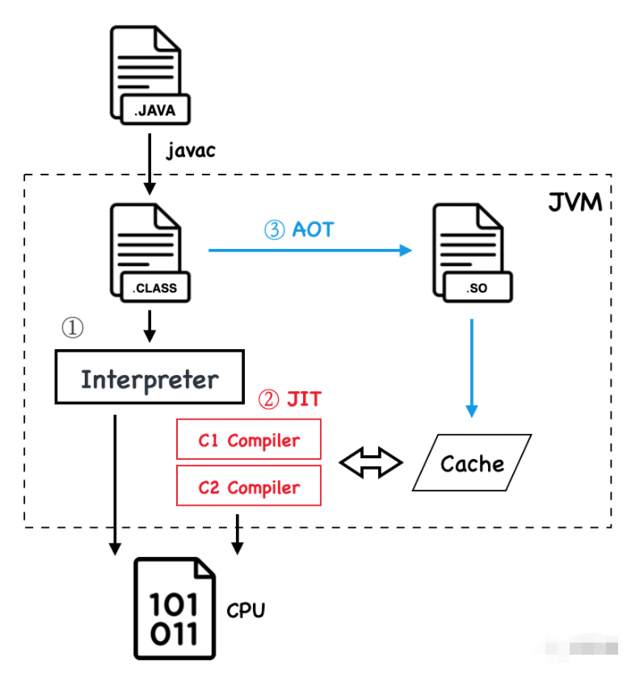
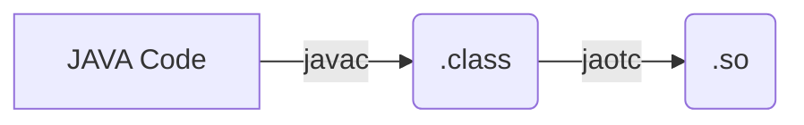

本文主要结合软硬件去研究 JVM 中的 JIT 和 AOT 技术，主要针对 ART 虚拟机，提炼出 JAVA 虚拟机相关的基础知识和软硬件结合点。

<!-- more -->

## AOT & JIT

AOT 是提前编译技术，JIT 是即时编译技术。

下图可以简单说明 AOT 和 JIT 的执行过程：



:::warning ❌❌❌

注意，这是一个很新手入门的图，不是完全准确，后续随着理解的深入，需要将这个图替换掉

:::

从上面的图中，可以学到以下几点：

1. AOT 预编译成 SO 以后还需要再经过以下编译器，最终生成机器码；这个过程确认一下是否这样的
2. JIT 从字节码中寻找热点代码编译为机器码，放入代码缓存，下次执行的时候直接跳过解释器，执行机器码
   1. 这里面分为 C1 和 C2 编译器，注意 C1 和 C2 都是再后台运行的，只是运行的时间不同

3. AOT 操作将部分字节码提前编译未机器代码库，然后启动程序，减少字节码解释

### AOT

AOT 存在着一些挑战：

1. 动态类加载；这是一个 AOT 面临的较为严重的问题，编译器无法预测程序执行的时候需要加载哪些类，如果预测错误的话，就产生了错误的编译；这些需要预知的信息包括静态字段的地址，对象实例字段的偏移量或者任何调用的实际目标
2. AOT 会牺牲平台无关性和代码质量

## 解释器与编译器

主流的商用 JAVA 虚拟机都采取了解释器与编译器并存的运行架构，但是要注意并不是所有的 JAVA 虚拟机都是这样的。
对于解释器而言，其优势在于：当程序需要快速启动和执行的时候，解释器可以先发挥作用，此时解释器直接解释执行 JAVA 字节码；这种方法的好处是可以省去编译的时间，立即运行。
对于编译器而言，在程序启动后，可以把越来越多的代码编译成本地代码，减少解释器的中间消耗，获得更高的执行效率。

## AOT 过程

### JAVA 代码到 so

我们思考一个问题，给定一段 JAVA 代码，如何将 JAVA 代码转化为二进制呢？[^1]（我们在分析 AOT 性能的时候会将二进制反汇编，分析这个反汇编文件中的指令）。

其路径如下：



例如我们有一个 class 名为 `**JaotCompilation`, 其经过的转化过程如下：

首先使用 JAVA 编译器得到 `.class` 文件：

```bash
javac JaotCompilation.java
```

然后 pass 生成的 `JaotCompilation.class` 文件到 AOT 编译器中，可以使用的命令如下：

```bash
jaotc --output jaotCompilation.so JaotCompilation.class
```

然后就会在当下目录下生成 `jaotCompilation.so` 这个 .so 文件。

### 使用 AOT 产物

我们在上一步将 JAVA 代码转化成了 .so 文件，那么在实际中，是如何使用的呢？

在 JVM 中有个选项，`-XX:AOTLibrary`, 传入 so 库的路径（绝对路径或者相对路径都可以）；如果要更省事的话，可以将 library 拷贝到 java home 的 lib 文件夹下面，此时只需要传递名字即可。

```bash
java -XX:AOTLibrary=./jaotCompilation.so JaotCompilation
```

执行这个命令之后，可以验证一下 so 是不是被正常加载了，可以增加 `-XX:+PrintAOT` 进行观察：

```bash
java -XX:+PrintAOT -XX:AOTLibrary=./jaotCompilation.so JaotCompilation
```

如果顺利的话，应该是可以看到已经加载的库；注意这是加载而不是被使用，可以指定 `-verbose` 选项看是否被实际调用了。

> The AOT compiled library contains a **class fingerprint**, which must match the fingerprint of the **.class** file.

上述文字的意思是说如果我们修改了 `JaotCompilation.java` 的代码的时候，如果没有使用 AOT 编译被修改的 .class 文件，会发生错误；因此在每一次修改代码的时候，我们都要对 AOT 进行重新编译。

## AOT 编译选项

我们可以给 AOT 的编译指定一些选项，将需要的选项写在文件中，然后使能。

`complileCommands.txt`:

```bash
compileOnly java.lang.*
```

指定只需要编译的 scope, 然后把这个选项用进去：

```bash
jaotc --output javaBaseLang.so --module java.base --compile-commands compileCommands.txt
```

### warm-up which class

我们可以用看一下哪些类实际上在 JVM 预热期间被调用了，命令如下：

```bash
java -XX:+UnlockDiagnosticVMOptions -XX:+LogTouchedMethods -XX:+PrintTouchedMethodsAtExit JaotCompilation
```

### single class

可以只编译一个类，指定类名即可：

```bash
jaotc --output javaBaseString.so --class-name java.lang.String
```

### 分层编译

默认情况下，始终使用 AOT 的代码，也就是说 so 库中包含的类不会进行 JIT 编译，如果我们想在库中包含 profiling 信息，则可以增加 `compile-for-tiered` 来实现我们的目的：

```bash
jaotc --output jaotCompilation.so --compile-for-tiered JaotCompilation.class
```

上述预编译的代码会被一直使用，直到字节码变成符合 JIT 编译的时候。


## class 文件格式

### Abstract

本章主要是对 java 中的 class 文件进行研究，通过对书籍 《深入理解 Android: JAVA 虚拟机ART》的研究和简单的例子，研究 `.class` 文件中的奥秘。

在开始研究之前，我们使用一个简单的 JAVA 程序，如下所示：

```java
public class Sample{
    public String  m1; //声明两个String类型的成员变量m1和m2
    public String  m2;
}
```

如上文我们研究的，可以分别使用 `javac` 和 `jaotc` 生成 `.class` 和 `.so` 文件，此处不再赘述。

对于生成的 class 文件，可以使用 `javap` 命令来进行解析，如下所示：

```bash
javap -verbose Sample
```

上述命令可以对我们的 `Sample.class` 文件进行解析，解析的输出如下所示：

```bash
Classfile /srv/workspace/c00574183/java_art/Sample.class
  Last modified Oct 9, 2022; size 233 bytes
  MD5 checksum 85a5eb7e4a88b673fa930ca5a7a2e858
  Compiled from "Sample.java"
public class Sample
  minor version: 0
  major version: 52
  flags: (0x0021) ACC_PUBLIC, ACC_SUPER
  this_class: #2                          // Sample
  super_class: #3                         // java/lang/Object
  interfaces: 0, fields: 2, methods: 1, attributes: 1
Constant pool:
   #1 = Methodref          #3.#13         // java/lang/Object."<init>":()V
   #2 = Class              #14            // Sample
   #3 = Class              #15            // java/lang/Object
   #4 = Utf8               m1
   #5 = Utf8               Ljava/lang/String;
   #6 = Utf8               m2
   #7 = Utf8               <init>
   #8 = Utf8               ()V
   #9 = Utf8               Code
  #10 = Utf8               LineNumberTable
  #11 = Utf8               SourceFile
  #12 = Utf8               Sample.java
  #13 = NameAndType        #7:#8          // "<init>":()V
  #14 = Utf8               Sample
  #15 = Utf8               java/lang/Object
{
  public java.lang.String m1;
    descriptor: Ljava/lang/String;
    flags: (0x0001) ACC_PUBLIC

  public java.lang.String m2;
    descriptor: Ljava/lang/String;
    flags: (0x0001) ACC_PUBLIC

  public Sample();
    descriptor: ()V
    flags: (0x0001) ACC_PUBLIC
    Code:
      stack=1, locals=1, args_size=1
         0: aload_0
         1: invokespecial #1                  // Method java/lang/Object."<init>":()V
         4: return
      LineNumberTable:
        line 1: 0
}
SourceFile: "Sample.java"
```

上图中的结果需要注意的几点在于：

1. Constant Pool: 常量池；
2. xx

### Constant Pool

常量池对应的数据结构伪代码就是一个类型为 `cp_info` 的数组，如下所示：

```c
cp_info { // u1表示该域对应一个字节长度，u 表示 unsigned
    u1 tag; // 每一个 cp_info 的第一个字节表明该常量项的类型
    u1 info[]; // 常量项的具体内容
}
```

`tag` 字段用于表示该常量的类型，`info` 数组是常量的具体内容。


## Dex 文件格式

### Abstract

DEX 文件格式一般是 Android 平台上和传统的 class 文件对应的 java 字节码文件，其针对移动设备做了一些定制化处理。

### Dex vs class

dex 文件和 class 文件存在很多区别，简单列举如下：

1. 一个 class 文件对应一个 Java 源码文件，而一个 Dex 文件可以对应多个 Java 源码文件；在 PC 平台上，每一个 Java 文件都对应生成一个同名的 class 文件，这些文件统一打包成 Jar 包；而在安卓平台上，这些 Java 源码会最终编译、合并到一个名为 classes.dex 的文件中去。
2. PC 平台上 class 文件的字节序是 Big Endian, 而安卓平台的 Dex 文件的字节序是 Little Endian, 其原因是 ARM CPU 可能也采用的是 Little Endian.
3. Dex 文件新定义了 LEB128 的数据类型，其全称为 Little Endian Based 128, 用于表示 32 比特位长度的数据。


[^1]: [https://www.baeldung.com/ahead-of-time-compilation](https://www.baeldung.com/ahead-of-time-compilation)
