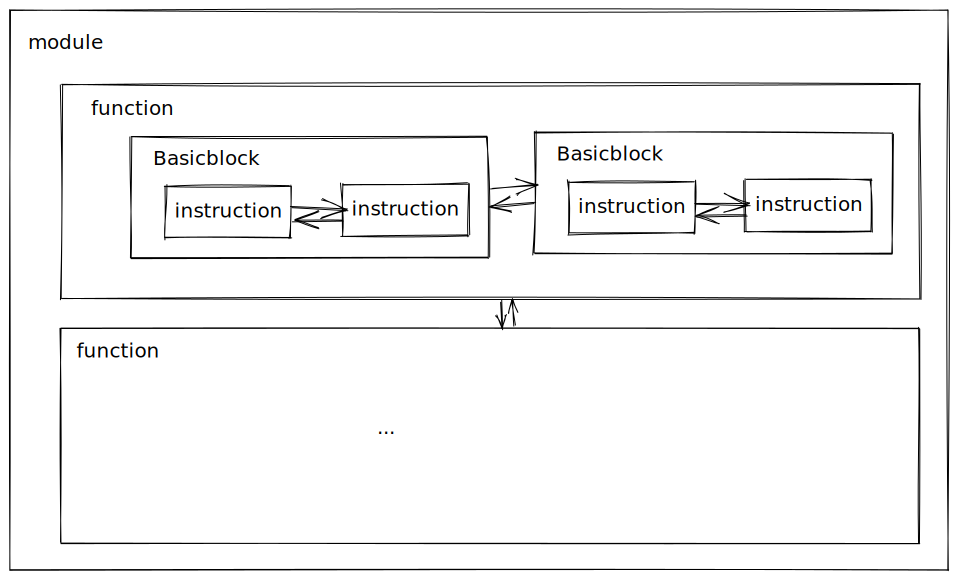

这篇文章是一个关于 JAVA Art/Davlik 虚拟机的一个杂谈，整理了一些问题和感悟。

- 栈式虚拟机 vs 寄存器虚拟机
- IR

<!-- more -->

## 栈 vs 寄存器虚拟机

### 对比

常见的虚拟机可以分为两种，一种是基于堆栈（表达式栈）的虚拟机，一种是基于寄存器的虚拟机，Davlik 就是基于寄存器的虚拟机。关于这两个方面的优劣，在这进行一个简单的研究。

> 所谓“表达式栈”就是用来存放表达式临时值的地方。“基于虚拟寄存器”的做法是给每个临时值都赋予一个“临时变量”的名字；而“基于表达式栈”则不赋予“临时变量”的名，总是通过栈来隐式操作临时值。

> 对于解释器来说，解释器开销主要来自解释器循环（fetch-decode/dispatch-execute 循环）中的 fetch 与 decode/dispatch，反而真正用于执行程序逻辑的 execute 部分并不是大头。每条指令都要经历一轮 FDX 循环。因而减少指令条数可以导致 F与 D 的开销减少，于是就提升了解释器速度[^1]。

上述文字说了一个问题，就是解释器的开销的前端 bound 较大，所以说减少指令数量可以一定程度上提高性能。

有几个对比：

1. 源代码的生成难度：差别不大，栈更简单一些
2. 同样逻辑的代码大小：基于栈 < 基于寄存器
3. 同样逻辑的指令条数：基于栈 > 基于寄存器
4. 简易实现中数据移动次数：基于栈 > 基于寄存器；这里面说的就是堆栈的上下文切换之类的；栈顶缓存技术(top-of-stack caching) 可以大幅度降低基于栈的解释器的数据移动操作
5. 同等优化下的解释器速度：基于栈 < 基于寄存器
6. 交由同等优化程度的 JIT 编译器编译后生成的代码速度：基于栈 == 基于寄存器；只要经过合理的编译，得到的结果是一模一样的

基于以上的说明，我们如果要选择基于寄存器的虚拟机的时候，我们一般是对**解释器的执行速度**有所要求；如果要选择基于栈的虚拟机的时候，其优点是实现简单、传输代码的大小较小；

而对于带有 JIT 编译器的执行引擎的速度而言，如果 JIT 实现的较好的话，其经过 parse 之后速度是差不多的。

### JVM

早期 JVM 是基于栈的，但是实际上，基于栈的虚拟机并没有减少 Java 代码的传输大小，这是因为 JAVA 是使用 Class 文件为单位来进行传输与存储的，每一个 Class 文件都是独立存储，这是为了 Java 设计之初支持分离编译和按需动态类加载；独立存储的情况下，每一个 Class 文件都必须携带自己的常量池以及用于符号链接的符号引用信息。

分析 Java 字节码是可以看出来，其只占 Class 文件的小部分，大部分都被常量池占了 -- 这些常量池一般都是存在重叠的，这些都是冗余信息。所以说 Dex 文件的优势就在这显现出来了。

但是有一个问题是，Dex 文件较小，和虚拟机是基于寄存器的有关吗？其实没有特别大的关联，在字节码部分，Dalvik 的字节码其实比 JVM 的字节码更大。再多说一句，我个人的理解就是 Dex 文件较小是取决于其中的共享常量池等技术，pack200.

不管如何，基于寄存器的设计还是一个较为新的潮流。

在这关于 Class 文件的一些槽点，引用[^1]作者的一些描述，看能否再后续的工作上对这些提出优化的思路：

> Class文件方面：
>
> - 各种人为的大小限制都跟不上时代了，例如每个方法的字节码最多65535字节；
> - 要生成StackMapTable太闹心；
> - 常量池的组织方式不便于直接从文件映射到内存然后高效执行；可以有更高效的组织方式。
>
> JAR文件方面：
>
> - 如前文提的，多个Class文件之间的常量池冗余；
> - 缺少带有强语义的描述模块的信息；
> - 等等…

#### class 文件就是字节码么？

@todo 博客更新后，转移到 jvm.md 中，并且可以根据 class 文件找到所对应的信息部分。

不是。除了字节码以外，class 文件还记录了很多信息：

- 结构信息
  - Class 文件格式版本号
  - 各部分的数量与大小
- 元数据
  - 类、继承的超类、实现的接口声明信息
  - 常量池
  - ...
- 方法信息
  - 字节码
  - 异常处理器表
  - ...

字节码只代表程序逻辑，只是 class 文件众多组成部分其中之一。

### 栈顶缓存

在最原始的 “基于表达式栈” 的基础上有两个变种，都是利用 “栈顶缓存” 的思路：

1. 单状态栈顶缓存，1-TOSCA
2. 多状态栈顶缓存，2-TOSCA

单状态栈顶缓存：总是把表达式栈的栈顶值放在一个实际寄存器（这个缓存寄存器也叫累加器）里；如果表达式栈有多于一个值，则其余部分分配在栈帧上。

关于 HotSpot VM 和 Dalvik VM 的解释器，前者是使用 1-TOSCA，后者是用全部映射到栈帧上的方式实现基于虚拟寄存器的指令集（Dalvik 字节码）。

多状态栈顶缓存有几种不同的做法；本质上其就是一种非常简单使用的、适用于后序遍历表达树的寄存器分配思路[^2]。

:::tip stack slot

暂时可以理解为栈的一部分。Second chance binpacking 算法（全局寄存器分配的算法之一，一种或线性扫描的算法）中会使用到这个概念。

:::

## IR

> 如果有个项目急需为某个语言实现一个优化的 JIT 编译器，怎样能在有限的时间内快速做出优化程度足够好的实现呢？
>
> 一个思路：如果有现成的静态编译器后端的话，针对输入的语言写个编译器前端，让它生成现成的后端能接受的[IR](https://link.zhihu.com/?target=http%3A//en.wikipedia.org/wiki/Intermediate_language%23Intermediate_representation)，直接插到现成的后端上。
>
> “有现成的静态编译器后端”门槛挺高，直到[LLVM](https://link.zhihu.com/?target=http%3A//llvm.org/)普及之前；不过土豪大厂们早已跨过这门槛，自然会想走这条路。

这个是引用知乎上的一个回答中的问题，从中我们可以管中窥豹，看一下 IR 在整个编译器中所处的位置。目前的理解是：IR 是后端的输入，前端的输出。


LLVM IR 语言目标是成为一种通用中间语言，全称是 Intermediate Representation, 连接着编译器前端和后端；LLVM IR 的存在使得设计一门新的编程语言只需要完成能够生成 LLVM IR 的编译器前端即可，然后就可以轻松使用 LLVM 的各种编译优化、JIT 支持、目标代码生成等功能。

IR 有三种形式：

1. 内存中的表示形式，如 BasicBlock, Instruction 这种 cpp 类
2. bitcode 表示形式，这是一种序列化二进制的表示形式
3. LLVM 汇编文件形式，这也是一种序列化的表示形式，与 bitcode 的区别是汇编文件是可读的、字符串的形式。

### IR 内存模型

内存中的 IR 模型其实就是对应 LLVM 实现中的 OO 模型，更直白的讲就是一些 cpp 的 class 的定义。

如下图所示：



这是一个简单的示意图，从上图中我们可以知道，存在着以下的模块：

- Module 类：这个可以理解为一个完整的编译单元，一般来说，这个编译单元就是一个源码文件，如一个后缀为 cpp 的源文件；一般而言，一个程序会被编译成为一个 Module，多个 Module 之间是相互隔离的，无法获取对方的内容；可以使用 `M.dump()` 在屏幕上打印出所有的信息。
- Function 类：这个类顾名思义就是对应一个函数单元，可以分为函数定义和函数声明；如图所示，在一个 Module 中，是由多个 func 组成的，Module 的主要组成部分是一个 function 的 list; Function 类有两个很实用的函数：`F.dump()` 可以打印出全部信息，`F.viewCfg()` 可以将ControlFlowGraph 按照dot 的方式存到文件里，使用第三方工具可以很舒服地观察它。
- BasicBlock 类：这个类表示一个基本代码块，基本代码块的含义是一段没有控制流逻辑的基本流程，相当于程序流程图中的基本过程（矩形）；其中有多条指令，指令是串行执行的，一个 BasicBlock 会以跳转语句或者 ret 语句结束；每个 BasicBlock 中都有一个唯一的 label, 可以用来跳转目的地址等。
- Instruction 类：指令类是 LLVM 中定义的基本操作，如加减乘除这种算数指令、函数调用指令、跳转指令、返回指令等；

除此之外，还有基本类型 Value 和 User.

- Value 类：是一个非常基础的基类。一个继承于 Value 的子类表示它的结果可以被其他地方使用；
- User 类：一个继承于 User 的类表示它会使用一个或者多个 Value 对象；

这两个基本类型会产生 use-def 和 def-use 两个链，前者表示某个 User 使用的 Value 列表，后者表示某个 Value 的 User 列表。

- use-def

  由于同一个函数实例可以在多个地方被调用，所以在 LLVM 中就可以查看一个函数被调用的指令列表：

  ```c
  Function *F = ...;
  for (User *U : F->users()) {
   if (Instruction *Inst = dyn_cast<Instruction>(U)) {
      errs() << "F is used in instruction:\n";
      errs() << *Inst << "\n";
    }
  }
  ```

  我们不难看出，遍历的函数的 `users()`.

- def-user

  对于指令和操作数而言，一个指令可以有一个或者多个操作数；可以对指令的操作数进行遍历：

  ```c
  Instruction *pi = ...;
  for (Use &U : pi->operands()) {
    Value *v = U.get();
   // ...
  }
  ```

  我们不难看出，遍历的是指令的 `operands()`.

### 汇编形式的 IR

前面第三点所提到的，是一个序列化的表示形式，不同于 bitcode, 其是可读的；如下例子：

```c
// add.cpp
int add(int a, int b) {
    return a + b;
}
```

产生汇编形式的 IR:

```bash
clang add.cpp -emit-llvm -S -c -o add.ll
```

注意到如果要产生二进制码形式的 IR 的话，可以如下：

```bash
 clang add.cpp -emit-llvm -c -o add.bc
```

当然这个二进制的产物是没有可读性的。

:::tip clang 安装

使用命令安装 clang:

```bash
sudo apt-get install clang-format clang-tidy clang-tools clang clangd libc++-dev libc++1 libc++abi-dev libc++abi1 libclang-dev libclang1 liblldb-dev libllvm-ocaml-dev libomp-dev libomp5 lld lldb llvm-dev llvm-runtime llvm python-clang
```

安装 clang 的时候，由于是依赖库的关系，llvm 也被安装了。

:::

部分的 IR 如下表示：

```
; ModuleID = 'add.cpp'
source_filename = "add.cpp"
target datalayout = "e-m:e-p270:32:32-p271:32:32-p272:64:64-i64:64-f80:128-n8:16:32:64-S128"
target triple = "x86_64-pc-linux-gnu"

; Function Attrs: noinline nounwind optnone uwtable
define dso_local i32 @_Z3addii(i32 %0, i32 %1) #0 {
  %3 = alloca i32, align 4
  %4 = alloca i32, align 4
  store i32 %0, i32* %3, align 4
  store i32 %1, i32* %4, align 4
  %5 = load i32, i32* %3, align 4
  %6 = load i32, i32* %4, align 4
  %7 = add nsw i32 %5, %6
  ret i32 %7
}

attributes #0 = { noinline nounwind optnone uwtable "correctly-rounded-divide-sqrt-fp-math"="false" "disable-tail-calls"="false" "frame-pointer"="all" "less-precise-fpmad"="false" "min-legal-vector-width"="0" "no-infs-fp-math"="false" "no-jump-tables"="false" "no-nans-fp-math"="false" "no-signed-zeros-fp-math"="false" "no-trapping-math"="false" "stack-protector-buffer-size"="8" "target-cpu"="x86-64" "target-features"="+cx8,+fxsr,+mmx,+sse,+sse2,+x87" "unsafe-fp-math"="false" "use-soft-float"="false" }

!llvm.module.flags = !{!0}
!llvm.ident = !{!1}

!0 = !{i32 1, !"wchar_size", i32 4}
!1 = !{!"clang version 10.0.0-4ubuntu1 "}
```

从第 7 行开始就是 add 函数的汇编 IR. 我们简单观察就可以发现，其与源代码的一些对应关系。

- ModuleID：用于编译器区分不用 module 的 ID
- source_filename: 源文件名
- target datalayout: 目标机器架构数据布局
  - `e`: 内存存储模式为小端模式
  - 其他更多的信心可以参考手册[^3]
- target triple: 用于描述目标机器信息的一个元组

我们看 IR 中存在两种符号：`@` 和 `%`, 分别表示全局标识符和局部标识符（局部变量）。

其中局部标识符存在两种分配方式：

1. 寄存器分配的局部变量：此类局部变量多采用 `%1 = some value` 的方式进行分配，一般是接受指令返回结果的局部变量
2. 栈分配的局部变量：使用 `alloca` 指令在栈帧上分配的局部变量。如 `%2 = alloca i32`, `%2` 也是一个指针，访问或存储时必须使用 `load` or `store` 指令

并且需要注意，局部标识符还存在两种命名方式：

1. 未命名的局部标识符：多采用带前缀的无符号数字表示
2. 命名的局部标识符：就是有名称，如 `%result` 这样的形式

### IR 字节码解析

还记得上一步中我们获得的 `add.bc` 文件吗？由于其时二进制的形式（也可以称之为字节码），所以我们没办法将其直接阅读，但是我们可以自己编写代码，使用 llvm 自带的一些解析函数，来打印出我们想要的信息。本程序参考知乎的文章《LLVM 概述——第一个 LLVM 项目》[^4]。

首先看需要解析字节码的 `main.cpp` 文件：

```cpp
// 引入相关LLVM头文件
#include <llvm/IR/LLVMContext.h>
#include <llvm/IR/Function.h>
#include <llvm/IR/Module.h>
#include <llvm/IRReader/IRReader.h>
#include <llvm/Support/SourceMgr.h>
#include <llvm/Support/CommandLine.h>

using namespace llvm;

// LLVM上下文全局变量
static ManagedStatic<LLVMContext> GlobalContext;

// 命令行位置参数全局变量, 这个参数的含义是需要处理的LLVM IR字节码的文件名
static cl::opt<std::string> InputFilename(cl::Positional, cl::desc("<filename>.bc"), cl::Required);

int main(int argc, char **argv) {
    // 诊断实例
    SMDiagnostic Err;
    // 格式化命令行参数,
    cl::ParseCommandLineOptions(argc, argv);
    // 读取并格式化LLVM IR字节码文件, 返回LLVM Module(Module是LLVM IR的顶级容器)
    std::unique_ptr<Module> M = parseIRFile(InputFilename, Err, *GlobalContext);
    // 错误处理
    if (!M) {
        Err.print(argv[0], errs());
        return 1;
    }
    // 遍历Module中的每一个Function
    for (Function &F:*M) {
        // 过滤掉那些以llvm.开头的无关函数
        if (!F.isIntrinsic()) {
            // 打印函数返回类型
            outs() << *(F.getReturnType());
            // 打印函数名
            outs() << ' ' << F.getName() << '(';
            // 遍历函数的每一个参数
            for (Function::arg_iterator it = F.arg_begin(), ie = F.arg_end(); it != ie; it++) {
                // 打印参数类型
                outs() << *(it->getType());
                if (it != ie - 1) {
                    outs() << ", ";
                }
            }
            outs() << ")\n";
        }
    }
}
```

这个解析用的程序中有以下的细节需要注意：

1. `parseIRFile` 加载 Module，然后遍历 Module 中的每一个 Function, 
2. 然后可以打印出 Function 相关的一些信息。

编译 `main.cpp` 和执行字节码的命令如下：

```bash
clang++ $(llvm-config --cxxflags --ldflags --libs) main.cpp -o main
./main add.bc
```


[^1]:[栈式虚拟机和寄存器式虚拟机？](https://www.zhihu.com/question/35777031/answer/64575683)
[^2]: [寄存器分配问题？ - RednaxelaFX的回答 - 知乎 ](https://www.zhihu.com/question/29355187/answer/51935409)
[^3]: [llvm data-layout](https://llvm.org/docs/LangRef.html#data-layout)
[^4]:[LLVM 概述——第一个 LLVM 项目](https://zhuanlan.zhihu.com/p/102270840)