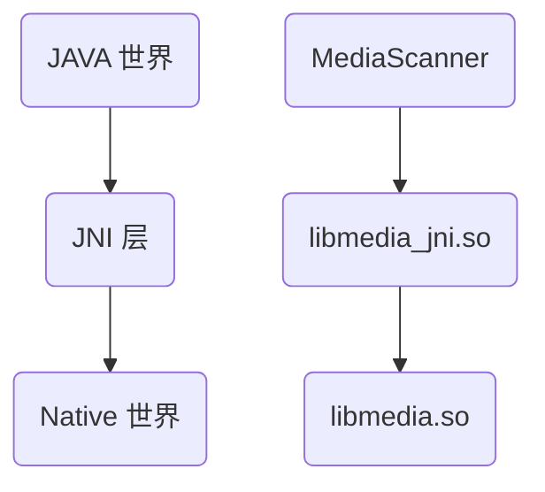
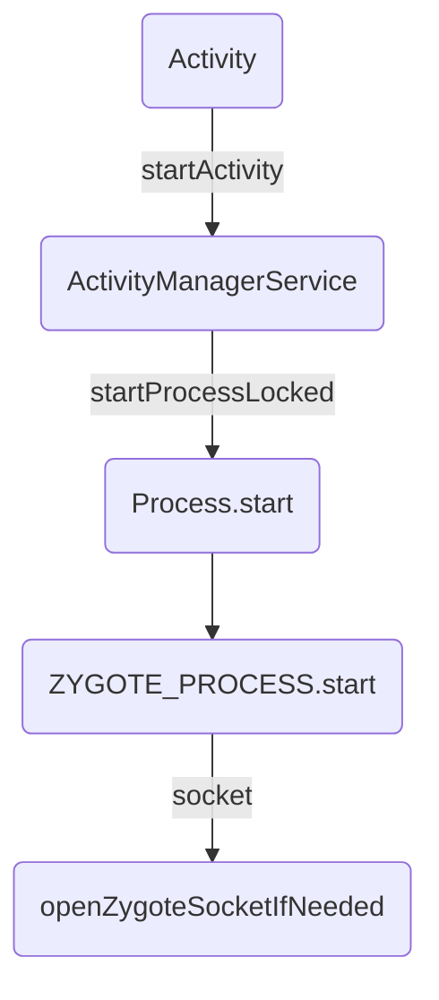

这篇文章是一个关于 JAVA Art/Davlik 虚拟机的一个杂谈，整理了一些问题和感悟。

- 栈式虚拟机 vs 寄存器虚拟机
- IR

<!-- more -->

## 栈 vs 寄存器虚拟机

### 对比

常见的虚拟机可以分为两种，一种是基于堆栈（表达式栈）的虚拟机，一种是基于寄存器的虚拟机，Davlik 就是基于寄存器的虚拟机。关于这两个方面的优劣，在这进行一个简单的研究。

> 所谓“表达式栈”就是用来存放表达式临时值的地方。“基于虚拟寄存器”的做法是给每个临时值都赋予一个“临时变量”的名字；而“基于表达式栈”则不赋予“临时变量”的名，总是通过栈来隐式操作临时值。

> 对于解释器来说，解释器开销主要来自解释器循环（fetch-decode/dispatch-execute 循环）中的 fetch 与 decode/dispatch，反而真正用于执行程序逻辑的 execute 部分并不是大头。每条指令都要经历一轮 FDX 循环。因而减少指令条数可以导致 F与 D 的开销减少，于是就提升了解释器速度[^1]。

上述文字说了一个问题，就是解释器的开销的前端 bound 较大，所以说减少指令数量可以一定程度上提高性能。

有几个对比：

1. 源代码的生成难度：差别不大，栈更简单一些
2. 同样逻辑的代码大小：基于栈 < 基于寄存器
3. 同样逻辑的指令条数：基于栈 > 基于寄存器
4. 简易实现中数据移动次数：基于栈 > 基于寄存器；这里面说的就是堆栈的上下文切换之类的；栈顶缓存技术(top-of-stack caching) 可以大幅度降低基于栈的解释器的数据移动操作
5. 同等优化下的解释器速度：基于栈 < 基于寄存器
6. 交由同等优化程度的 JIT 编译器编译后生成的代码速度：基于栈 == 基于寄存器；只要经过合理的编译，得到的结果是一模一样的

基于以上的说明，我们如果要选择基于寄存器的虚拟机的时候，我们一般是对**解释器的执行速度**有所要求；如果要选择基于栈的虚拟机的时候，其优点是实现简单、传输代码的大小较小；

而对于带有 JIT 编译器的执行引擎的速度而言，如果 JIT 实现的较好的话，其经过 parse 之后速度是差不多的。

### JVM

早期 JVM 是基于栈的，但是实际上，基于栈的虚拟机并没有减少 Java 代码的传输大小，这是因为 JAVA 是使用 Class 文件为单位来进行传输与存储的，每一个 Class 文件都是独立存储，这是为了 Java 设计之初支持分离编译和按需动态类加载；独立存储的情况下，每一个 Class 文件都必须携带自己的常量池以及用于符号链接的符号引用信息。

分析 Java 字节码是可以看出来，其只占 Class 文件的小部分，大部分都被常量池占了 -- 这些常量池一般都是存在重叠的，这些都是冗余信息。所以说 Dex 文件的优势就在这显现出来了。

但是有一个问题是，Dex 文件较小，和虚拟机是基于寄存器的有关吗？其实没有特别大的关联，在字节码部分，Dalvik 的字节码其实比 JVM 的字节码更大。再多说一句，我个人的理解就是 Dex 文件较小是取决于其中的共享常量池等技术，pack200.

不管如何，基于寄存器的设计还是一个较为新的潮流。

在这关于 Class 文件的一些槽点，引用[^1]作者的一些描述，看能否再后续的工作上对这些提出优化的思路：

> Class文件方面：
>
> - 各种人为的大小限制都跟不上时代了，例如每个方法的字节码最多65535字节；
> - 要生成StackMapTable太闹心；
> - 常量池的组织方式不便于直接从文件映射到内存然后高效执行；可以有更高效的组织方式。
>
> JAR文件方面：
>
> - 如前文提的，多个Class文件之间的常量池冗余；
> - 缺少带有强语义的描述模块的信息；
> - 等等…

### 栈顶缓存

在最原始的 “基于表达式栈” 的基础上有两个变种，都是利用 “栈顶缓存” 的思路：

1. 单状态栈顶缓存，1-TOSCA
2. 多状态栈顶缓存，2-TOSCA

单状态栈顶缓存：总是把表达式栈的栈顶值放在一个实际寄存器（这个缓存寄存器也叫累加器）里；如果表达式栈有多于一个值，则其余部分分配在栈帧上。

关于 HotSpot VM 和 Dalvik VM 的解释器，前者是使用 1-TOSCA，后者是用全部映射到栈帧上的方式实现基于虚拟寄存器的指令集（Dalvik 字节码）。

多状态栈顶缓存有几种不同的做法；本质上其就是一种非常简单使用的、适用于后序遍历表达树的寄存器分配思路[^2]。

:::tip stack slot

暂时可以理解为栈的一部分。Second chance binpacking 算法（全局寄存器分配的算法之一，一种或线性扫描的算法）中会使用到这个概念。

:::

## IR

> 如果有个项目急需为某个语言实现一个优化的 JIT 编译器，怎样能在有限的时间内快速做出优化程度足够好的实现呢？
>
> 一个思路：如果有现成的静态编译器后端的话，针对输入的语言写个编译器前端，让它生成现成的后端能接受的[IR](https://link.zhihu.com/?target=http%3A//en.wikipedia.org/wiki/Intermediate_language%23Intermediate_representation)，直接插到现成的后端上。
>
> “有现成的静态编译器后端”门槛挺高，直到[LLVM](https://link.zhihu.com/?target=http%3A//llvm.org/)普及之前；不过土豪大厂们早已跨过这门槛，自然会想走这条路。

这个是引用知乎上的一个回答中的问题，从中我们可以管中窥豹，看一下 IR 在整个编译器中所处的位置。目前的理解是：IR 是后端的输入，前端的输出。


LLVM IR 语言目标是成为一种通用中间语言，全称是 Intermediate Representation, 连接着编译器前端和后端；LLVM IR 的存在使得设计一门新的编程语言只需要完成能够生成 LLVM IR 的编译器前端即可，然后就可以轻松使用 LLVM 的各种编译优化、JIT 支持、目标代码生成等功能。

IR 有三种形式：

1. 内存中的表示形式，如 BasicBlock, Instruction 这种 cpp 类
2. bitcode 表示形式，这是一种序列化二进制的表示形式
3. LLVM 汇编文件形式，这也是一种序列化的表示形式，与 bitcode 的区别是汇编文件是可读的、字符串的形式。

### IR 内存模型

内存中的 IR 模型其实就是对应 LLVM 实现中的 OO 模型，更直白的讲就是一些 cpp 的 class 的定义。

如下图所示：


这是一个简单的示意图，从上图中我们可以知道，存在着以下的模块：

- Module 类：这个可以理解为一个完整的编译单元，一般来说，这个编译单元就是一个源码文件，如一个后缀为 cpp 的源文件；一般而言，一个程序会被编译成为一个 Module，多个 Module 之间是相互隔离的，无法获取对方的内容；可以使用 `M.dump()` 在屏幕上打印出所有的信息。
- Function 类：这个类顾名思义就是对应一个函数单元，可以分为函数定义和函数声明；如图所示，在一个 Module 中，是由多个 func 组成的，Module 的主要组成部分是一个 function 的 list; Function 类有两个很实用的函数：`F.dump()` 可以打印出全部信息，`F.viewCfg()` 可以将ControlFlowGraph 按照dot 的方式存到文件里，使用第三方工具可以很舒服地观察它。
- BasicBlock 类：这个类表示一个基本代码块，基本代码块的含义是一段没有控制流逻辑的基本流程，相当于程序流程图中的基本过程（矩形）；其中有多条指令，指令是串行执行的，一个 BasicBlock 会以跳转语句或者 ret 语句结束；每个 BasicBlock 中都有一个唯一的 label, 可以用来跳转目的地址等。
- Instruction 类：指令类是 LLVM 中定义的基本操作，如加减乘除这种算数指令、函数调用指令、跳转指令、返回指令等；

除此之外，还有基本类型 Value 和 User.

- Value 类：是一个非常基础的基类。一个继承于 Value 的子类表示它的结果可以被其他地方使用；
- User 类：一个继承于 User 的类表示它会使用一个或者多个 Value 对象；

这两个基本类型会产生 use-def 和 def-use 两个链，前者表示某个 User 使用的 Value 列表，后者表示某个 Value 的 User 列表。

- use-def

  由于同一个函数实例可以在多个地方被调用，所以在 LLVM 中就可以查看一个函数被调用的指令列表：

  ```c
  Function *F = ...;
  for (User *U : F->users()) {
   if (Instruction *Inst = dyn_cast<Instruction>(U)) {
      errs() << "F is used in instruction:\n";
      errs() << *Inst << "\n";
    }
  }
  ```

  我们不难看出，遍历的函数的 `users()`.

- def-user

  对于指令和操作数而言，一个指令可以有一个或者多个操作数；可以对指令的操作数进行遍历：

  ```c
  Instruction *pi = ...;
  for (Use &U : pi->operands()) {
    Value *v = U.get();
   // ...
  }
  ```

  我们不难看出，遍历的是指令的 `operands()`.

### 汇编形式的 IR

前面第三点所提到的，是一个序列化的表示形式，不同于 bitcode, 其是可读的；如下例子：

```c
// add.cpp
int add(int a, int b) {
    return a + b;
}
```

产生汇编形式的 IR:

```bash
clang add.cpp -emit-llvm -S -c -o add.ll
```

注意到如果要产生二进制码形式的 IR 的话，可以如下：

```bash
 clang add.cpp -emit-llvm -c -o add.bc
```

当然这个二进制的产物是没有可读性的。

:::tip clang 安装

使用命令安装 clang:

```bash
sudo apt-get install clang-format clang-tidy clang-tools clang clangd libc++-dev libc++1 libc++abi-dev libc++abi1 libclang-dev libclang1 liblldb-dev libllvm-ocaml-dev libomp-dev libomp5 lld lldb llvm-dev llvm-runtime llvm python-clang
```

安装 clang 的时候，由于是依赖库的关系，llvm 也被安装了。

:::

部分的 IR 如下表示：

```
; ModuleID = 'add.cpp'
source_filename = "add.cpp"
target datalayout = "e-m:e-p270:32:32-p271:32:32-p272:64:64-i64:64-f80:128-n8:16:32:64-S128"
target triple = "x86_64-pc-linux-gnu"

; Function Attrs: noinline nounwind optnone uwtable
define dso_local i32 @_Z3addii(i32 %0, i32 %1) #0 {
  %3 = alloca i32, align 4
  %4 = alloca i32, align 4
  store i32 %0, i32* %3, align 4
  store i32 %1, i32* %4, align 4
  %5 = load i32, i32* %3, align 4
  %6 = load i32, i32* %4, align 4
  %7 = add nsw i32 %5, %6
  ret i32 %7
}

attributes #0 = { noinline nounwind optnone uwtable "correctly-rounded-divide-sqrt-fp-math"="false" "disable-tail-calls"="false" "frame-pointer"="all" "less-precise-fpmad"="false" "min-legal-vector-width"="0" "no-infs-fp-math"="false" "no-jump-tables"="false" "no-nans-fp-math"="false" "no-signed-zeros-fp-math"="false" "no-trapping-math"="false" "stack-protector-buffer-size"="8" "target-cpu"="x86-64" "target-features"="+cx8,+fxsr,+mmx,+sse,+sse2,+x87" "unsafe-fp-math"="false" "use-soft-float"="false" }

!llvm.module.flags = !{!0}
!llvm.ident = !{!1}

!0 = !{i32 1, !"wchar_size", i32 4}
!1 = !{!"clang version 10.0.0-4ubuntu1 "}
```

从第 7 行开始就是 add 函数的汇编 IR. 我们简单观察就可以发现，其与源代码的一些对应关系。

- ModuleID：用于编译器区分不用 module 的 ID
- source_filename: 源文件名
- target datalayout: 目标机器架构数据布局
  - `e`: 内存存储模式为小端模式
  - 其他更多的信心可以参考手册[^3]
- target triple: 用于描述目标机器信息的一个元组

我们看 IR 中存在两种符号：`@` 和 `%`, 分别表示全局标识符和局部标识符（局部变量）。

其中局部标识符存在两种分配方式：

1. 寄存器分配的局部变量：此类局部变量多采用 `%1 = some value` 的方式进行分配，一般是接受指令返回结果的局部变量
2. 栈分配的局部变量：使用 `alloca` 指令在栈帧上分配的局部变量。如 `%2 = alloca i32`, `%2` 也是一个指针，访问或存储时必须使用 `load` or `store` 指令

并且需要注意，局部标识符还存在两种命名方式：

1. 未命名的局部标识符：多采用带前缀的无符号数字表示
2. 命名的局部标识符：就是有名称，如 `%result` 这样的形式

### IR 字节码解析

还记得上一步中我们获得的 `add.bc` 文件吗？由于其时二进制的形式（也可以称之为字节码），所以我们没办法将其直接阅读，但是我们可以自己编写代码，使用 llvm 自带的一些解析函数，来打印出我们想要的信息。本程序参考知乎的文章《LLVM 概述——第一个 LLVM 项目》[^4]。

首先看需要解析字节码的 `main.cpp` 文件：

```cpp
// 引入相关LLVM头文件
#include <llvm/IR/LLVMContext.h>
#include <llvm/IR/Function.h>
#include <llvm/IR/Module.h>
#include <llvm/IRReader/IRReader.h>
#include <llvm/Support/SourceMgr.h>
#include <llvm/Support/CommandLine.h>

using namespace llvm;

// LLVM上下文全局变量
static ManagedStatic<LLVMContext> GlobalContext;

// 命令行位置参数全局变量, 这个参数的含义是需要处理的LLVM IR字节码的文件名
static cl::opt<std::string> InputFilename(cl::Positional, cl::desc("<filename>.bc"), cl::Required);

int main(int argc, char **argv) {
    // 诊断实例
    SMDiagnostic Err;
    // 格式化命令行参数,
    cl::ParseCommandLineOptions(argc, argv);
    // 读取并格式化LLVM IR字节码文件, 返回LLVM Module(Module是LLVM IR的顶级容器)
    std::unique_ptr<Module> M = parseIRFile(InputFilename, Err, *GlobalContext);
    // 错误处理
    if (!M) {
        Err.print(argv[0], errs());
        return 1;
    }
    // 遍历Module中的每一个Function
    for (Function &F:*M) {
        // 过滤掉那些以llvm.开头的无关函数
        if (!F.isIntrinsic()) {
            // 打印函数返回类型
            outs() << *(F.getReturnType());
            // 打印函数名
            outs() << ' ' << F.getName() << '(';
            // 遍历函数的每一个参数
            for (Function::arg_iterator it = F.arg_begin(), ie = F.arg_end(); it != ie; it++) {
                // 打印参数类型
                outs() << *(it->getType());
                if (it != ie - 1) {
                    outs() << ", ";
                }
            }
            outs() << ")\n";
        }
    }
}
```

这个解析用的程序中有以下的细节需要注意：

1. `parseIRFile` 加载 Module，然后遍历 Module 中的每一个 Function, 
2. 然后可以打印出 Function 相关的一些信息。

编译 `main.cpp` 和执行字节码的命令如下：

```bash
clang++ $(llvm-config --cxxflags --ldflags --libs) main.cpp -o main
./main add.bc
```

## JNI

### 概述

JNI 的全称是 Java Native Interface, 通过 JNI 技术，可以做到以下几点：

1. Java 程序中可以调用 Native 语言写的函数；一般是 C/C++ 编写的函数；
2. Native 程序中的函数可以调用 JAVA 层的函数；也就是说 在 C/C++ 中可以调用 JAVA 层的函数；

仔细思考一下，如果引用了 JNI, 是不是就破坏了 JAVA 的平台无关性呢？其实不尽然，引入 JNI 有以下的好处：

1. JAVA 虚拟机是由 Native 语言写的，并不是平台无关的，而 JNI 层可以对 JAVA 层屏蔽平台之间的差异，有助于实现 JAVA 本身平台无关的特性；
2. 很多程序都用 Native 语言写的，用 JNI 就可以直接使用了，避免了重复造轮子。

### JAVA 调用 Native 的函数

这个问题是萦绕在初学 JNI 的时候一个很大的问题，到底 Java 是如何调用 Native 的函数的呢？首先先看 Java 世界、JNI 世界和 Native 世界之间的关系：



除此之外，为了方便理解，再图上增加了一个 `MediaScanner` 实例进行说明。

- `MediaScanner` 类中的一些功能需要由 Native 层来实现
- JNI 层对应 `media_jni` 库，库的名字是 `media`, `jni` 表示的是这个一个 JNI 库
- Native 的 `libmedia.so` 完成了实际的功能

```java
 // media / java / android / media / MediaScanner.java
public class MediaScanner
{
    static {
        // 加载对应的 JNI 库
        // 在实际加载动态库的时候会将其拓展称为 libmedia_jni.so
        System.loadLibrary("media_jni");
        // 调用 native_init() 函数
        native_init();
    }
    
    // ..
    
    // native 函数的声明；被 native 标识的函数表示它将由 JNI 层完成
    private native void processDirectory(String path, MediaScannerClient client);
    
    // ..
}
```

1. 在调用 native 函数之前，需要进行 JNI 库的加载；关于加载 JNI 库的时机，通用的做法是在类的 `static` 语句中加载，加载的方法是调用 `System.loadLibrary` 方法，需要注意 JNI 库的加载必须是在 native 函数调用之前；
2. JAVA 程序员调用 JNI 中的函数还需要使用 native 关键字声明函数。

从上我们可以看出，JNI 的使用对于 JAVA 程序员是非常友好的。

### JNI 调用过程

本小节用实际的代码走读来理解 Java native 函数是怎么被注册、调用的。


### JNI 层分析

@todo

### 静态注册 vs 动态注册

## Art 启动过程

### Art 启动过程

1. APK 以进程的形式运行，进程的创建是由 zygote
2. 进程运行起来以后，初始化 Java VM（每一个进程都有一个 JVM）
3. JVM 创建后，就有了 JNINativeInterface，其中包含所有的 JAVA 接口
4. Java 运行时的功能简单来说分为：类的加载和函数 Method 的执行

具体来简单讲述一下其中的细节：

安卓进程启动调起  apk 在 mainfest 中申明的组件，如 Activity, 调起后的过程如下分析。

### Zygote 创建 client

Zygote 创建进程：其原理是通过 socket 跨进程的调用，`Process.start` 充当一个 Client 端。



我们现在来逐一分析这些代码：

```java
// frameworks/base/services/core/java/com/android/server/am/ActivityManagerService.java
// todo
```

@todo 代码有重构，需要弄清楚 S 上面新的逻辑。

ActivityManagerService 调用 `Process.start()` 方法，start 实现如下：

```java
public static ProcessStartResult start(/* (省略)args */) {
        return ZYGOTE_PROCESS.start(processClass, niceName, uid, gid, gids,
                    runtimeFlags, mountExternal, targetSdkVersion, seInfo,
                    abi, instructionSet, appDataDir, invokeWith, packageName,
                    zygotePolicyFlags, isTopApp, disabledCompatChanges,
                    pkgDataInfoMap, whitelistedDataInfoMap, bindMountAppsData,
                    bindMountAppStorageDirs, zygoteArgs);
    }
```

start 的时候调用了 ZYGOTE_PROCESS：

```java
    /**
     * State associated with the zygote process.
     * @hide
     */
    public static final ZygoteProcess ZYGOTE_PROCESS = new ZygoteProcess();
```

这个方法定义在 `ZygoteProcess.java` 中：

```java
// frameworks/base/core/java/android/os/ZygoteProcess.java
public final Process.ProcessStartResult start(/* args... */) {
        // TODO (chriswailes): Is there a better place to check this value?
        if (fetchUsapPoolEnabledPropWithMinInterval()) {
            informZygotesOfUsapPoolStatus();
        }

        try {
            return startViaZygote(processClass, niceName, uid, gid, gids,
                    runtimeFlags, mountExternal, targetSdkVersion, seInfo,
                    abi, instructionSet, appDataDir, invokeWith, /*startChildZygote=*/ false,
                    packageName, zygotePolicyFlags, isTopApp, disabledCompatChanges,
                    pkgDataInfoMap, allowlistedDataInfoList, bindMountAppsData,
                    bindMountAppStorageDirs, zygoteArgs);
        } catch (ZygoteStartFailedEx ex) {
            Log.e(LOG_TAG,
                    "Starting VM process through Zygote failed");
            throw new RuntimeException(
                    "Starting VM process through Zygote failed", ex);
        }
    }
```

### Server 处理

Server 端是 app_process 这个进程（该进程以 zygote 作为进程名）中，是一个常驻的系统服务。

主要是调用 `startViaZygote()` 方法，由于代码太长，在此只列举部分关键代码：

```java
// frameworks/base/core/java/android/os/ZygoteProcess.java
private Process.ProcessStartResult startViaZygote(/* args */)
                                                      throws ZygoteStartFailedEx {
        ArrayList<String> argsForZygote = new ArrayList<>();

        // --runtime-args, --setuid=, --setgid=,
        // and --setgroups= must go first
        argsForZygote.add("--runtime-args");
        argsForZygote.add("--setuid=" + uid);
        argsForZygote.add("--setgid=" + gid);
        argsForZygote.add("--runtime-flags=" + runtimeFlags);
        if (mountExternal == Zygote.MOUNT_EXTERNAL_DEFAULT) {
            argsForZygote.add("--mount-external-default");
        } else if (mountExternal == Zygote.MOUNT_EXTERNAL_INSTALLER) {
            argsForZygote.add("--mount-external-installer");
        } else if (mountExternal == Zygote.MOUNT_EXTERNAL_PASS_THROUGH) {
            argsForZygote.add("--mount-external-pass-through");
        } else if (mountExternal == Zygote.MOUNT_EXTERNAL_ANDROID_WRITABLE) {
            argsForZygote.add("--mount-external-android-writable");
        }

        argsForZygote.add("--target-sdk-version=" + targetSdkVersion);

    	// 处理一些 args    
    
        argsForZygote.add(processClass);

        if (extraArgs != null) {
            Collections.addAll(argsForZygote, extraArgs);
        }
		
    	// 定义在：private final Object mLock = new Object();
        synchronized(mLock) {
            // The USAP pool can not be used if the application will not use 
            // the systems graphics driver.  
            // If that driver is requested use the Zygote application start path.
            // 核心
            return zygoteSendArgsAndGetResult(openZygoteSocketIfNeeded(abi),
                                              zygotePolicyFlags,
                                              argsForZygote);
        }
    }
```

`openZygoteSocketIfNeeded()` 的实现如下：

```java
    @GuardedBy("mLock")
    private ZygoteState openZygoteSocketIfNeeded(String abi) throws ZygoteStartFailedEx {
        try {
            attemptConnectionToPrimaryZygote();

            if (primaryZygoteState.matches(abi)) {
                return primaryZygoteState;
            }

            if (mZygoteSecondarySocketAddress != null) {
                // The primary zygote didn't match. Try the secondary.
                attemptConnectionToSecondaryZygote();

                if (secondaryZygoteState.matches(abi)) {
                    return secondaryZygoteState;
                }
            }
        } catch (IOException ioe) {
            throw new ZygoteStartFailedEx("Error connecting to zygote", ioe);
        }

        throw new ZygoteStartFailedEx("Unsupported zygote ABI: " + abi);
    }
```

主要是 socket 跨进程的调用：

```java
    @GuardedBy("mLock")
    private void attemptConnectionToSecondaryZygote() throws IOException {
        if (secondaryZygoteState == null || secondaryZygoteState.isClosed()) {
            secondaryZygoteState =
                    ZygoteState.connect(mZygoteSecondarySocketAddress,
                            mUsapPoolSecondarySocketAddress);

            maybeSetApiDenylistExemptions(secondaryZygoteState, false);
            maybeSetHiddenApiAccessLogSampleRate(secondaryZygoteState);
        }
    }
```

具体的 connect 过程如下：

```java
static ZygoteState connect(@NonNull LocalSocketAddress zygoteSocketAddress,
                @Nullable LocalSocketAddress usapSocketAddress)
                throws IOException {

            DataInputStream zygoteInputStream;
            BufferedWriter zygoteOutputWriter;
            final LocalSocket zygoteSessionSocket = new LocalSocket();

            if (zygoteSocketAddress == null) {
                throw new IllegalArgumentException("zygoteSocketAddress can't be null");
            }

            try {
                zygoteSessionSocket.connect(zygoteSocketAddress);
                zygoteInputStream = new DataInputStream(zygoteSessionSocket.getInputStream());
                zygoteOutputWriter =
                        new BufferedWriter(
                                new OutputStreamWriter(zygoteSessionSocket.getOutputStream()),
                                Zygote.SOCKET_BUFFER_SIZE);
            } catch (IOException ex) {
                try {
                    zygoteSessionSocket.close();
                } catch (IOException ignore) { }

                throw ex;
            }

            return new ZygoteState(zygoteSocketAddress, usapSocketAddress,
                                   zygoteSessionSocket, zygoteInputStream, zygoteOutputWriter,
                                   getAbiList(zygoteOutputWriter, zygoteInputStream));
        }
```

我们可以看到创建了一个 `LocalSocket`, 通过 `LocalSocket` 的通信，来完成进程的创建。

## JNI 实例

这篇博客[^5]有一个给 libcore 增加日志的例子，全流程的走了一遍 native 方法创建、注册的过程，而我们选择的例子为 `libcore` 中 JDK 的实现。

### Native java analysis

Native Java 的代码如下：

```java
// libcore/ojluni/src/main/java/java/lang/String.java
@FastNative
native void getCharsNoCheck(int start, int end, char[] buffer, int index);
```

上述函数使用 `@FastNative` 注解修饰，函数声明前的 `native` 表示这是一个 native 方法。 

在 `libcore/openjdk_java_files.bp` 中可以看到 `String.java` 文件，表示其在**编译链**中。

```
filegroup {
    name: "openjdk_javadoc_files",
    srcs: [
        "ojluni/src/main/java/java/awt/font/NumericShaper.java",
        // more code ...
        "ojluni/src/main/java/java/lang/String.java",
        // ...
    ],
    path: "ojluni/src/main/java",
}
```

### JNI 实现

JNI 层负责实现 `getCharsNoCheck`, 实现过后会被注册，此时就与 Java 层的 native 方法对应起来了，对于 `getCharsNoCheck` 的注册过程如下：

在 `.hh` 中：

```cpp
// art/runtime/native/java_lang_String.h
#ifndef ART_RUNTIME_NATIVE_JAVA_LANG_STRING_H_
#define ART_RUNTIME_NATIVE_JAVA_LANG_STRING_H_

#include <jni.h>

namespace art {

void register_java_lang_String(JNIEnv* env);

}  // namespace art

#endif  // ART_RUNTIME_NATIVE_JAVA_LANG_STRING_H_
```

在 `.cc` 中进行注册：

```cpp
static void String_getCharsNoCheck(JNIEnv* env, jobject java_this, jint start, jint end,
                                   jcharArray buffer, jint index) {
  // ScopedFastNativeObjectAccess 中保存了 env 对象以及其所在的 Thread 对象
  ScopedFastNativeObjectAccess soa(env);
  // 从 soa.Self 中获取 JNIEnv 所在的线程对象
  StackHandleScope<1> hs(soa.Self());
  // 获取 buffer 的指针
  Handle<mirror::CharArray> char_array(hs.NewHandle(soa.Decode<mirror::CharArray>(buffer)));
  // 获取 jobject 指针后调用 GetChars
  soa.Decode<mirror::String>(java_this)->GetChars(start, end, char_array, index);
}

static JNINativeMethod gMethods[] = {
  FAST_NATIVE_METHOD(String, charAt, "(I)C"),
  FAST_NATIVE_METHOD(String, compareTo, "(Ljava/lang/String;)I"),
  FAST_NATIVE_METHOD(String, concat, "(Ljava/lang/String;)Ljava/lang/String;"),
  FAST_NATIVE_METHOD(String, doReplace, "(CC)Ljava/lang/String;"),
  FAST_NATIVE_METHOD(String, fastSubstring, "(II)Ljava/lang/String;"),
  FAST_NATIVE_METHOD(String, getCharsNoCheck, "(II[CI)V"),
  FAST_NATIVE_METHOD(String, intern, "()Ljava/lang/String;"),
  FAST_NATIVE_METHOD(String, toCharArray, "()[C"),
};

void register_java_lang_String(JNIEnv* env) {
  REGISTER_NATIVE_METHODS("java/lang/String");
}
```

到此，我们对 `register_java_lang_String` 进行了定义，调用这个函数就可以进行 native 函数的注册。

对于宏 `REGISTER_NATIVE_METHODS`，其定义如下：

```cpp
// art/runtime/native/native_util.h
#define REGISTER_NATIVE_METHODS(jni_class_name) \
  RegisterNativeMethodsInternal(env, (jni_class_name), gMethods, arraysize(gMethods))

}  // namespace art

ALWAYS_INLINE inline void RegisterNativeMethodsInternal(JNIEnv* env,
                                                        const char* jni_class_name,
                                                        const JNINativeMethod* methods,
                                                        jint method_count) {
  ScopedLocalRef<jclass> c(env, env->FindClass(jni_class_name));
  if (c.get() == nullptr) {
    LOG(FATAL) << "Couldn't find class: " << jni_class_name;
  }
  jint jni_result = env->RegisterNatives(c.get(), methods, method_count);
  CHECK_EQ(JNI_OK, jni_result);
}
```

也就是说 `register_java_lang_String()` 最终是调用了 `RegisterNativeMethodsInternal()`, 传入了 class name, 全局的 gMethods, 以及计算出来的 count.

@todo log 后增加分析结果

对于宏 `FAST_NATIVE_METHOD` 我在源码中未找到其定义，但是根据其用法，不难发现，三个参数应该分别是：类名（函数指针）、函数名、函数参数和返回值（signature）。

那么接下来的问题就只剩下：是谁调用了 `register_java_lang_String()` 进行了 native 函数的注册呢？我们进行下一章节的旅程。

### InitNativeMethods

除此之外，我们搜索全局的`register_java_lang_String` 发现，还在一处出现：

```cpp
// art/runtime/runtime.cc
void Runtime::RegisterRuntimeNativeMethods(JNIEnv* env) {
  register_dalvik_system_DexFile(env);
// ...
  register_java_lang_String(env);
  register_java_lang_StringFactory(env);
  // ...
}
```

这个函数的调用也是在这个文件中的 `InitNativeMethods` 函数（这个文件比较重要，所以全部列举出来了）：

```cpp
void Runtime::InitNativeMethods() {
  VLOG(startup) << "Runtime::InitNativeMethods entering";
  Thread* self = Thread::Current();
  JNIEnv* env = self->GetJniEnv();

  // Must be in the kNative state for calling native methods (JNI_OnLoad code).
  CHECK_EQ(self->GetState(), kNative);

  // Set up the native methods provided by the runtime itself.
  RegisterRuntimeNativeMethods(env);

  // Initialize classes used in JNI. The initialization requires runtime native
  // methods to be loaded first.
  WellKnownClasses::Init(env);

  // Then set up libjavacore / libopenjdk / libicu_jni ,which are just
  // a regular JNI libraries with a regular JNI_OnLoad. Most JNI libraries can
  // just use System.loadLibrary, but libcore can't because it's the library
  // that implements System.loadLibrary!
  //
  // By setting calling class to java.lang.Object, the caller location for these
  // JNI libs is core-oj.jar in the ART APEX, and hence they are loaded from the
  // com_android_art linker namespace.

  // libicu_jni has to be initialized before libopenjdk{d} due to runtime dependency from
  // libopenjdk{d} to Icu4cMetadata native methods in libicu_jni. See http://b/143888405
  {
    std::string error_msg;
    if (!java_vm_->LoadNativeLibrary(
          env, "libicu_jni.so", nullptr, WellKnownClasses::java_lang_Object, &error_msg)) {
      LOG(FATAL) << "LoadNativeLibrary failed for \"libicu_jni.so\": " << error_msg;
    }
  }
  {
    std::string error_msg;
    if (!java_vm_->LoadNativeLibrary(
          env, "libjavacore.so", nullptr, WellKnownClasses::java_lang_Object, &error_msg)) {
      LOG(FATAL) << "LoadNativeLibrary failed for \"libjavacore.so\": " << error_msg;
    }
  }
  {
    constexpr const char* kOpenJdkLibrary = kIsDebugBuild
                                                ? "libopenjdkd.so"
                                                : "libopenjdk.so";
    std::string error_msg;
    if (!java_vm_->LoadNativeLibrary(
          env, kOpenJdkLibrary, nullptr, WellKnownClasses::java_lang_Object, &error_msg)) {
      LOG(FATAL) << "LoadNativeLibrary failed for \"" << kOpenJdkLibrary << "\": " << error_msg;
    }
  }

  // Initialize well known classes that may invoke runtime native methods.
  WellKnownClasses::LateInit(env);
  
  // check startup module ready 后再打印日志
  VLOG(startup) << "Runtime::InitNativeMethods exiting";
}
```

第 10 行调用了 `RegisterRuntimeNativeMethods`, 后面的很多过程也很重要，我们后续再进行研究。

注意到有一行日志 `VLOG(startup) << "Runtime::InitNativeMethods entering";`,  我们可以通过在日志中查找是否有这个对应的打印来确定启动的时候是否调用到了这个流程（因为调用链还涉及到很多非常复杂的过程，所以我们可以通过这个方式来进行验证）

@todo 验证后填写结论


而`InitNativeMethods` 函数在 `Runtime::Start()` 中被调用：

```cpp
bool Runtime::Start() {
  // ...code 

  // InitNativeMethods needs to be after started_ so that the classes
  // it touches will have methods linked to the oat file if necessary.
  {
    ScopedTrace trace2("InitNativeMethods");
    InitNativeMethods();
  }

  // .. code
}
```

接下来的过程就是涉及到 JVM 进程的启动等知识了。


## JNINativeInterface

Art 的 JNINativeInterface 的定义如下(`art/runtime/jni/jni_internal.cc`):

```cpp
template<bool kEnableIndexIds>
struct JniNativeInterfaceFunctions {
  using JNIImpl = JNI<kEnableIndexIds>;
  static constexpr JNINativeInterface gJniNativeInterface = {
    nullptr,  // reserved0.
    nullptr,  // reserved1.
    nullptr,  // reserved2.
    nullptr,  // reserved3.
    JNIImpl::GetVersion,
    JNIImpl::DefineClass,
    JNIImpl::FindClass,
    JNIImpl::FromReflectedMethod,
    JNIImpl::FromReflectedField,
    JNIImpl::ToReflectedMethod,
    JNIImpl::GetSuperclass,
    JNIImpl::IsAssignableFrom,
    JNIImpl::ToReflectedField,
    // more code
  };
}
```


[^1]: [栈式虚拟机和寄存器式虚拟机？](https://www.zhihu.com/question/35777031/answer/64575683)
[^2]: [寄存器分配问题？ - RednaxelaFX的回答 - 知乎 ](https://www.zhihu.com/question/29355187/answer/51935409)
[^3]: [llvm data-layout](https://llvm.org/docs/LangRef.html#data-layout)
[^4]: [LLVM 概述——第一个 LLVM 项目](https://zhuanlan.zhihu.com/p/102270840)
[^5]: [Java核心库libcore中添加Log接口任意调用（Android10）](https://blog.csdn.net/u011426115/article/details/113032671)
