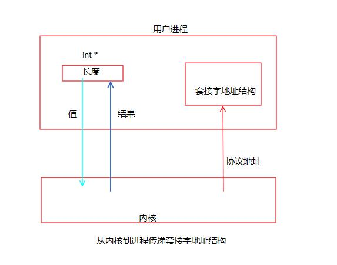

## Socket

### Data Struct

地址转化函数：`inet_pton(AF_INET, "127.0.0.1", &serv.sin_addr.s_addr);` 和 `inet_ntop`。 其中 p 表示**表达(presentation)**, n 表示 **数值(numeric)**

```c
struct sockaddr_in addr;
char str[INET_ADDRSTRLEN];
inet_ntop(AF_INET, &addr.sin_addr, str, sizeof(str));
```

套接字结构体为：

```c
struct sockaddr_in {
    uint_8  sin_len;
    sa_family_t sin_family;
    in_port_t   sin_port; // 16-bit

    struct in_addr sin_addr;

    char sin_zero[8];
}

struct in_addr {
    in_addr_t   s_addr; // 32-bit IPV4
}
```

### 值-结果参数

问题：

```c
#include <sys/socket.h>
int accept(int sockfd, struct sockaddr *addr, socklen_t *addrlen);
```

为什么 addrlen 要以指针的方式传递？

- 因为 addrlen 是**值-结果参数**: 套接字地址结构从**内核到进程**方向的传递。

1. 从进程到内核传递套接字地址结构的函数有 3 个：bind, connect 和 sendto; 这些函数的一个参数是指向某个套接字地址结构的指针，另一个参数是该结构的整数大小。

    ```c
    struct sockaddr_in serv;
    // fill in serv
    connect(sockfd, (SA *) &serv, sizeof(serv));
    ```

2. 从内核到进程传递套接字地址结构的函数有 4 个：accept, recvfrom, getsockname 和 getpeername; 这些函数的其中两个参数是指向某个套接字地址结构的指针和指向表示该结构大小的整数变量的指针。

    ```c
    struct sockaddr_un cli;
    socklen_t len;

    len = sizeof(len);
    getpeername(unixfd, (SA *) &cli, &len);
    ```

    

    如图中所示，当函数被调用时，结构大小是一个 **值(value)** , 它告诉内核该结构的大小，这样内核在写该结构时不至于越界；当函数返回时，结构大小又是一个 **结果(result)** , 它告诉内核在该结构中究竟存储了多少信息。这种类型的参数称为 **value-result** 参数。

> 所有的套接字函数都是内核中的系统调用。

除了系统调用之外，操作系统还可以通过异常(如缺页异常)和中断(如0x80)从用户态切换到内核态。

### listen()

```c
#include <sys/socket.h>
int listen(int sockfd, int backlog);
```

当 socket 函数创建了一个套接字时，它被假设为一个 **主动套接字**，也就是说，它是一个将调用 connect() 发起连接的客户端套接字。listen() 函数把一个未连接的套接字转化为 **被动套接字**。指示内核应该接受指向该套接字的连接请求。

> 本函数通常在调用 socket 和 bind 这两个函数之后，并在调用 accept 函数之前调用。

第二个参数规定了内核应该为相应套接字排队的最大连接个数，比如 36。对于这个参数 *backlog*, 内核为任何一个给定的套接字维护[两个队列](./networks.html#连接队列)：

1. 未完成连接队列(incomplete connection queue): SYN 分节已由某个客户端发出并到达服务器，而服务器正在等待完成相应的 TCP 三路握手过程；这些套接字处于 SYN_RCVD 状态；
   在三路握手正常完成的前提下，未完成连接队列中的任何一项在其中的存留时间就是一个 RTT, RTT 的取值取决于特定的客户与服务器。

2. 已完成连接的队列(completed connection queue): 每个已完成 TCP 三路握手的客户端对应1其中的一项；这些套接字处于 ESTABLISHED 状态。

两队列之和不超过 backlog.

当进程调用 accept 函数之后，已完成连接队列中的对头项将返回给进程，或者如果该队列为空，那么进程将被投入休眠，直到 TCP 在该队列放入一项才唤醒它。

### accept()

```c
int accept(int sockfd, struct sockaddr *cliaddr, socklen_t *addrlen);
```

在 accept() 函数中，我们称它的第一个参数为 **监听套接字(listening socket)** 描述符，称它的第二个参数为 **已连接套接字(connected socket)** 描述符。

监听套接字由 socket 创建，随后用于 bind 和 listen 的第一个参数。一个服务器通常仅仅创建一个监听套接字，它在该服务器的生命周期内一直存在。

已连接套接字由内核为每个服务器进程接受的客户端创建，当服务器完成对某个客户的服务时，相应的已连接套接字就被关闭。

## select, poll and epoll

### select 的缺点

1. 单个进程能够监视的文件描述符的数量存在最大限制(_FD_SETSIZE)，通常是 1024。由于 select 采用轮询的方式扫描文件描述符，文件描述符越多，性能越差

2. 内核/用户空间拷贝问题，select 需要复制大量的数组，产生了巨大的开销

3. select 返回的是含有整个句柄的数组，需要遍历整个数组才能发现哪些句柄发生了事件

4. select 的触发方式是水平触发，应用程序如果没有完成对一个已经就绪的文件描述符进行 IO，那么之后再次 select 调用还是会将这些文件描述符通知进程。

相比于 select 模型，poll 使用链表保存文件描述符，因此没有了监视文件数量(缺点 1)的限制，但其他三个缺点依然存在。

假设有 100 万个客户端同时与一个服务器保持着 TCP 连接，在 select/poll 时代，服务器进程每次都把 100 万个连接告诉操作系统（从用户态复制句柄数据结构到内核态），让操作系统内核去查询这些套接字上是否有事件发生，轮询完后，再将句柄数据复制到用户态，让服务器应用程序轮询处理已发生的网络事件，这一过程资源消耗较大，因此，select/poll 一般只能处理几千的并发连接。

## epoll

epoll 主要有三个方法：

1. `epoll_create(int __size)`: 返回一个 epfd 文件描述符，红黑树的根节点

2. `int epoll_ctl (int __epfd, int __op, int __fd, struct epoll_event *__event)`

3. `int epoll_wait (int __epfd, struct epoll_event *__events, int __maxevents, int __timeout);`

```cpp
struct epoll_event
{
  uint32_t events;  /* Epoll events */
  epoll_data_t data;    /* User data variable */
}
```

events 包括：

- EPOLLIN

- EPOLLOUT

- EPOLLERR

判断是否已连接的客户端：`!all[i] & EPOLLIN`

判断是否新连接： `fd == lfd`, 有新连接时，调用 accept() 接受该连接请求。

```cpp
typedef union epoll_data
{
  void *ptr;
  int fd;
  uint32_t u32;
  uint64_t u64;
} epoll_data_t;
```

`*ptr` 的用法：

```cpp
struct sockinfo
{
    int fd;
    struct sockaddr_in addr;
}sockInfo;

sockInfo* sinfo = (sockInfo*)malloc(sizeof(sockInfo));
sinfo->fd = lfd;
sinfo->sock = serv_addr;

struct epoll_event ev;
// *ptr
cv.data.ptr = sinfo
```

令 ptr 指向这个结构体，传入 `epoll_ctl()` 即可。

更复杂的带回调的 `epoll_data_t` 例子：

```cpp
struct myevent_s {
    int fd; // 要监听的文件描述符
    int events; // 对应的监听事件
    void *arg; // 指向 myevent_s 的函数指针
    void(*call_back)(int fd, int events, void *arg); // 回调函数
    int status; // 1：在红黑树上监听；0：不监听
    char buf[BUFLEN];
    int len;
    long last_active; // time(NULL) 记录每次加入红黑树 g_efd 的时间值
}
```

epoll_ctl 的 op 操作：

1. EPOLL_CTL_ADD

2. EPOLL_CTL_MOD

3. EPOLL_CTL_DEL

## epoll 三种工作模式

1. 水平触发模式（默认模式）- LT

   - 只要 fd 对应的缓冲区有数据，`epoll_wait` 就返回，例如读缓冲区的 buf 设置过小，就会使得读操作次数变多，`epoll_wait` 调用变多，直到读完缓冲区中的数据；

   - 返回的次数和发送数据的次数没有关系；

   - `epoll_wait` 调用次数越多，系统开销越大；

   - 在 EPOLL_OUT 中，`epoll_wait` 会一直返回，缓冲区能写数据，该函数会返回，缓冲区满的时候，不返回。**本质上是检测写缓冲区是否可以写。**

2. 边沿触发模式 - ET

    - `ev.events = EPOLLIN | EPOLLET`

    - fd - 默认阻塞属性

    - 客户端给 server 发数据：发一次数据 server 的 `epoll_wait` 返回一次；

    - 缓冲区中要是有没发完的数据，除非新数据到达，剩余的数据才会被发送出来，**不在乎数据是否读完**；

    - 可以减少系统开销，提高 `epoll_wait` 的效率；

    - 如果数据读不完，如何全部读出来？

        `while(recv())` 数据读完之后 `recv` 会阻塞，需要**设置 fd 非阻塞**，也就是边沿非阻塞触发模式。

    - EPOLL_OUT 中，第一次设置的时候 `epoll_wait` 会返回一次，然后就不返回了，除非满缓冲区被读，从 满 -> 不满的时候再返回一次，然后不再返回。

3. 边沿非阻塞触发模式- [代码实现](https://github.com/chenweigao/socket-epoll/blob/master/cpp_webserver/nonblock_et_epoll.c)

   - 效率最高

   - 如何设置非阻塞？

        1. `open()`: 修改 flags: `O_WDRW | O_NONBLUCK`, 使得文件描述符设置为非阻塞。适用于终端文件 dev/tty

        2. `fcntl()`:

            ```cpp
            #include <fcntl.h>
            int flag = fcntl(fd, F_GETFL);
            flag |= ONNBLOCK;
            fcntl(fd, F_SETFL, flag);
            ```

   - 将缓冲区的数据全读出，特别是针对缓冲区大小不够的情况

        ```cpp
        while ((len = recv(fd, buf, sizeof(buf), 0)) > 0)
        {
            write(STDOUT_FILENO, buf, len);
            send(fd, buf, len, 0);
        }
        ```

### 突破文件描述符上限

查看受计算机限制的文件描述符上限：

```sh
cat /proc/sys/fs/file-max
```

通过配置修改上限值：

```sh
# see open files's num: 1024
ulimit -a

vi /etc/security/limits.conf

# add lines
*   soft    nofile  8000
*   hard    nofile  8000

# temp setting
ulimit -n 2000
```

## Libevent Install

:::tip 简介
libevent 封装了 socket 通信、IO 多路转接；精简，专注于网络，性能高；跨平台；**事件驱动**。
:::

### Linux Install

```sh
# 检测安装环境，生成 makefile
./configure
make
sudo make install
```

`make install` 会将数据拷贝到对应的目录，如果目录不存在，则创建该目录。

默认目录是：

- `/usr/local/include`

- `/usr/local/bin`

- `/usr/local/lib`

验证是否安装成功：

```sh
cd sample/
gcc hello-world.c -o hello-world -l event

./hello-world
nc localhost 9995
```

### Window Install

使用 VS 的开发者命令行，然后输入：

```sh
nmake /f Makefile.nmake
```

编译完成后会看到三个 lib 文件，在 VS 的设置中，添加附加依赖项和附加包含项即可，分别包含这三个 lib 文件和 include 文件。

在运行时，会产生一些错误：

1. `#define _CRT_SECURE_NO_WARNINGS` 添加这行，对应 window 下的 `strerror` 错误；

2. `#pragma comment(lib, "ws2_32.lib")` 对应 winsock相关的问题。

## Libevent 框架概述

1. 事件的底层处理框架
   1. 一个函数

2. 消息循环
   1. 一个函数

3. **创建事件**
   1. 不带缓冲区 - event
      1. 几个函数
   2. 带缓冲区 - bufferevent
      1. 几个函数

4. 资源的释放
   1. 几个函数

总结其使用方法是：[参考程序 bufferevent_server.c](https://github.com/chenweigao/socket-epoll/blob/master/cpp_webserver/bufferevent_server.c)

1. 创建一个事件处理框架：`struct event_base* base = event_base_new();` （流水线或设备初始化完成）

2. 创建一个事件，并将事件添加到框架上：

   - （服务端）使用 **链接监听器** 直接创建: `struct evconnlistener* listen =  evconnlistener_new_bind();`, 函数中要求实现 `listen_cb` 函数回调；

   - 使用 `struct event* ev = event_new()` and `event_add()`, [参考这里的 40 - 44 行](https://github.com/chenweigao/socket-epoll/blob/master/cpp_webserver/libevent_read_fifo.c)

    如果要使用终端标准输入，可以使用 stdin 的文件描述符创建一个事件：`struct events* ev_in = event_new(base, STDIN_FILENO, EV_READ | EV_PERSIST, read_terminal, NULL);`

3. 开始事件循环: `event_base_dispatch(base);`

4. 释放资源: `evconnlistener_free(listen);`, `event_base_free(base);` and `event_free();`

## bufferevent

`bufferevent` 相比于 `event` 是创建带缓冲区的事件，包括读缓冲区和写缓冲区，参考[libevent 官网示例](https://github.com/libevent/libevent/blob/master/sample/hello-world.c)：

- 读：只要缓冲区有数据，就会被通知；

- 写：一般用不掉，自动发送并且返回回调。

`listen_cb` 回调中：

1. 创建一个带缓冲区的事件：`struct bufferevent* bev = bufferevent_socket_new(base, fd, BEV_OPT_CLOSE_ON_FREE);`

2. 然后 `bufferevent_setcb(bev, read_cb, write_cb, event_cb, NULL);`

3. 然后分别实现三个回调:

   - 以 `read_cb()` 为例，读写回调函数原型为：`typedef void (*bufferevent_data_cb)(struct bufferevent *bev, void *ctx);`

   - 事件回调函数原型为：`typedef void (*bufferevent_event_cb)(struct bufferevent *bev, short what, void *ctx);` `what` 包括的有: `BEV_EVENT_*`;

4. 释放资源：使用 `bufferent_free()`.

:::warning bug avoid
在初始化 `listen_cb` 的回调函数中，会使用读缓冲区和写缓冲区，bufferevent 默认读缓冲区是不可用的；

一般情况下，我们将这两个缓冲区都 `bufferevent_enable()`, 防止出现段异常
:::

在套接字通信中，客户端连接服务器使用：`int bufferevent_socket_connect(struct bufferevent *, const struct sockaddr *, int);`
