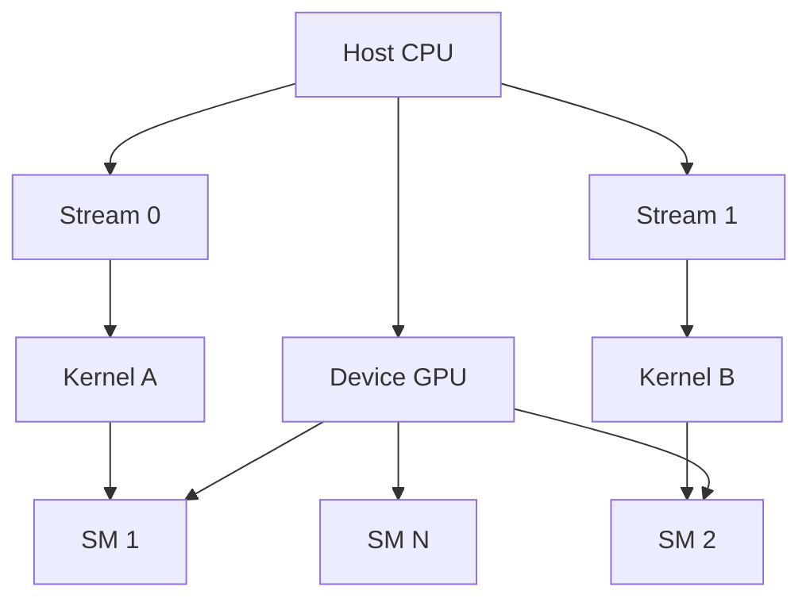
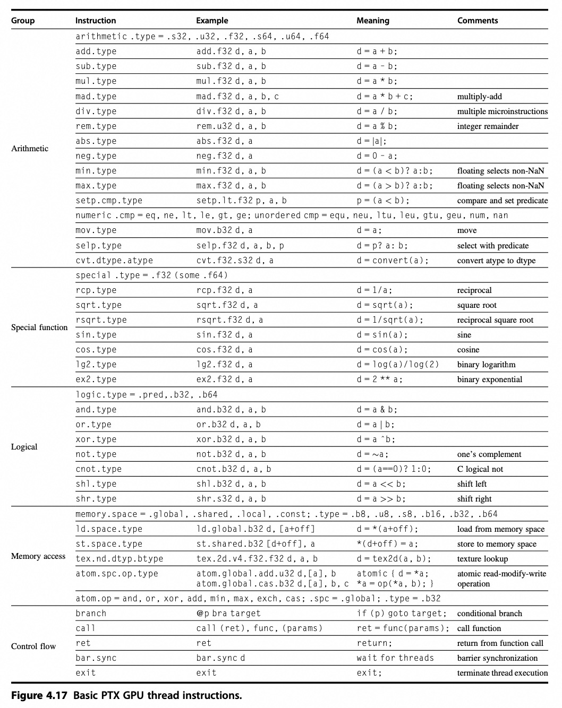

# GPU 架构深度解析

## 1. GPU 架构概述

### 1.1 GPU vs CPU：设计理念的差异

**CPU程序员面临的挑战**不仅是在GPU上获得出色的性能，更重要的是==协调系统处理器与GPU之间的计算调度，以及系统存储器与GPU存储器之间的数据传输==。

**GPU中的并行性体现**：
- **多线程并行**：支持数万个线程同时执行
- **MIMD**：多指令多数据流
- **SIMD**：单指令多数据流 
- **指令级并行**：指令流水线优化

### 1.2 SIMT：单指令多线程模型

NVIDIA将CUDA编程定义为**SIMT**（Single Instruction, Multiple Threads）-- ==单指令多线程==。这是GPU架构的核心特征：

- **硬件管理并行**：并行执行和线程管理由GPU硬件负责，而非应用程序或操作系统
- **两级调度机制**：
  - **线程块调度器**（Thread Block Scheduler）：将线程块分配给多线程SIMD处理器
  - **线程调度器**（Thread Scheduler）：每个时钟周期选择要执行的SIMD指令线程

> **英文原文**：The hardware Thread Block Scheduler assigns Thread Blocks to multithreaded SIMD Processors, and the hardware Thread Scheduler picks which thread of SIMD instructions to run each clock cycle within a SIMD Processor.

详细机制解析见[第7节：线程调度机制详解](#7-线程调度机制详解)。

## 2. GPU 核心编程模型：Stream、Kernel 和 Device

### 2.1 核心概念关系图

在GPU编程中，Stream、Kernel和Device是三个基础概念，它们的关系如下图所示：



### 2.2 Device：GPU设备

**Device**是指**GPU本身**，相对于运行主程序的**Host（通常是CPU）**：

- **多GPU系统**：每个GPU都是一个独立的device
- **设备选择**：可通过API查询和选择当前使用的device（如`cudaSetDevice()`或`hipSetDevice()`）
- **内存分离**：GPU内存（device memory）和CPU内存完全分开，需要显式数据拷贝
- **硬件架构**：一个GPU内部包含多个**SM（Streaming Multiprocessors）**，每个SM可并发执行多个**warp**（32个线程的调度单元）

### 2.3 Kernel：GPU函数

**Kernel**是运行在GPU上的**并行函数**，由Host发起调用：

- **执行模型**：大规模并行执行的最小单元，多个线程并发运行同一个kernel
- **调用语法**：`kernel<<<grid, block>>>(...)` 
  - **Grid**：thread blocks的网格布局
  - **Block**：block中线程的个数和布局
- **数据并行**：kernel执行时的并行性由开发者设计
- **资源绑定**：一个kernel被分割为多个block，每个block绑定到一个SM执行

### 2.4 Stream：执行队列

**Stream**是GPU上指令的**执行队列**：

- **顺序执行**：每个stream中的操作按顺序执行
- **并行机制**：不同stream可以并行执行，提升整体性能
- **并发应用**：利用多stream实现kernel执行和数据拷贝的并发（copy + compute overlap）
- **默认流**：stream 0为**default stream**或**legacy stream**
- **显式流**：非默认stream称为**explicit streams**，允许更细粒度的并发控制

### 2.5 硬件映射关系

实际的硬件交互映射如下：

```
+--------------------+            +---------------------------+
|   CPU (Host)       |            |         GPU               |
|--------------------|            |---------------------------|
| API: cudaMemcpy    |  ======>   | DMA Engine                |
| API: kernel launch |  ======>   | Command Processor (GPC)   |
|                    |            |  └── dispatch to SMs      |
+--------------------+            |     └── Warp Schedulers   |
                                  |         └── Threads       |
                                  +---------------------------+
```

参考GPU的存储结构设计：


## 3. Warp：线程束执行模型

**Warp**是GPU中最基本的执行单元，理解Warp对于GPU编程至关重要。

### 3.1 Warp基本概念

- **定义**：一个Warp包含32个线程（NVIDIA）或64个线程（AMD Wavefront）
- **同步执行**：同一Warp内的所有线程必须执行相同指令
- **分支分化**：当Warp内线程执行不同分支时，会导致性能下降
- **调度单元**：SM以Warp为单元进行线程调度

### 3.2 Warp执行机制

1. **指令发射**：一个Warp一次只能执行一条指令
2. **内存合并访问**：同一Warp内的线程应访问连续内存地址
3. **占用及延迟隐藏**：多个Warp并发执行，隐藏内存访问延迟

### 3.3 性能优化要点

- **避免分支分化**：让同一Warp内的线程执行相同逻辑
- **内存访问模式**：优化内存访问模式，提高带宽利用率
- **占用率调优**：合理设置线程块大小，提高SM占用率

::: tip 开发建议
理解Warp执行模型是GPU性能优化的关键。在设计CUDA kernel时，始终考虑Warp级别的执行效率。
:::

## 5. 硬件管理并行执行的原理

### 5.1 核心理念

> 并行执行和线程管理由GPU硬件负责，而不是由应用程序或者操作系统完成。

这句话的含义是：在GPU中，并行任务的执行和线程调度完全由硬件架构直接管理，而非依赖应用程序或操作系统的软件层面控制。

### 5.2 三个关键机制

#### 5.2.1 硬件直接管理并行执行

GPU通过**SIMT架构**实现并行性：
- **核心思想**：单条指令同时控制多个线程，共享指令流但处理不同数据
- **Warp执行**：32或64个线程组成一个Warp，由硬件调度器自动分配到SM
- **分支处理**：同一Warp内的线程必须执行相同指令，但数据路径独立

#### 5.2.2 线程模型的硬件抽象

GPU编程模型提供逻辑划分，实际执行由硬件完成：
- **Grid**：整个计算任务的规模
- **Block**：绑定到一个SM执行，线程间可通过共享内存协作
- **Thread**：最小执行单元，由硬件直接调度

#### 5.2.3 硬件资源自动分配

- **SM资源管理**：包含CUDA Core、共享内存、寄存器等，支持上下文切换
- **Warp调度器**：根据线程状态动态选择可执行的Warp
- **内存层次优化**：硬件自动优化内存访问，减少程序员工作量

### 5.3 优势总结

这种设计使得GPU能够高效实现大规模并行计算，同时降低编程复杂度。程序员只需关注任务的并行划分，而具体的线程调度、资源分配和延迟隐藏均由硬件自动完成。

## 6. SM（Streaming Multiprocessor）深度解析

### 6.1 SM架构演进历程

流多处理器（SM）架构随GPU技术发展不断演进：

#### 第一阶段：早期架构（2000年代初-2006年）
- **图形处理为主**：主要聚焦于图形处理任务
- **有限资源**：==处理核心数量相对较少==，缓存和共享内存规模有限
- **专用指令集**：主要针对图形渲染优化

#### 第二阶段：通用计算支持（2006-2012年）
- **CUDA架构引入**：==NVIDIA推出CUDA架构后，SM开始支持通用计算==
- **核心数量大幅增加**：处理核心数量显著提升
- **共享内存优化**：容量显著提升，便于线程间数据共享

#### 第三阶段：架构优化（2012-2018年）
- **处理核心性能增强**：单位时间内可完成更多计算操作
- **缓存层次结构完善**：增加缓存容量，优化缓存算法
- **指令集丰富**：==支持更多复杂计算指令==

#### 第四阶段：面向深度学习（2018年至今）
- **Tensor Core集成**：安培架构中集成专用Tensor Core
- **稀疏计算支持**：提高对稀疏数据的处理效率
- **能效优化**：降低功耗同时提高计算性能

### 6.2 SM基本信息

SM是GPU中最基本的并行计算单元，相当于一个"微型处理器集群"：

- **核心功能**：
  - 管理数百个线程的并行执行（通过硬件线程调度器）
  - 集成多种计算单元（CUDA Core、Tensor Core）、缓存、寄存器等
- **架构演进**：不同代次架构的SM设计不同，核心变化在于Tensor Core的引入与升级


*早期GPU微架构，具体可参考项目中的Excalidraw*

### 6.3 不同架构SM对比

以Hopper vs Ada Lovelace为例：

| **架构** | **SM核心组件** | **Tensor Core特性** | **CUDA Core数量/SM** |
|----------|---------------|---------------------|---------------------|
| **Hopper (H100)** | 包含CUDA Core、第四代Tensor Core、共享内存、寄存器文件、线程调度器等 | 支持FP8/INT4/稀疏化，FP16矩阵运算吞吐量提升 | 128 |
| **Ada Lovelace (L40S)** | 类似Hopper，但优化了图形相关单元（如RT Core），Tensor Core支持INT4稀疏化 | 强化INT4/FP8推理加速，兼容图形与计算任务 | 128 |

### 6.4 Tensor Core

SM（Streaming Multiprocessor，流多处理器）和 Tensor Core（张量核心，**矩阵核心，专用加速单元**）都是 NVIDIA GPU 中的关键组件，它们相互协作，共同提升 GPU 在不同计算任务中的性能。

**Tensor Core 是 SM 的组成部分**：在 NVIDIA 的 GPU 架构中，如 Volta、Turing 和 Ampere 等，Tensor Core 是集成在 SM 内部的专用处理单元。以 Volta 架构为例，一个 SM 由 4 个 Sub Core 组成，每个 Sub Core 内含有两个 4x4x4 Tensor Core 。Turing 架构的 SM 中，则包含 8 个 Turing Tensor Core。这表明 Tensor Core 是 SM 架构的一部分，依托 SM 的整体架构发挥作用。

**功能上相互配合**：SM 负责管理和执行大量线程，具备强大的并行数据处理能力，其中的 CUDA 核心能执行通用的并行计算任务，处理各种类型的计算指令。而 Tensor Core 是专门为加速深度学习中的矩阵乘法和累加操作设计的，在深度学习训练和推理任务中，当遇到矩阵运算时，Warp Scheduler（负责调度计算单元工作）会向 Tensor Core 发送矩阵乘法 GEMM 运算指令，Tensor Core 接收来自寄存器文件的输入矩阵，执行矩阵乘法操作，并将结果写回寄存器文件。这体现了 SM 的线程管理和通用计算能力，与 Tensor Core 的深度学习矩阵运算加速能力相互配合。

**共同提升计算性能**：SM 的架构设计为 Tensor Core 提供了运行环境和数据交互支持，如 SM 中的 L1 指令缓存、L1 数据缓存和共享内存等组件，保障了 Tensor Core 所需数据的读取和计算结果的存储。Tensor Core 的高效矩阵运算能力又提升了 SM 在深度学习任务上的处理速度，两者协同工作，使得 GPU 在通用计算和深度学习等多领域都能有出色的性能表现。

#### 6.4.1. 定位

Tensor Cores 是**专为矩阵运算优化的专用硬件单元**，首次出现在 2017 年的 Volta 架构（如 V100），后续在 Ampere、Hopper、Ada Lovelace 等架构中持续升级（当前为第四代）。

- **功能**：**加速矩阵乘法与累加（GEMM, General Matrix Multiply）**，即计算 C=A×B+C，其中 A、B、C 为矩阵。

- **应用场景**：
    - **深度学习核心场景**：神经网络中的线性层（全连接层、Transformer 的 Attention）、卷积层（可转换为矩阵运算），是训练和推理的关键加速单元。
    - **科学计算优化**：如矩阵求逆、奇异值分解（SVD）等，需配合特定库（如 cuBLAS）使用。

#### 6.4.2. 技术特点

- **专用性**：仅支持**特定精度的矩阵运算**，包括 FP16、BF16、TF32、INT8、INT4、FP8 等（不同架构支持的精度不同，如 H200 NVL 支持 FP8，L40S 支持 INT4），**不处理标量运算**。
- **计算模式**：每次处理一个 4×4×4 的矩阵块（输入为两个 4x4 矩阵，输出为 4x4 矩阵并累加），单周期内完成 64 次乘加运算，效率远超 CUDA Cores 的标量累加。
- **性能优势**：
    - 以 FP16 为例，Tensor Core 的运算速度通常是 CUDA Core 的**8-16 倍**（如 H100 的 FP16 Tensor Core 性能为 204.9 TFLOPS，而 FP32 CUDA Core 性能为 51.2 TFLOPS，前者是后者的 4 倍，因 Tensor Core 同时利用低精度和矩阵并行）。
    - 支持**稀疏化（Sparsity）**：当矩阵中零值占比达到 50% 时，性能可再提升 1 倍（如表格中 “with Sparsity” 的数值通常是非稀疏模式的 2 倍）。

- **第四代 Tensor Core**（Hopper/Ada Lovelace 架构）：支持更多精度（如 FP8、INT4）和稀疏化技术，矩阵运算吞吐量进一步提升（如 H200 NVL 的 FP8 Tensor Core 稀疏性能达 3341 TFLOPS）。
- **数量对比**：Tensor Core 数量远少于 CUDA Cores（如 H200 NVL：528 个 Tensor Core vs 16896 个 CUDA Core），但每个 Tensor Core 的矩阵运算效率极高。


图片来源：https://g.masse.me/gpu-specs/


#### 6.4.3. SM 内的 Tensor Core 布局

- **引入与位置**：Tensor Core 自 **Volta 架构（2017 年）** 开始集成到 SM 中，位于 SM 的专用计算模块内，与 CUDA Core 并列。
- **数量**：每个 SM 包含的 Tensor Core 数量随代次升级：
    - **Volta（V100）**：每个 SM 有 8 个 Tensor Core（支持 FP16/INT8 矩阵运算）；
    - **Ampere（A100）**：每个 SM 有 8 个 Tensor Core（支持 TF32/FP16/BF16/INT8，性能提升）；
    - **Hopper（H100/H200 NVL）**：每个 SM 有 8 个**第四代 Tensor Core**（支持 FP8/INT4 等更低精度，新增稀疏化加速）；
    - **Ada Lovelace（L40S）**：每个 SM 有 8 个 Tensor Core（与 Hopper 类似，但优化了 FP8/INT4 支持）。
- **功能定位**：
    - Tensor Core 是 SM 的 “矩阵运算加速器”，专门处理 4×4 矩阵块的乘加运算（GEMM），单周期内完成 64 次乘加操作（即计算 4×4+4×4=4×4）。
    - 仅当计算精度和操作类型（矩阵乘法）匹配时，SM 才会调用 Tensor Core，否则使用 CUDA Core。

#### 6.4.4. 与 SM 的协作

- **数据通路**：Tensor Core 的输入输出数据通过 SM 内的专用寄存器文件（Register File）与 CUDA Core 共享，无需经过显存，减少延迟。
- **调度逻辑**：当框架（如 PyTorch）调用矩阵运算时，==SM 的指令调度器自动判断==是否使用 Tensor Core：
    - 若为 FP16/BF16/TF32/INT8 等支持的精度且是矩阵运算，则分配给 Tensor Core；
    - 否则分配给 CUDA Core（如 FP32 标量运算、INT32 整数操作）。

### 6.5. Cuda Core

#### 6.5.1. 对比

**CUDA Cores** 和 **Tensor Cores** 均为 **SM 内部的计算单元**，二者在 SM 中以特定结构集成。

| **特性**     | **CUDA Cores**        | **Tensor Cores**               |
| ---------- | --------------------- | ------------------------------ |
| **定位**     | 通用计算单元，处理标量运算         | 专用单元，加速矩阵乘法与累加                 |
| **支持精度**   | FP64/FP32/INT32 等通用精度 | FP16/BF16/TF32/INT8/FP8 等特定低精度 |
| **计算模式**   | 标量运算，单数据点并行           | 矩阵块运算（4x4x4），块级并行              |
| **典型应用**   | 图形渲染、科学计算、非矩阵优化任务     | 深度学习矩阵运算（训练 / 推理）、矩阵分解         |
| **性能优势**   | 大规模线程并行，通用性强          | 单核心超高矩阵运算效率（比 CUDA Core 快数倍）   |
| **首次出现架构** | 所有 CUDA 架构（2006 年至今）  | Volta 架构（2017 年），当前为第四代        |
在深度学习中，两者通常协同工作：
1. **Tensor Cores**：处理神经网络中的矩阵运算（如前向传播、反向传播的梯度计算），由框架（PyTorch/TensorFlow）或库（cuDNN）自动调用，大幅减少计算时间。
2. **CUDA Cores**：处理辅助任务，如数据预处理、激活函数（ReLU/Sigmoid）、非矩阵化的张量操作（如索引、切片），以及不支持 Tensor Core 的精度（如 FP64 训练）。

例如，在训练一个 Transformer 模型时：
- 矩阵乘法（Q/K/V 投影、FFN 层）由 Tensor Cores 加速；
- 层归一化、Softmax 等标量运算由 CUDA Cores 处理。

#### 6.5.2. SM 内的 CUDA Core 布局

- **数量**：每个 SM 包含多个 CUDA Core，具体数量随架构变化：
    - **Volta 架构（V100）**：每个 SM 有 64 个 CUDA Core；
    - **Ampere 架构（A100）**：每个 SM 有 128 个 CUDA Core；
    - **Hopper 架构（H100/H200 NVL）**：每个 SM 有 128 个 CUDA Core；
    - **Ada Lovelace 架构（L40S）**：每个 SM 有 128 个 CUDA Core（与 Ampere 类似，但优化了指令调度）。

- **功能定位**：
    - CUDA Core 是 SM 的 “通用计算基石”，负责处理标量运算（如 FP32/FP64 浮点、INT32 整数运算），以及不适合 Tensor Core 的任务（如激活函数、数据预处理）。
    - 每个 CUDA Core 独立执行一条线程的标量指令，SM 通过同时调度数千个线程（分布在多个 CUDA Core 上）实现大规模并行计算。

#### 6.5.3. 与 SM 的协作

SM 通过线程束（Warp，32 个线程为一组） 调度 CUDA Core：
- 每个 Warp 的 32 个线程分配到 32 个 CUDA Core 上并行执行（如 Hopper 的 SM 有 128 个 CUDA Core，可同时处理 4 个 Warp）；
- 当 CUDA Core 执行浮点或整数指令时，SM 的控制单元（如指令调度器）负责分发任务并同步结果。

### 6.6. 举例：Grid/Block/Thread

关系的示意图如下所示：(图中表示 $A = B * C$, 两个向量相乘，每个向量的长度为 8192 个元素)。

1. 每个 SIMD 线程指令计算 32 个元素；
2. 每个线程块包含 16 个 SIMD 线程；
3. 网格包含 16 个线程块。


### 6.7. 与 CPU 的对比

CPU：依赖操作系统管理线程调度（如多核任务分配），线程切换和资源分配由软件控制，适合复杂逻辑和低延迟任务。

GPU：硬件直接管理线程，通过 SIMT 架构和大量线程掩盖内存延迟，适合数据并行任务（如矩阵运算、图像处理）。

总结：GPU 的硬件设计使得并行执行和线程管理成为“黑箱”，程序员只需关注任务的并行划分（如线程块大小），而具体的线程调度、资源分配和延迟隐藏均由硬件自动完成。这种设计大幅提升了并行计算效率，同时降低了编程复杂度。

**GPU 的硬件设计如何隐藏线程管理细节并提升并行计算效率**:

GPU（图形处理器）的架构与传统 CPU 有着根本性的不同，它专为大规模并行计算优化，能够同时运行成千上万个线程。GPU 之所以能够高效执行并行计算，关键在于其硬件设计隐藏了线程调度、资源分配以及延迟隐藏的复杂性，使得开发者只需要关注任务的并行划分，而无需直接管理底层的并行执行细节。

---

#### 6.7.1. GPU 线程管理的“黑箱”特性

在 GPU 上，程序员通常通过 CUDA（NVIDIA）或 HIP（AMD）等并行计算框架，定义计算任务的并行性。开发者需要做的主要工作是：

• 确定数据并行模式：任务如何划分为多个线程进行处理。

• 选择线程块大小（Thread Block Size）：GPU 计算通常基于“线程块（Thread Block）”的概念，程序员需要决定每个块中的线程数。

• 确定网格（Grid）结构：将线程块映射到更大范围的计算任务。

然而，一旦任务被划分好，线程的具体执行顺序、分派到哪个计算单元、如何进行调度、如何隐藏延迟等，完全由 GPU 硬件自动管理，这与**传统 CPU 上需要开发者手动优化线程调度**和同步的做法形成鲜明对比。

---

#### 6.7.2. GPU 自动完成的线程管理机制

GPU 硬件通过多个机制隐藏线程管理细节，从而优化计算效率：

**(1) 线程调度（Warp Scheduling）**：

GPU 的基本执行单元是“Warp”或“Wavefront”（如 NVIDIA 的 Warp 由 32 个线程组成，AMD 的 Wavefront 通常为 64 个线程）。GPU 的硬件调度器负责：

- 自动分配 Warp 到计算单元（Streaming Multiprocessors, SM）
- 在不同 Warp 之间交错执行，以最大化硬件利用率
- 屏蔽不同线程的执行细节，开发者不需要关心线程具体如何被调度

例如，在 CPU 上，如果多个线程争夺相同的核心，可能会导致复杂的上下文切换（context switch），而 GPU 通过“零开销线程切换”机制，在一个 Warp 执行遇到内存访问延迟时，硬件可以快速切换到另一个 Warp，隐藏延迟，从而提高计算效率。

**(2) 资源分配（Register & Shared Memory Management）**：

GPU 采用分层存储架构，包括：

• 寄存器（Register File）

• 共享内存（Shared Memory）

• 全局内存（Global Memory）

• 纹理/常量内存（Texture/Constant Memory）

不同线程块的资源分配由硬件自动管理：

- GPU 会根据线程块的大小，自动划分可用的寄存器和共享内存，**确保线程间不会发生资源冲突**
- 程序员无需手动管理内存访问模式，硬件会自动进行 **数据合并（Memory Coalescing）** 以优化内存访问

在 CPU 上，开发者需要手动进行缓存优化，而在 GPU 上，很多缓存优化（如 L2 Cache、共享内存）由硬件完成，大大减少了程序优化的复杂度。

**(3) 延迟隐藏（Latency Hiding）**：

CPU 主要依靠深度流水线（Deep Pipeline）和分支预测（Branch Prediction） 来减少指令执行的延迟，而 GPU 采用了**大规模线程切换（Thread-Level Parallelism, TLP）** 来隐藏延迟：

- 当某个 Warp 等待内存访问时，GPU 硬件会自动调度另一个 Warp 执行，避免计算单元空闲
- 这种策略能够充分利用 GPU 的超大存储带宽（如 HBM 高带宽存储），在数百至数千个线程间动态调度计算任务

这种延迟隐藏机制使得程序员不需要像在 CPU 上那样进行复杂的流水线优化、寄存器重命名等，而是交给 GPU 硬件自动优化。

---

#### 6.7.3. GPU 这种硬件设计的优势

**(1) 降低编程复杂度**

由于线程管理和调度均由硬件完成，开发者只需要关注：

• 如何划分计算任务

• 如何选择合理的线程块大小

• 如何优化数据访问模式（如避免共享内存冲突）

相较于 CPU 上需要手动管理线程、同步、缓存等，GPU 的这种设计大大降低了并行编程的门槛，使得更多开发者能够利用 GPU 进行加速计算。

**(2) 提升并行计算效率**

• 由于 GPU 能够同时管理数万个线程，并通过自动调度 Warp 来优化资源利用率，使得 GPU 在数据并行任务上展现出极高的吞吐率

• 通过零开销线程切换，GPU 在面对高延迟操作（如全局内存访问）时依然能够保持高效执行，而 CPU 可能会因为缓存未命中导致停滞

• 通过自动资源分配和寄存器优化，避免了 CPU 上需要手动进行的复杂优化

**(3) 适用于大规模计算任务**

GPU 的这种设计特别适合：

- 深度学习和 AI 训练（如 TensorFlow、PyTorch）：因为矩阵计算可以高度并行化

- 科学计算和 HPC（如气候模拟、基因计算）：涉及大量浮点运算的任务

- 大规模图形渲染（如游戏和视觉计算）：GPU 本就是为并行渲染设计的

- 数据库加速（如 GPU 加速 SQL 查询）：高吞吐率可以显著提升查询性能

---

#### 6.7.4. 结论

GPU 通过将**线程调度、资源分配、延迟隐藏等低层细节封装在硬件中**，使得开发者能够更专注于任务的并行划分，而无需关心具体的线程管理。这种“黑箱”设计使得 GPU 能够高效执行大规模并行计算任务，同时大幅降低了并行编程的复杂度，从而推动了 AI、HPC、图形渲染等领域的快速发展。

这种架构的核心理念是**让硬件管理并行性，让开发者专注于计算逻辑**，从而最大化计算资源的利用率，实现高效的并行计算。

## 7. 线程调度机制详解

### 7.1 双层调度架构

> 硬件线程块调度器（Thread Block Scheduler）将线程块（Thread Blocks）分配给多线程SIMD处理器（multithreaded SIMD Processors），而硬件线程调度器（Thread Scheduler）在每个时钟周期内选择要在SIMD处理器中运行的SIMD指令线程（thread of SIMD instructions）。

这句话描述了GPU内部的**线程块调度**和**线程调度**两个层次的机制，强调了线程调度是逐个时钟周期进行的动态过程。

### 7.2 线程块调度器（Thread Block Scheduler）

**功能职责**：
- 负责将线程块分配给多线程SIMD处理器
- 在GPU计算模型中，一个计算任务被划分成多个线程块
- 每个线程块内部包含多个线程

**分配策略**：
由于GPU由多个SIMD处理单元（如SM或CU）组成，线程块调度器需要均匀分配任务到这些处理单元上。

**示例**：如果一个GPU有8个SIMD处理单元，而计算任务包含64个线程块，线程块调度器可能会将每个SIMD处理单元分配8个线程块，确保所有计算单元都参与计算，最大化吞吐量。

### 7.3 线程调度器（Thread Scheduler）

**核心机制**：
- 在每个SIMD处理器内部，每个时钟周期选择一个要执行的SIMD指令线程
- 由于GPU采用SIMT计算模式，每个SIMD处理单元可以同时执行多个Warp/Wavefront
- 由于计算资源有限，必须在多个候选线程中选择合适的线程执行

**关键特征**：
1. **多Warp竞争执行权**：一个SIMD处理单元内部可能有几十到上百个Warp处于就绪状态，但一次只能执行一个Warp的SIMD指令
2. **每时钟周期调度**：线程调度器在每个时钟周期都会选择一个Warp，执行它的下一条SIMD指令
3. **智能调度决策**：基于指令依赖性、寄存器压力、内存访问延迟等因素进行选择

### 7.4 调度决策因素

- **指令依赖性**：如果某个Warp需要的数据还没准备好，调度器会跳过它
- **寄存器压力**：如果某个Warp占用了太多寄存器，可能会降低调度器的灵活性
- **内存访问延迟**：如果某个Warp需要访问DRAM，调度器可能会选择另一个不受内存访问限制的Warp先执行

### 7.5 延迟隐藏机制

假设一个SIMD处理器可以并行执行32个线程（即1个Warp），但它可能维护了64个Warp在等待执行。当某个Warp的内存访问未完成时，线程调度器会选择另一个已经准备好执行的Warp，以隐藏延迟（latency hiding）。

### 7.6 架构总结

- **Thread Block Scheduler**：负责在多个SIMD处理单元之间分配线程块，确保所有处理单元都参与计算
- **Thread Scheduler**：负责在每个SIMD处理单元内部进行时钟周期级的Warp调度，最大化计算资源利用率

::: tip 比喻理解
可以把整个GPU计算过程比作工厂流水线：
1. Thread Block Scheduler类似于车间经理，负责把不同的任务分配给多个生产线（SIMD处理单元）
2. Thread Scheduler类似于生产线上的调度员，每秒钟（每个时钟周期）都要决定当前哪条生产线上的工作站（Warp）应该执行下一步任务
:::

可以把整个 GPU 计算过程比作工厂流水线：

1. Thread Block Scheduler 类似于车间经理，负责把不同的任务分配给多个生产线（SIMD 处理单元）。
2. Thread Scheduler 类似于生产线上的调度员，每秒钟（每个时钟周期）都要决定当前哪条生产线上的工作站（Warp/Wavefront）应该执行下一步任务。

这样，GPU 通过多层次调度，在硬件层面实现高吞吐量并行计算，有效地利用计算资源。

## 9. Explicit Predicate Registers（显式谓词寄存器）

Explicit Predicate Registers（显式谓词寄存器）通常出现在支持 VLIW（超长指令字） 或 SIMD（单指令多数据） 体系结构的 CPU 和 GPU 设计中，用于实现指令级并行（ILP） 和数据级并行（DLP）。它们的主要作用是存储和控制指令或数据的执行条件。

### 9.1. 什么是 Explicit Predicate Registers？

在计算机体系结构中，**predicate（谓词）** 是一个布尔值（0/1），用于指示某条指令是否应该执行。Predicate 允许在不需要分支指令（如 if-else 或 branch）的情况下，实现**条件执行**（conditional execution）。这在**减少流水线分支预测失败、提高指令并行度**方面非常重要。

**Predicate Registers（谓词寄存器）** 存储这些布尔值，每个谓词寄存器通常存储一个或多个谓词位。例如，在向量化执行时，每个 SIMD 线程可以有一个对应的谓词寄存器位，控制它是否执行当前指令。

**显式谓词寄存器（Explicit Predicate Registers）** “显式”指的是架构直接提供**专门的**谓词寄存器，而不是依赖通用寄存器或状态标志位。例如：

- Intel AVX-512: 提供 16 个 mask registers（k0-k15），用于 SIMD 向量化中的条件掩码。

- AMD CDNA / RDNA: GPU 采用谓词寄存器来管理 SIMT（单指令多线程）执行，控制哪些线程在 warp/wavefront 中生效。

- Itanium（IA-64）: 采用了大量的谓词寄存器（64 个），用于 VLIW 指令并行调度。

- ARM SVE（Scalable Vector Extension）: 提供了显式谓词寄存器 p0-p7，用于向量掩码操作。

### 9.2. 显式谓词寄存器的作用

**避免分支预测失败**：传统 if-else 代码会引入分支预测，而谓词寄存器允许**无分支执行**，减少分支预测开销。例如：

```
; x86 AVX-512
VPADDQ ZMM1, ZMM2, ZMM3 {k1}  ; 仅在 k1 掩码为 1 的位置执行加法
```

 **提高指令并行度（ILP）**：现代 CPU 会同时调度多个指令，使用谓词寄存器可以让不同指令并行执行，不必等待分支决策完成。

 **向量化计算（SIMD/SIMT）**：GPU 和向量指令集利用谓词寄存器进行**掩码计算**，控制哪些元素参与计算，例如：

```
; ARM SVE
ADD Z0.S, P0/M, Z1.S, Z2.S  ; 仅对 P0 掩码为 1 的元素执行加法
```

**减少控制依赖（Control Dependency）**：传统流水线 CPU 需要预测分支，而谓词寄存器让**所有指令都进入流水线**，只是在执行阶段选择是否生效，降低分支误预测的开销。

### 9.3. 典型应用

 **AI 和 HPC**: 深度学习推理（如 Transformer 模型）和数值计算中，经常使用 AVX-512、SVE、CDNA/RDNA 的 SIMD/矩阵运算，显式谓词寄存器用于掩码计算。

 **编译器优化**: LLVM、GCC 在自动向量化过程中，会利用谓词寄存器生成**无分支代码**，提升 SIMD 效率。

 **GPU Wavefront 处理**: AMD RDNA/CDNA GPU 使用显式谓词寄存器管理**Wavefront 屏蔽（Wave Masking）**，让 SIMD 线程更高效地执行 warp/wave 级分支。

::: tip 总结
**显式谓词寄存器**是一种专门用于**条件执行**的寄存器，广泛应用于 **VLIW、SIMD、SIMT** 体系结构。它们的优势包括**减少分支预测失败、提高指令并行度、提升向量化计算效率**，在现代 CPU/GPU 体系结构中扮演关键角色。
:::

## 10. NVIDA GPU 指令集体系结构

列举部分指令：



## 11. NV GPU 存储结构

### 11.1. Streaming Caches

> Rather than rely on large caches to contain the whole working sets of an application, GPUs traditionally ==use smaller streaming caches== and, because their working sets can be hundreds of megabytes, rely on extensive multithreading of threads of SIMD instructions to **hide the long latency to DRAM.**

这句话的意思是：

与其依靠大容量的缓存来容纳应用程序的整个工作集，GPU 传统上采用更小的流式缓存。由于 GPU 的工作集可能达到数百兆字节，为了掩盖访问 DRAM（动态随机存取存储器）时的长延迟，GPU 依靠大量的线程并行执行 SIMD（单指令多数据）指令来隐藏这些延迟。

1. **大缓存 vs. 小流式缓存**

- **CPU** 通常使用较大的缓存（如 L2/L3 缓存）来存储经常访问的数据，从而减少对主存（DRAM）的访问次数。
- **GPU** 则采用**小型流式缓存**（Streaming Cache）。它主要用于临时存储数据，通过高速缓存访问来减少访存延迟，但不会试图容纳整个应用的工作集。

2. **Workload 大小**：GPU 的应用场景（如图像处理、深度学习等）通常需要处理海量数据，其 Workload 可能达到数百兆字节，远超缓存的容量。

3. **隐藏内存延迟**

- 由于 DRAM 访问的延迟较长，GPU 不像 CPU 那样依靠复杂的缓存层级来降低延迟。
- GPU 采用**大量的线程**（通过 SIMT/SIMD 方式）执行，==确保在某个线程等待数据返回时，其他线程可以继续执行其他任务==。这种方法有效地**隐藏内存访问延迟**。

4. **SIMD 指令**：GPU 通过 SIMD 指令（Single Instruction, Multiple Data）执行一条指令，同时操作多个数据项。再结合超线程调度，多线程并行执行进一步提高了吞吐量。

GPU 的架构设计强调**吞吐量**而非**低延迟**。通过依靠**小型流式缓存**和**多线程掩盖内存延迟**，GPU 能高效处理大规模数据并执行并行计算。

> [!NOTE]
>
> 此处命名为 `数据`，但这里并没有提供具体数据集，而是提供了处理获取大规模数据的方法

## 12. Device and Stream

在 CUDA 编程里，`device`（设备）和 `stream`（流）是两个关键概念，它们存在着密切的联系，下面将为你详细介绍它们之间的关系。

### 12.1. 基本概念

- **Device**：在 CUDA 语境中，`device` 通常指的是 GPU。CUDA 程序可以在多个 GPU 设备上并行运行，每个 GPU 设备都有其独立的内存和计算资源。
- **Stream**：`stream` 是一系列按顺序执行的 CUDA 操作队列。同一流内的操作会按照顺序依次执行，不同流内的操作则可以并行执行，这样就能提高 GPU 资源的利用率。

### 12.2. 二者关系

- **设备包含多个流**：一个 `device`（GPU）能够同时管理多个 `stream`。借助多个流，你可以让不同的 CUDA 操作在同一个 GPU 上并行执行，以此提升整体性能。例如，在一个 GPU 上可以同时开启数据传输流和内核执行流，使数据传输和内核计算并行进行。
- **流在设备上执行**：所有的 `stream` 都必须依附于某个 `device`。当你创建一个 `stream` 时，实际上是在特定的 GPU 设备上创建了一个操作队列。不同设备上的流是相互独立的，不能跨设备共享。
- **通过流管理设备资源**：合理运用 `stream` 能够更好地管理 `device`（GPU）的资源。例如，你可以把不同类型的任务分配到不同的流中，像将数据传输任务和内核计算任务分别放到不同的流里，从而实现数据传输和内核计算的重叠，充分利用 GPU 的带宽和计算能力。

### 12.3. 示例代码

下面是一个简单的 CUDA C++代码示例，展示了如何在一个 GPU 设备上创建和使用多个流：

```
#include <cuda_runtime.h>
#include <iostream>

__global__ void kernel(float* d_a, float* d_b, float* d_c, int n) {
    int idx = threadIdx.x + blockIdx.x * blockDim.x;
    if (idx < n) {
        d_c[idx] = d_a[idx] + d_b[idx];
    }
}

int main() {
    const int n = 1024;
    const int blockSize = 256;
    const int gridSize = (n + blockSize - 1) / blockSize;

    float *h_a, *h_b, *h_c;
    float *d_a, *d_b, *d_c;

    // 分配主机内存
    h_a = (float*)malloc(n * sizeof(float));
    h_b = (float*)malloc(n * sizeof(float));
    h_c = (float*)malloc(n * sizeof(float));

    // 初始化主机数据
    for (int i = 0; i < n; i++) {
        h_a[i] = static_cast<float>(i);
        h_b[i] = static_cast<float>(i * 2);
    }

    // 分配设备内存
    cudaMalloc((void**)&d_a, n * sizeof(float));
    cudaMalloc((void**)&d_b, n * sizeof(float));
    cudaMalloc((void**)&d_c, n * sizeof(float));

    // 创建两个流
    cudaStream_t stream1, stream2;
    cudaStreamCreate(&stream1);
    cudaStreamCreate(&stream2);

    // 在流1中执行数据传输和内核计算
    cudaMemcpyAsync(d_a, h_a, n * sizeof(float), cudaMemcpyHostToDevice, stream1);
    cudaMemcpyAsync(d_b, h_b, n * sizeof(float), cudaMemcpyHostToDevice, stream1);
    kernel<<<gridSize, blockSize, 0, stream1>>>(d_a, d_b, d_c, n);
    cudaMemcpyAsync(h_c, d_c, n * sizeof(float), cudaMemcpyDeviceToHost, stream1);

    // 在流2中执行另一个任务（这里简单示例为同步操作）
    cudaStreamSynchronize(stream2);

    // 销毁流
    cudaStreamDestroy(stream1);
    cudaStreamDestroy(stream2);

    // 释放设备内存
    cudaFree(d_a);
    cudaFree(d_b);
    cudaFree(d_c);

    // 释放主机内存
    free(h_a);
    free(h_b);
    free(h_c);

    return 0;
}
```

在这个示例里，我们在同一个 GPU 设备上创建了两个流 `stream1` 和 `stream2`，并在 `stream1` 中执行了数据传输和内核计算任务。这样，通过使用流，我们能够更好地管理 GPU 设备的资源，提高程序的性能。

### 12.4. Stream 的进一步细分理解

从功能和操作类型角度，`Stream`内的操作可以更细致地划分：

- **内存操作流**：

 	- **主机到设备的内存传输**：借助 `cudaMemcpyAsync` 函数，能把数据从主机（CPU）内存异步传输到设备（GPU）内存。比如在深度学习训练里，需把输入数据和标签从主机内存传至 GPU 内存，以开展后续计算。
 	- **设备到主机的内存传输**：同样使用 `cudaMemcpyAsync` 函数，可将数据从设备内存异步传输回主机内存。例如在推理结束后，要把计算结果从 GPU 内存传回 CPU 内存进行后续处理。
 	- **设备内的内存操作**：像 `cudaMemsetAsync` 可用于异步地将设备内存的某个区域设置为特定值，`cudaMemcpyPeerAsync` 能在不同 GPU 设备间异步传输数据。

- **内核执行流**：用于调度和执行 CUDA 内核函数。CUDA 内核是在 GPU 上并行执行的函数，可同时处理大量数据。例如，在矩阵乘法运算中，可编写一个 CUDA 内核函数，让大量线程并行计算矩阵元素的乘积和累加结果。
- **事件同步流**：CUDA 事件可用于记录流中特定操作的完成时间，并且能实现不同流之间的同步。例如，你可以在一个流中记录一个事件，在另一个流中等待该事件完成后再继续执行后续操作，以此确保不同流中的操作按特定顺序执行。

## 13. 总结

本文深入解析了GPU架构的核心设计原理，主要包括：

### 13.1 核心架构特点

1. **SIMT编程模型**：单指令多线程，硬件管理并行执行
2. **双层调度机制**：线程块调度器 + 线程调度器
3. **SM核心组件**：集成CUDA Core、Tensor Core、共享内存等
4. **Warp执行模型**：32个线程为一组的执行单元
5. **流式缓存设计**：通过多线程并行隐藏内存延迟

### 13.2 设计优势

- **硬件管理并行性**：程序员只需关注任务划分，硬件自动处理线程调度
- **高吞吐量设计**：通过大量线程并行和流式缓存实现高效数据处理
- **延迟隐藏机制**：多线程动态调度掩盖内存访问延迟
- **专用加速单元**：Tensor Core专门加速AI计算中的矩阵运算

### 13.3 应用价值

**GPU架构特别适合**：
- **深度学习**：矩阵运算密集的AI训练和推理
- **科学计算**：大规模数值模拟和并行计算
- **图形渲染**：大规模并行的图像处理
- **数据分析**：高吞吐量的数据处理任务

通过理解GPU的这些架构特点，开发者能够更好地设计和优化并行计算程序，充分发挥GPU在现代计算中的强大潜力。

---

*本文档持续更新中，如有疑问或建议，欢迎交流讨论。*

## 14. Reference