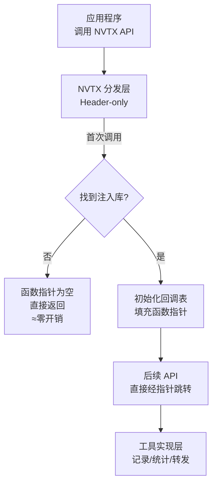

## 1. 与 Runtime 交互

参考代码位置：
- C/C++ 头文件：`c/include/nvtx3`
- 示例注入：`tools/sample-injection`



```
应用程序调用 nvtxRangePushA("foo")
        ↓
NVTX 运行时检查是否有注入库
        ↓
首次调用时加载注入库，调用 InitializeInjectionNvtx2()
        ↓
注入库填充回调表
        ↓
后续调用直接路由到注入库的 impl::RangePushA()
```
