## 1. 项目概述

本项目是一个基于深度学习的视频质量过滤系统，采用**生产者-消费者模式**实现高效的视频处理流水线。系统支持多种视频质量检测任务，包括 VFX 特效检测、静态帧检测、旋转异常检测、低质量评估以及异常区域检测。

### 1.1 核心特性

- **多进程并行**：使用 `torchrun` 支持多 GPU 分布式推理
- **流水线架构**：I/O 与计算解耦，最大化 GPU 利用率
- **模型实例池**：独占式模型分配，确保线程安全
- **多数据源支持**：CPFS、Alluxio、OSS 三级数据读取策略

---

## 2. 系统架构

### 2.1 整体架构图

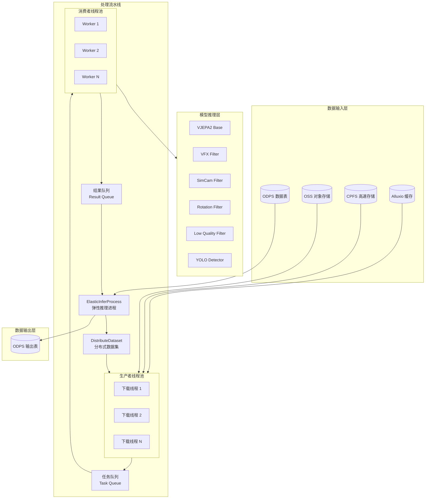

### 2.2 进程与线程模型

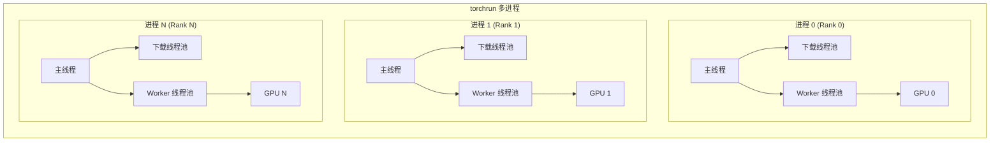

---

## 3. 数据处理流程

### 3.1 完整处理流程

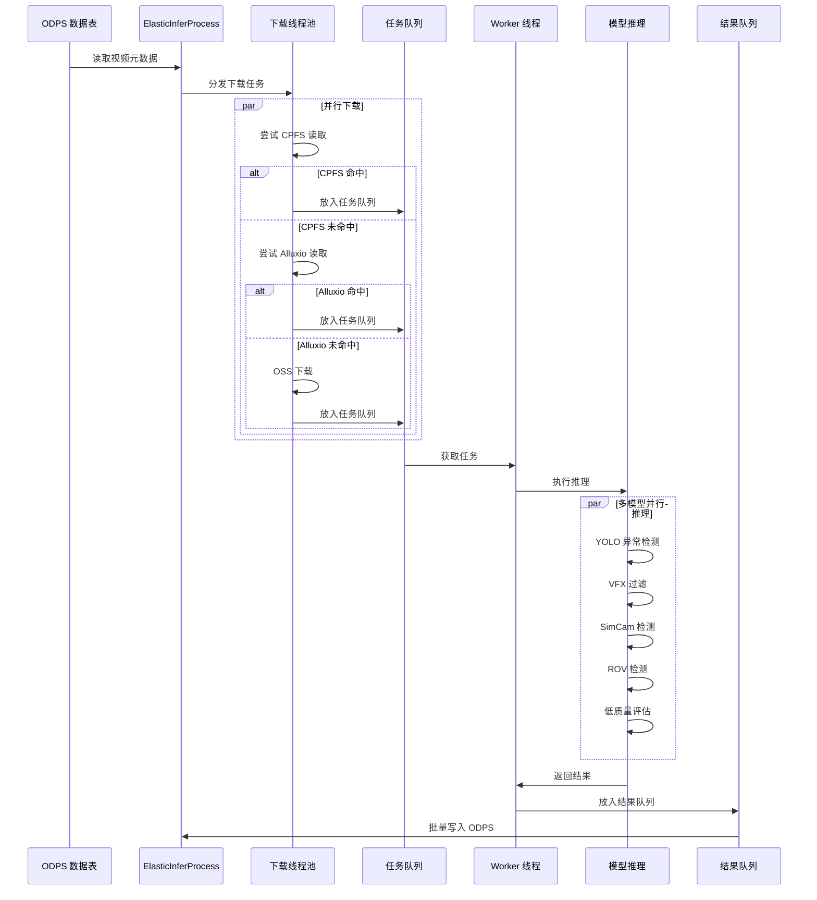

### 3.2 单视频处理流程

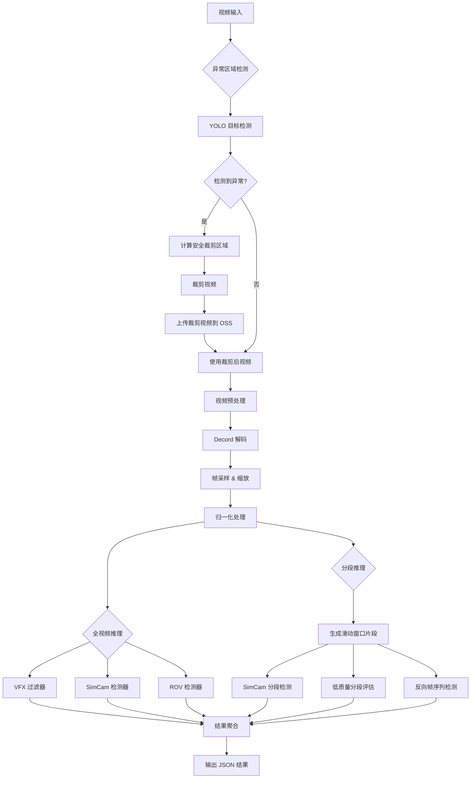

---

## 4. 模型架构

### 4.1 模型层次结构

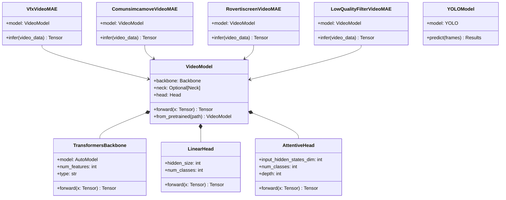

### 4.2 模型配置

| 模型名称 | Backbone | Head | 输入尺寸 | 帧数 | 任务类型 |
|---------|----------|------|---------|------|---------|
| VFX Filter | VJEPA2-base | LinearHead | 256×256 | 48 | 二分类 |
| SimCam Filter | VJEPA2-base | LinearHead | 256×256 | 48 | 二分类 |
| ROV Filter | VJEPA2-rov-base | LinearHead | 256×256 | 48 | 二分类 |
| Low Quality | VJEPA2-base | AttentiveHead | 256×256 | 48 | 二分类 |
| YOLO Detector | YOLOv8 | - | 960×960 | 1 | 目标检测 |

---

## 5. CPU & GPU 交互

### 5.1 数据流转图

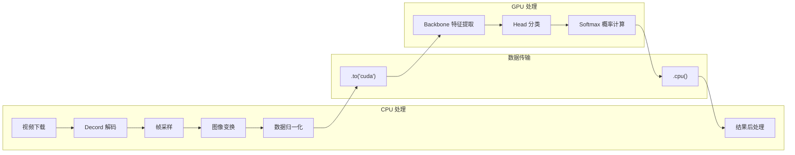

### 5.2 显存管理策略

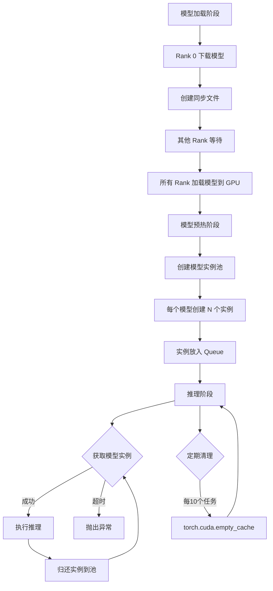

### 5.3 模型实例池机制

```python
# 独占式模型获取（上下文管理器）
@contextmanager
def acquire_model_instance(model_name, timeout=300):
    """
    以独占方式获取模型实例
    
    使用方法:
        with acquire_model_instance('VfxFilterInfer') as model:
            output = model.infer(video_data)
    """
    pool = _model_instance_pools[model_name]
    model = pool.get(timeout=timeout)  # 阻塞等待
    try:
        yield model
    finally:
        pool.put(model)  # 归还实例
```

---

## 6. 关键模块说明

### 6.1 模块依赖关系

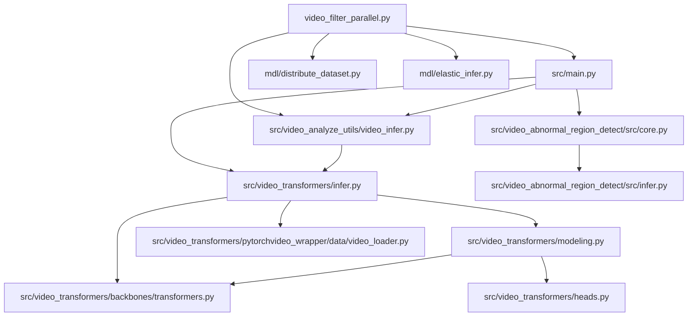

### 6.2 核心模块功能

| 模块 | 功能描述 |
|------|---------|
| `video_filter_parallel.py` | 入口文件，实现生产者-消费者流水线 |
| `src/main.py` | 单视频处理核心逻辑 |
| `src/video_analyze_utils/video_infer.py` | 模型实例池管理，推理任务封装 |
| `src/video_transformers/infer.py` | VideoMAE 模型封装，数据加载器 |
| `src/video_transformers/modeling.py` | VideoModel 模型定义 |
| `src/video_transformers/backbones/transformers.py` | VJEPA2 Backbone 实现 |
| `src/video_abnormal_region_detect/src/core.py` | 异常区域检测与裁剪 |
| `src/video_abnormal_region_detect/src/infer.py` | YOLO 模型推理 |

---

## 7. 配置参数

### 7.1 全局配置

```python
# 并发控制
MAX_CONCURRENT_DOWNLOADS = 6  # 最大下载并发数
MAX_CONCURRENT_WORKERS = 6    # 最大 Worker 数
MODEL_INSTANCES_NUM = 6       # 每种模型的实例数
MAX_QUEUE_SIZE = 16           # 任务队列最大深度

# 磁盘限制
DISK_LIMIT_BYTES = 180 * 1024**3  # 180 GB

# 模型下载
MOS_MAX_WORKERS = 16  # MOS 下载并发数
```

### 7.2 命令行参数

| 参数 | 默认值 | 说明 |
|------|-------|------|
| `--tables` | "" | ODPS 输入表名 |
| `--outputs` | "" | ODPS 输出表名 |
| `--vfx_enable` | "true" | 启用 VFX 过滤器 |
| `--com_enable` | "true" | 启用运镜检测器 |
| `--rov_enable` | "true" | 启用旋转检测器 |
| `--low_quality_enable` | "true" | 启用低质量评估器 |

---

## 8. 数据流格式

### 8.1 输入数据格式

```json
{
  "video_id": "string",
  "oss_bucket": "string",
  "video_path": "string",
  "video_tag": "string",
  "info": "{\"use_alluxio\": true, ...}"
}
```

### 8.2 输出数据格式

```json
{
  "video_id": "string",
  "oss_bucket": "string",
  "video_oss_url": "string",
  "video_tag": "string",
  "info": {
    "abnormal_region_info": {...},
    "abnormal_region_crop": {...},
    "vfx_filter": {
      "result": {"VFX_video": 0.1, "normal_video": 0.9},
      "label": "normal_video",
      "prob": 0.9
    },
    "simcam_filter": {...},
    "rotate_vertical_filter": {...},
    "seg_simcam_filter": {
      "0": {"duration": [0, 4], "simcam_filter": {...}},
      "1": {"duration": [3, 7], "simcam_filter": {...}}
    },
    "inverse_seg_simcam_filter": {...}
  },
  "result_info": {
    "succeed": "true",
    "start_time": "2025-01-15T10:00:00",
    "end_time": "2025-01-15T10:00:05",
    "avg_cost": 5.0,
    "device_name": "NVIDIA A100",
    "device_info": {...}
  }
}
```

---

## 9. 性能优化策略

### 9.1 I/O 优化

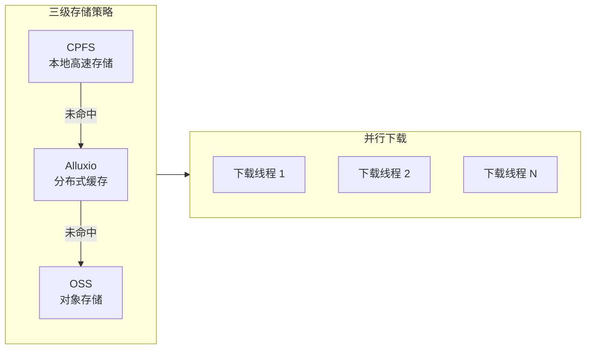

### 9.2 计算优化

1. **模型实例池**：预创建多个模型实例，避免推理时的模型加载开销
2. **FP16 推理**：使用半精度浮点数减少显存占用和计算时间
3. **批量处理**：多帧批量送入 YOLO 进行检测
4. **异步任务**：使用 `async_thread_tasks_with_name` 并行执行多个推理任务

### 9.3 内存优化

1. **定期显存清理**：每 10 个任务执行 `torch.cuda.empty_cache()`
2. **及时删除中间变量**：推理完成后立即 `del` 不需要的张量
3. **流式视频处理**：使用 Decord 流式解码，避免一次性加载整个视频

---

## 10. 错误处理

### 10.1 错误处理流程

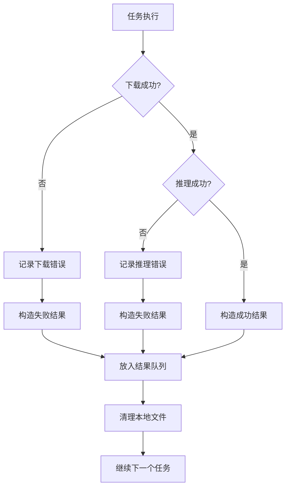

### 10.2 重试机制

- 模型推理任务继承 `RetryTask`，支持自动重试
- 模型实例获取支持超时机制（默认 300 秒）
- 任务队列操作支持超时（默认 1200 秒）

---

## 11. 部署架构

### 11.1 分布式部署

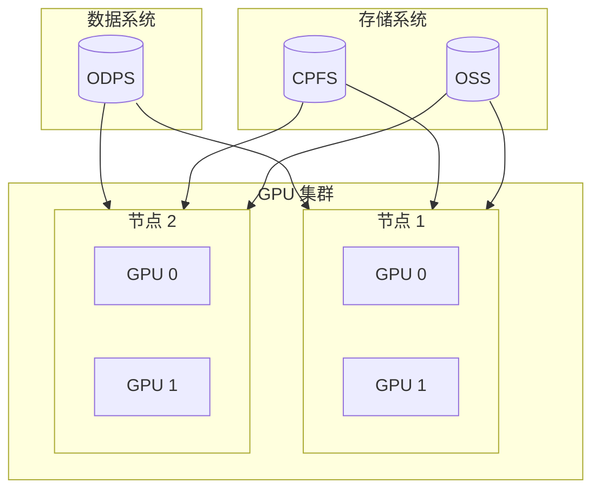

### 11.2 启动命令

```bash
# 单机多卡
torchrun --nproc_per_node=8 video_filter_parallel.py \
    --tables "odps://project/table/ds=20250115" \
    --outputs "odps://project/output_table/ds=20250115" \
    --vfx_enable true \
    --com_enable true \
    --rov_enable true \
    --low_quality_enable true
```

---

## 12. 总结

本项目实现了一个高效的视频质量过滤系统，主要特点包括：

1. **生产者-消费者架构**：解耦 I/O 和计算，最大化资源利用率
2. **多模型并行推理**：支持 VFX、SimCam、ROV、低质量等多种检测任务
3. **模型实例池**：独占式分配确保线程安全，预热机制减少冷启动开销
4. **三级存储策略**：CPFS → Alluxio → OSS，优化数据读取性能
5. **分布式支持**：基于 torchrun 的多进程多 GPU 推理
