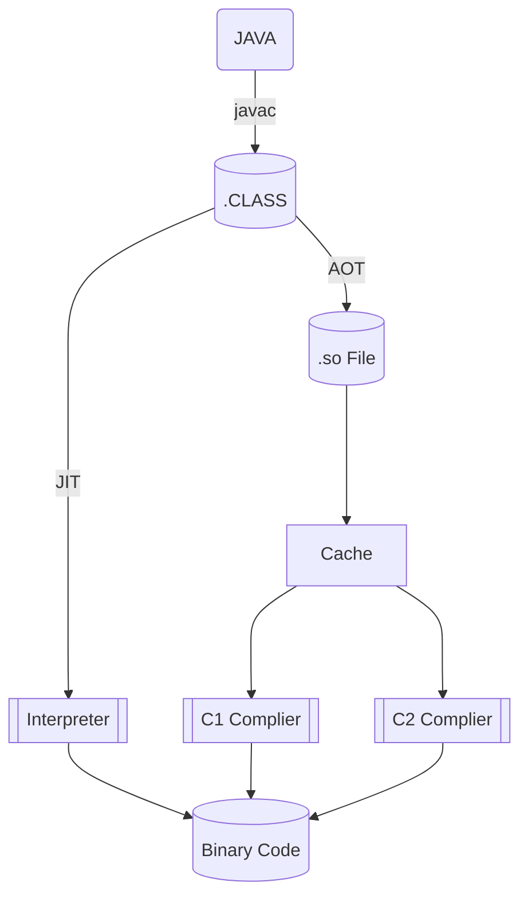
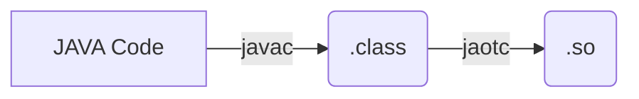
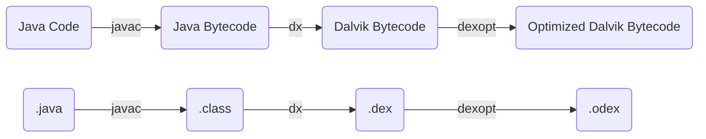
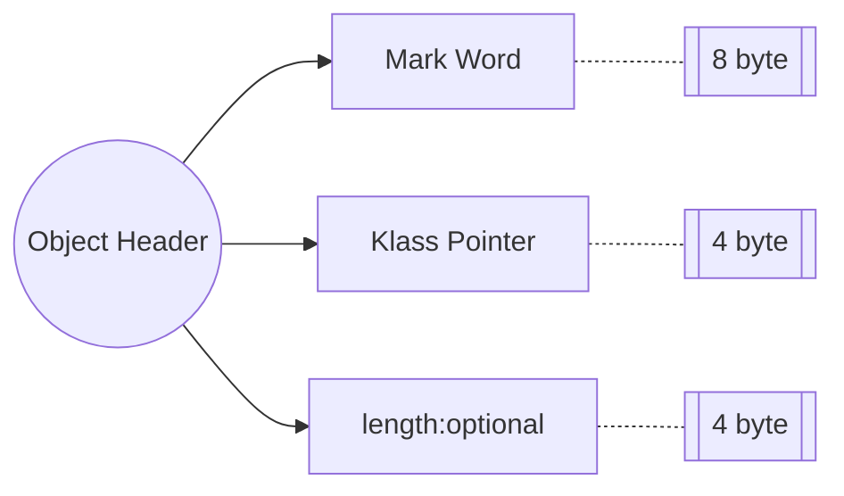

本文主要结合软硬件去研究 JVM 中的 JIT 和 AOT 技术，主要针对 ART 虚拟机，提炼出 JAVA 虚拟机相关的基础知识和软硬件结合点。

<!-- more -->

## Art 概述

常见的几个 JAVA 虚拟机：

- HotSpot: 比较流行、广泛
- Dalvik VM: 运行在安卓上，没有完全遵守 JAVA 虚拟机规范
- Art VM: 安卓 5.0 以后把 Dalvik 虚拟机替换成了 Art

思考为什么 Dalvik VM 没有遵守 JAVA 虚拟机规范呢？这是因为 JAVA 程序有跨平台的需求，但是安卓的平台是较为固定的，设备目标明确。对比于 HotSpot, 主要是有两点区别：

1. 不直接运行 class 文件，执行的是编译后的 dex 字节码文件
2. 结构基于寄存器指令结构，而不是 JVM 的栈指令集结构

## AOT & JIT

AOT 是提前编译技术，JIT 是即时编译技术。

下图可以简单说明 AOT 和 JIT 的执行过程：




:::warning ❌❌❌

注意，这是一个很新手入门的图，不是完全准确，后续随着理解的深入，需要将这个图替换掉

:::

从上面的图中，可以学到以下几点：

1. AOT 预编译成 SO 以后还需要再经过以下编译器，最终生成机器码；这个过程确认一下是否这样的
2. JIT 从字节码中寻找热点代码编译为机器码，放入代码缓存，下次执行的时候直接跳过解释器，执行机器码
   1. 这里面分为 C1 和 C2 编译器，注意 C1 和 C2 都是再后台运行的，只是运行的时间不同

3. AOT 操作将部分字节码提前编译未机器代码库，然后启动程序，减少字节码解释

### AOT

AOT 存在着一些挑战：

1. 动态类加载；这是一个 AOT 面临的较为严重的问题，编译器无法预测程序执行的时候需要加载哪些类，如果预测错误的话，就产生了错误的编译；这些需要预知的信息包括静态字段的地址，对象实例字段的偏移量或者任何调用的实际目标
2. AOT 会牺牲平台无关性和代码质量

## 解释器与编译器

主流的商用 JAVA 虚拟机都采取了解释器与编译器并存的运行架构，但是要注意并不是所有的 JAVA 虚拟机都是这样的。
对于解释器而言，其优势在于：当程序需要快速启动和执行的时候，解释器可以先发挥作用，此时解释器直接解释执行 JAVA 字节码；这种方法的好处是可以省去编译的时间，立即运行。
对于编译器而言，在程序启动后，可以把越来越多的代码编译成本地代码，减少解释器的中间消耗，获得更高的执行效率。

如何判断 JVM 是用的解释器模式、编译器模式或者混合模式呢？我们可以求助于 `java -version` 来帮助解答这个问题。下面是运行该命令后的输出：

<!--  -->

再提一下，sharing 表示 class data sharing. Server 编译器也叫 C2 编译器，与之对应的 Clinet 叫做 C1 编译器。

## AOT 过程

### JAVA 代码到 so

我们思考一个问题，给定一段 JAVA 代码，如何将 JAVA 代码转化为二进制呢？[^1]（我们在分析 AOT 性能的时候会将二进制反汇编，分析这个反汇编文件中的指令）。

其路径如下：



例如我们有一个 class 名为 `**JaotCompilation`, 其经过的转化过程如下：

首先使用 JAVA 编译器得到 `.class` 文件：

```bash
javac JaotCompilation.java
```

然后 pass 生成的 `JaotCompilation.class` 文件到 AOT 编译器中，可以使用的命令如下：

```bash
jaotc --output jaotCompilation.so JaotCompilation.class
```

然后就会在当下目录下生成 `jaotCompilation.so` 这个 .so 文件。

### 使用 AOT 产物

我们在上一步将 JAVA 代码转化成了 .so 文件，那么在实际中，是如何使用的呢？

在 JVM 中有个选项，`-XX:AOTLibrary`, 传入 so 库的路径（绝对路径或者相对路径都可以）；如果要更省事的话，可以将 library 拷贝到 java home 的 lib 文件夹下面，此时只需要传递名字即可。

```bash
java -XX:AOTLibrary=./jaotCompilation.so JaotCompilation
```

执行这个命令之后，可以验证一下 so 是不是被正常加载了，可以增加 `-XX:+PrintAOT` 进行观察：

```bash
java -XX:+PrintAOT -XX:AOTLibrary=./jaotCompilation.so JaotCompilation
```

如果顺利的话，应该是可以看到已经加载的库；注意这是加载而不是被使用，可以指定 `-verbose` 选项看是否被实际调用了。

> The AOT compiled library contains a **class fingerprint**, which must match the fingerprint of the **.class** file.

上述文字的意思是说如果我们修改了 `JaotCompilation.java` 的代码的时候，如果没有使用 AOT 编译被修改的 .class 文件，会发生错误；因此在每一次修改代码的时候，我们都要对 AOT 进行重新编译。

## AOT 编译选项

我们可以给 AOT 的编译指定一些选项，将需要的选项写在文件中，然后使能。

`complileCommands.txt`:

```bash
compileOnly java.lang.*
```

指定只需要编译的 scope, 然后把这个选项用进去：

```bash
jaotc --output javaBaseLang.so --module java.base --compile-commands compileCommands.txt
```

### warm-up which class

我们可以用看一下哪些类实际上在 JVM 预热期间被调用了，命令如下：

```bash
java -XX:+UnlockDiagnosticVMOptions -XX:+LogTouchedMethods -XX:+PrintTouchedMethodsAtExit JaotCompilation
```

### single class

可以只编译一个类，指定类名即可：

```bash
jaotc --output javaBaseString.so --class-name java.lang.String
```

### 分层编译

默认情况下，始终使用 AOT 的代码，也就是说 so 库中包含的类不会进行 JIT 编译，如果我们想在库中包含 profiling 信息，则可以增加 `compile-for-tiered` 来实现我们的目的：

```bash
jaotc --output jaotCompilation.so --compile-for-tiered JaotCompilation.class
```

上述预编译的代码会被一直使用，直到字节码变成符合 JIT 编译的时候。


## class 文件格式

### Abstract

本章主要是对 java 中的 class 文件进行研究，通过对书籍 《深入理解 Android: JAVA 虚拟机ART》的研究和简单的例子，研究 `.class` 文件中的奥秘。

在开始研究之前，我们使用一个简单的 JAVA 程序，如下所示：

```java
import java.io.Serializable;
public class Foo implements Serializable {
    public void bar() {
        int i = 31;
        if (i > 0) {
            int j = 42;
        }
    }
}
```

如上文我们研究的，可以分别使用 `javac` 和 `jaotc` 生成 `.class` 和 `.so` 文件，此处不再赘述。

对于生成的 class 文件，可以使用 `javap` 命令来进行解析(注意传入的 Class 名称，提前生成好 Class 文件)，如下所示：

```bash
javap -verbose Foo
```

上述命令可以对我们的 `Sample.class` 文件进行解析，解析的输出如下所示(基于 Java 19 分析出的结果，可能和其他版本略有不同)：

```bash
Classfile /mnt/c/Users/Administrator/Documents/_code/wsl2/jvm_demo/class/Foo.class
  Last modified Oct 19, 2022; size 303 bytes
  SHA-256 checksum 5a29b77322e4ee4fc0b22ee7030de4231135616732d86e3e7a8dfc3d8246b879
  Compiled from "Foo.java"
public class Foo implements java.io.Serializable
  minor version: 0
  major version: 63
  flags: (0x0021) ACC_PUBLIC, ACC_SUPER
  this_class: #7                          // Foo
  super_class: #2                         // java/lang/Object
  interfaces: 1, fields: 0, methods: 2, attributes: 1
Constant pool:
   #1 = Methodref          #2.#3          // java/lang/Object."<init>":()V
   #2 = Class              #4             // java/lang/Object
   #3 = NameAndType        #5:#6          // "<init>":()V
   #4 = Utf8               java/lang/Object
   #5 = Utf8               <init>
   #6 = Utf8               ()V
   #7 = Class              #8             // Foo
   #8 = Utf8               Foo
   #9 = Class              #10            // java/io/Serializable
  #10 = Utf8               java/io/Serializable
  #11 = Utf8               Code
  #12 = Utf8               LineNumberTable
  #13 = Utf8               bar
  #14 = Utf8               StackMapTable
  #15 = Utf8               SourceFile
  #16 = Utf8               Foo.java
{
  public Foo();
    descriptor: ()V
    flags: (0x0001) ACC_PUBLIC
    Code:
      stack=1, locals=1, args_size=1
         0: aload_0
         1: invokespecial #1                  // Method java/lang/Object."<init>":()V
         4: return
      LineNumberTable:
        line 2: 0

  public void bar();
    descriptor: ()V
    flags: (0x0001) ACC_PUBLIC
    Code:
      stack=1, locals=3, args_size=1
         0: bipush        31
         2: istore_1
         3: iload_1
         4: ifle          10
         7: bipush        42
         9: istore_2
        10: return
      LineNumberTable:
        line 4: 0
        line 5: 3
        line 6: 7
        line 8: 10
      StackMapTable: number_of_entries = 1
        frame_type = 252 /* append */
          offset_delta = 10
          locals = [ int ]
}
SourceFile: "Foo.java"
```

上面的解析结果可以分为几个部分：

1. 类声明

2. 源文件名

3. Class 文件结构信息

4. 常量池

5. 方法元数据（30行）

   1. 注意到有些方法元数据中会出现 StackMapTable；分支控制流的方法会带有 StackMapTable，记录每个基本块开头处操作数栈的类型状态

6. 字节码（46行，Code 开始的部分 2 行严格来说属于方法元数据）

   

上图中的结果需要注意的几点在于：

1. Constant Pool: 常量池；
2. xx

#### class 文件就是字节码么？

不是。除了字节码以外，class 文件还记录了很多信息（上文已经提及了 class 文件的具体构成）：

- 结构信息
  - Class 文件格式版本号
  - 各部分的数量与大小
- 元数据
  - 类、继承的超类、实现的接口声明信息
  - 常量池
  - ...
- 方法信息
  - 字节码
  - 异常处理器表
  - ...

字节码只代表程序逻辑，只是 class 文件众多组成部分其中之一。

### Constant Pool

常量池对应的数据结构伪代码就是一个类型为 `cp_info` 的数组，如下所示：

```c
cp_info { // u1表示该域对应一个字节长度，u 表示 unsigned
    u1 tag; // 每一个 cp_info 的第一个字节表明该常量项的类型
    u1 info[]; // 常量项的具体内容
}
```

`tag` 字段用于表示该常量的类型，`info` 数组是常量的具体内容。

### JVM 基本结构

了解 class 文件是怎么解析的，需要首先了解一下 JVM 的基本结构：

<!--  -->

:::tip JAVA 虚拟机

在这需要说明以下，什么才算做 java 虚拟机？通过 JCK 测试的，实现 JVM 规范的就可以。

:::

我们说的一般的 JVM 都是基于栈结构的，所以自然会有一个方法调用栈，每个 Java 线程都拥有一个 Java 方法调用栈，该栈与其他线程不共享；每次方法被调用的时候都会在调用栈上面分配一个栈帧，方法的一次调用结束（包括抛出异常）后对应的栈帧都会被自动撤销。

每一个 Java 栈帧都包括：

- 局部变量区
- 操作数栈
- 指向方法已解析的常量池的引用
- 其他一些 VM 内部实现需要的数据

这个栈帧的设计比较巧妙，比如说前后两个栈帧之间可以共享一部分数据用来传递参数（局部变量区栈帧 slot 的复用，这又是一个很大的话题了）


## Dex 文件格式

### Abstract

DEX 文件格式一般是 Android 平台上和传统的 class 文件对应的 java 字节码文件，其针对移动设备做了一些定制化处理。

在我们开始之前，首先研究一下 Dex 文件是如何生成的，可以用下图来加以概述：



在 Dalvik 或者 ART 中，class 文件是不能被直接解释执行的，需要经过 dx 将 class 文件进行翻译、重构、解释、压缩等处理，生成 .dex 文件。

### Dex vs class

dex 文件和 class 文件存在很多区别，简单列举如下：

1. 一个 class 文件对应一个 Java 源码文件，而一个 Dex 文件可以对应多个 Java 源码文件；在 PC 平台上，每一个 Java 文件都对应生成一个同名的 class 文件，这些文件统一打包成 Jar 包；而在安卓平台上，这些 Java 源码会最终编译、合并到一个名为 classes.dex 的文件中去。
2. PC 平台上 class 文件的字节序是 Big Endian, 而安卓平台的 Dex 文件的字节序是 Little Endian, 其原因是 ARM CPU 可能也采用的是 Little Endian.
3. Dex 文件新定义了 **LEB128** 的数据类型，其全称为 Little Endian Based 128, 用于表示 32 比特位长度的数据。

### Dex 文件格式

我们想要得到 dex 文件的话，只需要把一个任意的 APK 文件解压缩，就可以得到若干个 dex 文件。

使用 010 editor 可以对这个 dex 文件进行解析，就可以观察文件的结构信息。

| Name                                       | Value            | Start   | Size   | Comment                  |
| ------------------------------------------ | ---------------- | ------- | ------ | ------------------------ |
| struct  header_item dex_header             | 0h               | 0h      | 70h    | Dex file header          |
| struct string_id_list dex_string_ids       | 66454 strings    | 70h     | 40E58h | String ID list           |
| struct type_id_list dex_type_ids           | 9994 types       | 40EC8h  | 9C28h  | Type ID list             |
| struct proto_id_list dex_proto_ids         | 14661 prototypes | 4AAF0h  | 2AF3Ch | Method prototype ID list |
| struct field_id_list dex_field_ids         | 50403 fields     | 75A2Ch  | 62718h | Field ID list            |
| struct method_id_list dex_method_ids       | 65503 methods    | D8144h  | 7FEF8h | Method ID list           |
| struct class_def_item_list  dex_class_defs | 7957 classes     | 15803Ch | 3E2A0h | Class definitions list   |
| struct map_list_type dex_map_list          | 18 items         | 8ADDB0h | DCh    | Map list                 |


## JAVA 内存布局

我们需要研究一下 JAVA 的内存布局情况。主要带着问题：🟥🟧🟨 JAVA 数组中是如何存储到数组的长度属性的？压缩又是怎么使能的？

### length()

对于压缩使能这个问题，在此需要解释一下，我们在看汇编的时候有一段这样的代码：

```
// length() dex_method_idx=3308
0x001bad20: b9400820	ldr w0, [x1, #8]
0x001bad24: 53017c00	lsr w0, w0, #1
0x001bad28: d65f03c0	ret
```

对应的源代码如下：

```java
public int length() {
    final boolean STRING_COMPRESSION_ENABLED = true;
    if (STRING_COMPRESSION_ENABLED) {
        return (count >>> 1);
    } else {
        return count;
    }
}
```

这是一段计算字符串 `length` 的函数，我们可以看到，如果是使能了 `STRING_COMPRESSION_ENABLED` 的话，其 length 需要 `count` 无符号右移一位才行；查阅资料后表明这是因为最后一位是压缩的标志位。但是具体为什么要这么做，这么做的好处在哪，需要更加深入的研究。

### JAVA 对象内存构成

JAVA 中通过 `new()` 可以创建一个新的对象，对象分配后存在于堆中并给其分配一个内存地址，在堆中的 JAVA 对象主要包含三个部分[^2]（以表格形式给出）

| 内存区域 | 英文名称      | 说明                                                      |
| -------- | ------------- | --------------------------------------------------------- |
| 对象头   | Object Header | 包括堆对象的布局、类型、GC 状态、同步状态和标识 hash code |
| 实例数据 | Instance Data | 存放类的数据信息，父类的信息，对象字段属性信息            |
| 对齐填充 | Padding       | 为了字节对齐，不是必须的                                  |

下面我们的研究将分别通过对象头、实例数据、对齐填充展开。

下图可以比较清晰的说明 Java 的内存构成：

<!--  -->

JAVA 的内存对象布局分为两种：第一种是普通的 JAVA 对象实例，第二种是 JAVA 数组实例，数组实例中会存储 length 元素。

对于这几个内存区域具体的大小，我们以 32 HotSpot 中的 `java.lang.Integer` 存储为例，其在内存中的布局大小如下图所示：

<!--  -->

对象头固定大小为 8 个字节，接下来就会存储对象中的实际数据，后面的 padding 视情况而定。

### 对象头(Object Header)

在 hotspot 术语表[^3]中可以找到 object header 的相关定义：

> Common structure at the beginning of every GC-managed heap object. (Every oop points to an object header.) Includes fundamental information about the heap object's layout, type, GC state, synchronization state, and identity hash code. Consists of **two words**. In arrays it is immediately followed by a **length field**. Note that both Java objects and VM-internal objects have a common object header format.

上述文字先是描述了对象头结构中都包含了哪些信息，而后描述了其中包含了两个字；除此之外，如果是个 array 类型，还会跟随一个 `length` 字段。（*此时我们的问题已经解决了：JAVA 数组在 object header 中存储数组的长度信息*）

对于对象头中包含的两个字：**Mark word** 和 **Klass pointer**, 我们将分别研究。




#### Mark Word

> The first word of every object header. Usually a set of bitfields including synchronization state and identity hash code. May also be a pointer (with characteristic low bit encoding) to synchronization related information. During GC, may contain GC state bits.

用于存储对象自身的运行时数据，在 32 位 JVM 中长度是 32bit, 64 位 JVM 中长度是 64bit, 对应路径 `/openjdk/hotspot/src/share/vm/oops`, 对应代码 `markOop.hpp`, 其构成可以从注释中获得（google 搜索文件名即可搜到）：

```cpp
// Bit-format of an object header (most significant first, big endian layout below):
//
//  32 bits:
//  --------
//             hash:25 ------------>| age:4    biased_lock:1 lock:2 (normal object)
//             JavaThread*:23 epoch:2 age:4    biased_lock:1 lock:2 (biased object)
//             size:32 ------------------------------------------>| (CMS free block)
//             PromotedObject*:29 ---------->| promo_bits:3 ----->| (CMS promoted object)
//
//  64 bits:
//  --------
//  unused:25 hash:31 -->| unused:1   age:4    biased_lock:1 lock:2 (normal object)
//  JavaThread*:54 epoch:2 unused:1   age:4    biased_lock:1 lock:2 (biased object)
//  PromotedObject*:61 --------------------->| promo_bits:3 ----->| (CMS promoted object)
//  size:64 ----------------------------------------------------->| (CMS free block)
//
//  unused:25 hash:31 -->| cms_free:1 age:4    biased_lock:1 lock:2 (COOPs && normal object)
//  JavaThread*:54 epoch:2 cms_free:1 age:4    biased_lock:1 lock:2 (COOPs && biased object)
//  narrowOop:32 unused:24 cms_free:1 unused:4 promo_bits:3 ----->| (COOPs && CMS promoted object)
//  unused:21 size:35 -->| cms_free:1 unused:7 ------------------>| (COOPs && CMS free block)
```

上述描述较为清晰，在此需要解释一下几个类型（为什么会有不同的状态，这是因为 Mark Word 在不同的锁状态下存储的内容不同）：

1. biased object, 类比于 biased_lock 意思是偏向锁
2. CMS free object, 类比于轻量级锁
3. CMS promoted object, 类比于重量级锁

@todo 表格 or 图片

- **lock**: 表示锁标志位；11 的时候为 GC 状态，只有后 2 位的 lock 标志位有效
- **age**: 分代年龄：表示对象被 GC 的次数，到达阈值以后，对象被转移到老年代；最大值是 15, 因为该标志位最大位数是 4 位

#### Klass Pointer

> The second word of every object header. Points to another object (a metaobject) which describes the layout and behavior of the original object. For Java objects, the "klass" contains a C++ style "vtable".

类型指针，对象指向它的类元数据的指针，虚拟机通过这个指针来确定这个对象是哪个类的实例。

也叫类元数据指针，

### 实例数据(Instance Data)

如果对象中有属性字段，则这里会有数据信息。

### 对齐填充(Padding)

对象可以有对齐数据也可以没有。

:::tip 😋😋😋 关于对齐填充与 cache line 的关系

对齐填充的目的是为了将对象的大小对齐到 8N 个字节，以此来补齐对象头和实例数据占用内存之后的剩余空间的大小；

这么做的好处在于，确保对象的字段可以出现在同一个 cache line 之中；如果不进行对齐的话，可能会出现跨 cache line 存储的情况出现；导致此对象读取的时候需要读两个 cache line, 或者更新的时候污染两个 cache line.

:::

### 实战 demo

#### 基本构成研究

本章节通过一个实战的 demo 来展示 JAVA 对象在内存中的布局情况。

首先增加 `openjdk.jol.core` 包到项目中；

我们编写一个简单的类 `A.class` 来观察一下这个类的内存分布：

```java
public class A {
}
```

然后在 main 函数中如下写：

```java
import java_object.A;
import org.openjdk.jol.info.ClassLayout;

public class Main {
    public static void main(String[] args) {
        A a = new A();
        System.out.println(ClassLayout.parseInstance(a).toPrintable());
    }
}
```

此时就可以在控制台看到 A class 内存布局的打印，如下所示：

```
java_object.A object internals:
OFF  SZ   TYPE DESCRIPTION               VALUE
  0   8        (object header: mark)     0x0000000000000001 (non-biasable; age: 0)
  8   4        (object header: class)    0xf800c041
 12   4        (object alignment gap)    
Instance size: 16 bytes
Space losses: 0 bytes internal + 4 bytes external = 4 bytes total
```

- OFF: 偏移地址，单位字节
- SZ: SIZE, 大小
- TYPE DESCRIPTION: 类型描述；我们可以看到，这个类的内存布局只有一个 object header
- VALUE: 内存中当前存储的值

OK，了解了基本构成以后，我们现在可以做一些更加深入的研究。

#### 数组的内存布局

为了更加清晰直观的说明本章开头提出的那个问题，我们在类中构造一个数组，以此来观察有数组元素的类的内存布局是什么样子的。

```java
// A.class
public class A {
    char[] arrayA = {'a', 'c', 'e'};
}
```

然后打印出来的内存布局如下所示(main 函数未做修改)：

```
java_object.A object internals:
OFF  SZ     TYPE DESCRIPTION               VALUE
  0   8          (object header: mark)     0x0000000000000001 (non-biasable; age: 0)
  8   4          (object header: class)    0xf800c041
 12   4   char[] A.arrayA                  [a, c, e]
Instance size: 16 bytes
Space losses: 0 bytes internal + 0 bytes external = 0 bytes total
```

可以看到，数组 `arrayA` 被当做 class A 的内部元素保存起来了，并没有产生引用或者是 header, 我们直接使用一个对象数组，来看看有什么变化。修改 main 函数如下：

```java
import org.openjdk.jol.info.ClassLayout;

public class Main {
    public static void main(String[] args) {
//        A a = new A();
        char[] arrayB = {'b', 'e', 'd', 'f', 'g'};
        System.out.println(ClassLayout.parseInstance(arrayB).toPrintable());
    }
}
```

对应的输出如下：

```
[C object internals:
OFF  SZ   TYPE DESCRIPTION               VALUE
  0   8        (object header: mark)     0x0000000000000001 (non-biasable; age: 0)
  8   4        (object header: class)    0xf800003f
 12   4        (array length)            5
 12   4        (alignment/padding gap)   
 16  10  
 char [C.<elements>             N/A
 26   6        (object alignment gap)    
Instance size: 32 bytes
Space losses: 4 bytes internal + 6 bytes external = 10 bytes total
```

- 可以看到，新增了 array length 的类型描述字段，这个描述字段中的值为 array 的长度 5.
- array 的字段位于 Mark Word 和 Kclass Pointer 之后，占 4 位


[^1]: [https://www.baeldung.com/ahead-of-time-compilation](https://www.baeldung.com/ahead-of-time-compilation)
[^2]: [java 内存对象布局](https://www.cnblogs.com/jajian/p/13681781.html)
[^3]: [HotSpot Glossary of Terms](https://openjdk.org/groups/hotspot/docs/HotSpotGlossary.html)

