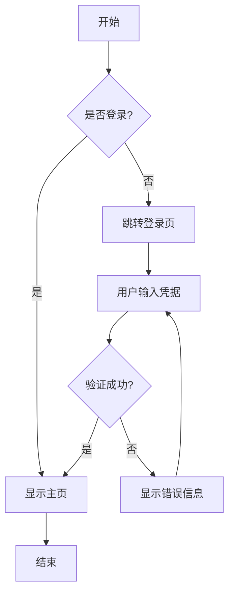
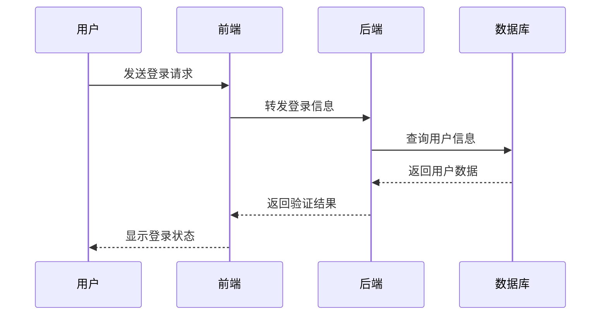
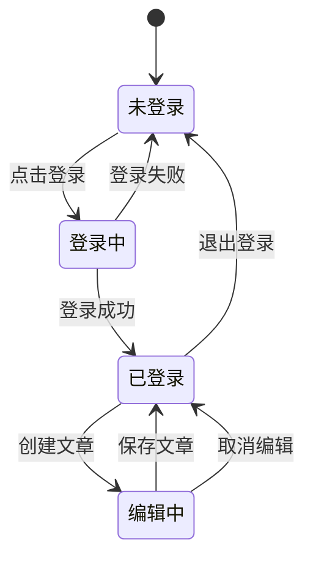
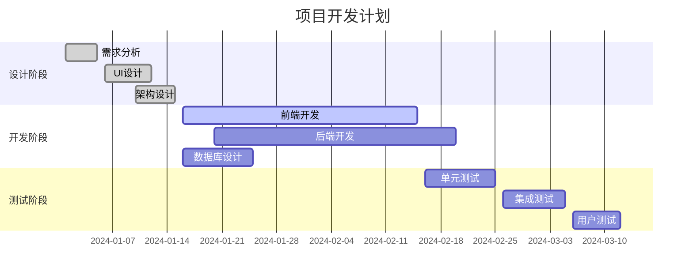
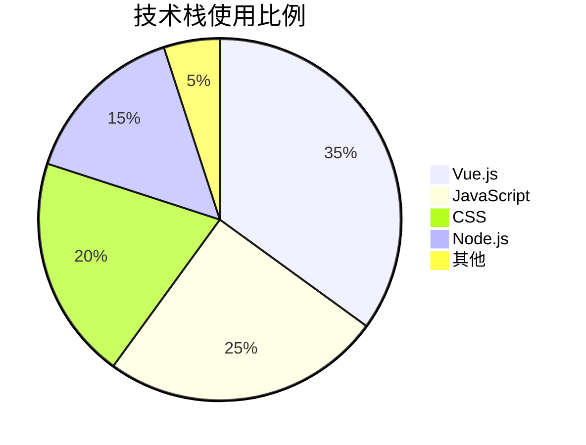

# Mermaid 图表测试

这是一个测试页面，用于验证 vitepress-plugin-mermaid 插件是否正常工作。

## 流程图示例



## 序列图示例



## 类图示例

```mermaid
classDiagram
    class User {
        +String username
        +String email
        +String password
        +login()
        +logout()
        +updateProfile()
    }
    
    class Article {
        +String title
        +String content
        +Date createdAt
        +User author
        +publish()
        +edit()
        +delete()
    }
    
    class Comment {
        +String content
        +Date createdAt
        +User author
        +Article article
        +reply()
        +delete()
    }
    
    User ||--o{ Article : writes
    User ||--o{ Comment : writes
    Article ||--o{ Comment : has
```

## 状态图示例



## 甘特图示例



## 饼图示例



如果以上图表都能正常显示，说明 mermaid 插件集成成功！