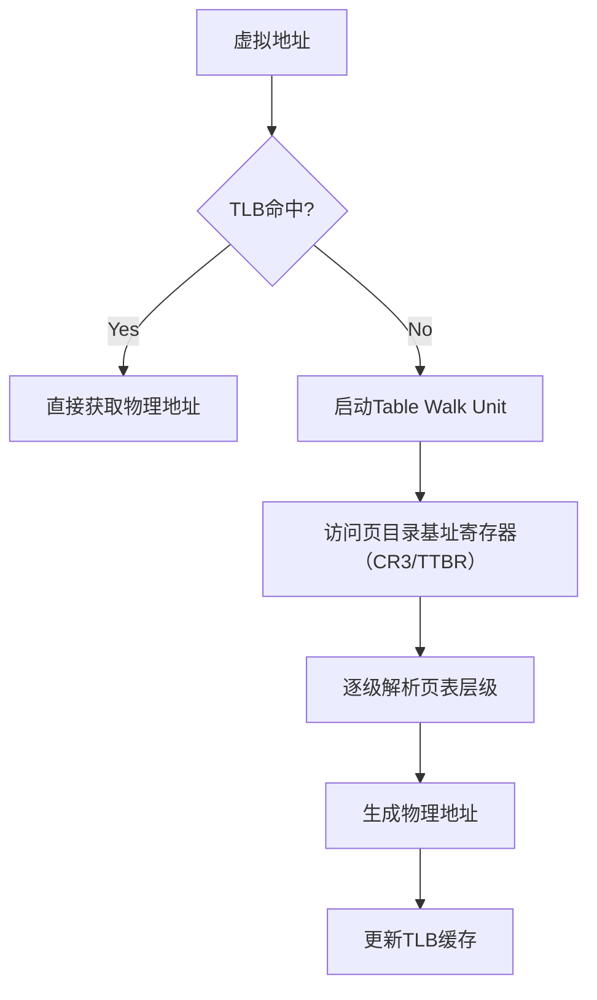

  
## 1. Table Walk Unit

MMU 中的 Table Walk Unit（页表遍历单元） 是硬件级的核心组件，专门处理虚拟地址到物理地址转换过程中 TLB  未命中时的页表查找，其设计目标是通过硬件加速减少页表访问延迟。以下是其技术细节的深度解析：

### 1.1. 核心功能

1. **页表遍历自动化**

当 TLB 未命中时，自动根据虚拟地址中的**虚拟页号（VPN）** 逐级解析页表层级：


支持多级页表架构（如 x86 的 4 级页表、ARMv8 的 2 级页表）

2. **硬件级异常处理**：实时检查页表项（PTE）的有效位（Valid） 和权限位，直接触发缺页中断（Page Fault）或访问冲突异常，无需软件干预

3. **页表缓存优化**：内置微型缓存（如 Intel 的 Page Walk Cache）存储最近访问的页目录/页表项；与 CPU 的L2/L3 Cache 协同预取相邻页表项（如 Intel 的 PAT 技术）

### 1.2. 结构设计与工作流程

#### 1.2.1. 硬件架构

```
Table Walk Unit
├── 页表基址寄存器（CR3/TTBR）接口
├── 多级页表解析引擎
│   ├── 页目录索引计算单元
│   ├── 页表项权限验证器
│   └── 物理页号拼接器
├── 微型页表缓存（Page Walk Cache）
├── 内存访问接口（支持非阻塞请求）
└── 异常信号生成器
```

#### 1.2.2. 工作流程示例（x86 架构）



1. **获取基址**：从 CR3 寄存器读取页目录基址
2. **解析页目录**：计算页目录索引：`(VPN[39:30] << 3)` → 访问页目录项（PDE）
3. **检查页目录项**：若 PDE 为大页（2MB/1GB），直接获取 PPN；否则，读取页表基址并解析页表（PTE）
4. **权限验证**：检查 PTE的R/W/U/S位
5. **生成物理地址**：`PPN << 12 | Offset`

### 1.3. 页表基址寄存器

**页表基址寄存器（Page Table Base Register）** 是 CPU 内存管理单元（MMU）中的核心组件，其作用是 **存储当前进程页目录的物理起始地址**，为虚拟地址到物理地址的转换提供入口点。以下是其功能的深度解析：

**地址转换起点**： 当 CPU 需要将虚拟地址转换为物理地址时（如 TLB 未命中时），必须从页表基址寄存器获取页目录的物理地址。

多级页表转化流程：


硬件架构对比如下：

| 架构     | 寄存器名称       | 地址宽度 | 页目录结构                                  |
| ------ | ----------- | ---- | -------------------------------------- |
| x86_64 | CR3         | 64 位 | 4 级页表（PML4 → PDPT → PDE → PTE）         |
| ARMv9  | TTBR0/TTBR1 | 48 位 | 2 级页表（Table0 → Table1 → Table2）        |
| RISC-V | satp        | 64 位 | 3 级页表（Root → Level1 → Level2 → Level3） |

### 1.4. 关键技术优化

1. **预取机制**

- 硬件预测下一级页表地址并提前加载到 Cache（如 ARM 的 Translation Table Walk Accelerator）
- 支持页表链预取（Page Table Chaining）减少内存访问次数

2. **大页支持**

- 直接跳过中间页表层级（如 x86 的 1GB 大页仅需访问页目录）
- 动态调整页表层级（如 Linux 内核的 HugeTLBFS）

3. **缓存一致性**

- 支持**硬件页表缓存刷新**（如 x86 的 INVLPG 指令）
- 与 CPU Cache 的 MESI 协议协同处理脏页回写

### 1.5. 典型架构实现对比

|   |   |   |
|---|---|---|
|特性|Intel x86（Ice Lake）|ARMv9（Cortex-X3）|
|页表层级|4 级（PD → PDPT → PDE → PTE）|2 级（TTBR → Table1 → Table2）|
|缓存容量|Page Walk Cache（4K 条目）|Translation Table Cache（1K 条目）|
|预取深度|支持 4 级预取|支持 2 级预取|
|异常响应延迟|~150-200 cycles|~100-150 cycles|

### 1.6. 性能影响与设计权衡

1. **延迟优化**

- 典型页表遍历时间：L2 Cache 命中时 10-15 cycles，DRAM 访问时 100 cycles
- 硬件实现比纯软件遍历快 10-100 倍（如 Linux 内核软件遍历需~1000 cycles）

2. **面积与功耗**

- 占用芯片面积：0.5-1.5%（高端 CPU）
- 动态功耗：占 MMU 总功耗的 30-40%（主要来自内存访问）

3. **设计权衡**

- **页表缓存容量**：需在面积与命中率间平衡（典型命中率 85-95%）
- **预取策略**：过度预取可能导致内存带宽浪费

### 1.7. 未来演进方向

1. **神经形态页表预测**

- 利用片上 AI 引擎预测页表访问模式（如 Google TPU 的自适应页表）
- 动态调整页表层级结构（如合并空闲页表项）

2. **存算一体集成**

- 在 HBM 内存控制器中嵌入 Table Walk Unit（如 CXL 3.0 规范）
- 直接在内存颗粒内完成地址转换与数据运算

3. **非易失性内存优化**

- 支持持久化页表（Persistent Page Tables）
- 硬件级 NVM 地址转换原子性保证

### 1.8. **总结**

Table Walk Unit 是现代 MMU 设计的关键性能瓶颈之一，其硬件实现显著提升了页表遍历效率。未来随着存算架构的发展，该单元可能深度整合到内存子系统中，同时结合 AI 技术实现更智能的地址转换优化。