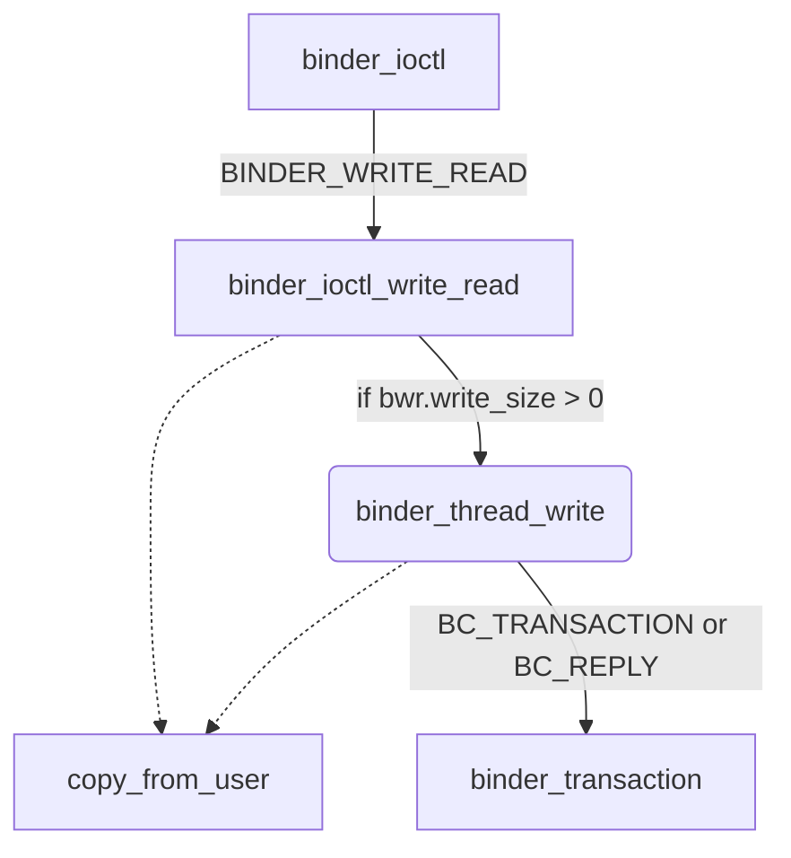

## Overview

kernel 侧实现：kernel/linux-5.10/drivers/android/binder.c

native 侧实现：system/libhwbinder

💯💯 本文主要是针对 binder 的理解进行的行为，代码列举和文字之间关联度不高，如果想了解原理但是不想对代码进行走读的，可以跳过代码解析的部分，以免陷入太多的细节。


## IPC 通信

binder 相比于传统的 IPC 通信拥有比较大的优势：其只需要进行一次拷贝。IPC 通信的原理大致如下：

## Binder 线程池

关于 binder 线程是如何管理，binder 线程池是如何创建的？在 Android 中，不管是 app 进程，还是 system_server 进程，都是在进程 fork 完成以后，在新进程中执行 `onZygoteInit()` 函数的过程中，启动创建 binder 线程池。

线程池创建好之后，就可以使用 binder 线程了，通常而言，binder 线程的命名格式为 `binder_x`, 通过 `spawnPooledThread` 方法创建[^1]。

binder 线程可以分为主线程和普通线程，还有一种其他的 binder 线程：

1. 主线程：进程创建过程中调用 `startThreadPool()` 再进入 `spawnPooledThread(true)`, 创建 binder 主线程，名称是 binder_PID_1, 这个主线程不会退出
2. 普通线程：Binder Driver 根据是否有空闲的 binder 线程来决定是否创建 binder 线程，回调 `spawnPooledThread(false)`, false 表示不是主线程
3. 其他线程：没有通过 `spawnPooledThread` 方法，而是直接调用 `IPC.joinThreadPool()`, 将当前线程加入 binder 线程队列（默认的参数 isMain 是 true）。

### startThreadPool()

> system/libhwbinder/ProcessState.cpp

```cpp
void ProcessState::startThreadPool()
{
    AutoMutex _l(mLock); // 多线程同步
    if (!mThreadPoolStarted) {
        mThreadPoolStarted = true;
        if (mSpawnThreadOnStart) {
            spawnPooledThread(true);
        }
    }
}
```

`mThreadPoolStarted` 保证每个进程只会启动一个 binder 线程池；然后我们调用 `spawnPooledThread(true)`;

#### spawnPooledThread() 

```cpp
void ProcessState::spawnPooledThread(bool isMain)
{
    if (mThreadPoolStarted) {
        String8 name = makeBinderThreadName();
        ALOGV("Spawning new pooled thread, name=%s\n", name.string());
        sp<Thread> t = new PoolThread(isMain);
        t->run(name.string());
    }
}
```

1. 给 binder 线程起名，名称是 `name.appendFormat("HwBinder:%d_%X", pid, s);`, 其中 `s` 表示一个原子的计数
2. 创建 `PoolThread` 并运行，我们下面研究这个函数。

#### PoolThread

```cpp
class PoolThread : public Thread
{
public:
    explicit PoolThread(bool isMain)
        : mIsMain(isMain)
    {
    }

protected:
    virtual bool threadLoop()
    {
        IPCThreadState::self()->joinThreadPool(mIsMain);
        return false;
    }

    const bool mIsMain;
};
```

从函数名看起来是创建线程池，其实就只是创建一个线程，该 PoolThread 继承 Thread 类。`t->run()` 方法最终调用 PoolThread 的 threadLoop() 方法。

这段函数的重点就是 `joinThreadPool`, 我们下个章节进行详细的分析。

#### Summary

总结一下 `startThreadPool` 这个函数，其本质上就是调用 `joinThreadPool` 函数进行 binder 线程池的创建，为了达到这个目的，其做了以下事情：

1. 多线程同步
2. binder 线程命名
3. 创建 binder 线程并加入线程池

### IPC.joinThreadPool()

该函数时 Android framework 中负责讲 binder 线程加入线程池的函数。

当应用程序需要与另一个进程通信时，可以通过 Binder 技术创建一个 Binder 代理对象，并在该对象上调用**远程方法**以实现跨进程通信。在服务端，每个 Binder 代理对象对应一个 IBinder 接口的实现类，通过这个实现类与客户端进行交互。

客户端向服务端发起请求时，请求会发送到服务端的线程池中等待处理。服务端的线程池是由 `IPCThreadState ` 类维护的，当服务端的进程启动时，IPCThreadState 创建了一个名为 "Binder:xxx_xxx" 的 binder 线程，并将其加入到默认的 Handler 线程池中。客户端请求到达服务端后，它会被分配给 Handler 线程池中的某个线程进行处理。

而 `joinThreadPool(bool isMain)` 函数就是将当前线程加入到 Binder 线程池中，以便在服务端接收客户端请求时能够被分配到该线程处理。参数 isMain 指示是否将当前线程作为主线程加入到线程池中，如果是，则当前线程将开始处理消息循环。否则，它将被加入到线程池中等待任务分配。

#### source code

> system/libhwbinder/IPCThreadState.cpp

```cpp
void IPCThreadState::joinThreadPool(bool isMain)
{
    //创建Binder线程
    mOut.writeInt32(isMain ? BC_ENTER_LOOPER : BC_REGISTER_LOOPER);
    set_sched_policy(mMyThreadId, SP_FOREGROUND); //设置前台调度策略

    status_t result;
    do {
        processPendingDerefs(); //清除队列的引用[
        result = getAndExecuteCommand(); //处理下一条指令

        if (result < NO_ERROR && result != TIMED_OUT
                && result != -ECONNREFUSED && result != -EBADF) {
            abort();
        }

        if(result == TIMED_OUT && !isMain) {
            break; ////非主线程出现timeout则线程退出
        }
    } while (result != -ECONNREFUSED && result != -EBADF);

    mOut.writeInt32(BC_EXIT_LOOPER);  // 线程退出循环
    talkWithDriver(false); //false代表bwr数据的read_buffer为空
}
```

`mOut.writeInt32(isMain ? BC_ENTER_LOOPER : BC_REGISTER_LOOPER);` 如果是主线程的话，则 **BC_ENTER_LOOPER**;  此时的状态是： mOut 中有值，mIn 是空。我们看接下来的 `result = getAndExecuteCommand();` 是怎么处理这种 case 的。

#### getAndExecuteCommand()

```cpp
status_t IPCThreadState::getAndExecuteCommand()
{
    status_t result;
    int32_t cmd;

    result = talkWithDriver(); //与binder进行交互
    // ... 省略这部分代码，暂时不关注
    return result;
}
```

我们可以看到，这个时候调用了 `talkWithDriver()` 函数。

#### talkWithDriver()

```cpp
// mOut有数据，mIn还没有数据 doReceive默认值为true
status_t IPCThreadState::talkWithDriver(bool doReceive)
{
    binder_write_read bwr;
    
    // This is what we'll read.
    // 是读写场景中的哪个？
    if (doReceive && needRead) {
        bwr.read_size = mIn.dataCapacity();
        bwr.read_buffer = (uintptr_t)mIn.data();
    } else {
        bwr.read_size = 0;
        bwr.read_buffer = 0;
    }
    // ...
    
    // 当同时没有输入和输出数据则直接返回
    if ((bwr.write_size == 0) && (bwr.read_size == 0)) return NO_ERROR;
    ...
    bwr.write_size = outAvail;
    bwr.write_buffer = (uintptr_t)mOut.data();
    do {
        //ioctl执行binder读写操作，经过syscall，进入Binder驱动。调用Binder_ioctl
        if (ioctl(mProcess->mDriverFD, BINDER_WRITE_READ, &bwr) >= 0)
            err = NO_ERROR;
        ...
    } while (err == -EINTR);
    ...
    return err;
}
```

从上面的分析中我们知道，我们需要处理 `mOut` 中写入的命令，所以前面的判断逻辑根据这个来走读。主要关注 do..while 循环中的 `ioctl`: 我们可以看到，此时是把我们上面写的 `BC_ENTER_LOOPER` 发送给了 binder 驱动，对 binder 驱动而言，就是调用到 `binder_thread_write` 来进行处理了。

## Binder Application Layer

本篇主要讲述在应用层，binder 是如何体现出来的。


## Binder Framework & Native

本章主要讲述在 Framework 和 native 层，binder 的实现。

### BBinder

也叫做 Base Binder, 是 Binder 通信机制的基类。

BBinder 是 Binder 通信机制的基类，它实现了 IBinder 接口并提供了一些基本的 Binder 功能。

BBinder 可以作为服务端的基类，开发者可以继承 BBinder 来创建自定义的 Binder 服务端对象。

BBinder 提供了一些方法来处理跨进程通信的底层细节，如线程同步、Parcel 数据封装等。

### BpBinder

也叫做 Proxy Binder。

BpBinder 是 Binder 通信机制的代理类，它通过代理方式与远程的 Binder 通信。

BpBinder 通过向系统的 Binder 驱动发送请求，将请求转发给远程的 Binder 服务端对象，并将响应结果返回给调用方。

BpBinder 通常作为客户端使用，它隐藏了与底层 Binder 通信的复杂性，提供了简单的接口供开发者使用。

## Binder Driver

### binder_ioctl()

binder_ioctl() 函数是 native 层调用下来之后的第一个函数，其重要性自然不言而喻。

在上层我们使用 ioclt 调用到 binder 设备，类似于：

> ipc/native/src/mock/source/binder_connector.cpp

```cpp
// bool BinderConnector::OpenDriver()
ioctl(fd, BINDER_VERSION, &version);
```

其中 fd 表示 binder 的文件设备，通过 open() 系统调用打开：

```c
// bool BinderConnector::OpenDriver()
int fd = open(deviceName_.c_str(), O_RDWR);
```

其中 deviceName_ 是：

```cpp
// binder_connector.cpp
static constexpr const char *DRIVER_NAME = "/dev/binder";
```

也就是说，我们通过 fd 文件设备，打开 binder 设备，调用到了 binder deriver 中。

在 binder driver 中，会先去调用 binder_ioctl() 函数，那么，上层的设备是如何与该入口函数对应起来的呢？

> drivers/android/binder.c

1. 在 init binder 的时候，指定 binder 设备对应的 fops:

   ```c {9}
   static int __init init_binder_device(const char *name)
   {
       // ...
       
   	struct binder_device *binder_device;
   
   	binder_device = kzalloc(sizeof(*binder_device), GFP_KERNEL);
   
   	binder_device->miscdev.fops = &binder_fops;
   	
       // ...
   }
   ```

2. 定义 binder_fops:

   ```c {4}
   const struct file_operations binder_fops = {
   	.owner = THIS_MODULE,
   	.poll = binder_poll,
   	.unlocked_ioctl = binder_ioctl,
   	.compat_ioctl = compat_ptr_ioctl,
   	.mmap = binder_mmap,
   	.open = binder_open,
   	.flush = binder_flush,
   	.release = binder_release,
   	.may_pollfree = true,
   };
   ```

   我们可以看到，在结构体 binder_fops 的定义中，第 4 行代码指向了 binder_ioctl() 函数。

如此一来，我们就将 native 层的 ioctl() 和 driver 层的函数进行了对应。

在 binder_ioctl() 中，我们可以根据上层传入的 cmd 进行相对应的操作：

```c
static long binder_ioctl(struct file *filp, unsigned int cmd, unsigned long arg)
{
    // ...
	thread = binder_get_thread(proc);

	switch (cmd) {
	case BINDER_WRITE_READ:
		ret = binder_ioctl_write_read(filp, cmd, arg, thread);
	case BINDER_SET_MAX_THREADS: 
            
	case BINDER_SET_CONTEXT_MGR_EXT: 
            
	case BINDER_SET_CONTEXT_MGR:
		// ..
    }
    // ...
}
```

比如我们经常会使用到的 `BINDER_WRITE_READ` 命令，根据这个命令调用到 binder_ioctl_write_read() 中去，最终实现 driver 层的功能。

:::tip One More Thing

在 binder driver 这个章节中，我们还会从各个角度深入分析 binder_ioctl() 函数。让我们拭目以待。

:::

### binder_transaction()

> drivers/staging/android/binder.c

BC_TRANSACTION（会调用 binder_transaction() 函数） 简单来说流程如下：

1. 找到目标进程或线程。
2. 将用户空间的数据拷贝到目前进程空间，并解析 flat_binder_object。
3. 将传输入栈到当前线程中。
4. 将 BINDER_WORK_TRANSACTION 加入到目标队列，将 BINDER_WORK_TRANSACTION_COMPLETE 加入到当前线程队列。
5. 唤醒目标进程或线程进行处理。

接下来，我们需要分析一下这个重要函数的源码：

::: tabs

@tab binder_transaction#defines

```c
static void binder_transaction(struct binder_proc *proc,
                   struct binder_thread *thread,
                   struct binder_transaction_data *tr, int reply)
```

上述为函数的定义，函数细节请看详细分析: details[^3]。

@tab detalis#binder_transaction

```c
static void binder_transaction(struct binder_proc *proc,
                   struct binder_thread *thread,
                   struct binder_transaction_data *tr, int reply)
{
    ......
    if (reply) {
    ......
    } else {
        if (tr->target.handle) {
            // 根据handle找到相应的binder实体
            struct binder_ref *ref;
            ref = binder_get_ref(proc, tr->target.handle, true);
            ......
            target_node = ref->node;
        } else {
            // handle为0时为service manager的binder实体
            target_node = binder_context_mgr_node;
            ......
        }
        e->to_node = target_node->debug_id;
        // binder实体的binder_proc
        target_proc = target_node->proc;
        ......
        if (!(tr->flags & TF_ONE_WAY) && thread->transaction_stack) {
            struct binder_transaction *tmp;
            tmp = thread->transaction_stack;
            ......
            // 如果是同步传输，寻找是否传输栈中是否有来自对端的传输，如果有就使用对端线程处理传输
            while (tmp) {
                if (tmp->from && tmp->from->proc == target_proc)
                    target_thread = tmp->from;
                tmp = tmp->from_parent;
            }
        }
    }
    // 找到对端线程这使用线程todo list，否则使用进程todo list
    if (target_thread) {
        e->to_thread = target_thread->pid;
        target_list = &target_thread->todo;
        target_wait = &target_thread->wait;
    } else {
        target_list = &target_proc->todo;
        target_wait = &target_proc->wait;
    }
    e->to_proc = target_proc->pid;

    // 分配binder transaction
    t = kzalloc(sizeof(*t), GFP_KERNEL);
    ......
    // 分配binder_work用于处理传输完成
    tcomplete = kzalloc(sizeof(*tcomplete), GFP_KERNEL);
    ......
    // 同步的非reply传输，设置当前线程为from
    if (!reply && !(tr->flags & TF_ONE_WAY))
        t->from = thread;
    else
        t->from = NULL;
    t->sender_euid = proc->tsk->cred->euid;
    // 设置传输的目标进程和线程
    t->to_proc = target_proc;
    t->to_thread = target_thread;
    t->code = tr->code;
    t->flags = tr->flags;
    t->priority = task_nice(current);

    
    // 从目标进程中分配传输空间
    t->buffer = binder_alloc_buf(target_proc, tr->data_size,
        tr->offsets_size, !reply && (t->flags & TF_ONE_WAY));
    ......
    t->buffer->allow_user_free = 0;
    t->buffer->debug_id = t->debug_id;
    t->buffer->transaction = t;
    t->buffer->target_node = target_node;
    // 增加binder实体的引用计数
    if (target_node)
        binder_inc_node(target_node, 1, 0, NULL);

    offp = (binder_size_t *)(t->buffer->data +
                 ALIGN(tr->data_size, sizeof(void *)));
    // 拷贝用户数据到binder实体的传输空间中
    if (copy_from_user(t->buffer->data, (const void __user *)(uintptr_t)
               tr->data.ptr.buffer, tr->data_size)) {
        ......
    }
    // 拷贝用户数据的flat_binder_object对象信息
    if (copy_from_user(offp, (const void __user *)(uintptr_t)
               tr->data.ptr.offsets, tr->offsets_size)) {
        ......
    }
    ......
    off_end = (void *)offp + tr->offsets_size;
    off_min = 0;
    // 处理flat_binder_object对象信息
    for (; offp < off_end; offp++) {
        struct flat_binder_object *fp;
        ......
        fp = (struct flat_binder_object *)(t->buffer->data + *offp);
        off_min = *offp + sizeof(struct flat_binder_object);
        switch (fp->type) {
        // 类型为binder实体，用于server注册
        case BINDER_TYPE_BINDER:
        case BINDER_TYPE_WEAK_BINDER: {
            struct binder_ref *ref;
            // 如果找不到binder实体就创建一个
            struct binder_node *node = binder_get_node(proc, fp->binder);
            if (node == NULL) {
                node = binder_new_node(proc, fp->binder, fp->cookie);
                ......
            }
            ......
            // 在目标进程中创建引用
            ref = binder_get_ref_for_node(target_proc, node);
            ......
            // 修改binder对象的类型为handle
            if (fp->type == BINDER_TYPE_BINDER)
                fp->type = BINDER_TYPE_HANDLE;
            else
                fp->type = BINDER_TYPE_WEAK_HANDLE;
            fp->binder = 0;
            // 将引用的handle赋值给对象
            fp->handle = ref->desc;
            fp->cookie = 0;
            // 增加引用计数
            binder_inc_ref(ref, fp->type == BINDER_TYPE_HANDLE,
                       &thread->todo);
            ......
        } break;
        // 类型为binder引用，client向server传输
        case BINDER_TYPE_HANDLE:
        case BINDER_TYPE_WEAK_HANDLE: {
            // 获取当前进程中的binder引用
            struct binder_ref *ref = binder_get_ref(
                    proc, fp->handle,
                    fp->type == BINDER_TYPE_HANDLE);
            ......
            if (ref->node->proc == target_proc) {
                // 如果binder传输发生在同一进程中则直接使用binder实体
                if (fp->type == BINDER_TYPE_HANDLE)
                    fp->type = BINDER_TYPE_BINDER;
                else
                    fp->type = BINDER_TYPE_WEAK_BINDER;
                fp->binder = ref->node->ptr;
                fp->cookie = ref->node->cookie;
                binder_inc_node(ref->node, fp->type == BINDER_TYPE_BINDER, 0, NULL);
                ......
            } else {
                struct binder_ref *new_ref;
                // 在目标进程中创建binder引用
                new_ref = binder_get_ref_for_node(target_proc, ref->node);
                ......
                fp->binder = 0;
                fp->handle = new_ref->desc;
                fp->cookie = 0;
                binder_inc_ref(new_ref, fp->type == BINDER_TYPE_HANDLE, NULL);
                ......
            }
        } break;
        // 类型为文件描述符，用于共享文件或内存
        case BINDER_TYPE_FD: {
            ......
        } break;
        ......
        }
    }
    if (reply) {
        ......
    } else if (!(t->flags & TF_ONE_WAY)) {
        // 当前线程的传输入栈
        t->need_reply = 1;
        t->from_parent = thread->transaction_stack;
        thread->transaction_stack = t;
    } else {
        // 异步传输使用aync todo list
        if (target_node->has_async_transaction) {
            target_list = &target_node->async_todo;
            target_wait = NULL;
        } else
            target_node->has_async_transaction = 1;
    }
    // 将传输添加到目标队列中
    t->work.type = BINDER_WORK_TRANSACTION;
    list_add_tail(&t->work.entry, target_list);
    // 将传输完成添加到当前线程todo队列中
    tcomplete->type = BINDER_WORK_TRANSACTION_COMPLETE;
    list_add_tail(&tcomplete->entry, &thread->todo);
    // 唤醒目标线程或进程
    if (target_wait)
        wake_up_interruptible(target_wait);
    return;
    ......
}
```

:::

这个函数是 binder driver 的关键函数，虽然很长很复杂，但是值得细细品味。

## Binder Protocol

向 binder driver 通信的时候，需要确定基本的通讯协议（请求码），其中又分为 BC_PROTOCOL 和 BR_PROTOCOL:

- **BC_PROTOCOL**: 应用程序向 binder 驱动设备发送请求消息
- **BR_PROTOCOL**: binder 驱动设备向应用程序发送消息

这些协议都定义在 `enum binder_driver_command_protocol` 结构体(binder.h)中：

> /linux/android/binder.h

```c
enum binder_driver_command_protocol {
	BC_TRANSACTION = _IOW('c', 0, struct binder_transaction_data),
	BC_REPLY = _IOW('c', 1, struct binder_transaction_data),
    // ...
}
```

其中 `_IOW` 宏定义如下：

```c
#define _IOW(type,nr,size)	_IOC(_IOC_WRITE,(type),(nr),(_IOC_TYPECHECK(size)))

#define _IOC(dir,type,nr,size) \
	(((dir)  << _IOC_DIRSHIFT) | \
	 ((type) << _IOC_TYPESHIFT) | \
	 ((nr)   << _IOC_NRSHIFT) | \
	 ((size) << _IOC_SIZESHIFT))
```

### Abstract of BC_PROTOCOL

我们先对 BC_PROTOCOL 进行研究。

应用程序向 binder 驱动发送请求消息共 15 条[^2]：

| 请求码                        | 作用                           | 使用场景                   |
| :---------------------------- | :----------------------------- | :------------------------- |
| BC_TRANSACTION                | Client向Binder驱动发送请求数据 | transact()                 |
| BC_REPLY                      | Server向Binder驱动发送请求数据 | sendReply()                |
| BC_FREE_BUFFER                | 释放内存                       | freeBuffer()               |
| BC_ACQUIRE                    | binder_ref强引用加1            | incStrongHandle()          |
| BC_RELEASE                    | binder_ref强引用减1            | decStrongHandle()          |
| BC_INCREFS                    | binder_ref弱引用加1            | incWeakHandle()            |
| BC_DECREFS                    | binder_ref弱引用减1            | decWeakHandle()            |
| BC_ACQUIRE_DONE               | binder_node强引用减1完成       | executeCommand()           |
| BC_INCREFS_DONE               | binder_node弱引用减1完成       | executeCommand()           |
| BC_REGISTER_LOOPER            | 创建新的Binder线程             | joinThreadPool()           |
| BC_ENTER_LOOPER               | Binder主线程进入looper         | joinThreadPool()           |
| BC_EXIT_LOOPER                | Binder线程线程退出looper       | joinThreadPool()           |
| BC_REQUEST_DEATH_NOTIFICATION | 注册死亡通知                   | requestDeathNotification() |
| BC_CLEAR_DEATH_NOTIFICATION   | 取消注册死亡通知               | clearDeathNotification()   |
| BC_DEAD_BINDER_DONE           | 已完成binder的死亡通知         | executeCommand()           |

我们接下来对这些协议进行一一分析。

### BC_TRANSACTION & BC_REPLY

这是最常用的协议，用于向 binder 驱动发起请求或者应答数据，传递的参数就是 `binder_transaction_data` 结构体。

该传输过程中涉及到的函数列表：

- binder_ioctl
- binder_ioctl_write_read
- **binder_thread_write**: 协议的直接调用处，我们从此处开始研究
- binder_transaction: 函数较为复杂，单独新开章节研究

为了方便理解，我们用一张图来进行表述：




> drivers/android/binder.c 

#### binder_thread_write()

```c{12,15}
static int binder_thread_write(struct binder_proc *proc,
            struct binder_thread *thread,
            binder_uintptr_t binder_buffer, size_t size,
            binder_size_t *consumed)
{
    	void __user *ptr = buffer + *consumed;
    	// ...
        case BC_TRANSACTION:
        case BC_REPLY: {
            struct binder_transaction_data tr;

            if (copy_from_user(&tr, ptr, sizeof(tr)))
                return -EFAULT;
            ptr += sizeof(tr);
            binder_transaction(proc, thread, &tr, cmd == BC_REPLY);
            break;
        }
    	// ...
}
```

下面分别研究 binder_ioctl() 函数和 binder_ioctl_write_read() 函数在这个 case 中的应用：

#### binder_ioctl()

binder_ioctl 函数是上层调用下来以后的入口函数，在本章研究的 BC_TRANSACTION & BC_REPLY 流程中，会进入 case BINDER_WRITE_READ, 这是由 native 层传递过来的 command.

```c{5}
static long binder_ioctl(struct file *filp, unsigned int cmd, unsigned long arg)
{
    switch (cmd) {
	case BINDER_WRITE_READ:
		ret = binder_ioctl_write_read(filp, cmd, arg, thread);
		if (ret)
			goto err;
		break;
    }
    // ...
}
```

#### binder_ioctl_write_read()

binder 通信，上层会传递 **BINDER_WRITE_READ** cmd, 从 该 case 里面调用到 binder_ioctl_write_read() 函数：

```c{11,17}
static int binder_ioctl_write_read(struct file *filp,
				unsigned int cmd, unsigned long arg,
				struct binder_thread *thread)
{
	int ret = 0;
	struct binder_proc *proc = filp->private_data;
	unsigned int size = _IOC_SIZE(cmd);
	void __user *ubuf = (void __user *)arg;
	struct binder_write_read bwr;
	
    if (copy_from_user(&bwr, ubuf, sizeof(bwr))) {
		ret = -EFAULT;
		goto out;
	}
    // 需要写数据
	if (bwr.write_size > 0) { 
		ret = binder_thread_write(proc, thread,
					  bwr.write_buffer,
					  bwr.write_size,
					  &bwr.write_consumed);
		
        // ...
	}
}
```

此时我们是真正调用进了 `binder_thread_write`, 也就是上面我们那个 case 所在的地方。

### BC_FREE_BUFFER

```c
case BC_FREE_BUFFER: {
    binder_uintptr_t data_ptr;
    struct binder_buffer *buffer;
	
    // 获取用户空间数据
    if (get_user(data_ptr, (binder_uintptr_t __user *)ptr))
        return -EFAULT;
    ptr += sizeof(binder_uintptr_t);
	
    // 从 buffer 树中找到对应的 binder_buffer
    buffer = binder_alloc_prepare_to_free(&proc->alloc,
                                          data_ptr);

    binder_free_buf(proc, thread, buffer);
    break;
}
```

### BR_TRANSACTION_COMPLETE

Client 在执行 **BINDER_WRITE_READ** 时，先通过 binder_thread_write() 写数据，将 **BINDER_WORK_TRANSACTION_COMPLETE** 放入工作队列。紧接着就执行 binder_thread_read() 读取返回数据。这里会将命令 BR_TRANSACTION_COMPLETE 返回给 Client 线程。

```c
static int binder_thread_read(struct binder_proc *proc,
                  struct binder_thread *thread,
                  binder_uintptr_t binder_buffer, size_t size,
                  binder_size_t *consumed, int non_block)
{
    ......
    // 第一次读时，插入命令 BR_NOOP 返回给用户
    if (*consumed == 0) {
        if (put_user(BR_NOOP, (uint32_t __user *)ptr))
            return -EFAULT;
        ptr += sizeof(uint32_t);
    }

retry:
    // 当前线程没有传输并且 todo 队列为空时，处理进程的工作队列
    wait_for_proc_work = thread->transaction_stack == NULL &&
                list_empty(&thread->todo);
    ......
    thread->looper |= BINDER_LOOPER_STATE_WAITING;
    // 如果处理进程工作队列，则当前线程为空闲线程
    if (wait_for_proc_work)
        proc->ready_threads++;
    ......
    // 等待进程或线程工作队列被唤醒
    if (wait_for_proc_work) {
        ......
            ret = wait_event_freezable_exclusive(proc->wait, binder_has_proc_work(proc, thread));
    } else {
        ......
            ret = wait_event_freezable(thread->wait, binder_has_thread_work(thread));
    }
    ......
    // 唤醒后，开始处理传输，空闲线程减1
    if (wait_for_proc_work)
        proc->ready_threads--;
    thread->looper &= ~BINDER_LOOPER_STATE_WAITING;
    ......
    while (1) {
        ......
       // 优先处理线程工作队列，再处理进程工作队列
        if (!list_empty(&thread->todo))
            w = list_first_entry(&thread->todo, struct binder_work, entry);
        else if (!list_empty(&proc->todo) && wait_for_proc_work)
            w = list_first_entry(&proc->todo, struct binder_work, entry);
        else {
            if (ptr - buffer == 4 && !(thread->looper & BINDER_LOOPER_STATE_NEED_RETURN)) /* no data added */
                goto retry;
            break;
        }
        ......
        switch (w->type) {
        ......
        case BINDER_WORK_TRANSACTION_COMPLETE: {
            // 发送命令BR_TRANSACTION_COMPLETE给用户
            cmd = BR_TRANSACTION_COMPLETE;
            if (put_user(cmd, (uint32_t __user *)ptr))
                return -EFAULT;
            ptr += sizeof(uint32_t);
            ......
            list_del(&w->entry);
            kfree(w);
            binder_stats_deleted(BINDER_STAT_TRANSACTION_COMPLETE);
        } break;
        ......
        if (!t)
            continue;
        ......
    }
```

### BR_TRANSACTION

Server 端线程启动后就调用 talkWithDriver() 等待读取数据。Binder 驱动处理 Client 发送的 BC_TRANSACTION 命令后，会唤醒 Server 线程。Server 线程读取数据进行处理同样是在 binder_thread_read() 中完成的。

## mmap 技术

mmap(), 或者称之为内存映射技术，是实现 binder 的重要技术之一。

mmap() 可以将一个文件、一段物理内存或者其他对象映射到**进程的虚拟地址空间**。在内存映射技术中，操作系统会为每个映射的文件或设备创建一个虚拟地址空间，然后将该虚拟地址空间中的每个地址都映射到文件或设备的实际物理地址上。

❤️❤️ 对于这句话的理解，物理内存（物理页）–> 虚拟内存（虚拟页）；物理页是内核管理物理页的基本单位。

❌❌ 目前来看：这种映射本身操作系统就会完成，那么 mmap 做了什么呢？

mmap 有一个重要的理念：访问文件（如果映射的是文件）就像是访问内存一样。


## Pracel

### Call Stack

来研究一下序列化、反序列化的过程。

> ipc/native/src/mock/source/binder_invoker.cpp

```cpp
bool BinderInvoker::WriteTransaction(int cmd, uint32_t flags, int32_t handle, uint32_t code, const MessageParcel &data,
    const int32_t *status)
{
    binder_transaction_data tr {};
    tr.target.handle = (uint32_t)handle;
    tr.code = code;
    tr.flags = flags;
    tr.flags |= TF_ACCEPT_FDS;
    if (data.GetDataSize() > 0) {
        // Send this parcel's data through the binder.
        tr.data_size = data.GetDataSize();
        tr.data.ptr.buffer = (binder_uintptr_t)data.GetData();
        tr.offsets_size = data.GetOffsetsSize() * sizeof(binder_size_t);
        tr.data.ptr.offsets = data.GetObjectOffsets();
    } else if (status != nullptr) {
        // Send this parcel's status through the binder.
        tr.flags |= TF_STATUS_CODE;
        tr.data_size = sizeof(int32_t);
        tr.data.ptr.buffer = reinterpret_cast<uintptr_t>(status);
        tr.offsets_size = 0;
        tr.data.ptr.offsets = 0;
    }

    if (!output_.WriteInt32(cmd)) {
        ZLOGE(LABEL, "WriteTransaction Command failure");
        return false;
    }
    return output_.WriteBuffer(&tr, sizeof(binder_transaction_data));
}
```

这段代码是客户端❓写 ipc 通信所需要的数据，data 是一个 `MessageParcel` 对象，从这就可以猜测出，在 native 层，是依靠这个对象来进行数据的传输的。

来看定义：

```cpp
class MessageParcel : public Parcel {
}
```

其集成了 Parcel 接口，所以我们需要找到 Parcel 的实现。

➡️➡️ 客户端

```cpp
int TestAbilityProxy::TestPingService(const std::u16string &dummy) {
    MessageOption option;
    MessageParcel dataParcel, replyParcel;
    dataParcel.WriteString16(dummy);
    int error = Remote()->SendRequest(TRANS_ID_PING_ABILITY, dataParcel, replyParcel, option);
    int result = (error == ERR_NONE) ? replyParcel.ReadInt32() : -1;
    return result;
}
```

第 5 行调用到了 SendRequest 方法，


➡️➡️ JNI 层 

> ipc/native/src/jni/source/ohos_rpc_message_parcel.cpp

```cpp
/*
 * Class:     ohos.rpc.MessageParcel
 * Method:    nativeWriteRawData
 * Signature: ([BI)Z
 */
jboolean JNICALL Java_ohos_rpc_MessageParcel_nativeWriteRawData(JNIEnv *env, jobject object, jobject rawData, jint size)
{
    MessageParcel *nativeParcel = JavaOhosRpcMessageParcelGetNative(env, object);
    if (nativeParcel == nullptr) {
        ZLOGE(LABEL, "could not get native parcel for raw data");
        return JNI_FALSE;
    }

    jbyte *ptr = static_cast<jbyte *>(env->GetPrimitiveArrayCritical(static_cast<jarray>(rawData), 0));
    if (ptr == nullptr) {
        return JNI_FALSE;
    }
    bool result = nativeParcel->WriteRawData(ptr, size);
    env->ReleasePrimitiveArrayCritical(static_cast<jarray>(rawData), ptr, 0);
    return result ? JNI_TRUE : JNI_FALSE;
}
```

JNI 层函数网上看，函数映射（看注释里面的 Method 也能知道）：

```cpp
{ "nativeWriteRawData", "([BI)Z", (void *)Java_ohos_rpc_MessageParcel_nativeWriteRawData }
```

其中 nativeWriteRawData 是给 JNI 的上层使用的，但是并没有找到其调用的地方。💊💊💊

 


➡️➡️ native 层

18 行我们可以看到，调用了 MessageParcel 的 WriteRawData 方法：

> ipc/native/src/core/source/message_parcel.cpp

```cpp
bool MessageParcel::WriteRawData(const void *data, size_t size)
{
    if (data == nullptr || size > MAX_RAWDATA_SIZE) {
        return false;
    }
    if (kernelMappedWrite_ != nullptr) {
        return false;
    }
    if (!WriteInt32(size)) {
        return false;
    }
    if (size <= MIN_RAWDATA_SIZE) {
        return WriteUnpadBuffer(data, size);
    }
    int fd = AshmemCreate("Parcel RawData", size);
    if (fd < 0) {
        return false;
    }
    // ...
}
```


### Pracel Object(Java)

todo: 本章研究 Pracel 对象的创建等操作[^4]。


## Reference

1. [mmap 接口解析：《一文读懂 mmap 原理》](https://juejin.cn/post/6956031662916534279)

2. [IPC 通信与 binder 基础介绍：《Android Binder原理图解》](https://developer.aliyun.com/article/933229)

3. [binder 基本原理：《Android Binder原理（一）学习Binder前必须要了解的知识点》](https://blog.csdn.net/itachi85/article/details/102713845)

[^1]: [binder 线程池](http://gityuan.com/2016/10/29/binder-thread-pool/)

[^2]: [5.5 探究Binder Driver](http://gityuan.com/2014/01/05/binder-driver/)
[^3]: [Binder驱动之最简单的通信](https://segmentfault.com/a/1190000020534070)
[^4]: [彻底理解Android Binder通信架构](http://gityuan.com/2016/09/04/binder-start-service/)

