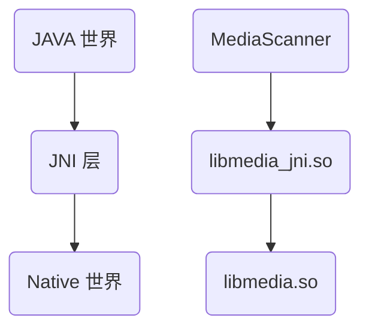

本篇文章主要是研究 ART 虚拟机中的 native 方法相关的处理流程，凡是涉及到 native 相关的，都会在本篇文章中进行收录。

1. JNI 原理、基础知识
2. Java native 函数的定义、使用以及编译
3. JNI 层的实现
4. native 函数注册的流程、函数等

<!-- more -->


## Abstract

本文分为几个部分：

1. 第一个部分研究 `libcore` 中的一个 `@FastNative` 例子，通过这个例子简单了解 Java native 函数的基本调用流程；
2. native 函数的总结：分为几张图标进行说明；

## JNI

### Abstract

JNI 的全称是 Java Native Interface, 通过 JNI 技术，可以做到以下几点：

1. Java 程序中可以调用 Native 语言写的函数；一般是 C/C++ 编写的函数；
2. Native 程序中的函数可以调用 JAVA 层的函数；也就是说 在 C/C++ 中可以调用 JAVA 层的函数；

仔细思考一下，如果引用了 JNI, 是不是就破坏了 JAVA 的平台无关性呢？其实不尽然，引入 JNI 有以下的好处：

1. JAVA 虚拟机是由 Native 语言写的，并不是平台无关的，而 JNI 层可以对 JAVA 层屏蔽平台之间的差异，有助于实现 JAVA 本身平台无关的特性；
2. 很多程序都用 Native 语言写的，用 JNI 就可以直接使用了，避免了重复造轮子。

### JAVA World to Native World

这个问题是萦绕在初学 JNI 的时候一个很大的问题，到底 Java 是如何调用 Native 的函数的呢？首先先看 Java 世界、JNI 世界和 Native 世界之间的关系：



除此之外，为了方便理解，再图上增加了一个 `MediaScanner` 实例进行说明。

- `MediaScanner` 类中的一些功能需要由 Native 层来实现
- JNI 层对应 `media_jni` 库，库的名字是 `media`, `jni` 表示的是这个一个 JNI 库
- Native 的 `libmedia.so` 完成了实际的功能

```java
 // media / java / android / media / MediaScanner.java
public class MediaScanner
{
    static {
        // 加载对应的 JNI 库
        // 在实际加载动态库的时候会将其拓展称为 libmedia_jni.so
        System.loadLibrary("media_jni");
        // 调用 native_init() 函数
        native_init();
    }
    
    // ..
    
    // native 函数的声明；被 native 标识的函数表示它将由 JNI 层完成
    private native void processDirectory(String path, MediaScannerClient client);
    
    // ..
}
```

1. 在调用 native 函数之前，需要进行 JNI 库的加载；关于加载 JNI 库的时机，通用的做法是在类的 `static` 语句中加载，加载的方法是调用 `System.loadLibrary` 方法，需要注意 JNI 库的加载必须是在 native 函数调用之前；
2. JAVA 程序员调用 JNI 中的函数还需要使用 native 关键字声明函数。

从上我们可以看出，JNI 的使用对于 JAVA 程序员是非常友好的。

### JNI 层分析

@todo

### 静态注册 vs 动态注册

@todo

## JNI Code Analysis

这篇博客[^1]有一个给 libcore 增加日志的例子，全流程的走了一遍 native 方法创建、注册的过程，而我们选择的例子为 `libcore` 中 JDK 的实现。

### Java Native

Native Java 的代码如下：

```java
// libcore/ojluni/src/main/java/java/lang/String.java
@FastNative
native void getCharsNoCheck(int start, int end, char[] buffer, int index);
```

上述函数使用 `@FastNative` 注解修饰，函数声明前的 `native` 表示这是一个 native 方法。 

在 `libcore/openjdk_java_files.bp` 中可以看到 `String.java` 文件，表示其在**编译链**中。

```
filegroup {
    name: "openjdk_javadoc_files",
    srcs: [
        "ojluni/src/main/java/java/awt/font/NumericShaper.java",
        // more code ...
        "ojluni/src/main/java/java/lang/String.java",
        // ...
    ],
    path: "ojluni/src/main/java",
}
```

### JNI 定义

#### register_java_lang_String

JNI 层负责实现 `getCharsNoCheck`, 实现过后会被注册，此时就与 Java 层的 native 方法对应起来了，对于 `getCharsNoCheck` 的注册过程如下：

在 `.hh` 中：

```cpp
// art/runtime/native/java_lang_String.h
#ifndef ART_RUNTIME_NATIVE_JAVA_LANG_STRING_H_
#define ART_RUNTIME_NATIVE_JAVA_LANG_STRING_H_

#include <jni.h>

namespace art {

void register_java_lang_String(JNIEnv* env);

}  // namespace art

#endif  // ART_RUNTIME_NATIVE_JAVA_LANG_STRING_H_
```

在 `.cc` 中进行注册：

```cpp
static void String_getCharsNoCheck(JNIEnv* env, jobject java_this, jint start, jint end,
                                   jcharArray buffer, jint index) {
  // ScopedFastNativeObjectAccess 中保存了 env 对象以及其所在的 Thread 对象
  ScopedFastNativeObjectAccess soa(env);
  // 从 soa.Self 中获取 JNIEnv 所在的线程对象
  StackHandleScope<1> hs(soa.Self());
  // 获取 buffer 的指针
  Handle<mirror::CharArray> char_array(hs.NewHandle(soa.Decode<mirror::CharArray>(buffer)));
  // 获取 jobject 指针后调用 GetChars
  soa.Decode<mirror::String>(java_this)->GetChars(start, end, char_array, index);
}

static JNINativeMethod gMethods[] = {
  FAST_NATIVE_METHOD(String, charAt, "(I)C"),
  FAST_NATIVE_METHOD(String, compareTo, "(Ljava/lang/String;)I"),
  FAST_NATIVE_METHOD(String, concat, "(Ljava/lang/String;)Ljava/lang/String;"),
  FAST_NATIVE_METHOD(String, doReplace, "(CC)Ljava/lang/String;"),
  FAST_NATIVE_METHOD(String, fastSubstring, "(II)Ljava/lang/String;"),
  FAST_NATIVE_METHOD(String, getCharsNoCheck, "(II[CI)V"),
  FAST_NATIVE_METHOD(String, intern, "()Ljava/lang/String;"),
  FAST_NATIVE_METHOD(String, toCharArray, "()[C"),
};

void register_java_lang_String(JNIEnv* env) {
  REGISTER_NATIVE_METHODS("java/lang/String");
}
```

到此，我们对 `register_java_lang_String` 进行了定义，调用这个函数就可以进行 native 函数的注册。

#### REGISTER_NATIVE_METHODS

对于宏 `REGISTER_NATIVE_METHODS`，其定义如下：

```cpp
// art/runtime/native/native_util.h
#define REGISTER_NATIVE_METHODS(jni_class_name) \
  RegisterNativeMethodsInternal(env, (jni_class_name), gMethods, arraysize(gMethods))

}  // namespace art

ALWAYS_INLINE inline void RegisterNativeMethodsInternal(JNIEnv* env,
                                                        const char* jni_class_name,
                                                        const JNINativeMethod* methods,
                                                        jint method_count) {
  ScopedLocalRef<jclass> c(env, env->FindClass(jni_class_name));
  if (c.get() == nullptr) {
    LOG(FATAL) << "Couldn't find class: " << jni_class_name;
  }
  jint jni_result = env->RegisterNatives(c.get(), methods, method_count);
  CHECK_EQ(JNI_OK, jni_result);
}
```

也就是说 `register_java_lang_String()` 最终是调用了 `RegisterNativeMethodsInternal()`, 传入了 class name, 全局的 gMethods, 以及计算出来的 count.

@todo log 后增加分析结果

对于宏 `FAST_NATIVE_METHOD` 我在源码中未找到其定义，但是根据其用法，不难发现，三个参数应该分别是：类名（函数指针）、函数名、函数参数和返回值（signature）。

那么接下来的问题就只剩下：是谁调用了 `register_java_lang_String()` 进行了 native 函数的注册呢？我们进行下一章节的旅程。

### JNI 注册

#### InitNativeMethods

除此之外，我们搜索全局的`register_java_lang_String` 发现，还在一处出现：

```cpp
// art/runtime/runtime.cc
void Runtime::RegisterRuntimeNativeMethods(JNIEnv* env) {
  register_dalvik_system_DexFile(env);
// ...
  register_java_lang_String(env);
  register_java_lang_StringFactory(env);
  // ...
}
```

这个函数的调用也是在这个文件中的 `InitNativeMethods` 函数（这个文件比较重要，所以全部列举出来了）：

```cpp
void Runtime::InitNativeMethods() {
  VLOG(startup) << "Runtime::InitNativeMethods entering";
  Thread* self = Thread::Current();
  JNIEnv* env = self->GetJniEnv();

  // Must be in the kNative state for calling native methods (JNI_OnLoad code).
  CHECK_EQ(self->GetState(), kNative);

  // Set up the native methods provided by the runtime itself.
  RegisterRuntimeNativeMethods(env);

  // Initialize classes used in JNI. The initialization requires runtime native
  // methods to be loaded first.
  WellKnownClasses::Init(env);

  // Then set up libjavacore / libopenjdk / libicu_jni ,which are just
  // a regular JNI libraries with a regular JNI_OnLoad. Most JNI libraries can
  // just use System.loadLibrary, but libcore can't because it's the library
  // that implements System.loadLibrary!
  //
  // By setting calling class to java.lang.Object, the caller location for these
  // JNI libs is core-oj.jar in the ART APEX, and hence they are loaded from the
  // com_android_art linker namespace.

  // libicu_jni has to be initialized before libopenjdk{d} due to runtime dependency from
  // libopenjdk{d} to Icu4cMetadata native methods in libicu_jni. See http://b/143888405
  {
    std::string error_msg;
    if (!java_vm_->LoadNativeLibrary(
          env, "libicu_jni.so", nullptr, WellKnownClasses::java_lang_Object, &error_msg)) {
      LOG(FATAL) << "LoadNativeLibrary failed for \"libicu_jni.so\": " << error_msg;
    }
  }
  {
    std::string error_msg;
    if (!java_vm_->LoadNativeLibrary(
          env, "libjavacore.so", nullptr, WellKnownClasses::java_lang_Object, &error_msg)) {
      LOG(FATAL) << "LoadNativeLibrary failed for \"libjavacore.so\": " << error_msg;
    }
  }
  {
    constexpr const char* kOpenJdkLibrary = kIsDebugBuild
                                                ? "libopenjdkd.so"
                                                : "libopenjdk.so";
    std::string error_msg;
    if (!java_vm_->LoadNativeLibrary(
          env, kOpenJdkLibrary, nullptr, WellKnownClasses::java_lang_Object, &error_msg)) {
      LOG(FATAL) << "LoadNativeLibrary failed for \"" << kOpenJdkLibrary << "\": " << error_msg;
    }
  }

  // Initialize well known classes that may invoke runtime native methods.
  WellKnownClasses::LateInit(env);
  
  // check startup module ready 后再打印日志
  VLOG(startup) << "Runtime::InitNativeMethods exiting";
}
```

第 10 行调用了 `RegisterRuntimeNativeMethods`, 后面的很多过程也很重要，我们后续再进行研究。

:::tip Runtime::InitNativeMethods entering

注意到有一行日志 `VLOG(startup) << "Runtime::InitNativeMethods entering";`,  我们可以通过在日志中查找是否有这个对应的打印来确定启动的时候是否调用到了这个流程（因为调用链还涉及到很多非常复杂的过程，所以我们可以通过这个方式来进行验证）

@todo 验证后填写结论

:::

#### Runtime::Start

而`InitNativeMethods` 函数在 `Runtime::Start()` 中被调用：

```cpp
bool Runtime::Start() {
  // ...code 

  // InitNativeMethods needs to be after started_ so that the classes
  // it touches will have methods linked to the oat file if necessary.
  {
    ScopedTrace trace2("InitNativeMethods");
    InitNativeMethods();
  }

  // .. code
}
```

接下来的过程就是涉及到 JVM 进程的启动等知识了，关于这个会在章节专门进行研究。


### Intrinsics Path

#### INTRINSICS_LIST

在 `art/runtime/intrinsics_list.h` 中有如下两个宏定义：

- SIGNATURE_POLYMORPHIC_INTRINSICS_LIST

```cpp
#define SIGNATURE_POLYMORPHIC_INTRINSICS_LIST(V) \
  V(MethodHandleInvokeExact, kPolymorphic, kNeedsEnvironment, kAllSideEffects, kCanThrow, "Ljava/lang/invoke/MethodHandle;", "invokeExact", "([Ljava/lang/Object;)Ljava/lang/Object;") \
  // .. more code
```

- INTRINSICS_LIST

```cpp
#define INTRINSICS_LIST(V) \
  V(DoubleDoubleToRawLongBits, kStatic, kNeedsEnvironment, kNoSideEffects, kNoThrow, "Ljava/lang/Double;", "doubleToRawLongBits", "(D)J") \
  // ...
  V(StringGetCharsNoCheck, kVirtual, kNeedsEnvironment, kReadSideEffects, kCanThrow, "Ljava/lang/String;", "getCharsNoCheck", "(II[CI)V") \
```

#### path –> oat

对于第二个宏 INTRINSICS_LIST，其用法我们可以在 `art/dex2oat/driver/compiler_driver.cc` 中看到：

```cpp
// Add classes which contain intrinsics methods to the list of image classes.
static void AddClassesContainingIntrinsics(/* out */ HashSet<std::string>* image_classes) {
#define ADD_INTRINSIC_OWNER_CLASS(_, __, ___, ____, _____, ClassName, ______, _______) \
  image_classes->insert(ClassName);

  INTRINSICS_LIST(ADD_INTRINSIC_OWNER_CLASS)
#undef ADD_INTRINSIC_OWNER_CLASS
}
```

`AddClassesContainingIntrinsics` 被 `CompilerDriver::LoadImageClasses` 调用：

```cpp
// Make a list of descriptors for classes to include in the image
void CompilerDriver::LoadImageClasses(TimingLogger* timings,
                                      /*inout*/ HashSet<std::string>* image_classes) {
  // ...

  if (GetCompilerOptions().IsBootImage()) {
    AddClassesContainingIntrinsics(image_classes);

    // All intrinsics must be in the primary boot image, so we don't need to setup
    // the intrinsics for any other compilation, as those compilations will pick up
    // a boot image that have the ArtMethod already set with the intrinsics flag.
    InitializeIntrinsics();
  }

  // ...
}
```

`CompilerDriver::LoadImageClasses` 被 `CompilerDriver::PreCompile` 调用：

```cpp
void CompilerDriver::PreCompile(jobject class_loader,
                                const std::vector<const DexFile*>& dex_files,
                                TimingLogger* timings,
                                /*inout*/ HashSet<std::string>* image_classes,
                                /*out*/ VerificationResults* verification_results) {
  CheckThreadPools();

  VLOG(compiler) << "Before precompile " << GetMemoryUsageString(false);

  // Precompile:
  // 1) Load image classes.
  // 2) Resolve all classes.
  // 3) For deterministic boot image, resolve strings for const-string instructions.
  // 4) Attempt to verify all classes.
  // 5) Attempt to initialize image classes, and trivially initialized classes.
  // 6) Update the set of image classes.
  // 7) For deterministic boot image, initialize bitstrings for type checking.

  LoadImageClasses(timings, image_classes);
  VLOG(compiler) << "LoadImageClasses: " << GetMemoryUsageString(false);
  // ...
}
```

`PreCompile` 在 `art/dex2oat/dex2oat.cc` 文件中被 `CompileDexFiles()` 函数调用：

```cpp
// Create the class loader, use it to compile, and return.
jobject CompileDexFiles(const std::vector<const DexFile*>& dex_files) {
    // ..
    driver_->InitializeThreadPools();
    driver_->PreCompile(class_loader,
                        dex_files,
                        timings_,
                        &compiler_options_->image_classes_,
                        verification_results_.get());
    // ..
    return class_loader;
}
```

最终调用到 `Dex2oat` 中，而 `Dex2oat` 在 main 中被调用；关于 dex2oat 的用法我们在文章《Art dex2oat》中进行研究；

可以看到，这个宏最后被 dex2oat 流程所用到了；**简而言之，宏 INTRINSICS_LIST 定义的这些 native 函数最终被编进了 oat 文件中使用。**


[^1]: [Java核心库libcore中添加Log接口任意调用（Android10）](https://blog.csdn.net/u011426115/article/details/113032671)
