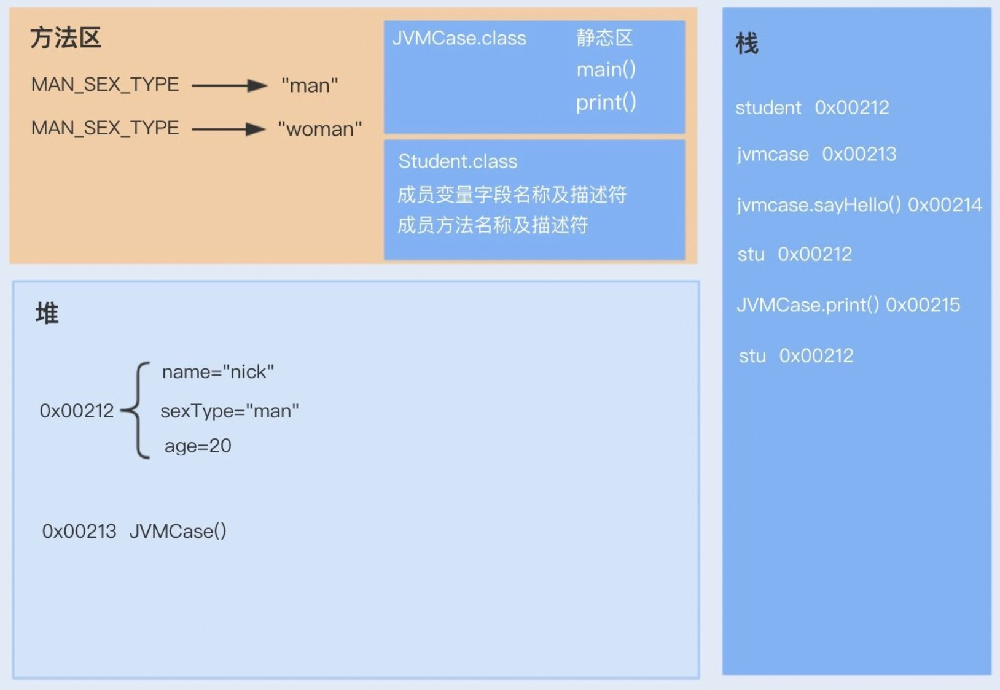

## 1. 架构

JVM 的软件架构如下：


JAVA 内存布局如下图所示：


通过对典型应用的 JVM 内存进行拆解，如下：

```shell
Total: reserved=15538605KB, committed=14221757KB
Java Heap (reserved=9601024KB, committed=9601024KB)
Class (reserved=2095827KB, committed=1215827KB)    
    Metadata (reserved=995328KB, committed=993536KB) 
    ## 每个类的元数据：类名、方法、字段描述    
    Class space (reserved=1048576KB, committed=170368KB) 
    ## 为类加载器存储的数据预留的空间
Thread (reserved=43505KB, committed=10101KB) 
## 包括线程栈和线程本地存储    
    stack (reserved=43505KB, committed=10101KB) 
    ## 对每个线程分配的栈空间，大小可通过 -Xss 配置
Code (reserved=977086KB, committed=573642KB) # 为 JIT 编译器预留的内存
GC (reserved=495136KB, committed=495136KB) # 为 GC 预留的内存
Compiler (reserved=734KB, committed=734KB)
Internal (reserved=20654KB, committed=20654KB) #JVM 内部使用的内存，依赖于 JVM 的实现
Other (reserved=733088KB, committed=733088KB) 
## Native Memory Tracking, Arena Chunk, Logging, 
## Arguments, Module,Synchronizer, Safepoint, Wisp, null
```

*下面章节会对这些区域进行逐一说明。*

JVM 在运行时的数据区大致如下图所示：


或者参考这张图：


## 2. 栈区

准确来说，栈区包括虚拟机栈、本地方法栈；PC 寄存器是很小的一块内存空间，指向当前线程所执行的字节码的行号，如果线程执行的是 Java 方法，则指向虚拟机字节码指令的地址；如果执行的是 native 方法，这个计数器通常为空。
VM Stack 是线程私有，生命周期与线程相同。如章节 1.1 中的图片所示，VM Stack 中有若干的栈帧 (Stack Frame)，每一个 Stack Frame 都对应一个方法。通常大家说的虚拟机中的栈都会特指 VM Stack.
栈区包含若干栈帧，每个栈帧中包括以下信息：

1. 局部变量表（Local Variable Array）：用于存储方法的局部变量和输入的参数。局部变量表以数组形式存储，Java 虚拟机根据字节码对这些变量进行索引和操作。
2. 操作数栈（Operand Stack）：用于执行计算时的操作数存储和结果保留。Java 字节码指令使用操作数栈来完成大多数操作，例如加法、乘法、方法调用等。
3. 动态链接（Dynamic Linking）：包含指向运行时常量池中方法引用的指针。这部分主要用于支持方法调用的运行时解析。
4. 方法返回地址（Return Address）：当方法调用完成后，程序需要知道返回到哪一行继续执行。返回地址存储着调用方法的下一条指令的地址。

附加信息：一些实施可能还会包括其他信息，例如调试信息、异常处理器和栈映射帧等。
本地方法栈主要是为虚拟机使用到的 Native 方法服务。
::: tip 栈上分配
在 Java 中默认创建一个对象是在堆中分配内存的，而当堆内存中的对象不再使用时，则需要通过垃圾回收机制回收，这个过程相对分配在栈中的对象的创建和销毁来说，更消耗时间和性能。这个时候，逃逸分析如果发现一个对象只在方法中使用，就会将对象分配在栈上。
:::

## 3. 方法区（Method Area）

刚开始的时候，HotSpot 虚拟机使用永久代来实现方法区，而现在已经发展成为 MateSpace（常量池、方法元信息、类元信息），Metaspace 使用本地内存而不是堆内存来存储。
方法区主要是用来存放已被虚拟机加载的类相关信息，包括==类信息、运行时常量池、字符串常量池==。类信息又包括了类的版本、字段、方法、接口和父类等信息。
JVM 在执行某个类的时候，必须经过加载、连接、初始化，而连接又包括验证、准备、解析三个阶段。在加载类的时候，JVM 会先加载 class 文件，而在 class 文件中除了有类的版本、字段、方法和接口等描述信息外，还有一项信息是*常量池 (Constant Pool Table)*，用于存放编译期间生成的各种**字面量**和**符号引用**。

- **字面量**：包括字符串（String a=“b”）、基本类型的常量（final 修饰的变量）
- **符号引用**：包括类和方法的全限定名（例如 String 这个类，它的全限定名就是 `Java/lang/String`）、字段的名称和描述符以及方法的名称和描述符

而当类加载到内存中后，JVM 就会将 class 文件常量池中的内容存放到运行时的常量池中；在解析阶段，JVM 会把**符号引用替换为直接引用**（对象的索引值）。
例如，类中的一个字符串常量在 class 文件中时，存放在 ==class 文件常量池==中的；在 JVM 加载完类之后，JVM 会将这个字符串常量放到==运行时常量池==中，并在解析阶段，指定该字符串对象的索引值。运行时常量池是全局共享的，==多个类共用一个运行时常量池==，class 文件中常量池多个相同的字符串在运行时常量池只会存在一份。
方法区与堆空间类似，也是一个共享内存区，所以方法区是线程共享的。假如两个线程都试图访问方法区中的同一个类信息，而这个类还没有装入 JVM，那么此时就只允许一个线程去加载它，另一个线程必须等待。
一个例子：


## 4. 堆

先简单感受一下堆内存内部的划分：


### 4.1. Code Cache

CodeCache 内存主要存储 JVM 动态生成的代码。动态生成的代码最主要的是 JIT 编译后的代码，其次动态生成的代码，本地方法代码（JNI）也会存在 CodeCache 中。
上章节提到的 NonProfiledHotCodeHeap 是属于 JIT 编译的产物，所以是 CodeCache 的一部分。
code cache 会被分成三块区域，可以使用 `jcmd <pid> Compiler. codecache` 打印出各个区域的情况，如下图所示：


这三个区域的含义如下：
- **non-nmethods**, 也叫做 JVM internal (non-method) code，通常包括 compiler buffers 和 bytecode interpreter 等，这些代码通常永久保存在 codecache 中；itable/vtable stub 这些函数就保存在该区域。

- **profiled nmethods**，表示被 profiled 但是 lightly optimized 的 code heap 区域，profiled nmethods 的生命周期较短；由 ProfiledCodeHeapSize 控制大小；

- **non-profiled nmethods**，被 fully optimized 的 C2 编译，生命周期较长；由 NonProfiledCodeHeapSize 控制大小；为了更高的性能优化，我们在 non-profiled 区再开辟了一块空间用于存储 non-profiled-hot-code, 这个 heap 区域一般比较小，由 NonProfiledHotCodeHeapSize 控制，该区域存储的 hotest code 能在 non-profile heap 中再进行冷热分离，提高性能。

JVM 的 THP 重排就是针对 non-profiled code heap 中的 non-profiled hot code heap 进行了重排。


> [!note]
> 举个例子，我们知道虚方法是用来实现面向对象语言多态性的。对于一个虚方法调用，尽管它有很多个目标方法，但在实际运行过程中它可能只调用其中的一个。


### 4.2. 浅堆和深堆

浅堆和深堆通常是计算机科学中特别是在垃圾回收领域讨论的两个概念。它们通常用于分析对象在内存中的占用情况。

**浅堆（Shallow Heap）** 浅堆大小指的是一个**对象本身在堆内存中的大小**，不包括该对象引用的其他对象所占的内存。例如，一个 Java 对象的浅堆大小只计算该对象的数据字段和对象头（如类元数据引用、锁信息等）所占据的内存。

**深堆（Retained Heap）** 深堆大小是指对象本身以及从该对象可达的所有其他对象所占的内存之和。这意味着它考虑了整个对象图的内存占用，是一个递归的大小计算。计算深堆大小通常用于了解某个对象及其相关对象链的整体内存使用情况。
在性能分析中，浅堆和深堆的区别可以帮助开发者识别内存泄漏和优化内存使用。例如，通过分析一个应用程序中某个对象的深堆大小，开发者可以识别出由于复杂的对象引用导致的高内存消耗情况。

在使用工具进行堆分析时（如 Java 的 VisualVM 或 Eclipse MAT），这些概念可以帮助更有效地理解内存分布和定位性能问题。

## 5. 对象内存布局

当 JVM 遇到对象创建的字节码指令时，首先会检查常量池中是否存在该类的符号引用，并判断该符号引用所代表的类是否已经 **加载（Loading）、解析（Linking）、初始化（Initialization）**。如果类尚未完成这些过程，则需要先执行类的加载操作，以确保类的元数据已经在方法区中准备就绪。
在完成检查后，JVM 开始为新对象分配内存。对象的大小在类加载完成后确定，JVM 需要在 **堆（Heap）** 上划分一块足够的空间来存放该对象。
对于 JVM 在堆内存中的对象存储布局，通常可以划分为三个部分：**对象头、实例数据和对齐填充。**

### 5.1. 指针压缩

在 Java 虚拟机中，每个 Java 对象都有一个==对象头==（object header），这个由**标记字段**和**类型指针**所构成。其中，标记字段用以存储 Java 虚拟机有关该对象的运行数据，如哈希码、GC 信息以及锁信息，而类型指针则指向该对象的类。

在 64 位的 Java 虚拟机中，对象头的标记字段占 64 位，而类型指针又占了 64 位。也就是说，*每一个 Java 对象在内存中的额外开销就是 16 个字节*。以 Integer 类为例，它仅有一个 int 类型的私有字段，占 4 个字节。因此，每一个 Integer 对象的额外内存开销至少是 400%。这也是为什么 Java 要引入基本类型的原因之一。

为了尽量较少对象的内存使用量，64 位 Java 虚拟机引入了压缩指针的概念（对应虚拟机选项 `-XX:+UseCompressedOops`，默认开启），将堆中原本 64 位的 Java 对象指针压缩成 32 位的。

这样一来，**对象头**中的类型指针也会被压缩成 32 位，使得对象头的==大小从 16 字节降至 12 字节==（注意是在说对象头，关于这点在后面对象头的章节进行详细的说明）。当然，压缩指针不仅可以作用于对象头的类型指针，还可以作用于引用类型的字段，以及引用类型数组。

>  那么压缩指针是什么原理呢？
>  
>  打个比方，路上停着的全是房车，而且每辆房车恰好占据两个停车位。现在，我们按照顺序给它们编号。也就是说，停在 0 号和 1 号停车位上的叫 0 号车，停在 2 号和 3 号停车位上的叫 1 号车，依次类推。
>  
>  原本的内存寻址用的是车位号。比如说我有一个值为 6 的指针，代表第 6 个车位，那么沿着这个指针可以找到 3 号车。现在我们规定指针里存的值是车号，比如 3 指代 3 号车。当需要查找 3 号车时，我便可以将该指针的值乘以 2，再沿着 6 号车位找到 3 号车。
>  
>  这样一来，32 位压缩指针最多可以标记 2 的 32 次方辆车，对应着 2 的 33 次方个车位。当然，房车也有大小之分。大房车占据的车位可能是三个甚至是更多。不过这并不会影响我们的寻址算法：我们只需跳过部分车号，便可以保持原本车号*2 的寻址系统。
>  上述模型有一个前提，你应该已经想到了，就是每辆车都从偶数号车位停起。这个概念我们称之为**内存对齐**（对应虚拟机选项-XX: ObjectAlignmentInBytes，默认值为 8）。

默认情况下，Java 虚拟机堆中对象的起始地址==需要对齐至 8 的倍数==。如果一个对象用不到 8N 个字节，那么空白的那部分空间就浪费掉了。这些浪费掉的空间我们称之为对象间的填充（padding）。

在默认情况下，Java 虚拟机中的 32 位压缩指针可以寻址到 2 的 35 次方个字节，也就是 32GB 的地址空间（超过 32GB 则会关闭压缩指针）。

在对压缩指针解引用时，我们需要将其左移 3 位，再加上一个固定偏移量，便可以得到能够寻址 32GB 地址空间的伪 64 位指针了。

> [!note]
> 为什么是左移 3 位？因为我们关于 8N 做了对齐。
> 
> 参考前面的哪个例子：*这样一来，32 位压缩指针最多可以标记 2 的 32 次方辆车，对应着 2 的 33 次方个车位。(这个例子类似于关于 2N 做了对齐)*


此外，我们可以通过配置刚刚提到的内存对齐选项（`-XX:ObjectAlignmentInBytes`）来进一步提升寻址范围。但是，这同时也可能增加对象间填充，导致压缩指针没有达到原本节省空间的效果。

举例来说，如果规定每辆车都需要从偶数车位号停起，那么对于占据两个车位的小房车来说刚刚好，而对于需要三个车位的大房车来说，也仅是浪费一个车位。

但是如果规定需要从 4 的倍数号车位停起，那么小房车则会浪费两个车位，而大房车至多可能浪费三个车位。

当然，就算是关闭了压缩指针，Java 虚拟机还是会进行内存对齐。此外，内存对齐不仅存在于对象与对象之间，也存在于对象中的字段之间。比如说，Java 虚拟机要求 long 字段、double 字段，以及非压缩指针状态下的引用字段地址为 8 的倍数。

字段内存对齐的其中一个原因，是让字段只出现在同一 CPU 的缓存行中。如果字段不是对齐的，那么就有可能出现跨缓存行的字段。也就是说，该字段的读取可能需要替换两个缓存行，而该字段的存储也会同时污染两个缓存行。这两种情况对程序的执行效率而言都是不利的。

### 5.2. 字段重排列

介绍一下对象内存布局另一个有趣的特性：字段重排列。

字段重排列，顾名思义，就是 Java 虚拟机重新分配字段的先后顺序，以达到内存对齐的目的。Java 虚拟机中有三种排列方法（对应 Java 虚拟机选项 `-XX: FieldsAllocationStyle`，默认值为 1），但都会遵循如下两个规则。

其一，如果一个字段占据 C 个字节，那么该字段的偏移量需要对齐至 NC。这里偏移量指的是字段地址与对象的起始地址差值。

以 long 类为例，它仅有一个 long 类型的实例字段。在使用了压缩指针的 64 位虚拟机中，尽管对象头的大小为 12 个字节，该 long 类型字段的偏移量也只能是 16，而中间空着的 4 个字节便会被浪费掉。

其二，子类所继承字段的偏移量，需要与父类对应字段的偏移量保持一致。

Java 8 还引入了一个新的注释@Contended，用来解决对象字段之间的虚共享（false sharing）问题。这个注释也会影响到字段的排列。

虚共享是怎么回事呢？假设两个线程分别访问同一对象中不同的 volatile 字段，逻辑上它们并没有共享内容，因此不需要同步。

然而，如果这两个字段恰好在同一个缓存行中，那么对这些字段的写操作会导致缓存行的写回，也就造成了实质上的共享。（volatile 字段和缓存行的故事我会在之后的篇章中详细介绍。）

Java 虚拟机会让不同的@Contended 字段处于独立的缓存行中，因此你会看到大量的空间被浪费掉。具体的分布算法属于实现细节，随着 Java 版本的变动也比较大，因此这里就不做阐述了。

如果你感兴趣，可以利用实践环节的工具，来查阅 Contended 字段的内存布局。注意使用虚拟机选项-XX:-RestrictContended。如果你在 Java 9 以上版本试验的话，在使用 javac 编译时需要添加 --add-exports java. Base/jdk.internal.vm.annotation=ALL-UNNAME

### 5.3. 对象头（Header）

对象头部分通常由两类信息组成：

- **Mark Word（标记字段）**：用于存储对象自身的运行时数据，例如哈希码（HashCode）、GC 分代年龄（Age）、锁状态（Lock）、偏向锁线程 ID（Thread ID）等信息。这部分是高度可变的，在不同阶段可能存储不同内容。

| 锁状态   | 25-32bit 内容                            |
| ----- | -------------------------------------- |
| 无锁    | hashcode (25b) + 分代年龄 (4b) + 偏向模式 (1b) |
| 轻量级锁  | 指向栈中锁记录的指针                             |
| 重量级锁  | 指向 Monitor 的指针                         |
| GC 标记 | 空（用于垃圾回收标识）                            |

- **类型指针（Klass Pointer）**：指向对象所属类的 **类元数据（Class Metadata）**，通过该指针，JVM 可以确定当前对象是哪个类的实例，并能访问该类的相关信息，如方法表（Method Table）、字段布局等。如果 JVM 采用了 **压缩类指针（Compressed Class Pointers）** 技术，该指针可能会占用较少的空间。

综上所述，对象头的总大小是：

$8\text{(Mark Word)}+ 8\text{(Class Pointer)}= 16 \text{Bytes}$

启用 Compressed Oops 后，**Class Pointer 以及所有的引用类型字段都会被压缩为 4 字节（32 位）**，而不是原来的 8 字节。  

因此对象头变成了：

$8\text{(Mark Word)}+ 4\text{(Compressed Class Pointer)}= 12 \text{Bytes}$

问题：**那多出来的 4 字节怎么办？对象不是要 8 字节对齐吗？**

  这个点很关键。确实，JVM 中对象通常要按照 8 字节对齐（尤其是 HotSpot 的默认行为）。

- 如果对象字段的总大小不是 8 字节的整数倍，**JVM 会在对象末尾补齐 padding（空白字节）**，确保对象大小对齐。
    
- 所以对象本身的内存占用可能还是 16 字节，但对象头的真实有效信息是 12 字节。

在启用 Compressed Oops 时，对象的布局可能是：

| **偏移量** | **大小** | **内容**        |
| ------- | ------ | ------------- |
| 0       | 8      | Mark Word     |
| 8       | 4      | Class Pointer |
| 12      | 4      | int 字段 a      |
| 16      | 0~4    | Padding（补齐）   |

---

> [!important]
> 
> JVM 是怎么在对象头里用 4 字节表示一个 8 字节的类型指针？


每个 Java 对象在内存中都有一个 **Class Pointer**，指向它的类元数据（即 Klass 对象，在 HotSpot JVM 中）。

这个 Class Pointer 是在对象头里，作用是告诉 JVM：

> “我是谁？我是哪个类的实例？”

默认情况下，这是个 **64 位指针（8 字节）**，直接指向 Klass 结构的地址。

当启用了 `-XX:+UseCompressedClassPointers` 后，Class Pointer 被压缩成 4 字节，压缩方式与 Compressed Oops 类似。


> JVM 会为所有 Klass 对象分配一个连续的内存区域（叫 **Klass Space**），然后通过 **基地址 + 偏移量** 的方式来代替原始指针。

**举个例子（类指针版）：**

- Klass space 起始地址：0x100000000
    
- 某个类的元数据 Klass 对象地址：0x100001000
    
- 那么 offset = (0x100001000 - 0x100000000) >> shift = 0x1000 >> 3 = 0x200
    
- 压缩的 class pointer = 0x20

解压时 JVM 做：
Real_klass_pointer = klass_base_address + (compressed_class_pointer << shift)
                   = 0x100000000 + (0x200 << 3)
                   = 0x100001000

### 5.4. 实例数据（Instance Data）

该部分存储的是程序代码中定义的所有 **实例字段（Instance Fields）**，包括从父类继承的字段和子类自身定义的字段。这些字段的实际存储顺序可能会影响对象的内存占用和访问效率，JVM 可能会根据字段类型（如 int、long、reference 等）进行 **字段对齐（Field Alignment）** 和 **字段重排序（Field Reordering）** 以优化访问性能。可以通过 JVM 参数 **-XX:FieldsAllocationStyle** 进行字段分配策略的调整。

### 5.5. 对齐填充（Padding）

填充部分并不是所有对象都具备的，其主要目的是 **保证对象的整体大小是 8 字节的整数倍（在 64 位 JVM 上一般是 16 字节的整数倍）**，以符合 **CPU 内存对齐（Memory Alignment）** 规则，提高 CPU 访问速度。由于对象头的大小通常是 32 位（4 字节）或 64 位（8 字节），JVM 会对 **实例数据部分（Instance Data）** 进行适当的填充，使对象大小符合对齐要求。这一部分的填充内容没有实际意义，仅仅是为了满足对齐规则，避免 CPU 在读取对象数据时发生 **跨缓存行（Cache Line Crossing）** 导致的性能下降。
对象大小计算公式：$\text{对象大小} = \text{头信息} + \text{实例数据} + padding$

> [!tip]
> 综上所述，JVM 在创建对象时，会按照 **对象头 -> 实例数据 -> 填充** 的顺序进行内存布局，以确保高效的内存管理和对象访问性能。


## 6. 堆外内存

### 6.1. 堆外内存的作用

堆外内存有以下作用:

1. 高性能计算: 对于需要高速读写的数据，直接操作堆外内存能够避免 JVM 内部的某些开销。
2. 网络传输: 在网络编程中，特别是使用 NIO (非阻塞 I/O) 时，可以直接将数据从堆外内存发送到网络上或者从网络接收到堆外内存中，从而减少了复制数据的过程。
3. 大数据处理: 当处理非常大的数据集时，合理利用堆外内存可以帮助更好地控制内存使用情况。

可以通过 `ByteBuffer. AllocateDirect ()` 方法来申请一块直接缓冲区，这块内存就是位于 JVM 堆外的。使用 Unsafe 类也可以直接操作内存地址，但这种方式比较底层，通常不推荐常规使用。

其优缺点如下：

- 减少了垃圾收集的工作量，因为这部分内存不由 GC 管理。
- 与操作系统更紧密地集成，有时候能提供更好的性能表现。
- 管理不当容易造成内存泄漏问题，因为这些内存不会被自动回收。
- 分配和释放堆外内存可能会比普通的堆内存消耗更多时间。

监控堆外内存的使用情况非常重要，可以通过设置 JVM 参数如 `-XX:MaxDirectMemorySize` 来限制最大可使用的直接内存大小。使用工具如 VisualVM、JConsole 等可以帮助查看当前应用的堆外内存使用状况。如果发现有内存泄露的问题，可能需要深入代码检查是否有未正确释放的直接缓冲区。
虽然使用堆外内存可以带来一定的性能提升，但也增加了程序复杂性和潜在的风险。因此，在决定是否使用之前应该仔细权衡利弊。需要注意的是，尽管堆外内存不受 JVM GC 的影响，但如果整个系统内存不足，还是有可能导致 OutOfMemoryError 错误的发生。

总之，合理地利用 JVM 堆外内存可以在特定场景下显著改善应用程序的性能，但是也需要注意相关的管理和优化工作。

## 7. MetaSpace

JVM 的 **元空间（Metaspace）不属于堆内存**，而是使用 **本地内存（Native Heap）**，即操作系统管理的非堆内存区域。

### 7.1. MetaSpace & CMS

在 Java 8 及更高版本中，元空间（Metaspace）替代了 Java 7 及之前的永久代（PermGen），用于存储类元数据（如类信息、常量池、方法代码等）。当与 CMS（Concurrent Mark-Sweep）垃圾回收器结合使用时，元空间的管理机制和 GC 行为会受到特定影响。以下是关于 CMS 与元空间的关键点总结：
元空间与 CMS 的交互机制

- 元空间触发 Full GC 的条件  
  当元空间的使用量达到其初始大小（`-XX:MetaspaceSize`）时，会触发一次 Full GC。如果 Full GC 后元空间仍不足，会继续扩容，直到达到最大值（`-XX:MaxMetaspaceSize`），否则可能引发 `OutOfMemoryError`。
- 例如，若设置 `-XX:MetaspaceSize=128m`，当元空间使用量接近或超过 128MB 时，即使老年代未达到 CMS 触发阈值（如默认 75%），也会触发一次 CMS Full GC。
- CMS 如何回收元空间  
  CMS 在执行元空间 GC 时，会遍历所有类加载器（ClassLoader）的元数据，回收未被引用的类和常量池。由于 CMS 是并发回收器，元空间 GC 通常伴随一次 Full GC（标记-清除阶段），但具体行为可能因参数配置而异。

---
元空间与 CMS 的配置参数

- 关键参数  
  - `-XX:MetaspaceSize`：元空间初始大小，达到此阈值会触发 Full GC。  
  - `-XX:MaxMetaspaceSize`：元空间最大值，防止无限制占用本地内存导致系统崩溃。  
  - `-XX:+CMSClassUnloadingEnabled`：启用类卸载（默认开启），允许 CMS 在 Full GC 时回收不再使用的类元数据。
- 默认行为  
  若未设置 `MaxMetaspaceSize`，元空间理论上可占用所有物理内存，但可能导致系统资源耗尽。建议根据应用实际需求设置合理上限。

元空间导致 CMS Full GC 的问题排查

- 典型场景  
  元空间内存不足时，会触发频繁 Full GC（如 CMS Full GC），表现为 GC 日志中出现 `[Full GC (Metadata GC Threshold)` 或 `[Full GC (Last ditch collection)`。此时即使堆内存未满，应用性能仍会显著下降。
- 案例分析  
  例如，某应用因 `MetaspaceSize=128m` 设置过小，在加载大量类时触发 CMS Full GC，导致老年代内存短暂下降（实际未满阈值）。通过调整 `MetaspaceSize=256m` 和 `MaxMetaspaceSize=256m`，问题得到解决。

---
元空间与永久代（PermGen）的区别

| 特性     | 元空间（Metaspace）                  | 永久代（PermGen）             |
| -------- | ------------------------------------ | ----------------------------- |
| 内存来源 | 本地内存（操作系统管理）             | 堆内存的一部分                |
| 扩容机制 | 动态扩展，受 `MaxMetaspaceSize` 限制   | 预分配固定大小，扩容需 JVM 重启 |
| 类卸载   | 支持（需 `CMSClassUnloadingEnabled`） | 不支持                        |
| OOM 风险  | 需显式设置 `MaxMetaspaceSize`         | 默认较小，易引发 OOM           |

优化建议

1. 合理设置元空间参数  
   - 根据应用类加载量调整 `MetaspaceSize` 和 `MaxMetaspaceSize`，避免频繁扩容。
2. 监控元空间使用  
   - 使用 `jstat -gcmetacapacity` 或监控工具（如 VisualVM）观察元空间使用趋势。
3. 结合 CMS 特性调优  
   - 若应用频繁加载动态类（如反射、CGLIB），可考虑减少 `CMSInitiatingOccupancyFraction` 阈值，提前触发 CMS 以缓解元空间压力。

## 8. Reference

- [苹果的堆内存管理与分析](https://developer.apple.com/cn/videos/play/wwdc2024/10173/?spm=ata.21736010.0.0.13622830DuCZPL)，可以作为目标。
