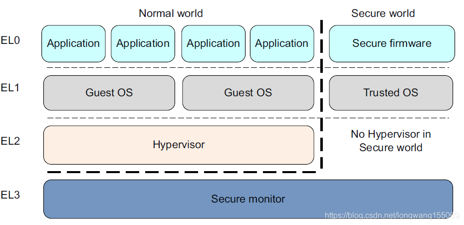

# BL3-1

> ARM Trusted Firmware Design [^1]

## Introduction

> The ARM Trusted Firmware implements a subset of the Trusted Board Boot Requirements (TBBR) Platform Design Document (PDD) for ARM reference platforms. The TBB sequence starts when the platform is powered on and runs up to the stage where it hands-off control to firmware running in the normal world in DRAM. This is the cold boot path.

Trusted Board Boot(TBB) 开始于平台上电的时候，直到固件(firmware)到了 norlmal world 阶段，是一个冷启动的路径。

> The ARM Trusted Firmware also implements the Power State Coordination Interface (PSCI) PDD as a runtime service. PSCI is the interface from normal world software to firmware implementing power management use-cases (for example, secondary CPU boot, hotplug and idle). Normal world software can access ARM Trusted Firmware runtime services via the ARM SMC (Secure Monitor Call) instruction. The SMC instruction must be used as mandated by the SMC Calling Convention PDD.

The ARM Trusted Firmware 实现了 PSCI(Power State Coordination Interface) 接口作为运行时服务。

PSCI: 一个接口，这个接口实现了电源管理用例(power management use-cases)，怎么理解这个电源管理用例？举例来说就是 secondary CPU 的启动、hotplug 和 idel 等；注意到这个接口是从 normal world software 到 firmware(关于 firmware 的介绍和理解可以参考下文)。

Normal world software 可以通过 ARM SMC(Secure Monitor Call) 指令来访问 ARM Trusted Firmware 服务，SMC 制定遵循着一些约定。

## Clod Boot

> The cold boot path starts when the platform is physically turned on.

介绍何时启动。

> One of the CPUs released from reset is chosen as the **primary CPU**, and the remaining CPUs are considered **secondary CPUs**. 
> The primary CPU is chosen through platform-specific means.

介绍主 CPU 和 secondray CPUs. 一个 CPU 被选为主 CPU, 剩下的都是 secondray. 怎么选的主 CPU 呢？主要是看平台实现。

> The cold boot path is mainly executed by the primary CPU, other than essential CPU initialization executed by all CPUs. The secondary CPUs are kept in a safe platform-specific state until the primary CPU has performed enough initialization to boot them.

冷启动主要由主 CPU 完成，次 CPU 要等主 CPU 来启动他们。

### Cloud Boot Path

The cold boot path in this implementation of the ARM Trusted Firmware is divided into five steps (in order of execution):

- Boot Loader stage 1 (BL1) AP Trusted ROM
- Boot Loader stage 2 (BL2) Trusted Boot Firmware
- Boot Loader stage 3-1 (BL3-1) EL3 Runtime Firmware
- Boot Loader stage 3-2 (BL3-2) Secure-EL1 Payload (optional)
- Boot Loader stage 3-3 (BL3-3) Non-trusted Firmware

冷启动的路径可以分为上述的步骤，下文将对每一个都进行分析。

> The ARM Fixed Virtual Platforms (FVPs) provide trusted ROM, trusted SRAM and trusted DRAM regions. Each boot loader stage uses one or more of these memories for its code and data.

术语：FVPs 指的是 ARM 固定虚拟平台。

### Summary

clod boot 启动由硬件完成，在启动的时候选定一个 CPU 为主 CPU, 剩余的 CPU 为从 CPU, 冷启动主要由主 CPU 完成。其主要的步骤可以分为 5 步：BL1, BL2, BL31, BL32, BL33.

## BL1

### EL0 - EL3

> This stage begins execution from the platform's reset vector in trusted ROM at EL3. BL1 code starts at `0x00000000` (trusted ROM) in the FVP memory map. The BL1 data section is placed at the start of trusted SRAM, `0x04000000`.

BL1 开始于 EL3, 我们要了解 EL3 是什么，简单来说就是可信的级别 EL0 ~ EL3, EL3 是最高的[^5]。



对于该图的解释如下：
1. EL0：表示用户空间，在 Norlmal World 运行中的应用程序，在 Secure World 中就是 Trust Application.
2. EL1: 运行操作系统。NW 中如 Linux, SW 中如高通 QSEE.
3. EL2: ARM 为了支持虚拟化，设计的虚拟化层，只有在 NW 中有
4. EL3: Secure Moniter 用于 NW 和 SW 的切换；切换的时候发送 SMC 指定，这个后文会研究

### BL1 实现

BL1 的实现主要是以下步骤：

### Determination of boot path

确定启动路径。

> Whenever a CPU is released from reset, BL1 needs to distinguish between a warm boot and a cold boot.
> This is done using a platform-specific mechanism.

CPU 从复位中释放的时候，BL1 需要区分冷启动和热启动。这种区分依赖于特定的平台。

> The ARM FVPs implement a simple power controller at `0x1c100000`.

很好理解。ARM 的虚拟化平台实现了一个电源控制，其启动的地址为 `0x1c100000`.

> The `PSYS` register (0x10) is used to distinguish between a cold and warm boot. This information is contained in the PSYS.WK[25:24] field.

`PSYS` 寄存器用于区分是冷启动还是热启动。

> Additionally, a per-CPU mailbox is maintained in trusted DRAM (0x00600000), to which BL1 writes an entrypoint. Each CPU jumps to this entrypoint upon warm boot.

阐述有一个入口点在，用于热启动。❌📛❌ 比较难理解的是，per-CPU mailbox 是一个什么？

> During cold boot, BL1 places the secondary CPUs in a safe platform-specific state while the primary CPU executes the remaining cold boot path as described in the following sections.

冷启动的时候把主 CPU 和从 CPUs 放在什么地方或者状态。

通过以上文章，可以分析到，这个启动路径指的就是区分冷热启动，其中涉及到一些寄存器地址，然后就是主 CPU 的相关工作。

### Architectural initialization

BL1 performs minimal architectural initialization as follows.

1. Exception vectors
2. MMU setup
3. Control register setup

结构初始化的步骤可以分为三步：异常向量、MMU 的配置、控制寄存器的配置，接下来分别进行阐述说明。

#### Exception vectors

> BL1 sets up simple exception vectors for both synchronous and asynchronous exceptions. 

BL1 设置了同步和异步的异常向量。

> The default behavior upon receiving an exception is to set a status code.

接受异常的时候会设置异常状态码。

> In the case of the FVP this code is written to the Versatile Express System LED register in the following format:

异常码会写入 LED 寄存器（❌❌❌ LED 寄存器是什么？），格式如下所示：

```
SYS_LED[0]   - Security state (Secure=0/Non-Secure=1)
SYS_LED[2:1] - Exception Level (EL3=0x3, EL2=0x2, EL1=0x1, EL0=0x0)
SYS_LED[7:3] - Exception Class (Sync/Async & origin). The values for
               each exception class are:

    0x0 : Synchronous exception from Current EL with SP_EL0
    0x1 : IRQ exception from Current EL with SP_EL0
    0x2 : FIQ exception from Current EL with SP_EL0
    0x3 : System Error exception from Current EL with SP_EL0
    0x4 : Synchronous exception from Current EL with SP_ELx
    0x5 : IRQ exception from Current EL with SP_ELx
    0x6 : FIQ exception from Current EL with SP_ELx
    0x7 : System Error exception from Current EL with SP_ELx
    0x8 : Synchronous exception from Lower EL using aarch64
    0x9 : IRQ exception from Lower EL using aarch64
    0xa : FIQ exception from Lower EL using aarch64
    0xb : System Error exception from Lower EL using aarch64
    0xc : Synchronous exception from Lower EL using aarch32
    0xd : IRQ exception from Lower EL using aarch32
    0xe : FIQ exception from Lower EL using aarch32
    0xf : System Error exception from Lower EL using aarch32
```

LED 寄存器里面涉及到 3 个取值：

- `SYS_LED[0]`: 安全状态
- `SYS_LED[2:1]`: EL, 异常级别，取值有 EL0 ~ EL3
- `SYS_LED[7:3]`: 异常类，包括很多取值

> A write to the LED register reflects in the System LEDs (S6LED0..7) in the CLCD window of the FVP. 

对 LED 寄存器的写入会反映在 FVP 上面。

> This behavior is because this boot loader stage does not expect to receive any exceptions other than the SMC exception.

boot loader 阶段除了 SMC 异常外不期望接收任何异常。

> For the latter, BL1 installs a simple stub. The stub expects to receive only a single type of SMC (determined by its function ID in the general purpose register X0). 

这段话说明了 BL1 有一个 stub, 该 stub 仅仅只接收简单类型的 SMC.

> This SMC is raised by BL2 to make BL1 pass control to BL3-1 (loaded by BL2) at EL3. Any other SMC leads to an assertion failure.

上述中的 SMC 是由 BL2 抛出，使得 BL1 将控制传递给 BL3-1.

#### MMU Setup

MMU 是内存管理单元，有时也称为分页内存管理单元（paged memory management unit，缩写为 PMMU），MMU 比较重要，我们在后文需要进行研究。@todo

> BL1 sets up EL3 memory translation by creating page tables to cover the first 4GB of physical address space. This covers all the memories and peripherals needed by BL1.

BL1 会创建一个页表，用于设置 EL3 内存转换。

#### Control Register Setup

> SCTLR_EL3. Instruction cache is enabled by setting the SCTLR_EL3.I bit. Alignment and stack alignment checking is enabled by setting the SCTLR_EL3.A and SCTLR_EL3.SA bits. Exception endianness is set to little-endian by clearing the SCTLR_EL3.EE bit.

> CPUECTLR. When the FVP includes a model of a specific ARM processor implementation (for example A57 or A53), then intra-cluster coherency is enabled by setting the CPUECTLR.SMPEN bit. The AEMv8 Base FVP is inherently coherent so does not implement CPUECTLR.

> SCR. Use of the HVC instruction from EL1 is enabled by setting the SCR.HCE bit. FIQ exceptions are configured to be taken in EL3 by setting the SCR.FIQ bit. The register width of the next lower exception level is set to AArch64 by setting the SCR.RW bit. External Aborts and SError Interrupts are configured to be taken in EL3 by setting the SCR.EA bit.

> CPTR_EL3. Accesses to the CPACR_EL1 register from EL1 or EL2, or the CPTR_EL2 register from EL2 are configured to not trap to EL3 by clearing the CPTR_EL3.TCPAC bit. Access to the trace functionality is configured not to trap to EL3 by clearing the CPTR_EL3.TTA bit. Instructions that access the registers associated with Floating Point and Advanced SIMD execution are configured to not trap to EL3 by clearing the CPTR_EL3.TFP bit.

寄存器的细节暂不关注。

### Platform Initialization

> BL1 enables issuing of snoop and DVM (Distributed Virtual Memory) requests from the CCI-400 slave interface corresponding to the cluster that includes the primary CPU. 

CCU-400[^6] 参考 CoreLink CCI-400 文档进行理解。

> BL1 also initializes UART0 (PL011 console), which enables access to the printf family of functions in BL1.


### BL2 image load and execution

BL1 execution continues as follows:

> BL1 determines the amount of free trusted SRAM memory available by calculating the extent of its own data section, which also resides in trusted SRAM. BL1 loads a BL2 raw binary image from platform storage, at a platform-specific base address. 
> If the BL2 image file is not present or if there is not enough free trusted SRAM the following error message is printed:
> ❌❌❌ "Failed to load boot loader stage 2 (BL2) firmware."
> If the load is successful, BL1 updates the limits of the remaining free trusted SRAM. It also populates information about the amount of trusted SRAM used by the BL2 image. The exact load location of the image is provided as a base address in the platform header. Further description of the memory layout can be found later in this document.

BL1 首先计算可用的 SRAM 空间用于加载 BL2 的二进制镜像，如果镜像加载成功，BL1 更新剩余的 SRAM 空间，镜像具体的加载地址会作为一个 base address 提供。

需要注意到，如果 BL1 在加载 BL2 镜像的时候，如果 BL2 镜像文件不存在，或者 SRAM 空间不足，此时就会报错。

> BL1 prints the following string from the primary CPU to indicate successful execution of the BL1 stage: "Booting trusted firmware boot loader stage 1"

打印出来 *"Booting trusted firmware boot loader stage 1"* 就说明 BL1 阶段成功。

> BL1 passes control to the BL2 image at Secure EL1, starting from its load address.

BL1 将控制权转交给 BL2, 其起始地址就是 load address.

> BL1 also passes information about the amount of trusted SRAM used and available for use. This information is populated at a platform-specific memory address.

再传递一下可信 SRAM 相关的信息。


### Summary

总结一下 BL1 的加载过程，抛开异常处理的过程不谈，BL1 首先初始化 MMU 和相关的寄存器，而后对平台进行初始化，最后再加载 BL2 的镜像并转接控制权。

## BL2

### Abstract

> BL1 loads and passes control to BL2 at Secure-EL1. 

这句话说的是：在 Secure-EL1 阶段，BL1 加载并且把控制权交给了 BL2!

🚫🚫🚫 有一个疑惑或者理解错误，BL1-BL33 不都是 EL3 阶段的事情么？

> BL2 is linked against and loaded at a platform-specific base address (more information can be found later in this document). 

BL2 链接于特定的平台 base address 上，后文还要继续阐述。

BL2 实现的功能如下文阐述。

### Architectural initialization

> BL2 performs minimal architectural initialization required for subsequent stages of the ARM Trusted Firmware and normal world software.

体系结构初始化最小化。

> It sets up Secure EL1 memory translation by creating page tables to address the first 4GB of the physical address space in a similar way to BL1.

和 BL1 相似的方式创建页表。

> EL1 and EL0 are given access to Floating Point & Advanced SIMD registers by clearing the CPACR.FPEN bits.

寄存器相关的，现在可能已经有更新，暂时不研究。

### Platform initialization

> BL2 copies the information regarding the trusted SRAM populated by BL1 using a platform-specific mechanism.

BL2 复制 BL1 可信 SRAM 的信息。

>  It calculates the limits of DRAM (main memory) to determine whether there is enough space to load the BL3-3 image. 

还是计算一下能不能足够加载 BL3-3 镜像。

> A platform defined base address is used to specify the load address for the BL3-1 image. 

BL3-1 镜像加载的地址。

> It also defines the extents of memory available for use by the BL3-2 image.

定义了 BL3-2 镜像可用的内存范围。

> BL2 also initializes UART0 (PL011 console), which enables access to the printf family of functions in BL2. Platform security is initialized to allow access to access controlled components.

> On the Base FVP a TrustZone controller (TZC-400) is configured to give full access to the platform DRAM. The storage abstraction layer is initialized which is used to load further bootloader images.

### BL3-0 (System Control Processor Firmware) image load

> Some systems have a separate System Control Processor (SCP) for power, clock, reset and system control. 

SCP 用于单独控制电源、时钟等。

> BL2 loads the optional BL3-0 image from platform storage into a platform-specific region of secure memory. 

BL2 加载可选的 BL3-0 镜像到安全内存中。

> The subsequent handling of BL3-0 is platform specific. 

BL3-0 的后续处理与平台有关。

>  Typically the image is transferred into SCP memory using a platform-specific protocol. The SCP executes BL3-0 and signals to the Application Processor (AP) for BL2 execution to continue.

镜像传输到 SCP 存储中。

### BL3-1 (EL3 Runtime Firmware) image load

> BL2 loads the BL3-1 image from platform storage into a platform-specific address in trusted SRAM. If there is not enough memory to load the image or image is missing it leads to an assertion failure. If the BL3-1 image loads successfully, **BL2 updates the amount of trusted SRAM used and available for use by BL3-1.** This information is populated at a platform-specific memory address.

这个介绍比较简单，就是 EL2 加载 BL3-1, 成功后更新 SRAM 的数量。

### BL3-2 (Secure-EL1 Payload) image load

> BL2 loads the optional BL3-2 image from platform storage into a platform- specific region of secure memory. The image executes in the secure world. BL2 relies on BL3-1 to pass control to the BL3-2 image, if present. Hence, BL2 populates a platform-specific area of memory with the entrypoint/load-address of the BL3-2 image. The value of the Saved Processor Status Register (SPSR) for entry into BL3-2 is not determined by BL2, it is initialized by the Secure-EL1 Payload Dispatcher (see later) within BL3-1, which is responsible for managing interaction with BL3-2. This information is passed to BL3-1.

暂时不研究。

### BL3-3 (Non-trusted Firmware) image load

> BL2 loads the BL3-3 image (e.g. UEFI or other test or boot software) from platform storage into non-secure memory as defined by the platform (0x88000000 for FVPs).

> BL2 relies on BL3-1 to pass control to BL3-3 once secure state initialization is complete. Hence, BL2 populates a platform-specific area of memory with the entrypoint and Saved Program Status Register (SPSR) of the normal world software image. The entrypoint is the load address of the BL3-3 image. The SPSR is determined as specified in Section 5.13 of the [PSCI PDD] PSCI. This information is passed to BL3-1.

和题目标题一样，非安全的镜像加载。

## BL3-1

这个章节研究 BL3-1 阶段所做的事情。

> The image for this stage is loaded by BL2 and BL1 passes control to BL3-1 at EL3. 

image 来源是 BL2, 控制权来源于 BL1.

> BL3-1 executes solely in trusted SRAM. 

BL3-1 只在受信任的 SRAM 中执行。

> BL3-1 is linked against and loaded at a platform-specific base address (more information can be found later in this document).

这句话还是在说 base address.

### Architectural initialization

> Currently, BL3-1 performs a similar architectural initialization to BL1 as far as system register settings are concerned.

系统寄存器的初始化和 BL1 的体系结构类似。

> Since BL1 code resides in ROM, architectural initialization in BL3-1 allows override of any previous initialization done by BL1.

BL1 在 ROM 中，BL1 做的初始化操作都可以被 BL3-1 覆盖掉。

> BL3-1 creates page tables to address the first 4GB of physical address space and initializes the MMU accordingly.

创建页表，并初始化 MMU.

>  It replaces the exception vectors populated by BL1 with its own. 

BL3-1 用自己的异常向量替换 BL1 填充的异常向量。

> BL3-1 exception vectors signal error conditions in the same way as BL1 does if an unexpected exception is raised.

Exception Vectors 是与 BL1 的实现一样的。

> They implement more elaborate support for handling SMCs since this is the only mechanism to access the runtime services implemented by BL3-1 (PSCI for example). 

They 还指的是 Exception Vectors, elaborate 的意思是复杂的、详细的；

前半句话说的话，异常向量实现了更加详细的 SMCs 处理(ARM SMC, Secure Monitor Call)，因为 SMC 是访问 BL3-1 实现的系统服务的唯一机制。

这个系统服务举例就是 PSCI 电源管理接口。

从这句话中我们可以推理出一些关系， ❓❓ （怀疑是 Exception Vectors）增强了处理 SMC 的支持，SMC 用于访问 BL3-1 实现的运行时服务，比如说 PSCI.

>  BL3-1 checks each SMC for validity as specified by the **SMC calling convention PDD**[^7] before passing control to the required SMC handler routine.

> BL3-1 programs the CNTFRQ_EL0 register with the clock frequency of the system counter, which is provided by the platform.

比较不好理解，需要结合参考文献进行解读。

### Platform initialization

> BL3-1 performs detailed platform initialization, which enables normal world software to **function** correctly.

❓❓❓ normal world softwar --> function: 这个 function 如何理解？

>  It also retrieves entrypoint information for the BL3-3 image loaded by BL2 from the platform defined memory address populated by BL2. 

检索 entrypoint.

> BL3-1 also initializes UART0 (PL011 console), which enables access to the printf family of functions in BL3-1. 

还初始化了 UART0(目前暂无接触)

>  It enables the system level implementation of the generic timer through the memory mapped interface.

使用内存映射实现了系统级别的通用计数器。

- GICv2 initialization：
  - Enable group0 interrupts in the GIC CPU interface.
  - Configure group0 interrupts to be asserted as FIQs.
  - Disable the legacy interrupt bypass mechanism.
  - Configure the priority mask register to allow interrupts of all priorities to be signaled to the CPU interface.
  - Mark SGIs 8-15, the secure physical timer interrupt (#29) and the trusted watchdog interrupt (#56) as group0 (secure).
  - Target the trusted watchdog interrupt to CPU0.
  - Enable these group0 interrupts in the GIC distributor.
  - Configure all other interrupts as group1 (non-secure).
  - Enable signaling of group0 interrupts in the GIC distributor.

GIC: Generic Interrupt Controller ARM 中断控制器。


## About

### Firmware

❓❓❓ 什么是 firmware?

> In computing, firmware is a specific class of computer software that provides the low-level control for a device's specific hardware[^2].

- computer software, 本质是软件；属于计算机软件中特殊的一类
- low-level control 作用于特定的硬件

> Ascher Opler coined the term firmware in a 1967 Datamation article, as an intermediary term between "hardware" and "software". In this article, Opler was referring to a new kind of computer program that had a different practical and psychological purpose from traditional programs from the user's perspective.
> 
> As computers began to increase in complexity, it became clear that various programs needed to first be initiated and run to provide a consistent environment necessary for running more complex programs at the user's discretion. This required programming the computer to run those programs automatically.

介绍了 firmware 的历史，固件的作用就是可以自动运行的、用户不感知的一个程序。

> Firmware, such as the BIOS of a personal computer, may contain basic functions of a device, and may provide hardware abstraction services to higher-level software such as operating systems. 

这句话举例说明了 BIOS 是 firmware 的一种。

> For less complex devices, firmware may act as the device's complete operating system, performing all control, monitoring and data manipulation functions.

对于不太复杂的系统而言，固件可以充当操作系统的角色。

❓❓❓ firmware 和嵌入式软件的关系是什么？

> Typical examples of devices containing firmware are embedded systems (running embedded software), home and personal-use appliances, computers, and computer peripherals[^3].

原文[^2]在举例 firmware 的时候提到了嵌入式系统(embedded systems), 从中我们不难判断，嵌入式系统也属于固件的一种。

> Firmware is held in non-volatile memory devices such as ROM, EPROM, EEPROM, and Flash memory. 

固件保存在非易失性存储器(non-volatile memory)中。

> Updating firmware requires ROM integrated circuits to be physically replaced, or EPROM or flash memory to be reprogrammed through a special procedure.

上段文字提到了固件的更新可以通过：
1. 把焊上去的 ROM 集成电路拆了再焊新的上去，ROM 一旦确定就无法更改。
2. EPROM：通过可擦除的 ROM 来更新。值得一提的是，EPROM 的擦除是通过紫外线的方式，其可擦除的次数一般在 1000 次左右。

:::tip ROM

ROM: Read-only memory[^4], 属于非易失性存储器，常用于固件。

我们现在SOC上用的是不可擦除的 ROM（OnChipRom）和闪存。

> Flash memory (or simply flash) is a modern type of EEPROM invented in 1984. 

Flash 也是 EEPROM 的一种。EEPROM 不同于 EPROM, EEPROM 是通过电擦除的方式来更新的，电擦除的优点在于更新其的时候不需要把这个东西从电脑中移除。

Flash 相比于 EEPROM 拥有更快的擦除重写速度，而且 endurance 在百万次级别。

:::


## Refenence

[^1]: [ARM Trusted Firmware Design](https://chromium.googlesource.com/external/github.com/ARM-software/arm-trusted-firmware/+/v0.4-rc1/docs/firmware-design.md)
[^2]: [Firmware](https://en.wikipedia.org/wiki/Firmware)
[^3]: 直译为计算机外围设备
[^4]: [Read-only memory WiKi](https://en.wikipedia.org/wiki/Read-only_memory)
[^5]: [ARMv8-A Exception Levels](https://blog.csdn.net/longwang155069/article/details/105010182)
[^6]: [CoreLink CCI-400](https://developer.arm.com/Processors/CoreLink%20CCI-400)
[^7]: [SMC calling convention PDD](https://developer.arm.com/documentation/den0028/a/)
