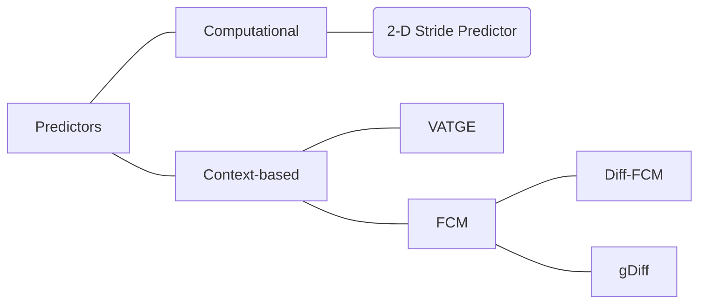

# HPCA 14

本章节研究文章 *Practical Data Value Speculation for Future High-end Processors*[^1], 简称 HPCA 14, 这篇文章主要是研究 CVP, 一种上下文有关的、Load value 的预测器。

## Abstract

> Dedicating more silicon area to single thread performance will necessarily be considered as worthwhile in future – potentially heterogeneous – multicores. 
>
> In particular, Value prediction (VP) was proposed in the mid 90’s to enhance the performance of high-end uniprocessors by breaking true data dependencies.

作者说在未来的多核架构中，将更多的硅面积用于提高单线程的性能是值得的。

特别是 VP 的出现，可以打破真正的数据依赖来提高高端单处理器的性能。

:::tip 💚💚 流水线并行 & 处理器并行

- 流水线：提高指令的并行度；流水线聚焦于指令，所以是 uniprocessor
- 多处理器：提高处理器的并行度

:::

> In this paper, we reconsider the concept of Value Prediction in the contemporary context and show its potential as a direction to improve current single thread performance.
>
> First, building on top of research carried out during the previous decade on confidence estimation, we show that every value predictor is amenable to very high prediction accuracy using very simple hardware. This clears the path to an implementation of VP without a complex selective reissue mechanism to absorb mispredictions. 
>
> Prediction is performed in the in-order pipeline frond-end and validation is performed in the in-order pipeline back-end, while the outof-order engine is only marginally modified.

作者在当代语境(contemporary context) 下重新思考了 VP 的概念，并且发觉其作为提高单线程性能方向的一个潜力。

首先作者阐述了简单的硬件就可以实现精确度较高的 VP, 也不用很复杂的 selective reissue 机制。

:::tip 单线程流水线 vs 多线程流水线

@todo 🔴🔴🔴 

:::

> Second, when predicting **back-to-back occurrences** of the same instruction, previous context-based value predictors relying on local value history exhibit a complex critical loop that should ideally be implemented in a single cycle. 
>
> To bypass this requirement, we introduce a new value predictor VTAGE *harnessing the global branch history*. VTAGE can seamlessly predict back-to-back occurrences, allowing predictions to *span over several cycles*. It achieves higher performance than previously proposed context-based predictors.

其次，对于同一个指令的 back-to-back 出现，以前基础 local value history 的方法会显示出一个复杂的关键循环。为了解决这个问题，作者引入了一个新的预测器 VTAG, 利用全局分支历史，VTAG 可以无缝预测 back-to-back 的发生，其允许预测跨越几个周期。相比于以前的基于上下文的预测器，实现了更高的性能。

:::warning 🧡🧡 一些理解

1. VTAGE 利用了全局分支历史，是如何体现的？
2. span over several cycles, 如何跨越几个 cycle?

:::

## Introduction

> Gabbay et al. and Lipasti et al. independently proposed Value Prediction to speculatively ignore true data dependencies and therefore shorten critical paths in computations. 

VP 可以缩短关键路径。

> Said penalty can be as high as the cost of a branch misprediction, yet the benefit of an individual correct prediction is often very limited.

错误惩罚可能和分支预测的错误惩罚一样高，所以单个正确预测的收益十分有限。

> As a consequence, high coverage is mostly irrelevant in the presence of low accuracy.

在精度极低的情况下，高覆盖率反而是没有必要的。

基于以上两段话，预测的设计思路在于：提高预测的准确率，可以接受适当降低覆盖率；故此作者提出 FPC, 其定义如下：

> The Forward Probabilistic Counters (FPC) scheme yields value misprediction rates well under 1%, at the cost of reasonably decreasing predictor coverage.

FPC 的错误预测率远低于 1%，同时牺牲了预测覆盖率。

使用 FPC 的好处如下：

> Our experiments show that when FPC is used, no complex repair mechanism such as selective reissue is needed at execution time.

使用 FPC 的话可以避免使用如 selective reissue 这种复杂机制。

本文的贡献主要由两点：

> First, we present a simple yet efficient confidence estimation mechanism for value predictors. The Forward Probabilistic Counters (FPC) scheme yields value misprediction rates well under 1%, at the cost of reasonably decreasing predictor coverage. 
>
> All classical predictors are amenable to this level of accuracy. 
>
> FPC is very *simple to implement* and does not require substantial change in the counters update automaton. Our experiments show that when FPC is used, no complex repair mechanism such as selective reissue  is needed at execution time. Prediction validation can even be delayed until commit time and be done in-order: Complex and power hungry logic needed for execution time validation is not required anymore. As a result, prediction is performed in the in-order pipeline front-end, validation is performed in the in-order pipeline back-end while the out-of-order execution engine is only marginally modified.

第一点是提出了 FPC, 一个新的计数器。

- 实现简单，不需要对计数器更新自动机进行实质性更改
- 在执行阶段不需要使用复杂的修复机制如 selective reissue
- Validation 可以推迟到 commit 阶段并按顺序完成；这意味着复杂耗电的 execution 阶段的 valudation 不再需要了
- out-of-order engine 只需做轻微修改

:::tip 随想

FPC 是一种置信度的衡量机制。FPC 的作用在于降低 misprediction rate.

:::

> Second, we introduce the Value TAGE predictor (VTAGE). This predictor is directly derived from research propositions on branch predictors [21] and more precisely from the indirect branch predictor ITTAGE. 
>
> VTAGE is the first hardware value predictor to leverage a long global branch history and the path history. Like all other value predictors, VTAGE is amenable to very high accuracy thanks to the FPC scheme. 
>
> VTAGE is shown to outperform previously proposed context-based predictors such as Finite Context Method and complements stride-based predictors.

第二点是提出了 VTAGE 预测器。

- VTAGE 是一个硬件 value predictor. 其利用了长期全局 branch history 和 path history.
- 由于 FPC 机制，VTAGE 具有很高的精度

:::tip 随想

上述这段话定义了 VTAG, 其基本属性是值预测器，但是利用了：

- global branch history
- path history

:::

> Moreover, we point out that unlike two-level predictors (in particular, predictors based on local value histories), VTAGE can seamlessly predict back-to-back occurrences of instructions, that is, instructions inside tight loops. Practical implementations are then feasible.

更加厉害的是，与两级预测器，特别是基于 local value history 的预测器不同的是，VTAGE 可以完美预测指令 back-to-back 的出现，即 tight loops.

下面这段话比较难以理解：

> Prediction validation can even be delayed until commit time and be done in-order: Complex and power hungry logic needed for execution time validation is not required anymore.

预测的验证可以在 commit 阶段完成？所以说简化了验证的步骤。

:::warning

❌❌❌ 但是这样的话，我们如何保证预测的正确性呢？

:::

结合下面这段话，看能否尝试理解：

> As a result, prediction is performed in the in-order pipeline front-end, validation is performed in the in-order pipeline back-end while the out-of-order execution engine is only marginally modified.

上述也是原文中的摘录。

## 	Questions

🤷‍♂️🤷‍♂️🤷‍♂️ 从以上对于文章的阅读，我们需要从文章中找到以下问题的答案：

1. FPC 的实现原理是什么？
2. VTAGE 如何利用 global branch history 和 path history? 其与上下文有关是如何体现的？
3. VATGE 如何解决 tight lopp 的问题？

## Related Work on VP

我们有必要研究一下相关的工作，看能否从中获得一些心得体会。

> Sazeides et al. refine the taxonomy of Value Prediction by categorizing predictors.

上述作者将 predictors 分成了两类：

1. Computational，计算的
2. Context-based

这两种方式是互补的因为它们擅长预测不同的指令（前文研究的 HPCA19 的文章也是使用了 4 个预测器，挖掘出来了互补的关系）。

对于 Computational 预测器而言，🟢🟢🟢 典型的如 2-Delta Stride predictor 这种需要进行研究。对于 Computational 预测器而言，其通过应用一个 fucntion 去预测 values.

对于 Context-based 的预测器而言，就是根据预测的历史来实现值的预测，典型的如 $n^th$ order *Finite Context Method(FCM)*  预测器，这些预测器一般使用 two-level 的预测结构：

1. 第一层结构是 VHT(Value History Table) 
2. 第二层结构是 VPT(Value Prediction Table)

VHT hash 到 VPT 上，VPT 上包含了实际的预测。需要注意，通常而言，VHT 和 VPT 都含有一个饱和计数器，以便于衡量置信度。

Goeman 实现了 diff-FCM, 通过追踪 local history 中的 diff, 而不是 value 本身，这样达到了更加节省空间的目的。

Zhou 实现了 gDiff 预测器，gDiff 计算了一个指令的结果和最后 n 个动态指令结果之间的 diff, 如果发现了一个 stable difference, 也可以称之为 stride, 则该指令的结果可以通过先前额指令进行预测。然而，gDiff 的缺陷在于，其依赖于另一个预测器在预测阶段去预测全局的投机值。但是正因为如此，gDiff 预测器可以被添加在任何 top of any predictor.

本文提出来的 VTAGE 预测器可以理解为一个 context-based 的预测器，其中的 context 包括 global branch history 和 path history.

## Motivation

> We identify two factors that will complicate the adaptation and implementation of value predictors in future processor cores. 
>
> First, *the misprediction recovery penalty and/or hardware complexity*. Second *the back-to-back predictions for two occurrences of the same instruction which can be very complex to implement while being required to predict tight loops.*

有两个因素可能使得预测器复杂化：

1. Misprediction Recovery
2. Back-to-back prediction

> A tight loop is a loop that loops many times and the loop body has few instructions.

### Misprediction Recovery

之前的很多研究都没有意识到 misprediction recovery 的复杂性，而只关注于准确率或者覆盖率，忽略了实际的加速效果。后续的很多研究也基本上忽略了与 misprediction recovery  相关的性能损失。

> Moreover, despite quite high coverage and reasonable accuracy, one observation that can be made from these early studies is that the average performance gain per correct prediction is rather small.

上述话说明了，单个正确预测的收益比较有限。

衡量 misprediction 的 recovery 的消耗可以分为两个因素：

1. average misprediction penalty(处罚) $P_{value}$
2. absolute number of misprediction $N_{misp}$

于是有总的错误预测惩罚计算如下：
$$
T_{recov} = P_{value} * N_{misp}
$$

> As we already pointed out, the total misprediction recovery cost can be minimized through two vehicles: Minimizing the individual misprediction penalty and/or minimizing the total number of mispredictions.

从上述公式中我们可以得出结论，降低 cost 可以使用两种方式：

- 降低单个预测错误惩罚
- 最小化错误预测数量

#### Value Misprediction Scenarios

处理器中目前已有两种机制去管理 value misprediciton recovery:

1. pipline squashing
2. selective reissue

不同之处如下：

> They induce very different average misprediction penalties, but are also very different from a hardware complexity standpoint.

这两者产生的平均错误预测惩罚不同，硬件复杂性也不同。

💚💚 什么是 pipline squashing?

暂时可以理解为 pipline flushing, clearing or squashing.

💚💚 pipline squashing 做了什么事情？

目前猜测的，需要继续研究。

> Pipeline squashing is already implemented to recover from branch mispredictions. *On a branch misprediction, all the subsequent instructions in the pipeline are flushed* and instruction fetch is resumed at the branch target. This mechanism is also generally used on load/store dependency mispredictions.
> Using pipeline squashing on a value misprediction is *straightforward*, but *costly as the minimum misprediction penalty* is the same as the minimum branch misprediction penalty. However, to limit the number of squashes due to VP,  **squashing can be avoided if the predicted result has not been used yet, that is, if no dependent instruction has been issued.**

pipline squashing 可以被用于分支预测失败的 recovery 中，也可以用与 VP 失败的 recovery 中，两者的代价是一致的。需要注意的是，VP 的 squash 可以被避免的，只要预测的结果还没有被应用，也就是说，没有 dependent instruction 被 issued.

❌❌ selective reissue 不是很好理解，需要再理解一下。

> Selective reissue is implemented in processors to recover in case where *instructions have been executed with incorrect operands*, in particular this is used to recover from L1 cache hit/miss mispredictions (i.e. load-dependent instructions are issued after predicting a L1 hit, but finally the load results in a L1 miss). When the execution of an instruction with an incorrect operand is detected, the instruction as well as all its dependent chain of instructions are canceled then replayed.

#### Validation at Execution vs Validation at Commit Time

下面是对于两种机制的对比：

1. 在实现的节点上，selective issue 必须是在 execution 的时候就实现了，其目的是为了限制错误预测的代价；而 pipeline squashing 则可以在 execution 或者 commit 的时候实现。
2. pipeline squashing 在 execution 时间去 validate 预测必须重新设计 out-of-order engine, 除此之外，预测的 value 还必须在每个乱序的阶段传播，等等。综合来看，在 exec 阶段去验证比较复杂。
3. 反之，在 commit 后进行 pipeline squashing 可能会导致预测错误后代价较高，但是其实现机制较为简单，特别是对于 out-of-order 来说，不需要增加额外的复杂机制。

简单使用表格进行概括：

|                    | Validation at Execution                                      | Validation at Commit                                         |
| ------------------ | ------------------------------------------------------------ | ------------------------------------------------------------ |
| Pipeline Squashing | - Results in a minimum misprediction penalty  - Need to redesign the complete out-of-order engine - 20 ~ 40 cycle penalty | - Results in a quite high average misprediction penalty  - Do not reduce complex mechanisms in the out-of-order execution engine - 40 ~ 50 cycle penalty |
| Selective Reissue  | - Must be implemented at execution time - 5 ~ 7 cycle penalty | N/A                                                          |

如果选择 validation at execution 的话：

> However, validating predictions *at execution time* necessitates to *redesign the complete out-of-order engine*: The predicted values must be propagated through all the out-of-execution engine stages and the predicted results must be validated as soon as they are produced in this out-of- order execution engine.

需要重新设计乱序引擎，预测的值需要在所有的 stage 传播并且预测的结果必须经过验证。

> On the contrary, **pipeline squashing at commit** results in a quite high average misprediction penalty since it can delay prediction validation by a substantial number of cycles. Yet, it is much easier to implement for Value Prediction since it does not induce complex mechanisms in the out-of-order execution engine. 
>
> It essentially restrains the Value Prediction related hardware to the in-order pipeline front-end (prediction) and the in-order pipeline back-end (validation and training). Moreover, it allows not to checkpoint the rename table since the committed rename map contains all the necessary mappings to restart execution in a correct fashion.

pipeline at commit 会导致较高的 misprediction penalty, 但是其优点在于不需要重新设计复杂的 out-of-order engine.

**Balancing Accuracy and Coverage**

> The total misprediction penalty Trecov is roughly proportional to the number of mispredictions. Thus, if one drastically improves the accuracy at the cost of some coverage then, as long as the coverage of the predictor remains quite high, there might be a performance benefit brought by Value Prediction, even though the average value misprediction penalty is very high.

$T_{recov}$ 与错误预测的数量大致成正比，所以如果可以在牺牲一些覆盖率的情况下提升精度，那么总的 VP 性能是可以得到提升的。

### Back-to-back prediction

> Unlike a branch prediction, a value prediction is needed rather late in the pipeline (at dispatch time).

不同于分支预测，值预测在 pipeline 中被需要的相当晚（在 dispatch 阶段）

:::tip 📍📍📍 dispatch

> The instruction dispatch unit controls when the decoded instructions are dispatched to the execution pipelines. It includes **Issue Queues** for storing instruction pending dispatch to execution pipelines[^2].

从上面的描述我们可以看出，dispatch 阶段处于指令 decode 之后，execution 之前。

在某些架构中，就是 issue.

 Issue Queues 是用来保存将要被 execution 的指令。

:::

> Thus, at first glance, prediction latency does not seem to be a concern and long lookups in large tables and/or fairly complex computations could be tolerated. 

基于上述我们分析的 VP 被需要的阶段，乍一看，预测的延迟似乎不是一个问题，我们可以容忍大表或者复杂计算。

> However, for most predictors, **the outcomes of a few previous occurrences of the instruction are needed to perform a prediction for the current instance.**

但是，对于大多数的预测器而言，当前实例的预测是依赖于指令先前出现指令的几次结果的。

💚💚 这边有个细节，仔细看那段英文原文的话我们可以发现，其描述的主题对象一直是 instruction, 即指令先前的出现和当前预测之间的关系。

> Consequently, for those predictors, either the critical operation must be made short enough to allow for the prediction of close (possibly back-to-back) occurrences (e.g. by using small tables) or the prediction of tight loops must be given up.

所以，对这些预测器而言，就要求关键路径尽可能的短。或者说 tight loop 必须尽可能得放弃。

> Unfortunately, tight loops with candidates for VP are quite abundant in existing programs.

不幸的是，tight loop 这种情况在程序中很多。

> Experiments conducted with the methodology we will introduce in Section 7 suggest that for a subset of the SPEC’00/’06 benchmark suites, there can be as much as 15.3% (3.4% a-mean) fetched instructions eligible for VP and for which **the previous occurrence was fetched in the previous cycle** (8-wide Fetch). We highlight such critical operations for each predictor in the subsequent paragraphs.

上述文字主要描述了实验结果，重要的部分 highlight 出来。

*总结一下，本部分首先阐述了 VP 需要值的阶段较为靠后，所以是允许预测延迟的，但是对于 tight loop 类似的场景，会要求关键路径尽可能短（或者说延迟尽可能小）。作者在后面通过实验的结果阐述了 tight loop 场景在实际是普遍存在的。*

接下来主要是对比 LVP, stride 和 FCM, 分别阐述这几个预测器的优缺点。

#### LVP

> Despite its name, LVP does not require the previous prediction to predict the current instance as long as the table is trained. Consequently, LVP uses only the program counter to generate a prediction.

LVP 不需要依赖先前的预测结果，但是其依赖于程序计数器 PC 的结果。

> Thus, successive table lookups are independent and can last until **Dispatch**, meaning that large tables can be implemented.

因此，连续的表查找是独立的，可以持续到 dispatch 阶段，因此 LVP 是可以使用大表的。

#### Stride

@todo

#### FCM

全称是 Finite Context Method, 其结构是 two-level:

> The first-level consists of a value history table accessed using the instruction address. This history is then hashed and used to index the second level table.

这个两级结构的图可以参考 Figure 1.

#### Summary

上面阐述了三个预测器的实现细节和缺点。

> Table lookup time is not an issue as long as the prediction arrives before Dispatch for LVP and Stride. Therefore, large predictor tables can be considered for implementation. For stride-based value predictor, the main difficulty is that one has to track the last (possibly speculative) occurrence of each instruction.

上述文字说明了 LVP 和 stride 的缺点。

> For local value based predictors the same difficulty arises with the addition of tracking the n last occurrences. Moreover the critical operations (hash and the 2nd level table read) lead to either using small tables or not being able to timely predict back-to-back occurrences of the same instruction. Implementations of such predictors can only be justified if they bring significant performance benefit over alternative predictors.

基于 local value 的预测器也会受到关键操作（hash 和第 2 级表的读取）的影响。

> The VTAGE predictor we introduce in this paper is able to seamlessly predict back-to-back occurrences of the same instruction, thus its access can span over several cycles. VTAGE does not require any complex tracking of the last occurrences of the instruction. 
>
> Section 8 shows that VTAGE (resp. hybrid predictor using VTAGE) outperforms a local value based FCM predictor (resp. hybrid predictor using a local value based FCM predictor).

本文提出的 VTAGE 预测器可以完美预测 back-to-back 场景，因此它的访问可以跨越几个循环。

### Commit Time Validation and Hardware Implications on the Out-of-Order Engine

> In the previous section, we have pointed out that the hardware modifications induced by *pipeline squashing* at *commit time on* the Out-of-Order engine are limited. 
>
> In practice, the only major modification compared with a processor without Value Prediction is that the predicted values must be written in the physical registers before Dispatch.

前面的章节提到了，pipline squashing + commit time validation 对 out-of-order 的影响是有限的。

事实上，在与没有 VP 的处理器相比，唯一的主要修改时：预测值必须在 dispatch 之前写入物理寄存器。

> At first glance, if every destination register has to be predicted for each fetch group, one would conclude that the number of write ports should double. 
>
> In that case the overhead on the register file would be quite high. The area cost of a register file is approximately proportional to $(R + W) *  (R + 2W)$, $R$ and $W$ respectively being the number of read ports and the number of write ports.
>
> Assuming $R = 2W$, the area cost without VP would be proportional to $12W^2$ and the one with VP would be proportional to $24W^2$, i.e. the double. Energy consumed in the register file would also be increased by around 50% (using very simple Cacti 5.3 approximation).

乍一看，如果每一个 fetch group 的目标寄存器都必须被预测的话，则会得出结论，write ports 应该翻一番。

接下来是对寄存器消耗的计算，其中 $R$ 表示读寄存器，$W$ 表示写寄存器。

经过一系列的计算，最后发现寄存器的面积要增加 50%!

> For practical implementations, there exist several opportunities to limit this overhead. 
>
> *For instance one can limit the number of extra ports needed to write predictions.* Each cycle, only a few predictions are used and the predictions can be known several cycles before Dispatch: One could limit the number of writes on each cycle to a certain limit, and buffer the extra writes, if there are any. 
>
> Assuming only $W/2$ write ports for writing predicted values leads to a register file area of $35W^2 /2$ , saving half of the overhead of the naive solution. The same saving on energy is observed (Cacti 5.3 estimations).
>
> Another opportunity is to *allocate physical registers for consecutive instructions in different register file banks, limiting the number of write ports on the individual banks.* One can also prioritize the predictions according to the criticality of the instruction and only use the most critical one, leveraging the work on criticality estimation of Fields et.

但是事实上，有一些 opportunities 去限制这一开销。

1. 例如可以限制写入预测需要的额外寄存器数量，下面是一些举例和计算。
2. 为连续指令分配物理寄存器，限制单个 bank 的写入端口数。甚至也可以根据优先级选择使用最关键的指令。

> Exploring the complete optimization to reduce the overhead on the register file design is out of the scope of this paper. It would depend on the precise micro-architecture of the processor, but we have clearly shown that this overhead in terms of energy and silicon area can be reduced to less than 25% and 50% respectively. Moreover, this overhead is restricted to the register file and does not impact the other components of the out-of-order engine. Similarly, thanks to commit time validation, the power overhead introduced by Value Prediction will essentially reside in the predictor table.

作者说明了减少寄存器的数量不在本文的研究范围之内。

❌❌❌ 这句话难理解：Similarly, thanks to commit time validation, the power overhead introduced by Value Prediction will essentially reside in the predictor table.

### Maximizing Value Predictor Accuracy Through Confidence

> As we already pointed out, the total misprediction recovery cost can be minimized through two vehicles: **Minimizing the *individual misprediction penalty* and/or minimizing the *total number of mispredictions.***

错误预测的恢复损耗从两个方面衡量。

> When using the prediction is not mandatory (i.e. contrarily to branch predictions), an efficient way to minimize the number of mispredictions is to use saturating counter to estimate confidence and use the prediction only when the associated confidence is very high. 
>
> For instance, for the value predictors considered in this study, a 3-bit confidence counter per entry that is reset on each misprediction leads to an accuracy in the 95-99% range if the prediction is used only when the counter is saturated. However this level of accuracy is still not sufficient to avoid performance loss in several cases unless idealistic selective reissue is used. 
>
> To increase accuracy, Burtscher et al. proposed the SAg confidence  stimation scheme to assign confidence to a history of outcomes rather than to a particular instruction. However, this entails a second lookup in the counter table using the outcome history retrieved in the predictor table with the PC of the instruction. A way to maximize accuracy without increasing complexity and latency would be preferable.

当预测不是强制的时候，使用饱和计数器，最小化错误预测的数量，计算置信值并且只使用置信度很高的预测。举例了 3-bit 饱和计数器的合理使用可以达到 95% - 99% 的准确率，但是这个准确率还是不够，有些专家提出了 SAg 置信度估计方案，但是会增加复杂性。现在需要一个准确度高的，但是不增加复杂性和时延的方法。

> We actually found that simply using **wider counters** (e.g. 6 or 7 bits) leads to much more accurate predictors while the prediction coverage is only reduced by a fraction. 
>
> Prediction is only used on saturated confidence counters and counters are reset on each misprediction. Interestingly, probabilistic 3-bit counters such as defined by Riley et al.  augmented with reset on misprediction achieve the same accuracy for substantially less storage and a marginal increase in complexity.

作者发现使用 wider counters 可以提升很多的预测准确度，随之的代价是很小的覆盖率损失。

*这句话的意思是说，使用更多 bit 位的计数器，其预测精度会提高；但是作者说明的，覆盖率会降低，我猜测可能是因为使用了饱和计数器的缘故，目前预测仅在饱和计数器饱和的时候进行预测，那么就意味着，越晚饱和，那么预测的覆盖率就越低。*

这个优点很多，具体怎么使用，要在后文研究。

> We refer to these probabilistic counters as Forward Probabilistic Counters (FPC). **In particular, each forward transition is only triggered with a certain probability.** 
>
> In this paper, we will consider 3-bit confidence counters using a probability vector $v = \{1, 1/16, 1/16, 1/16, 1/16, 1/32, 1/32\}$ for pipeline squashing at commit and $v = \{1, 1/8, 1/8, 1/8, 1/8, 1/16, 1/16\}$ for selective reissue, respectively mimicking 7-bit and 6-bit counters.
>
> This generally prevents all the considered VP schemes to slow down execution while minimizing the loss of coverage (as opposed to using lower probabilities). The used pseudo-random generator is a simple Linear Feedback Shift Register.

使用了 FPC 计数器，并且提出了 3-bit 计数器，每一位存在一个指定的概率值。

这个 FPC 翻译名称叫做前向概率计数器，是以固定的概率触发的，也就是说，这种计数器的优点在于，我只是使用了 3-bit, 就达到了 6-bit 或者 7-bit 的效果。由此，达到了我们上文提到的，准确率高但是不增加复杂性和时延。

注意在 HPCA 19 的文章中，我们使用了这个 FPC.

> Using FPC counters instead of full counters limits the overhead of confidence estimation. It also opens the opportunity to adapt the probabilities at run-time as suggested in and/or to individualize these probabilities depending on the criticality of the instructions.

使用 FPC 计数器而不是完整计数器限制了置信度估计的开销，并且还提供了在运行时调整概率的机会，如根据重要指令个性化概率。

### The Value TAgged GEometric Predictor

题目的含义为：值标记的几何预测器。

第一段首先列举出来了 VTAGE 来源于分支预测的 ITTAGE, ITTAGE 来源于 TAGE.

> As it uses branch history to predict, we expect VTAGE to perform much better than other predictors when instruction results are **indeed depending on the control flow**. 
>
> Nonetheless, VTAGE is also able to capture control-flow independent patterns as long as they are short enough with regard to the maximum history length used by the predictor. 
>
> In particular, it can still capture short strided patterns, although space efficiency is not optimal since each value of the pattern will reside in an entry (contrarily to the Stride predictor where one pattern can be represented by a single entry).

这一段的细节我们暂时不进行考究。

TAGE 使用了分支的历史进行预测，当指令的结果实际依赖于控制流的时候，我们希望 VTAGE 能比其他的预测器表现得更好。尽管如此，VTAGE 也能够捕获 control-flow independent patterns, 只要他们相对于预测器使用的最大历史长度足够短。

:::warning ❌❌ 控制流

需要理解文章中所说的控制流是什么意思？在什么情况下，指令的结果是取决于控制流的？

:::

> Fig. 2 describes a (1+N)-component VTAGE predictor. The main idea of the VTAGE scheme (exactly like the ITTAGE scheme) is to use several tables – components – storing predictions. Each table is indexed by a different number of bits of the global branch history, hashed with the PC of the instruction. 
>
> The different lengths form a geometric series (i.e. VT1 is accessed with two bits of the history, VT2 with four, VT3 with eight and so on). 
>
> These tables are backed up by a base predictor – a tagless LVP predictor – which is accessed using the instruction address only. 
>
> In VTAGE, an entry of a tagged component consists of a partial tag, a 1-bit usefulness counter u used by the replacement policy, a full 64-bit value val, and a confidence/hysteresis counter c. An entry of the base predictor simply consists of the prediction and the confidence counter.

上述文字在陈述 VTAGE 预测器是如何实现的，这段比较重要。

图 2（本篇文章中没有给出）描述了一个 1+N 组件的 VTAGE 预测器。其方案的核心思想是使用一些表，也可以说是组件，去存储预测，每一个表都被全局分支历史的 bit 数量索引，被指令的 PC 所 hash.

:::warning ❌❌❌ bits of global barnch history

这里提到了全局预测历史的 bit 数量，在查阅资料以后，这个的意思可能是，在分支预测中，存在一个全局分支预测历史寄存器 Global History Register (GHR), 这个 GHR 可能由 10-bit 组成，可以用来表示最近 10 个分支的历史，而这 10-bit 可以用来索引 1024 个 PHT 的 entry, 每一个 entry 由 2-bit 组成，是一个饱和计数器，索引的方式是 PC 的后 10-bit 与 GHR 进行异或[^3]。

🔴🔴 至于为什么是异或，还需要进行深入的思考。 

:::

不同的长度形成一个几何级数。

VTAGE 主要是使用了很多 table, VT1, VT2, …, VTn, 分别代表的含义是：VT1 关联了 2-bit 的 global branch history, VT2 为 4-bit, VT3 为 8-bit, 以此类推，这就是等比级数或者几何级数。

这些表由无标记 LVP 预测器备份，该预测器仅仅使用指令地址访问。

第三段讲述了预测器具体的实现细节。

> At **prediction time**, all components are searched in parallel to check for a tag match. The matching component accessed with the longest history is called the provider component as it will provide the prediction to the pipeline.

在预测的时候，并行查找与 tag 匹配的条目 match 的组件并且与 longest history 联系的称作 provider component, 在流水线中提供预测。

这边的 longest history 的意思是说，bit 数最长的，也就是说，从大到小进行查找；比如说对于一个 Global History Register (GHR) 而言，假设其有 10 位，那么我的 VT1 有 2 位，VT2 是 4 位…假设 VT2 就是最后一个，那么我就从 VT2 开始查找，这就是 longest history.

> At **update time**, only the provider is updated. 
>
> On either a correct or an incorrect prediction, $c$ and $u$ are updated.  
>
> On a misprediction, $val$ is replaced if $c$ is equal to 0, and a new entry is allocated in a component *using a longer history than the provider*: All “upper” components are accessed to see if one of them has an entry that is not useful ($u$ is 0).  If none is found, the u counter of all matching entries in the upper components are reset, but no entry is allocated. Otherwise, a new entry is allocated in one of the components whose corresponding entry is not useful. The component is chosen randomly.

在更新的时候，只更新 provider. (也就是说，只更新最长历史的那张表)

无论预测是正确或者不正确，$c$ 和 $u$ 会被更新。其中 c 表示饱和计数器，u 表示是否有用，1:useful, 0: not useful.

如果是 misprediction, $val$ 会被替换掉，如果计数器 c 是 0 的话，并且新的条目会被分配，使用比 provider 更长的 history.  所有更上层的组件都被访问，去判断是否其中有一个 entry 是无用的，在这里 $u == 0$（二进制）是无用的，$u$ 是一个 useful bit, 其被 replacement policy 使用。

如果没有找到任何一个，上层组件的 $u$ 计数器都被重置，意味着没有 entry 被分配。如果找到了的话，一个新的 entry 就被分配了，被分配的策略是：随机策略，选择一个组件的 entry 不是 useful 的。

> The main difference between VTAGE and ITTAGE is essentially the usage: The predicted value is used only if its confidence counter is saturated. We refer the reader to for a detailed description of ITTAGE.

VTAGE 和 ITTAGE 不同的点在于，饱和计数器饱和的时候才使用预测的值。

> Lastly, as a prediction does not depend on previous values but only on previous control-flow, VTAGE can seamlessly predict instructions in tight loops and behaves like LVP in Fig. 1. However, due to index hash and multiplexing from multiple components, it is possible that its prediction latency will be higher, although this is unlikely to be an issue since prediction can span several cycles.

最后，由于预测不依赖于先前的值，而只依赖于先前的控制流，VTAGE 可以完美预测 tight loop.

然而，由于多个组件的索引哈希和复用，其预测延迟可能会更高，尽管这可能不是一个问题，因为预测是可以跨周期的。

## Evaluation Methodology

### Value Predictors

#### Single Scheme Predictors

> We study the behavior of several distinct value predictors in addition to VTAGE.
>
> Namely, LVP, the 2-delta Stride predictor (2D-Stride) as a representative of the stride-based predictor family4 and a generic order-4 FCM predictor (o4-FCM)

除了 VTAGE, 我们还需要对比一些 value predictors. 包括 LVP, 2D-Stride 和 o4-FCM.

> All predictors use 3-bit saturating counters as confidence counters. The prediction is used only if the confidence counter is saturated. 
>
> Baseline counters are incremented by one on a correct prediction and reset on a misprediction. The predictors were simulated with and without FPC (See Section 5). As the potential of VP has been covered extensively in previous work, we **limit ourselves to reasonably sized predictors** to gain more concrete insights. 
>
> We start from a 128KB LVP (8K-entry) and derive the other predictors, each of them having 8K entries as we wish to gauge the prediction generation method, not space efficiency. Predictor parameters are illustrated in Table 1.

先阐述这些预测器都使用了 3-bit 的饱和计数器作为置信度的衡量标准，并且只有在饱和计数器饱和的时候对应的预测才被使用。

如果预测成功的话，基线的预测器 +1，misprediction 的话就重置。

预测器在有 FPC 和没有 FPC 的情况下模拟。并且限制了预测器的大小。

❌❌ 我们从 128K 的 LVP 开始，推导其他预测器，每个预测器都有 8K 个 entries, 因为我们希望衡量预测生成方法，而不是空间效率。

> For VTAGE, we consider a predictor featuring 6 tables in addition to a base component. The base component is a tagless LVP predictor. We use a single useful bit per entry in the tagged components and a 3-bit hysteresis/confidence counter c per entry in every component. The tag of tagged components is *12+rank-bit* long with *rank* varying between 1 and 6. The minimum and maximum history lengths are respectively 2 and 64 as we found that these values provided a good tradeoff in our experiments.

对于 VTAGE, 我们考虑一个预测器，除了一个基础组件外，还包括 6 个表。基础组件是 tagless 的 LVP 预测器。我们在每个 tagged 的组件中使用一个 useful 标志位和一个 3-bit 的置信度/迟滞计数器。tag 字段的大小是 $12 + rank$ bit, $rank$ 的取值在 1~6 之间，由此计算，最小和最大的 history length 的范围在 2~64 之间，这是一个很好的 trade-off.

> For o4-FCM, we use a hash function similar to those…..

说了一下 o4-FCM 的细节，我们暂时不对其进行研究。

> We consider that all predictors are able to predict instantaneously. **As a consequence, they can seamlessly deliver their prediction before Dispatch.** 
>
> This also implies that o4- CM is – unrealistically – able to deliver predictions for two occurrences of the same instruction fetched in two consecutive cycles. Hence, its performance is most likely to be overestimated.

我们认为所有的预测器都可以瞬间预测，因此，它们可以在 dispatch 之前完美地传递预测。

#### Hybrid Predictors

作者阐述了一下，表明混合预测是可行的（混合预测我们在 HPCA 19 中进行重点研究）。

### Simulator

>  In our experiments, we use the gem5 cycle-accurate simulator (x86 ISA).

实验使用了 gem5 仿真。

> We model a fairly aggressive pipeline: 4GHz, 8-wide superscalar, out-of-order processor with a latency of 19 cycles. 
>
> We chose a slow front-end (15 cycles) coupled to a swift back-end (3 cycles) to obtain a realistic misprediction penalty. 

作者模拟了相当激进的 pipline.

:::tip

🧡🧡🧡

这边需要专题理解，suprescalar, latency 的具体含义。

🧡🧡🧡

:::

作者选择了一个慢的前端耦合到快速的后端中，可以观察逼真的 misprediction 惩罚。

#### Misprediction Recovery

> We illustrate two possible recovery scenarios, squashing at commit time and a very idealistic selective reissue.
>
> In both scenarios, recovery is unnecessary if the prediction of instruction I was wrong but no dependent instruction has been issued before the execution of I, since the prediction is replaced by the effective result at execution time. This removes useless squashes and is part of our implementation.

misprediction 时候的恢复有两种方式：

1. squashing at commit time
2. 十分理想主义的 selective reissue(理想主义是作者对其的评价，不代表我本人观点)

在上述两种情况下，如果指令的预测错误但是其在执行之前没有 issue 依赖指令，则不需要 recovery, 因为预测会被执行时的有效结果取代。

## Reference

[^1]: A. Perais and A. Seznec, "Practical data value speculation for future high-end processors", *High Performance Computer Architecture (HPCA) 2014 IEEE 20th International Symposium on*, Feb 2014.

[^2]: [ARM Cortex-A75 Core Technical Reference Manual r2p0](https://developer.arm.com/documentation/100403/0200/functional-description/technical-overview/components/instruction-dispatch?lang=en)
[^3]: [Assignment 1: Understanding Branch Prediction](https://www.inf.ed.ac.uk/teaching/courses/car/Pracs/2017-18/Assignment1.pdf) 

