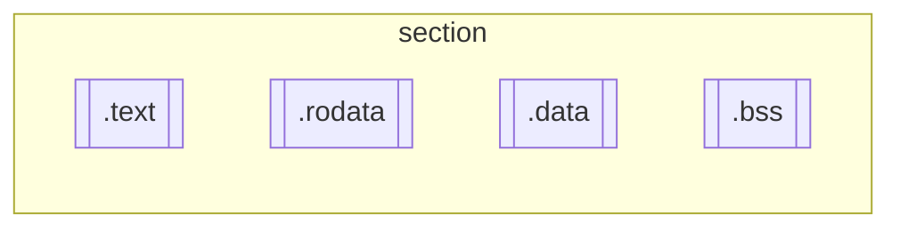
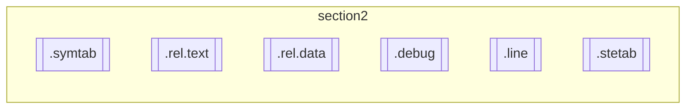

# init.h

## Abstract

本文分析 Linux 源码 `init.h` 文件，并研究其中涉及到的内核初始化过程、Thermal 模块如何调用等问题。

## initcall

### initcall{n}.init

内核初始化过程中的调用顺序[^1]：所有的 `__init` 函数在区段 `.initcall.init` 中还保存了一份函数指针，在初始化时内核会通过这些函数指针调用这些 `__init` 函数指针，并在整个初始化完成后，释放整个 `init` 区段，包括 `.init.text`，`.initcall.init` 等。

这些函数在内核初始化过程中的调用顺序只和这里的函数指针的顺序有关，和函数本身在 `.init.text` 的区段无关。在 2.4 内核中，这些函数指针的顺序也是和链接的顺序有关的，是不确定的。在 2.6 内核中，`initcall.init` 区段又分成7个子区段，分别是:

```markdown
.initcall1.init  
.initcall2.init  
.initcall3.init  
.initcall4.init  
.initcall5.init  
.initcall6.init  
.initcall7.init
```

各个区段定义的方法分别是：

```markdown
core_initcall(fn) --->.initcall1.init  
postcore_initcall(fn) --->.initcall2.init  
arch_initcall(fn) --->.initcall3.init  
subsys_initcall(fn) --->.initcall4.init  
fs_initcall(fn) --->.initcall5.init  
device_initcall(fn) --->.initcall6.init  
late_initcall(fn) --->.initcall7.init
```

在新的 5.17.4 内核中，各个区段的定义方法有所改变：

```c
#define pure_initcall(fn)		__define_initcall(fn, 0)

#define core_initcall(fn)		__define_initcall(fn, 1)
#define core_initcall_sync(fn)		__define_initcall(fn, 1s)
#define postcore_initcall(fn)		__define_initcall(fn, 2)
#define postcore_initcall_sync(fn)	__define_initcall(fn, 2s)
#define arch_initcall(fn)		__define_initcall(fn, 3)
#define arch_initcall_sync(fn)		__define_initcall(fn, 3s)
#define subsys_initcall(fn)		__define_initcall(fn, 4)
#define subsys_initcall_sync(fn)	__define_initcall(fn, 4s)
#define fs_initcall(fn)			__define_initcall(fn, 5)
#define fs_initcall_sync(fn)		__define_initcall(fn, 5s)
#define rootfs_initcall(fn)		__define_initcall(fn, rootfs)
#define device_initcall(fn)		__define_initcall(fn, 6)
#define device_initcall_sync(fn)	__define_initcall(fn, 6s)
#define late_initcall(fn)		__define_initcall(fn, 7)
#define late_initcall_sync(fn)		__define_initcall(fn, 7s)
```

不难看出，是多了一些同步的调用方法，其优先级是没有变化的。


当我们需要把函数 `fn()` 放到 `.initcall1.init` 区段的时候，只需要声明：`core_initcall(fn)` 即可。

而与 2.4 兼容的 `initcall(fn)` 则等价于 `device_initcall(fn)`, 这个在内核中是如此兼容的：

```c
#define __initcall(fn) device_initcall(fn)
```

各个子区段之间的顺序是确定的，即先调用 `.initcall1.init` 中的函数指针，在调用 `.initcall2.init` 中的函数指针，等。而在每个子区段中的函数指针的顺序是和链接的顺序相关的，是不确定的。

在内核中，不同的 `init` 函数被放在不同的子区段中，因此也就决定了它们的调用顺序。这样做可以解决一些 `init` 函数之间必须保证一定的调用顺序的问题。

>  A "pure" initcall has no dependencies on anything else, and purely initializes variables that couldn't be statically initialized.

## Thermal postcore_initcall()

在 `thermal_core.c` 对 thermal 进行初始化，我们这么调用：

```c
postcore_initcall(thermal_init);
```

也就是说，我们江 thermal_init 的步骤放在了 `.initcall2.init` 的子区段中，其 init 优先级仅次于 pure_init 和 core_init, 其中 pure_init 是不依赖于其他任何初始化函数的最先运行的。

## __section

对于各个区段 section 的定义是这样的：

```c
/* These are for everybody (although not all archs will actually
   discard it in modules) */
#define __init		__section(".init.text") __cold  \
            __latent_entropy __noinitretpoline __nocfi
#define __initdata	__section(".init.data")
#define __initconst	__section(".init.rodata")
#define __exitdata	__section(".exit.data")
#define __exit_call	__used __section(".exitcall.exit")
```

各个区段的示意图如下：





上述应该在一个 Section 中，为了方便，将这两个分开画了。

理解上述代码需要参考《Linux 内核初始化定义》[^2] 这篇文章。

- 第 3-4 行代码

  `#define __init		__section(".init.text") __cold  __latent_entropy __noinitretpoline __nocfi`

  ``__init` 用于标记函数，这个放在 `.init.text` section, 标记为初始化的函数，仅仅只是能在初始化的期间使用，在模块装载后，会将初始化函数扔掉。这样做可以将初始化函数占用的内存释放出来。

  `__cold` 是告诉编译器这个函数很可能不被执行到。

- notrace 

  `#define notrace __attribute__((no_instrument_function))` 说明 `notrace` 的定义，其作用是在程序中加入 hook, 让它在每次进入和退出函数的时候分别调用这个函数。

- __initdata

  `#define __initdata	__section(".init.data")`

​		`__initdata` 用于标记数据。

- 第 8 行代码 __exit_call	

  `#define __exit_call	__used __section(".exitcall.exit")`

  在模块卸载的时候使用，如果模块直接被编进内核就不会被调用；如果内核编译的时候没有包含该模块。则此标记的函数将被简单的丢弃。


```c
#define __ref            __section(".ref.text") noinline
#define __refdata        __section(".ref.data")
#define __refconst       __section(".ref.rodata")
```

- `noinline`: 阻止该函数被内联。

还有很多类似的定义 `__section` 的地方，就不一一列举了。

对于 `__section` 的定义，在 `compiler_attributes.h` 中可以找到：

```c
#define __section(section) __attribute__((__section__(section)))
```

我们不难看出，其本质就是一个 `__attribute__`.

### `__attribute__`

可以设置函数属性(Function Attribute), 变量属性(Variable Attribute), 类型属性(Type Attribute)[^3].

GNU CC 需要使用 `–Wall` 编译器来击活 `__attribute__` 功能。

具体后续再进行研究。


## Linux 内核初始化

### start_kernel

内核初始化的 C 语言入口[^4]是 `start_kernel`, 该函数首先初始化基础设施，即初始化内核的各个子系统，然后调用函数 `rest_init`, 该函数的执行流程如下：

1. 创建 1 号线程，即 init 线程，线程函数是 `kernel_init`
2. 创建 2 号线程，即 kthread 线程，负责创建内核线程
3. 0 号线程最终变成空闲线程

### init 线程

init 线程继续初始化，执行的主要操作如下：

1. `smp_prepare_cpus()` 在启动从处理器以前执行准备工作
2. `do_pre_smp_initcalls()`: 执行必须在初始化 SMP 系统以前执行的早期初始化，即使用宏 `early_initcall` 注册的初始化函数
3. `smp_init()`: 初始化 SMP 系统（对称多处理器系统），启动所有从处理器
4. `do_initcalls()`: 执行级别 0~7 的初始化
5. ... 暂略

分析：

1. 我们可以看到，`do_initcalls()` 这一步骤执行了级别 0~7 的初始化，所以说我们 thermal 模块的初始化就是在这个阶段完成的。
2. 从上文看到，在初始化 thermal 的时候，从处理器已经完成启动了。这句话的深层含义是说，系统启动时拔核等操作是在更底层完成的，要和加载区分进行区分，不要混淆。


## Reference

[^1]: [内核初始化过程中的调用顺序](https://e-mailky.github.io/2016-10-14-linux_kernel_init_seq)
[^2]: [Linux 内核初始化定义](https://blog.csdn.net/beatbean/article/details/8448623)
[^3]: [GNU __attribute__ 机制](https://sites.google.com/site/emmoblin/gcc-tech/gun-attribute)
[^4]: 《Linux 内核深度解析》
