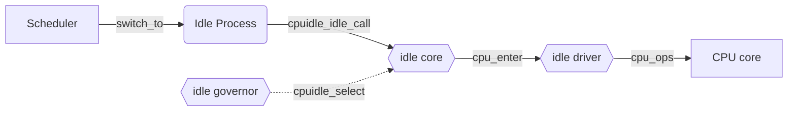

## Abstract

首先对于 Idle 是什么，我知之甚少，所以采用提出疑惑、回答问题的方式先进行行文，进行入门。


### cpuidle_idle_call

> `cpuidle_idle_call` is a function in the Linux kernel that is responsible for **putting the CPU into an idle state** when there is no work to do. The function is part of the CPU idle subsystem, which is designed to reduce power consumption by putting the CPU into low-power states when it is not in use.
>
> When the `cpuidle_idle_call` function is called, the CPU idle governor selects the most appropriate idle state based on the current system workload and the capabilities of the CPU. The CPU is then put into the selected idle state, which reduces its power consumption while still allowing it to quickly resume normal operation when needed.
>
> The `cpuidle_idle_call` function is called by the kernel scheduler when there is no work to do, and it is one of the key components of the Linux kernel's power management system. By efficiently managing CPU power consumption, the kernel can reduce energy usage and extend the battery life of mobile devices.

`cpuidle_idle_call` 是 idle 流程的主要函数，其主要的目的是让 CPU 进入 idle state, 目的是节省功耗。

### Idle States

> CPU idle states are low-power states that a CPU can enter when it is not actively processing tasks. These states are designed to reduce energy consumption and extend battery life on mobile devices. The exact set of idle states and their power-saving capabilities may vary depending on the CPU architecture and operating system. Here are some **common CPU idle states**:
>
> 1. **C0 (Active State)**: The CPU is fully active and executing instructions.
> 2. **C1 (Halt State)**: The CPU is not executing any instructions, but it is still powered on and can respond to interrupts.
> 3. **C2 (Sleep State)**: The CPU is in a low-power state and is not executing any instructions. It can be quickly woken up by an interrupt.
> 4. **C3 (Deep Sleep State)**: The CPU is in a deeper low-power state than C2 and consumes even less power. It takes longer to wake up from this state.
> 5. **C4 (Deepest Sleep State)**: The CPU is in the lowest power state and consumes the least amount of power. It takes the longest time to wake up from this state.
>
> The CPU idle governor is responsible for selecting the most appropriate idle state based on the current workload and system requirements. The governor takes into account factors such as the current CPU utilization, the available idle states, and the time it takes to wake up from each state. By efficiently managing CPU power consumption, the system can reduce energy usage and extend battery life.

从上面我们知道，Idle 一共有 5 个状态，分别是 C0 ~ C4，在此就不进行额外翻译了。

对于是选择进入 C0 还是 C4, 有以下的解答：

> The CPU idle governor is responsible for selecting the most appropriate idle state based on the current system workload and CPU capabilities. The governor takes into account factors such as the current CPU utilization, the available idle states, and the time it takes to wake up from each state. If the workload is light and there is no immediate processing required, the CPU idle governor may select a deeper sleep state, such as C4, to conserve power. On the other hand, if there is a heavier workload or an immediate processing requirement, the governor may select a shallower sleep state, such as C0, to ensure quick response times.

换言之，就是取决于当前的 workload. 当然这是最主要的原因，还有一些原因与体系结构和操作系统有关。

### CPU idle governor

> The CPU idle governor is a component of the **Linux kernel's power management system** that is responsible for **selecting the most appropriate idle state** for the CPU based on the current workload and system requirements. The CPU idle governor plays a critical role in optimizing energy efficiency and reducing power consumption.
>
> There are several idle governors available in the Linux kernel, including the menu governor, ladder governor, and utilization governor. Each governor has its own algorithm for selecting idle states and can be configured to optimize for performance or power consumption.
>
> Here are some key features and functions of the CPU idle governor:
>
> 1. Workload Estimation: The CPU idle governor estimates the current CPU workload to determine if the system can enter an idle state without impacting performance. The governor may use various metrics, such as CPU utilization, task queue length, or I/O activity, to estimate the workload.
> 2. Idle State Selection: Based on the workload estimation, the CPU idle governor selects the most appropriate idle state for the CPU. The governor considers factors such as the available idle states, their power-saving capabilities, and the time it takes to wake up from each state.
> 3. Power Management Policy: The CPU idle governor can be configured to optimize for performance or power consumption. In performance mode, the governor selects shallower idle states to ensure quick response times. In power-saving mode, the governor selects deeper idle states to conserve power.
> 4. Governor Switching: The CPU idle governor can switch between different idle governors based on system requirements. For example, the system may use the menu governor when the workload is light and switch to the utilization governor when the workload is heavy.
> 5. Debugging and Profiling: The CPU idle governor provides tools for debugging and profiling power management, including the `cpuidle-info` and `powertop` utilities. These tools can provide insight into CPU idle state transitions, power consumption, and system performance.
>
> Overall, the CPU idle governor is a critical component of the Linux kernel's power management system. By efficiently managing CPU power consumption and selecting the appropriate idle state, the governor can reduce energy usage and extend battery life on mobile devices.

### tickless

> In the context of operating systems, "tickless" refers to a power management feature that allows the system to reduce power consumption by dynamically adjusting the frequency of timer interrupts.

About "tick" interrupt:

> Traditionally, operating systems use a periodic timer interrupt, often called the "tick," to keep track of time and to perform various tasks such as updating the system clock, scheduling tasks, and handling interrupts. These timer interrupts are generated at a fixed frequency, regardless of whether there is any work to be done, which can consume a significant amount of power.

### WFI

WFI 是英文 Wait for Interrupt 的缩写，意为等待中断。WFI 指令是 ARM 处理器提供的一种指令，用于将处理器置于等待状态，直到下一个中断事件发生后才会继续执行。

Arm64 提供了 WFI 指令，使得 CPU 一旦执行该指令就进入低功耗状态，该状态会关闭 CPU 时钟，从而降低动态功耗。

如果我们想实现一个简单的 idle 的话，需要以下的流程即可[^1]：

```c
while (1) {
	if (condition)
		break;
}
```

在上述代码中，我们的 CPU 空转一直等待某个条件成立；这是最简单的实现方法。

而 Arm64 提供的 WFI 指令可以帮助系统降低功耗。此外，操作系统还可以通过 WFI 指令实现快速唤醒，以保证系统的响应速度和实时性。

## Code Analysis

### cpu_startup_entry

笔者在实际的业务场景中抓取过 idle 函数的调用栈，大概如下所示：

```text {4,6,7}
[] [pid:0,cpu6,swapper/6,0] show_stack+0x14/0x1c
[] [pid:0,cpu6,swapper/6,1] dump_stack_lvl+0xb8/0x108
[] [pid:0,cpu6,swapper/6,2] dump_stack+0x14/0x1c
[] [pid:0,cpu6,swapper/6,3] cpuidle_select+0x20/0x54
[] [pid:0,cpu6,swapper/6,4] 0xffffffe55f4d072c
[] [pid:0,cpu6,swapper/6,5] cpu_startup_entry+0x20/0x24
[] [pid:0,cpu6,swapper/6,6] secondary_start_kernel+0x1e8/0x208
[] [pid:0,cpu6,swapper/6,7]CPU: 6 PID: 0 Comm: swapper/6 VIP: 00
[] [pid:0,cpu6,swapper/6,8]TGID: 0 Comm: swapper/6
[] [pid:0,cpu6,swapper/6,9]Hardware name: xxx (DT)
```

这是一个很关键的调用栈，我们可以看到 `cpu_startup_entry` 会调用到 `cpuidle_select`, 在图中进行了高亮。

`start_kernel`  →  `rest_init`  →  `cpu_startup_entry`, 基本的调用关系可以如此理解，看 `cpu_startup_entry` 的实现：

```c
// in kernel/linux-5.10/kernel/sched/idle.c
void cpu_startup_entry(enum cpuhp_state state)
{
	arch_cpu_idle_prepare();
	cpuhp_online_idle(state);
	while (1)
		do_idle();
}
```

:::note cpu_startup_entry 流程

- `void cpu_startup_entry(enum cpuhp_state state)`
  - `arch_cpu_idle_prepare()`，进行 idle 前的准备工作，ARM64 中没有实现
    - cpu idle loop: 进入 cpuidle 的主循环；在上面代码中体现为 while loop
      - …
      - *下面的流程见 `do_idle()`*

:::

也就是说，idle 线程执行的时候，是一直在运行这个 `do_idle()` 的。

### do_idle

`do_idle()` 会执行 CPU idle 的主要操作。

:::note cpu_idle_loop 调用流程 static void do_idle(void)

- `__current_set_polling()`: 后续研究
- `tick_nohz_idle_enter()`: 后续研究

- 如果系统当前不需要调度（`while (!need_resched())`），执行后续的动作
  - 

  - local_irq_disable()，关闭 irq 中断

  - arch_cpu_idle_enter()，arch 相关的 cpuidle enter，ARM64 中没有实现
  - **cpuidle_idle_call()**，main idle function
    - cpuidle_select，通过 cpuidle governor，选择一个 cpuidle state
    - cpuidle_enter，通过 cpuidle state，进入该 idle 状态
    - …
    - 中断产生，idle 返回（注意，此时irq是被禁止的，因此CPU不能响应产生中断的事件）
    - cpuidle_reflect，通知 cpuidle governor，更新状态
    - local_irq_enable，使能中断，响应中断事件，跳转到对应的中断处理函数
    - …            

- arch_cpu_idle_exit，和 enter 类似，ARM64没有实现

:::

### local_irq_dis(en)able

这个函数涉及到中断处理的相关操作，`local_irq_disable()` 会禁止本地中断的传递，在这个地方有 4 个相似的接口，可以加以区分便于使用：

|        函数         |                       说明                       |
| :-----------------: | :----------------------------------------------: |
| local_irq_disable() |                 禁止本地中断传递                 |
| local_irq_enable()  |        激活本地中断传递（无条件激活中断）        |
|  local_irq_save()   | 保存本地中断传递的当前状态，然后禁止本地中断传递 |
| local_irq_restore() |           恢复本地中断传递到更定的状态           |

通常而言，我们会使用 `local_irq_save()` 和 `local_irq_restore()` 配合使用，这样做的好处在于：我们在此之前并不知道本地中断是开启还是关闭的，如果要使我们的代码对中断的原始状态不做过多的影响，用这两个接口是非常合适的。再多说一些，`local_irq_enable()` 是会无条件激活中断的，尽管这个中断可能在开始时就是关闭的。

再回到禁止中断这个事情本身，通过禁止中断，可以确保某个中断处理程序不会抢占当前的代码；此外，禁止中断还可以禁止内核抢占。但是需要注意的是，禁止中断并不能避免来自其他处理器的并发访问（使用锁来防止并发访问，或者使用核独占的数据结构）。

实现禁止中断只需要使用一条汇编指令即可，在 arm64 中使用的是 `msr daifclr, #2` 来禁止中断。

### cpuidle_idle_call

在外围对是否进入该函数有一个判断：

```c
if (cpu_idle_force_poll || tick_check_broadcast_expired()) {
    tick_nohz_idle_restart_tick();
    cpu_idle_poll();
} else {
    cpuidle_idle_call();
}
```

`cpu_idle_force_poll` 表示是否开启强制轮询模式，关于 idle polling 可以见下面章节的描述；

`tick_check_broadcast_expired` 表示 tick 是否过期需要重新开始以免进入深度睡眠。

### idle polling

idle polling 是一个空闲轮询机制。

我们来看代码：

```c
#ifdef CONFIG_GENERIC_IDLE_POLL_SETUP
static int __init cpu_idle_poll_setup(char *__unused)
{
	cpu_idle_force_poll = 1;

	return 1;
}
__setup("nohlt", cpu_idle_poll_setup);

static int __init cpu_idle_nopoll_setup(char *__unused)
{
	cpu_idle_force_poll = 0;

	return 1;
}
__setup("hlt", cpu_idle_nopoll_setup);
#endif
```

`cpu_idle_poll_ctrl`可以作为一个调度器选项，对空闲轮询机制进行控制。其具体做法是：

- 当`cpu_idle_poll_ctrl=1`时，空闲轮询机制被启用，调度器会直接检查是否有可运行的进程；

- 当`cpu_idle_poll_ctrl=0`时，空闲轮询机制被禁用，CPU会挂起或执行某些简单指令以等待其他事件的发生。

在传统的CPU调度方案中，当CPU处于空闲状态时，调度器通常会挂起CPU或让CPU执行一些简单的指令，以避免CPU浪费过多的时间。而在空闲轮询机制下，调度器会在CPU空闲时，立即检查系统中是否有可运行的进程，如果有，则立即唤醒该进程并将CPU分配给它。

具体的 polling 实现可能会分成很多种，如 busy-waiting, 表示如果没有可以运行的进程的话，则调度器会继续等待下一次轮询；如 sleep, 当 CPU 空闲时，会将整个 CPU 设置为休眠状态，以节能。


### tick_nohz_idle_stop_tick

当出现需要处理的中断时，CPU 将从无操作系统状态恢复到正常运行状态，并执行 `tick_nohz_idle_stop_tick` 函数来重新启用时钟事件处理器。

`tick_nohz_stop_tick` 的作用类似。

:::note tick

tick 是周期性产生的 timer 中断事件，在系统中断的时候，不想产生周期性的中断，提出了动态时钟的概念，在系统空闲的阶段停掉周期性的时钟达到节省功耗的目的。

内核可以通过配置项 CONFIG_NO_HZ 及 CONFIG_NO_HZ_IDLE 来打开该功能，这样在系统空闲的时候就可以停掉 tick 一段时间，但并不是完全没有 tick 了，当有除了 idle 进程之外的其它进程运行的时候会恢复 tick[^2] 。

tick_device_mode 有两种模式：TICKDEV_MODE_PERIODIC 和 TICKDEV_MODE_ONESHOT，即周期模式和单触发模式。

:::

### tick_broadcast_oneshot_control()

该代码的作用是打开或者关闭本地定时器。当 CPU 要进入需要关闭 local timer 的 idle 状态的时候，会调用`tick_broadcast_enter()`函数，从而告诉 tick 广播层属于本 CPU 的本地定时事件设备就要停止掉了，需要广播层提供服务。相反的，如果要退出某种 idle 状态之后，会调用 `tick_broadcast_exit()` 函数，恢复本 CPU 的本地定时事件设备，停止针对本 CPU 的 tick 广播服务。

这两个函数的代码如下：

```c
static inline int tick_broadcast_enter(void)
{
	return tick_broadcast_oneshot_control(TICK_BROADCAST_ENTER);
}

static inline void tick_broadcast_exit(void)
{
	tick_broadcast_oneshot_control(TICK_BROADCAST_EXIT);
}
```

从中我们可以看出，这两个函数都是调用了 `tick_broadcast_oneshot_control`(我们本小节的主角函数)，只不过是传入了不同的 state 参数，该函数的实现如下：

```c
// in kernel/linux-5.10/kernel/time/tick-common.c
int tick_broadcast_oneshot_control(enum tick_broadcast_state state)
{
	struct tick_device *td = this_cpu_ptr(&tick_cpu_device);

	if (!(td->evtdev->features & CLOCK_EVT_FEAT_C3STOP))
		return 0;

	return __tick_broadcast_oneshot_control(state);
}
EXPORT_SYMBOL_GPL(tick_broadcast_oneshot_control);
```

函数首先那倒本地的 tick 设备，然后判断如果本 CPU 的 tick 设备不支持 `CLOCK_EVT_FEAT_C3STOP` 也就是 C3_STOP 状态的话直接退出。否则会调用 `__tick_broadcast_oneshot_control` 函数，我们继续看其实现：

```c
// kernel/linux-5.10/kernel/time/tick-broadcast.c
int __tick_broadcast_oneshot_control(enum tick_broadcast_state state)
{
	struct tick_device *td = this_cpu_ptr(&tick_cpu_device);
	int cpu = smp_processor_id();

	if (!tick_oneshot_wakeup_control(state, td, cpu))
		return 0;

	if (tick_broadcast_device.evtdev)
		return ___tick_broadcast_oneshot_control(state, td, cpu);

	/*
	 * If there is no broadcast or wakeup device, tell the caller not
	 * to go into deep idle.
	 */
	return -EBUSY;
}
```

该函数分为两个大的部分，`tick_oneshot_wakeup_control` 和 `___tick_broadcast_oneshot_control`，我们逐个进行分析。

#### tick_oneshot_wakeup_control

```c
static int tick_oneshot_wakeup_control(enum tick_broadcast_state state,
				       struct tick_device *td,
				       int cpu)
{
	struct clock_event_device *dev, *wd;

	dev = td->evtdev;
	if (td->mode != TICKDEV_MODE_ONESHOT)
		return -EINVAL;

	wd = tick_get_oneshot_wakeup_device(cpu);
	if (!wd)
		return -ENODEV;

	switch (state) {
	case TICK_BROADCAST_ENTER:
		clockevents_switch_state(dev, CLOCK_EVT_STATE_ONESHOT_STOPPED);
		clockevents_switch_state(wd, CLOCK_EVT_STATE_ONESHOT);
		clockevents_program_event(wd, dev->next_event, 1);
		break;
	case TICK_BROADCAST_EXIT:
		/* We may have transitioned to oneshot mode while idle */
		if (clockevent_get_state(wd) != CLOCK_EVT_STATE_ONESHOT)
			return -ENODEV;
	}

	return 0;
}
```

#### ___tick_broadcast_oneshot_control

这段代码很长，不在此进行全部列举。

```c
static int ___tick_broadcast_oneshot_control(enum tick_broadcast_state state,
					     struct tick_device *td,
					     int cpu) {
    // ...
    raw_spin_lock(&tick_broadcast_lock);
    if (state == TICK_BROADCAST_ENTER) {
        
    } else {
        
    }
out:
	raw_spin_unlock(&tick_broadcast_lock);
	return ret;
}
```

函数的整体框架如上所示，按照传入的 state 进行划分，我们在上文说过，state 可以分为 和 TICK_BROADCAST_EXIT。

后续会使用到的两个设备变量分别为：`struct clock_event_device *bc, *dev = td->evtdev;`

- bc: clock_event_device 结构体，`bc = tick_broadcast_device.evtdev;` 表示 tick 广播设备；
- dev: clock_event_device 结构体，`*dev = td->evtdev`, td 来自于函数传参，是一个 tick 设备，这里指代的是待休眠(本) CPU 上面的 tick 设备。

##### TICK_BROADCAST_ENTER

该 state 表征的是当前 CPU 要进入 idle 状态。其步骤可以分解为以下的：

➡️➡️ 判断当前 CPU 能否进入（更深层次的）休眠状态。

```c
ret = broadcast_needs_cpu(bc, cpu);
if (ret)
    goto out;
```

> If the current CPU owns the hrtimer broadcast mechanism, it cannot go deep idle and we do not add the CPU to the broadcast mask. We don't have to go through the EXIT path as the local timer is not shutdown.

如果当前的 CPU 不支持广播模式的话，就不能使能更深层次的 idle 状态，故直接退出。判断是否可以支持 broadcast 使用下面的逻辑：

```c
static int broadcast_needs_cpu(struct clock_event_device *bc, int cpu)
{
	if (!(bc->features & CLOCK_EVT_FEAT_HRTIMER))
		return 0;
	if (bc->next_event == KTIME_MAX)
		return 0;
	return bc->bound_on == cpu ? -EBUSY : 0;
}
```

➡️➡️ TICKDEV_MODE_PERIODIC, 如果 tick 广播设备还在周期触发模式（与之对立的就是 one shot 模式）的话，执行以下逻辑：

```c
if (tick_broadcast_device.mode == TICKDEV_MODE_PERIODIC) {
    /* If it is a hrtimer based broadcast, return busy */
    if (bc->features & CLOCK_EVT_FEAT_HRTIMER)
        ret = -EBUSY;
    goto out;
}
```

当 tick 广播设备是由高分辨率定时器模拟的则返回 -EBUSY.

➡️➡️ one shot 模式 下面的处理逻辑，是设置 tick_broadcast_oneshot_mask 中当前 CPU 对应的位。

:::warning tick_broadcast_oneshot_mask 

需要留意到 tick_broadcast_oneshot_mask 这个变量能否使用 `__cpumask_var_read_mostly` 进行修饰！后续遇到的变量也应当注意。

:::

```c
if (!cpumask_test_and_set_cpu(cpu, tick_broadcast_oneshot_mask)) {
			WARN_ON_ONCE(cpumask_test_cpu(cpu, tick_broadcast_pending_mask));

			/* Conditionally shut down the local timer. */
    		// 尝试关闭本 CPU 上的定时事件设备
			broadcast_shutdown_local(bc, dev);

			/*
			 * We only reprogram the broadcast timer if we
			 * did not mark ourself in the force mask and
			 * if the cpu local event is earlier than the
			 * broadcast event. If the current CPU is in
			 * the force mask, then we are going to be
			 * woken by the IPI right away; we return
			 * busy, so the CPU does not try to go deep
			 * idle.
			 */
    		// 如果 tick_broadcast_force_mask 中对应当前 CPU 的位被设置了
			if (cpumask_test_cpu(cpu, tick_broadcast_force_mask)) {
				ret = -EBUSY; // 在此返回 -EBUSY 说明其暂时不能进入 idle
            /* 当前休眠 CPU 上的 tick 设备到期事件早于 tick 广播设备到期时间;
             * 如果该条件发生的话，则需要用当前 CPU 上 tick 设备的到期时间
             * 去更新 tick 广播
            */
			} else if (dev->next_event < bc->next_event) {
				tick_broadcast_set_event(bc, cpu, dev->next_event);
				/*
				 * In case of hrtimer broadcasts the
				 * programming might have moved the
				 * timer to this cpu. If yes, remove
				 * us from the broadcast mask and
				 * return busy.
				 */
                // 这边有个二次判断，很难理解
				ret = broadcast_needs_cpu(bc, cpu);
				if (ret) {
                    // 如果不支持广播模式的话，就清除掉当前 CPU 对应的那一位
					cpumask_clear_cpu(cpu,
						tick_broadcast_oneshot_mask);
				}
			}
}
```

上面对每一行代码进行了解析，总结以下，总共做了以下的事情：

1. 关闭本地 CPU 的定时设备，主要的任务；
2. 关闭后设置 tick_broadcast_force_mask 中本 CPU 对应的标志位；这边可能会存在一个竞态，所以会查询一次看是否设置成功；
3. 在设置成功的前提下，调用 tick_broadcast_set_event, 设置 broadcast 事件；这个设置的前提是本 cpu 的 tick 事件早于广播的下一个事件（很好理解，否则我就用广播的事件时间就可以了）
4. 在此判断是否支持 broadcase, 为何要再次判断呢？这就涉及到了 hrtimer broadcasts 机制的运行原理，需要进行更加详细的研究。

##### TICK_BROADCAST_EXIT


### DEFINE_PER_CPU

`DEFINE_PER_CPU` 是一个宏，用于定义一种特殊的变量类型，称为 "per-cpu 变量"。这种变量在 Linux 内核中广泛使用，用于跨多个 CPU 核心共享数据时保证数据的一致性。

使用 `DEFINE_PER_CPU` 宏定义的变量，会在每个 CPU 核心上都创建一个独立的副本，并通过内核提供的函数接口进行同步和访问。这样，在多核系统中，不同 CPU 核心上的代码可以同时访问该变量，而不会出现数据竞争或者锁竞争等问题。

具体来说，`DEFINE_PER_CPU` 宏的语法如下：

```c
DEFINE_PER_CPU(type, var);
```

其中，`type` 指定了变量的类型，`var` 是变量名。例如：

```c
DEFINE_PER_CPU(int, my_var);
```

上述代码定义了一个名为 `my_var` 的 per-cpu 整型变量。在汇编层面，编译器会自动生成对应的代码，以便为每个 CPU 核心上创建一个独立的 `int` 类型的变量，并对其进行初始化和管理。在 C 代码层面，程序员可以通过 `get_cpu_var()` 和 `put_cpu_var()` 等函数来访问和修改 per-cpu 变量的值，例如：

```c
int val = get_cpu_var(my_var);
put_cpu_var(my_var, val+1);
```

需要注意的是，per-cpu 变量仅适用于每个 CPU 核心独立使用的数据，并不适用于需要全局同步的数据结构。此外，需要注意内存分配和访问的开销，以避免影响系统的性能。

### cpuidle_enter_state()

 函数位置：kernel/linux-5.10/drivers/cpuidle/cpuidle.c

```c
int cpuidle_enter_state(struct cpuidle_device *dev, 
            struct cpuidle_driver *drv, int index)
```


🟢🟢🟢

```c
broadcast = !!(target_state->flags & CPUIDLE_FLAG_TIMER_STOP);
```

这行代码的作用是设置一个广播标志，判断是否需要停止定时器。其中，target_state  是一个指向 cpuidle_state 结构体的指针，该结构体描述了 CPU 的空闲状态，包括状态标识、所需的底层硬件支持、进入和退出该状态所需的操作等信息。

具体来说，target_state->flags 是一个位掩码，用于描述该空闲状态标识的一些特定属性。&运算符将该位掩码与 CPUIDLE_FLAG_TIMER_STOP 逐位进行 AND 运算，结果非零则表示 target_state 的 flags 属性中存在 CPUIDLE_FLAG_TIMER_STOP 标志，即需要停止定时器。*!!运算符则将结果转换为布尔类型*，确保在任何情况下返回的都是0或1的布尔值，而不是整型数值。

因此，这行代码最终会将广播标志设置为true或false，表示需要或不需要停止定时器。在CPU进入空闲状态之前，内核会根据广播标志来决定是否向其他CPU广播空闲状态，并通知它们停止当前正在运行的定时器。

简单来说，如果 local timer 关闭的话（进入更深层次的 idle 状态），就需要使用 broadcast.

🟢🟢🟢

```c
if (target_state->flags & CPUIDLE_FLAG_TLB_FLUSHED) {
    leave_mm(dev->cpu);
}
```

这段代码的作用是，**在CPU进入指定的空闲状态之前检查该状态是否需要刷新TLB**，并在必要时执行离开当前进程的操作。（从实测的数据来看，基本上没有刷新 TLB 的操作，这段逻辑很少被执行）

其中，target_state是一个指向cpuidle_state结构体的指针，描述了要进入的空闲状态，包括状态标识、所需的底层硬件支持和进入该状态所需的操作等信息。flags字段表示该状态的一些特殊属性，如CPUIDLE_FLAG_TLB_FLUSHED，表示在进入该状态前需要刷新TLB（Translation Lookaside Buffer）。

如果检测到目标状态需要刷新TLB，则调用leave_mm(dev->cpu)函数执行离开当前进程的操作。该函数的作用是在该CPU上的所有进程中暂停当前进程，并切换到空闲进程，以便操作系统在进入空闲状态之前刷新TLB高速缓存。

总之，这段代码的作用是确保在进入特定的空闲状态之前清除TLB以避免任何不必要的冲突，同时保证进程能够正确地切换。

🟢🟢🟢

```c
/* Take note of the planned idle state. */
sched_idle_set_state(target_state);

// 其实现如下：
void sched_idle_set_state(struct cpuidle_state *idle_state)
{
	idle_set_state(this_rq(), idle_state);
}
```

这段代码的作用是将当前CPU切换到指定的空闲状态，也就是进入一种较低功耗的状态以进行省电。

其中，`sched_idle_set_state` 是一个内核函数，用于设置当前CPU的空闲状态，并让CPU进入相应的空闲状态。target_state是一个指向cpuidle_state结构体的指针，描述了要进入的空闲状态，包括状态标识、所需的底层硬件支持和进入该状态所需的操作等信息。

`this_rq()` 表示*当前CPU所在的CPU运行队列*（runqueue），它的返回值是一个指向struct rq结构体的指针，该结构体描述了CPU调度器的运作情况和统计信息。

在调用该函数之前，内核通常会执行一些准备工作，如停止定时器、暂停当前进程、刷新TLB等。接着，调用该函数将当前CPU切换到目标状态，并执行目标状态所需的操作，如关闭某些设备、降低CPU主频等。

整个过程是由内核负责管理和控制的，程序员无法直接控制。当系统需要重新唤醒CPU时，内核会根据CPU的中断或事件触发来驱动CPU从空闲状态中返回，并恢复相关的设备和资源。

🟢🟢🟢

```c
if (!(target_state->flags & CPUIDLE_FLAG_RCU_IDLE))
    rcu_idle_enter();
```

这段代码用于判断当前进入空闲状态的目标状态是否需要进行**RCU（Read-Copy-Update）空闲处理**，如果需要，则调用rcu_idle_enter函数进行RCU空闲处理。

在Linux内核中，RCU是一种无锁机制，用于在多个进程间共享数据。当一个进程需要修改共享数据时，该进程会先创建出一个新的副本，对其进行修改，然后将新副本加入到RCU保护区中。此时，其他进程仍然可以访问旧的副本，不会受到影响。当所有对旧副本的访问都结束后，RCU保护区才会被清空，新副本才会变成有效的数据。

在进入空闲状态时，如果当前CPU正在进行RCU更新操作，就需要进行RCU空闲处理，即等待所有正在使用旧副本的进程完成访问后，再进行新副本的更新。这样一来，就可以避免数据的冲突和不一致性。

rcu_idle_enter函数用于启动RCU空闲处理，并进入RCU空闲状态。该函数会将当前CPU所在的调度器的状态设置为RCU空闲状态，然后等待所有正在使用旧副本的进程访问完毕，直到RCU保护区被清空。在此期间，该CPU不会执行任何其他任务，以避免对正在访问旧副本的进程产生干扰。

```c
void rcu_idle_enter(void)
{
	lockdep_assert_irqs_disabled();
	rcu_eqs_enter(false);
}
```

`rcu_idle_enter` 函数是用于启动RCU空闲处理并进入RCU空闲状态的函数。

其中，`lockdep_assert_irqs_disabled` 函数用于断言**当前中断已经被禁止**，在RCU空闲处理期间不会被重新打开。该函数会在执行时检查当前是否处于内核锁定状态，并通过锁依赖机制确保锁的正确性。如果当前存在锁冲突，则会抛出一个警告信息。

`rcu_eqs_enter` 函数则用于进入RCU空闲状态并等待所有正在使用旧副本的进程访问完毕。其中，参数false表示*不需要检查是否处于内核软件调试状态*（KDB或KGDB）。在该函数中，会调用rcu_prepare_for_idle函数进行RCU更新准备工作，并将当前CPU所在的调度器状态设置为RCU空闲状态。然后，该函数会启动一个RCU处理线程，在其中等待所有正在使用旧副本的进程访问完毕并结束。❓❓ 待处理线程结束之后，该函数会将当前CPU所在调度器状态设置为正常运行状态，并返回。

🟢🟢🟢

```c
entered_state = target_state->enter(dev, drv, index);
```

进入 state, 待深入研究。❌❌❌

🟢🟢🟢 对应于 `rcu_eqs_enter`

```c
if (!(target_state->flags & CPUIDLE_FLAG_RCU_IDLE))
    rcu_idle_exit();
```

这段代码用于判断目标状态是否为RCU空闲状态，并在不是RCU空闲状态时退出RCU空闲处理。

如果目标状态的flags字段中包含CPUIDLE_FLAG_RCU_IDLE标志，说明此时需要进入RCU空闲状态，即需要等待所有正在访问旧副本的进程结束后再进行新副本的更新。此时，不需要退出RCU空闲处理，代码直接跳过。

但如果目标状态的flags字段中不包含CPUIDLE_FLAG_RCU_IDLE标志，则代表当前并不需要进行RCU空闲处理。此时，需要通过rcu_idle_exit函数退出RCU空闲处理。该函数会将当前CPU所在的调度器状态设置为正常运行状态，并唤醒所有等待RCU更新的进程（如等待RCU更新的进程队列等）。这样一来，RCU更新操作就可以继续进行，而不会被阻塞在RCU空闲状态中。

需要注意的是，只有在完成了RCU更新操作之后，才能调用rcu_idle_exit函数退出RCU空闲状态。否则，会引起数据访问冲突和不一致性，导致系统出现异常。因此，在使用该函数时，需要保证系统支持RCU机制，并遵循相关的使用原则和规范。

🟢🟢🟢

```c
stop_critical_timings();
// ...
start_critical_timings();
```

`stop_critical_timings` 用于停止内核关键代码段的性能计数和统计，以便进行性能分析和优化。该函数通常在内核调试、性能测试等场景下使用，以了解内核关键代码段的耗时和执行情况，从而进行优化。

该函数会将内核当前的性能计数器（如TSC、APIC计数器等）停止，并记录下停止时的值，然后将所有的性能计数器状态都设置为暂停。这样一来，在停止之前和停止之后，所有关键代码段的执行时间就可以计算出来了。

`start_critical_timings` 的作用正好相反，就不过多赘述了。

## RCU

什么是 RCU 状态？

> 在Linux内核中，RCU（Read-Copy-Update）是一种读取数据不加锁的机制，它通过使用复制而不是传统的互斥量机制来实现对共享数据结构的并发安全。

也就是说 RCU 是一种同步机制，其可以支持一个写操作和多个读操作同时进行。对比而言，读写锁是一种排他锁，写的同时不允许其他读的操作。

❗本文为了研究清楚 idle, 故针对 idle 流程中的 RCU 进行研究。

::: info  🔗 名词解释

+ Grace period: 宽限期
+ Quiescent state: 静止态

:::

### QS

在 RCU（Read-Copy-Update）机制中，QS（Quiescent State）是指一个 RCU 线程已经处理完正在使用的共享数据并即将睡眠时所处的状态。

在 QS 中，RCU 线程不再持有任何共享数据，并且等待其他线程完成对共享数据的访问并退出 read-side 临界区。在所有线程退出 read-side 临界区后，RCU 线程才会进入睡眠状态，等待下一次需要访问共享数据时再被唤醒。

RCU 的 QS 机制是用来保证 RCU 的正确性和高效性，因为当某个 RCW 对共享数据进行修改时，RCU 不能立即释放内存，需要等待所有正在使用共享数据的线程都退出 read-side 临界区，即进入了 QS，才能安全地释放该共享数据占用的内存。

> ❓❓❓ 普通的 QS: CPU 发生进程切换，或是运行在用户态都标志着它进入了 QS[^3]

这段引用较难理解？

Extended QS：CPU 执行 **idle** 进程、进入中断、运行在用户态的 tickless 模式下标志着它进入 EQS；

RCU 是一个非常有用的内核机制，可以大幅度提升多 CPU 系统中并发读取共享数据的性能。然而，在过去的一些 RCU 实现中，需要定期调用 tick 以帮助检测 CPU 是否空闲并进行相应的操作。这样，系统就不可能真正进入 tickless 模式，因为为了保证 RCU 正确性，tick 仍然需要启动。为了解决这种矛盾，Linux 内核引入了一种新的 RCU 实现方法：RCU-Dynticks。该实现允许 RCU 在不定期使用计时器的情况下执行，从而允许系统真正进入 tickless 模式。具体来说，当所有 RCU 线程都被阻塞时，RCU-Dynticks 可以安全地关闭计时器，以避免后台 tick 等待造成的功耗和延迟。RCU-Dynticks 实现对应了 EQS 状态。


### rcu_idle_enter

`rcu_idle_enter()`是Linux内核中的一个函数，它用于将CPU置于RCU空闲状态，以便让RCU子系统在RCU调度器中执行后台工作。在具体实现上，该函数会挂起当前CPU的所有进程并使其休眠，以便其他CPU可以更快地访问共享资源。

具体来说，`rcu_idle_enter()`的功能可以简单地概括为以下几个方面：

1. 检查当前CPU是否已经成功进入空闲状态（即没有正在运行或等待运行的进程）。
2. 如果当前CPU还有进程在运行，则调用相应的函数停止这些进程的运行，并等待它们进入休眠状态。
3. 如果当前CPU已经成功进入空闲状态，则向RCU调度器发送空闲通知，通知RCU子系统开始执行后台任务。

需要注意的是，当CPU处于RCU空闲状态时，只有RCU子系统中的相关线程可以运行，其他进程无法在该CPU上运行，这可以避免竞态条件和死锁等问题。当后台任务完成后，调度器会自动唤醒CPU并恢复正常的进程调度。

### note_gp_changes

这个函数名字中的 `gp` 的含义是 **grace period**, 表示 RCU 的宽限期或者临界区。gp 的结束时间是在所有的 CPU 都经过一次静止态（QS）的时候。

这个函数位于 kernel/linux-5.10/kernel/rcu/tree.c 这个路径下面，对于 tree.c 这个文件，对于 tree 的含义，找到了一个解释：

> 还有一种分类可以通过内核源码中 RCU 文件名可以看到，分为 Tiny RCU 和 Tree RCU。Tiny RCU 适用于嵌入式系统单 CPU 的场景，而 Tree RCU 则适用于大型系统。

根据这个线索，我们从源码路径下面果然是看到了 tiny.c 这个文件。


## Idle Data Struct

### Abstract

本章节主要针对性分析 Idle 中的数据结构。在 kernel 中的 cpuidle framework 主体包括三个模块：cpuidle core, cpudile governors 和 cpuidle drivers.

**cpuidle core**: 负责整体框架，对接 sched 模块，调度器发现没有任务在执行的时候，就切换到 idle 进程，通知就会给 cpuidle core; cpuidle core 负责向 cpuidle driver/governors 模块提供统一的注册和管理接口，向用户空间提供 governor 选择的接口。

**cpuidle governors**: 在该模块进行 cpuidle 的选择；

**cpuidle driver**: 负责具体 idle 机制的实现。

总的来说，这几个的关系大致如下图所示：



### cpuidle core

cpuidle core 是 cpuidle framework 的核心模块，负责抽象出 cpuidle device、cpuidle driver 和 cpuidle governor三个实体。

其负责的功能有：

1. （如上阐述）向底层的 cpuidle driver 模块提供 cpudile devic e和 cpuidle driver 的注册/注销接口；
2. （如上阐述）向 cpuidle governors 提供 governor 的注册接口；
3. 提供全局的 puidle 机制的开、关、暂停、恢复等功能；
4. （如上阐述）向用户空间程序提供 governor 选择的接口；
5. 向 kernel sched 中的 cpuidle entry 提供 cpuidle 的级别选择、进入等接口，以方便调用。

### cpuidle device

在现在的 SMP 系统中，每个 cpu core 都会对应一个 cpuidle device, 内核通过 `strcut cpuidle_device` 抽象 cpuidle device.


### cpuidle driver

cpuidle driver 是一个 “driver", 其驱动的对象是 cpuidle device, 也就是 CPU；注意到在 SMP 系统中，有多个 CPU，也就意味着有多个 cpuidle device; 在实现 idle 的时候，如果这些 cpuidle device 的功能、参数相同，则可以使用一个 cpuidle driver 驱动，具体而言，kernel 中的宏 `CONFIG_CPU_IDLE_MULTIPLE_DRIVERS` 可以用来使能是否使用多个 cpu driver.  在实际的应用场景中，这个开关是被使能的。

代码可见 https://github.com/torvalds/linux/blob/master/include/linux/cpuidle.h

```c {10,17}
/****************************
 * CPUIDLE DRIVER INTERFACE *
 ****************************/

struct cpuidle_driver {
	const char		*name;
	struct module 		*owner;

        /* used by the cpuidle framework to setup the broadcast timer */
	unsigned int            bctimer:1;
	/* states array must be ordered in decreasing power consumption */
	struct cpuidle_state	states[CPUIDLE_STATE_MAX];
	int			state_count;
	int			safe_state_index;

	/* the driver handles the cpus in cpumask */
	struct cpumask		*cpumask;

	/* preferred governor to switch at register time */
	const char		*governor;
};
```

`bctimer:1`: 一个标志，用于指示在 cpuidle driver 注册和注销时，是否需要设置一个 broadcast timer;

`cpumask`: 一个 struct cpumask 结构的 bit map 指针，用于说明该 driver 支持哪些 cpu core;

`states`, `state_count`：该 driver 所支持的 idle state 及其个数。cpuidle driver 的主要任务就是定义所支持的 cpuidle state; 需要注意注释中所提到的，`states` 应该按照功耗大小降序排列。

cpuidle driver 的注册，我们在这边主演研究多个  cpu driver 的场景，主要是分为几个：

💄 `__cpuidle_get_cpu_driver`:

```c
static struct cpuidle_driver *__cpuidle_get_cpu_driver(int cpu)
{
    // 返回 pre_cpu 指针的值
	return per_cpu(cpuidle_drivers, cpu);
}
```

💄`__cpuidle_set_driver`

```c {14}
static inline int __cpuidle_set_driver(struct cpuidle_driver *drv)
{
	int cpu;

	for_each_cpu(cpu, drv->cpumask) {
		struct cpuidle_driver *old_drv;

		old_drv = __cpuidle_get_cpu_driver(cpu);
		if (old_drv && (old_drv != drv))
			return -EBUSY;
	}

	for_each_cpu(cpu, drv->cpumask)
		per_cpu(cpuidle_drivers, cpu) = drv;

	return 0;
}
```

- 对于每个 cpumask 的 cpu, 设置 drv; 条件是原有的 cpu 无 drv 或者是有 drv 并且和需要设置的不相等（不相等的话直接 return 不进行设置）
- 设置的方法如高亮行所示


---


[^1]: https://zhuanlan.zhihu.com/p/539722367
[^2]: http://kernel.meizu.com/linux-tick-and-tickless.html
[^3]: https://zhuanlan.zhihu.com/p/374902282

