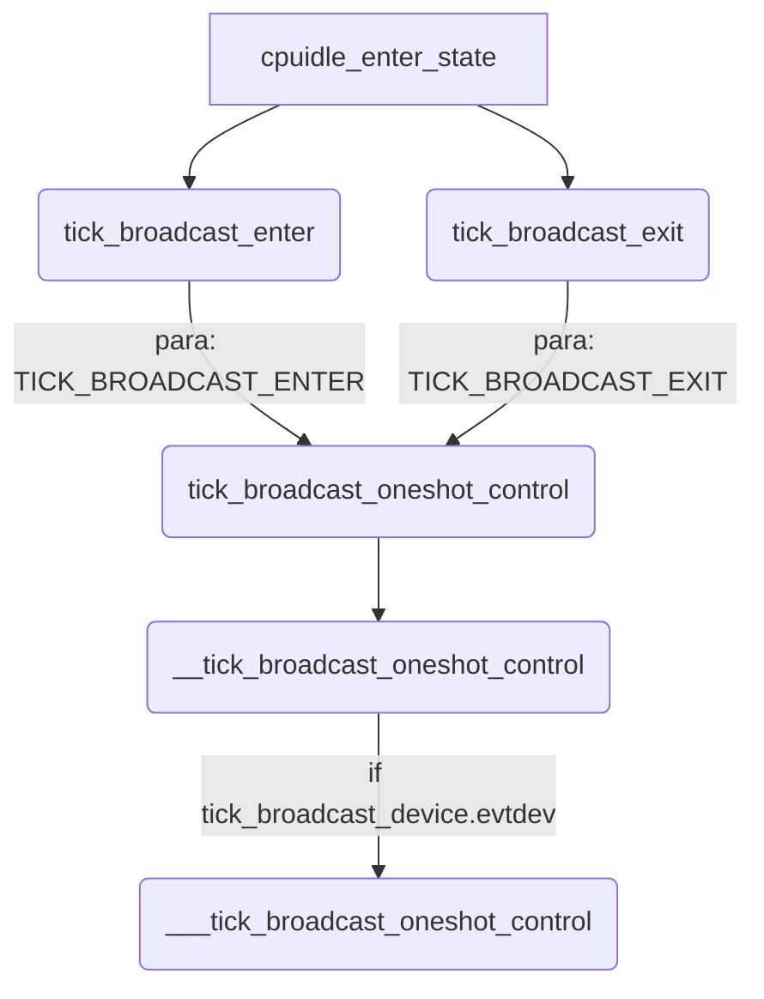

## Abstract

本文研究 tick, 在 kernel 的 idle 流程中，会出现对 tick 的调用，用于进行 idle 状态时钟的控制等。由于其机制复杂，代码量大，故将其单独进行研究。

本文主要针对于 idle 流程中涉及到的 tick 进行简单研究。

## tick_nohz_idle_stop_tick

当出现需要处理的中断时，CPU 将从无操作系统状态恢复到正常运行状态，并执行 `tick_nohz_idle_stop_tick` 函数来重新启用时钟事件处理器。

`tick_nohz_stop_tick` 的作用类似。

:::note tick

tick 是周期性产生的 timer 中断事件，在系统中断的时候，不想产生周期性的中断，提出了动态时钟的概念，在系统空闲的阶段停掉周期性的时钟达到节省功耗的目的。

内核可以通过配置项 CONFIG_NO_HZ 及 CONFIG_NO_HZ_IDLE 来打开该功能，这样在系统空闲的时候就可以停掉 tick 一段时间，但并不是完全没有 tick 了，当有除了 idle 进程之外的其它进程运行的时候会恢复 tick[^2] 。

tick_device_mode 有两种模式：TICKDEV_MODE_PERIODIC 和 TICKDEV_MODE_ONESHOT，即周期模式和单触发模式。

:::

## tick_broadcast_oneshot_control()

在研究之前，我们先给出调用关系图：




该函数代码的作用是打开或者关闭本地定时器。当 CPU 要进入需要关闭 local timer 的 idle 状态的时候，会调用`tick_broadcast_enter()`函数，从而告诉 tick 广播层属于本 CPU 的本地定时事件设备就要停止掉了，需要广播层提供服务。相反的，如果要退出某种 idle 状态之后，会调用 `tick_broadcast_exit()` 函数，恢复本 CPU 的本地定时事件设备，停止针对本 CPU 的 tick 广播服务。

这两个函数的代码如下：

```c
static inline int tick_broadcast_enter(void)
{
	return tick_broadcast_oneshot_control(TICK_BROADCAST_ENTER);
}

static inline void tick_broadcast_exit(void)
{
	tick_broadcast_oneshot_control(TICK_BROADCAST_EXIT);
}
```

从中我们可以看出，这两个函数都是调用了 `tick_broadcast_oneshot_control`(我们本小节的主角函数)，只不过是传入了不同的 state 参数，该函数的实现如下：

```c
// in kernel/linux-5.10/kernel/time/tick-common.c
int tick_broadcast_oneshot_control(enum tick_broadcast_state state)
{
	struct tick_device *td = this_cpu_ptr(&tick_cpu_device);

	if (!(td->evtdev->features & CLOCK_EVT_FEAT_C3STOP))
		return 0;

	return __tick_broadcast_oneshot_control(state);
}
EXPORT_SYMBOL_GPL(tick_broadcast_oneshot_control);
```

函数首先那倒本地的 tick 设备，然后判断如果本 CPU 的 tick 设备不支持 `CLOCK_EVT_FEAT_C3STOP` 也就是 C3_STOP 状态的话直接退出。否则会调用 `__tick_broadcast_oneshot_control` 函数，我们继续看其实现：

```c
// kernel/linux-5.10/kernel/time/tick-broadcast.c
int __tick_broadcast_oneshot_control(enum tick_broadcast_state state)
{
	struct tick_device *td = this_cpu_ptr(&tick_cpu_device);
	int cpu = smp_processor_id();

	if (!tick_oneshot_wakeup_control(state, td, cpu))
		return 0;

	if (tick_broadcast_device.evtdev)
		return ___tick_broadcast_oneshot_control(state, td, cpu);

	/*
	 * If there is no broadcast or wakeup device, tell the caller not
	 * to go into deep idle.
	 */
	return -EBUSY;
}
```

该函数分为两个大的部分:

- `tick_oneshot_wakeup_control` 
- `___tick_broadcast_oneshot_control`

我们在后文进行分析。

### tick_oneshot_wakeup_control

```c
static int tick_oneshot_wakeup_control(enum tick_broadcast_state state,
				       struct tick_device *td,
				       int cpu)
{
	struct clock_event_device *dev, *wd;

	dev = td->evtdev;
	if (td->mode != TICKDEV_MODE_ONESHOT)
		return -EINVAL;

	wd = tick_get_oneshot_wakeup_device(cpu);
	if (!wd)
		return -ENODEV;

	switch (state) {
	case TICK_BROADCAST_ENTER:
		clockevents_switch_state(dev, CLOCK_EVT_STATE_ONESHOT_STOPPED);
		clockevents_switch_state(wd, CLOCK_EVT_STATE_ONESHOT);
		clockevents_program_event(wd, dev->next_event, 1);
		break;
	case TICK_BROADCAST_EXIT:
		/* We may have transitioned to oneshot mode while idle */
		if (clockevent_get_state(wd) != CLOCK_EVT_STATE_ONESHOT)
			return -ENODEV;
	}

	return 0;
}
```

### ___tick_broadcast_oneshot_control

这段代码很长，不在此进行全部列举。

```c
static int ___tick_broadcast_oneshot_control(enum tick_broadcast_state state,
					     struct tick_device *td,
					     int cpu) {
    // ...
    raw_spin_lock(&tick_broadcast_lock);
    if (state == TICK_BROADCAST_ENTER) {
        
    } else {
        
    }
out:
	raw_spin_unlock(&tick_broadcast_lock);
	return ret;
}
```

函数的整体框架如上所示，按照传入的 state 进行划分，我们在上文说过，state 可以分为 TICK_BROADCAST_ENTER 和 TICK_BROADCAST_EXIT。

后续会使用到的两个设备变量分别为：`struct clock_event_device *bc, *dev = td->evtdev;`

- bc: `clock_event_device` 结构体，`bc = tick_broadcast_device.evtdev;` 表示 tick *广播* 设备；
- dev: `clock_event_device` 结构体，`*dev = td->evtdev`, td 来自于函数传参，是一个 tick 设备，这里指代的是待休眠(本) CPU 上面的 tick 设备。

下文我们先对传入的两个 state 进行研究。

#### TICK_BROADCAST_ENTER

该 state 表征的是当前 CPU 要进入 idle 状态。其步骤可以分解为以下的：

➡️➡️ 判断当前 CPU 能否进入（更深层次的）休眠状态。

```c
ret = broadcast_needs_cpu(bc, cpu);
if (ret)
    goto out;
```

> If the current CPU owns the hrtimer broadcast mechanism, it cannot go deep idle and we do not add the CPU to the broadcast mask. We don't have to go through the EXIT path as the local timer is not shutdown.

如果当前的 CPU 不支持广播模式的话，就不能使能更深层次的 idle 状态，故直接退出。判断是否可以支持 broadcast 使用下面的逻辑：

```c
static int broadcast_needs_cpu(struct clock_event_device *bc, int cpu)
{
	if (!(bc->features & CLOCK_EVT_FEAT_HRTIMER))
		return 0;
	if (bc->next_event == KTIME_MAX)
		return 0;
	return bc->bound_on == cpu ? -EBUSY : 0;
}
```

➡️➡️ TICKDEV_MODE_PERIODIC, 如果 tick 广播设备还在周期触发模式（与之对立的就是 one shot 模式）的话，执行以下逻辑：

```c
if (tick_broadcast_device.mode == TICKDEV_MODE_PERIODIC) {
    /* If it is a hrtimer based broadcast, return busy */
    if (bc->features & CLOCK_EVT_FEAT_HRTIMER)
        ret = -EBUSY;
    goto out;
}
```

当 tick 广播设备是由高分辨率定时器模拟的则返回 -EBUSY.

➡️➡️ one shot 模式 下面的处理逻辑，是设置 tick_broadcast_oneshot_mask 中当前 CPU 对应的位。

:::warning tick_broadcast_oneshot_mask 

需要留意到 tick_broadcast_oneshot_mask 这个变量能否使用 `__cpumask_var_read_mostly` 进行修饰！后续遇到的变量也应当注意。

:::

```c
if (!cpumask_test_and_set_cpu(cpu, tick_broadcast_oneshot_mask)) {
			WARN_ON_ONCE(cpumask_test_cpu(cpu, tick_broadcast_pending_mask));

			/* Conditionally shut down the local timer. */
    		// 尝试关闭本 CPU 上的定时事件设备
			broadcast_shutdown_local(bc, dev);

			/*
			 * We only reprogram the broadcast timer if we
			 * did not mark ourself in the force mask and
			 * if the cpu local event is earlier than the
			 * broadcast event. If the current CPU is in
			 * the force mask, then we are going to be
			 * woken by the IPI right away; we return
			 * busy, so the CPU does not try to go deep
			 * idle.
			 */
    		// 如果 tick_broadcast_force_mask 中对应当前 CPU 的位被设置了
			if (cpumask_test_cpu(cpu, tick_broadcast_force_mask)) {
				ret = -EBUSY; // 在此返回 -EBUSY 说明其暂时不能进入 idle
            /* 当前休眠 CPU 上的 tick 设备到期事件早于 tick 广播设备到期时间;
             * 如果该条件发生的话，则需要用当前 CPU 上 tick 设备的到期时间
             * 去更新 tick 广播
            */
			} else if (dev->next_event < bc->next_event) {
				tick_broadcast_set_event(bc, cpu, dev->next_event);
				/*
				 * In case of hrtimer broadcasts the
				 * programming might have moved the
				 * timer to this cpu. If yes, remove
				 * us from the broadcast mask and
				 * return busy.
				 */
                // 这边有个二次判断，很难理解
				ret = broadcast_needs_cpu(bc, cpu);
				if (ret) {
                    // 如果不支持广播模式的话，就清除掉当前 CPU 对应的那一位
					cpumask_clear_cpu(cpu,
						tick_broadcast_oneshot_mask);
				}
			}
}
```

上面对每一行代码进行了解析，总结以下，总共做了以下的事情：

1. 关闭本地 CPU 的定时设备，主要的任务；
2. 关闭后设置 tick_broadcast_force_mask 中本 CPU 对应的标志位；这边可能会存在一个竞态，所以会查询一次看是否设置成功；
3. 在设置成功的前提下，调用 tick_broadcast_set_event, 设置 broadcast 事件；这个设置的前提是本 cpu 的 tick 事件早于广播的下一个事件（很好理解，否则我就用广播的事件时间就可以了）
4. 在此判断是否支持 broadcase, 为何要再次判断呢？这就涉及到了 hrtimer broadcasts 机制的运行原理，需要进行更加详细的研究。

#### TICK_BROADCAST_EXIT

@todo