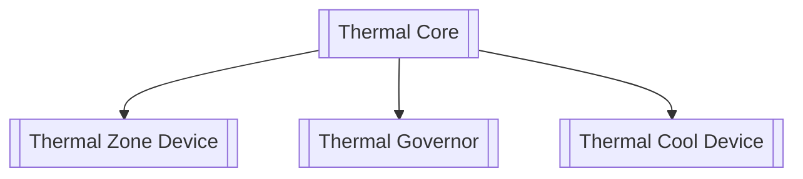
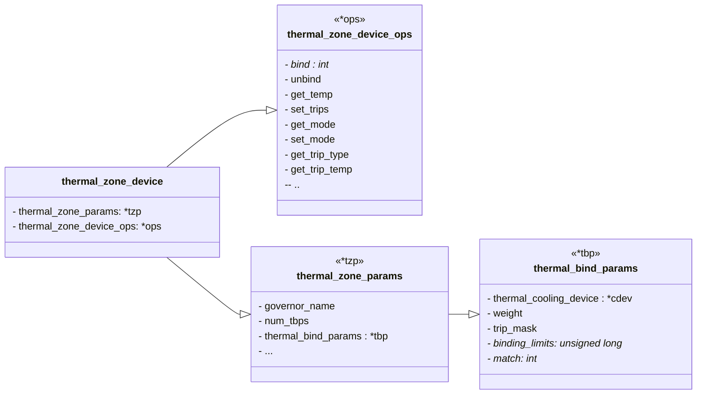

# Thermal Overview

## Abstract

Linux Thermal 是 Linux 系统下温度控制相关的模块，主要用来控制系统运行中芯片产生的热量。配合 ic 内部温度传感器，对 ic 温度进行管控，保证系统稳定性[^1]。

其基本的架构可以简单概括为下图：




Thermal 中有一些基础概念，下文会结合定义的代码对其进行分析。

## Thermal Zone Device

Thermal Zone 代表一个温控区间，将其看成一个虚拟的温度 sensor, 但是需要有物理 sensor 与其关联才可以发挥作用。 需要注意的是，一个 Thermal zone 最多可以关联一个 sensor, 但是一个 sensor 可以是多个硬件 Sensor 的混合。

🤔🤔🤔 为什么一个 Thermal zone 只能关联一个 sensor? 系统中会有多个 Thermal zone 吗？


Thermal Zone Device 在 Thermal 框架中理解为**获取温度的设备**。

我们列举并分析其结构组成：

```
// thermal.h
struct thermal_zone_device {
	int id;
	char type[THERMAL_NAME_LENGTH];
	struct device device;
	struct attribute_group trips_attribute_group;
	struct thermal_attr *trip_temp_attrs;
	struct thermal_attr *trip_type_attrs;
	struct thermal_attr *trip_hyst_attrs;
	void *devdata;
	int trips;
	unsigned long trips_disabled;	/* bitmap for disabled trips */
	int passive_delay;
	int polling_delay;
	int temperature;
	int last_temperature;
	int emul_temperature;
	int passive;
	int prev_low_trip;
	int prev_high_trip;
	unsigned int forced_passive;
	atomic_t need_update;
	struct thermal_zone_device_ops *ops;
	struct thermal_zone_params *tzp;
	struct thermal_governor *governor;
	void *governor_data;
	struct list_head thermal_instances;
	struct ida ida;
	struct mutex lock;
	struct list_head node;
	struct delayed_work poll_queue;
	enum thermal_notify_event notify_event;
}
```

为了更方便分析，我们给出一个简单的类图：




### thermal_zone_params *tzp

在上述结构体的 24 行，结构体细节如下：

```c
/* Structure to define Thermal Zone parameters */
struct thermal_zone_params {
	char governor_name[THERMAL_NAME_LENGTH];
    
	bool no_hwmon;

	int num_tbps;
    
	struct thermal_bind_params *tbp;

	u32 sustainable_power;

	s32 k_po;

	s32 k_pu;

	s32 k_i;

	s32 k_d;

	s32 integral_cutoff;

	int slope;
	
	int offset;
};
```

🟡🟡🟡发散：如寻找对应的 governor: `governor = __find_governor(tz->tzp->governor_name);` 就用到了 `tzp->governor_name` 这个参数。

我们看一下 `tzp` 的位置：


我们去掉原生代码中的注释信息，然后用表格的形式一一分析这些参数：

| param             | type   | comments                                                     | means                                               |
| :---------------- | ------ | ------------------------------------------------------------ | --------------------------------------------------- |
| governor_name     | char[] |                                                              |                                                     |
| no_hwmon          | bool   | *a boolean to indicate if the thermal to hwmon sysfs interface is required. when no_hwmon == false, a hwmon sysfs interface will be created. when no_hwmon == true, nothing will be done* |                                                     |
| num_tbps          | int    | *Number of tbp entries*                                      |                                                     |
| tbp               | struct | *Structure that holds binding parameters for a zone*         | struct thermal_bind_params 结构体定义在 `thermal.h` |
| sustainable_power | u32    | *Sustainable power (heat) that this thermal zone can dissipate in mW* | 该热区可消散的持续功率                              |
| k_po              | s32    | *Proportional parameter of the PID controller when*          | PID 控制器的比例参数                                |
| k_pu              | s32    | *Proportional parameter of the PID controller when undershooting* |                                                     |
| k_i               | s32    | *Integral parameter of the PID controller*                   |                                                     |
| k_d               | s32    | *Derivative parameter of the PID controller*                 |                                                     |
| integral_cutoff   | s32    | *threshold below which the error is no longer accumulated*   | 低于此阈值的错误将不再累计                          |
| slope             | int    | *slope of a linear temperature adjustment curve.*            | 线性温度调节曲线的斜率                              |
| offset            | int    | *offset of a linear temperature adjustment curve.*           | 线性温度调节曲线的偏移                              |

:::tip s32, u32 in int-l64.h

```c
typedef __signed__ int __s32;
typedef unsigned int __u32;
```

:::

#### thermal_bind_params 

thermal_bind_params (thermal.h)结构体如下：

```c
/* Structure that holds binding parameters for a zone */
struct thermal_bind_params {
	struct thermal_cooling_device *cdev;

	int weight;

	int trip_mask;

	unsigned long *binding_limits;
	int (*match) (struct thermal_zone_device *tz,
			struct thermal_cooling_device *cdev);
};
```

在深入分析之前，我们需要了解到，`thermal_bind_params ` 隶属结构如下：


| param          | type          | comments                                                     | means |
| :------------- | ------------- | ------------------------------------------------------------ | ----- |
| weight         | int           | *This is a measure of 'how effectively these devices can  cool 'this' thermal zone. It shall be determined by platform characterization. This value is relative to the rest of the weights so a cooling device whose weight is double that of another cooling device is twice as effective. See Documentation/driver-api/thermal/sysfs-api.rst for more information.* |       |
| trip_mask      | int           | *This is a bit mask that gives the binding relation between this thermal zone and cdev, for a particular trip point.* |       |
| binding_limits | unsigned long | *This is an array of cooling state limits. Must have exactly  2 \* thermal_zone.number_of_trip_points. It is an array consisting  of tuples  \<lower-state upper-state\> of state limits. Each trip  will be associated with one state limit tuple when binding.  A NULL pointer means <THERMAL_NO_LIMITS THERMAL_NO_LIMITS>  on all trips.* |       |
| match          |               | `int (*match) (struct thermal_zone_device *tz, struct thermal_cooling_device *cdev);` |       |


### thermal_zone_device_ops *ops

指的是 thermal 可以操作的类型：

其隶属的结构如下：


其结构体定义如下：

```c
struct thermal_zone_device_ops {
	int (*bind) (struct thermal_zone_device *,
		     struct thermal_cooling_device *);
	int (*unbind) (struct thermal_zone_device *,
		       struct thermal_cooling_device *);
	int (*get_temp) (struct thermal_zone_device *, int *);
	int (*set_trips) (struct thermal_zone_device *, int, int);
	int (*get_mode) (struct thermal_zone_device *,
			 enum thermal_device_mode *);
	int (*set_mode) (struct thermal_zone_device *,
		enum thermal_device_mode);
	int (*get_trip_type) (struct thermal_zone_device *, int,
		enum thermal_trip_type *);
	int (*get_trip_temp) (struct thermal_zone_device *, int, int *);
	int (*set_trip_temp) (struct thermal_zone_device *, int, int);
	int (*get_trip_hyst) (struct thermal_zone_device *, int, int *);
	int (*set_trip_hyst) (struct thermal_zone_device *, int, int);
	int (*get_crit_temp) (struct thermal_zone_device *, int *);
	int (*set_emul_temp) (struct thermal_zone_device *, int);
	int (*get_trend) (struct thermal_zone_device *, int,
			  enum thermal_trend *);
	int (*notify) (struct thermal_zone_device *, int,
		       enum thermal_trip_type);
};
```

#### int (*get_temp)

获取温度 `int (*get_temp) (struct thermal_zone_device *, int *);`

```c
if (d->override_ops && d->override_ops->get_temp)
	return d->override_ops->get_temp(zone, temp);
```

#### int (*get_trip_temp)

在 `thermal_sysfs.c` 中调用：

```c
static ssize_t
trip_point_temp_show(struct device *dev, struct device_attribute *attr,
                     char *buf)
{
        struct thermal_zone_device *tz = to_thermal_zone(dev);
        int trip, ret;
        int temperature;

        if (!tz->ops->get_trip_temp)
                return -EPERM;

        if (sscanf(attr->attr.name, "trip_point_%d_temp", &trip) != 1)
                return -EINVAL;

        ret = tz->ops->get_trip_temp(tz, trip, &temperature);

        if (ret)
                return ret;

        return sprintf(buf, "%d\n", temperature);
}
```

#### int (*set_trip_temp)

```c
static ssize_t
trip_point_temp_store(struct device *dev, struct device_attribute *attr,
                      const char *buf, size_t count)
{
        struct thermal_zone_device *tz = to_thermal_zone(dev);
        int trip, ret;
        int temperature, hyst = 0;
        enum thermal_trip_type type;

        if (!tz->ops->set_trip_temp)
                return -EPERM;

        if (sscanf(attr->attr.name, "trip_point_%d_temp", &trip) != 1)
                return -EINVAL;

        if (kstrtoint(buf, 10, &temperature))
                return -EINVAL;

        ret = tz->ops->set_trip_temp(tz, trip, temperature);
        if (ret)
                return ret;

        if (tz->ops->get_trip_hyst) {
                ret = tz->ops->get_trip_hyst(tz, trip, &hyst);
                if (ret)
                        return ret;
        }

        ret = tz->ops->get_trip_type(tz, trip, &type);
        if (ret)
                return ret;

        thermal_notify_tz_trip_change(tz->id, trip, type, temperature, hyst);

        thermal_zone_device_update(tz, THERMAL_EVENT_UNSPECIFIED);

        return count;
}
```

这个调用中有几个知识点可以注意的：

1. 关于 `sscanf()`: `sscanf(attr->attr.name, "trip_point_%d_temp", &trip) != 1`, 这个调用的意思是说，`attr->attr.name` 类似于 `trip_point_123_temp`, 然后我们可以把这个 `123` 拿出来写进 `trip` 中去，并返回写入变量的个数。在这个例子中我们只写入了 `trip`, 所以写入成功的话就返回 `1`.

2. `kstrtoint(buf, 10, &temperature)` 是将字符串转化为 `int` 整数，我们将 `buf` 中的值以 10 进制的形式传递给了 `temperature`.

3. 返回的错误码：
   `#define EINVAL 22`;
   `#define EPERM 1;`

### Trip point

> The binding of the cooling devices to the trip point is left for the user.

触发点由 Thermal Zone 维护，每个 Thermal Zone 可以维护多个 Trip Point, 其包含的信息有：

- temp: 当前温度

- type: 类型，有以下方式：passive、active、hot、critical

- cooling device: 绑定信息。

  这个绑定信息指的是 Trip Point 和 cooling device 的绑定关系，即当 Trip Point 触发后由哪个 cooling device 去实施冷却措施。每个 Trip Point 要与 cooling device 绑定，才有其实际意义。

  cooling device 是实际对系统实施冷却措施的驱动，是温控的执行者。cooling device 维护一个 cooling 等级 state, state 越高则表示系统的冷却需求越高（注意到 cooling device 只根据 state 进行冷却操作）。

  🤔🤔🤔 state 这个取值是由谁决定的？state 的计算由 Thermal Governor 完成。

### Source Code

dts 的配置：

@[code{1-13}](../code/thermal_zone.dts)

上述代码为拷贝过来的，具体的理解，目前如下：

1. 轮询时间有 2 个，如果超过了温度阈值，则缩短轮询的时间。
2. @todo


## Thermal Governal

Thermal Governal 是降温策略的一个抽象，与 cpufreq 的 governal 概念类似。

内核实现的策略定义如下：

(仅仅举例用，不是最新的代码实现，废弃)

```c
struct thermal_governor {
        char name[THERMAL_NAME_LENGTH];
        /* 策略函数 */
        int (*throttle)(struct thermal_zone_device *tz, int trip);
        struct list_head governor_list;
};
```

## Thermal Cooling Device

Thermal Cooling Device 是可以降温设备的抽象，如风扇。除此之外，还会包括CPU、GPU 这些，如何理解呢？

散热的方式有两种，一种是加快散热，一种是降低产热量，CPU、GPU 就是后者的体现。

```c
struct thermal_cooling_device {
    int id;
    char type[THERMAL_NAME_LENGTH];
    struct device device;
    struct device_node *np;
    void *devdata;
    /* cooling device 操作函数 */
    const struct thermal_cooling_device_ops *ops;
    bool updated; /* true if the cooling device does not need update */
    struct mutex lock; /* protect thermal_instances list */
    struct list_head thermal_instances;
    struct list_head node;
};

struct thermal_cooling_device_ops {
    int (*get_max_state) (struct thermal_cooling_device *, unsigned long *);
    int (*get_cur_state) (struct thermal_cooling_device *, unsigned long *);
    /* 设定等级 */
    int (*set_cur_state) (struct thermal_cooling_device *, unsigned long);
};
```

## Thermal Core

Thermal Core 作为中枢注册 Governor, 注册 Thermal 类，并且基于 Device Tree 注册 Thermal Zone;

除此之外，提供 Thermal Zone 注册函数、Cooling Device 注册函数、提供将 Cooling 设备绑定到 Zone 的函数，一个 Thermal Zone 可以有多个 Cooling 设备；

提供了核心函数 thermal_zone_device_update 作为 Thermal 中断处理函数和轮询函数，轮询的时候会根据不同 Trip Delay 调节。

### struct thermal_governor

对于 `thermal_governor` 结构体组成如下：

```c
/**
 * struct thermal_governor - structure that holds thermal governor information
 * @name:	name of the governor
 * @bind_to_tz: callback called when binding to a thermal zone.  If it
 *		returns 0, the governor is bound to the thermal zone,
 *		otherwise it fails.
 * @unbind_from_tz:	callback called when a governor is unbound from a
 *			thermal zone.
 * @throttle:	callback called for every trip point even if temperature is
 *		below the trip point temperature
 * @governor_list:	node in thermal_governor_list (in thermal_core.c)
 */
struct thermal_governor {
	char name[THERMAL_NAME_LENGTH];
	int (*bind_to_tz)(struct thermal_zone_device *tz);
	void (*unbind_from_tz)(struct thermal_zone_device *tz);
	int (*throttle)(struct thermal_zone_device *tz, int trip);
	struct list_head	governor_list;
};
```

- `name`: thermal governor 名称

- `bind_to_tz`: 回调函数，callback called when binding to a thermal zone. 如果返回 `0`, 则 governor 绑定到 thermal zone 成功，否则失败

- `unbind_from_tz`: 解绑回调函数

- `throttle`: 
  callback called for every trip point even if temperature is below the trip point temperature. 意思就是说，每个触发点的回调，即使是温度低于触发点温度，也会回调这个函数;
  在有些解释中，`throttle` 被认为是策略函数，其参数传入 `int (*thermal_governor::throttle)`

- `governor_list`: governor 列表

`list_head` 结构体定义如下：

```c
struct list_head {
	struct list_head *next, *prev;
};
```


## Reference

[^1]: [Linux电源管理（五）thermal](https://www.it610.com/article/1288705954065489920.htm)
