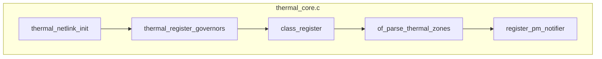
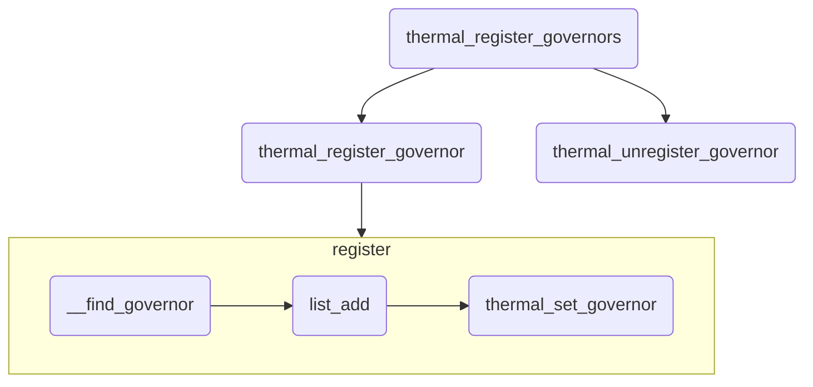

# Thermal Init

## Abstract

__init thermal_init 是 thermal 的初始化函数，thermal 驱动模块的入口（thermel_core.c）。

1. thermal_netlink_init();

   netlink 机制，猜测是用于内核空间和用户空间通信。

2. thermal_register_governors()

   这个步骤是向 thermal core 注册 governors.

3. class_register(&thermal_class)

   注册 thermal_class

4. of_parse_thermal_zones()

   解析 dts 里面的 thermal_zones，这个是重中之重。

5. register_pm_notifier(&thermal_pm_nb)

   notifier 机制，表明 Thermal core 对 pm 时间感兴趣。

我们为了方便理解，用一个流程图来形象化这个步骤：




:::tip 关于 postcore_initcall: 

注意最后调用：`postcore_initcall(thermal_init);`, 在之前的代码中使用的是 `fs_initcall()`, 但是最新的代码更改成了前者。 

`fs_initcall()` 用的原因是因为：thermal 模块加载进内核用的 `fs_initcall()`，tsadc 驱动一般用的是 `module_init()`，前者会早于后者加载，这点比较重要，有些代码流程上会依赖这种先后关系，需要留意[^1]。
这边使用 `postcore_initcall(thermal_init);`, 也是为了解决调用顺序的问题。


要理解这个我们需要了解内核初始化过程中的调用顺序[^2], 可以参考 \<init.h\> 那篇文章的分析。

:::

## thermal_register_governors

这个代码比较重要，所以在这边列举出来：

```c
// 5.17.4
static int __init thermal_register_governors(void)
{
	int ret = 0;
	struct thermal_governor **governor;

	for_each_governor_table(governor) {
		ret = thermal_register_governor(*governor);
		if (ret) {
			pr_err("Failed to register governor: '%s'",
			       (*governor)->name);
			break;
		}

		pr_info("Registered thermal governor '%s'",
			(*governor)->name);
	}

	if (ret) {
		struct thermal_governor **gov;

		for_each_governor_table(gov) {
			if (gov == governor)
				break;
			thermal_unregister_governor(*gov);
		}
	}

	return ret;
}
```

这个是 Linux 5.17.4 的代码实现，做了一些封装，封装过后调用了 `thermal_register_governor`.

其调用的流程图如下：



### thermal_register_governor

函数定义如下：`int thermal_register_governor(struct thermal_governor *governor)`.

注册 governor 实现了几件事：

1. 根据传入的 governor 去查找，调用 `__find_governor`, 传入的 governor 名称是否有对应的存在，存在于什么地方呢？`thermal_governor_list`, 这个 list 是一个静态的 `static LIST_HEAD(thermal_governor_list);` 不存在的 governor 会被添加进去
2. 找到的话，把 governor -> governor_list 放到 thermal_governor_list 中去

对于 `thermal_unregister_governor` 道理相似，不再赘述。

我们再分析一下源码：

```c
int thermal_register_governor(struct thermal_governor *governor)
{
	int err;
	const char *name;
	struct thermal_zone_device *pos;

	if (!governor)
		return -EINVAL;

	mutex_lock(&thermal_governor_lock);

	err = -EBUSY;
	if (!__find_governor(governor->name)) { // __find_governor == NULL
		bool match_default;

		err = 0;
		list_add(&governor->governor_list, &thermal_governor_list);
		match_default = !strncmp(governor->name,
					 DEFAULT_THERMAL_GOVERNOR,
					 THERMAL_NAME_LENGTH);
		// match_default is true when governor->name == DEFAULT_xxx
		if (!def_governor && match_default)
			def_governor = governor;
	}

	mutex_lock(&thermal_list_lock);

	list_for_each_entry(pos, &thermal_tz_list, node) {
		/*
		 * only thermal zones with specified tz->tzp->governor_name
		 * may run with tz->govenor unset
		 */
		if (pos->governor)
			continue;

		name = pos->tzp->governor_name;

		if (!strncasecmp(name, governor->name, THERMAL_NAME_LENGTH)) {
			int ret;

			ret = thermal_set_governor(pos, governor);
			if (ret)
				dev_err(&pos->device,
					"Failed to set governor %s for thermal zone %s: %d\n",
					governor->name, pos->type, ret);
		}
	}

	mutex_unlock(&thermal_list_lock);
	mutex_unlock(&thermal_governor_lock);

	return err;
}
```

- 第 7 行进行了安全性检查，确保传进来的 govenor 不是空指针；

- 第 10 行使用了互斥锁 `mutex_lock`, 这个互斥锁用于对临界区上锁。之所以可以对 `thermal_governor_lock` 上锁，是因为这是一个静态初始化的全局变量。

  ```c
  static DEFINE_MUTEX(thermal_governor_lock);
  ```

  后续会对全局变量 thermal_governor_list 进行操作，所以在此加锁。

- 第 17 行，如果没找到，就把当前的 thermal_governor 加入全局链表 `thermal_governor_list`

- 第 18 行，找到 match 的 governor, 然后和默认值进行对比，默认的 governor 定义如下：

  ```c
  /* Default Thermal Governor */
  // in thermal_cor.h
  #if defined(CONFIG_THERMAL_DEFAULT_GOV_STEP_WISE)
  #define DEFAULT_THERMAL_GOVERNOR       "step_wise"
  #elif defined(CONFIG_THERMAL_DEFAULT_GOV_FAIR_SHARE)
  #define DEFAULT_THERMAL_GOVERNOR       "fair_share"
  #elif defined(CONFIG_THERMAL_DEFAULT_GOV_USER_SPACE)
  #define DEFAULT_THERMAL_GOVERNOR       "user_space"
  #elif defined(CONFIG_THERMAL_DEFAULT_GOV_POWER_ALLOCATOR)
  #define DEFAULT_THERMAL_GOVERNOR       "power_allocator"
  #endif
  ```

- 第 22 行，如果默认的全局变量 `def_governor` 为空且要注册的 governor 的名称和默认的  `DEFAULT_THERMAL_GOVERNO` 一致，则赋值给 `def_governor`

- 第 41 行，调用 `thermal_set_governor()`, 下文继续分析

#### __find_governor

```c
static struct thermal_governor *__find_governor(const char *name) {
	struct thermal_governor *pos;

	if (!name || !name[0])
		return def_governor;

	list_for_each_entry(pos, &thermal_governor_list, governor_list)
		if (!strncasecmp(name, pos->name, THERMAL_NAME_LENGTH))
			return pos;

	return NULL;
}
```

预设 `static struct thermal_governor *def_governor;` 没有传入 `name` 的时候返回预设的 governor.

传入 `name` 的话，进行名称循环校验，和 `LIST_HEAD` 中的进行对比。


调用地方：

1. `int thermal_register_governor(struct thermal_governor *governor)`

2. `void thermal_unregister_governor(struct thermal_governor *governor)`

3. `int thermal_zone_device_set_policy(struct thermal_zone_device *tz, char *policy)`

   `policy` 作为 `governor` 的名称传入，进行了 `strim(policy)` 操作。

4. `thermal_zone_device_register`

总结一下，`__find_governor` 主要的作用是根据 policy 去拿到对应的 governor, 如果 policy 是不存在的，则从预先设置的里面返回。

❌❌❌ 了解预先设置的返回什么？

### thermal_set_governor

> thermal_set_governor() - Switch to another governor

```c
/**
 * thermal_set_governor() - Switch to another governor
 * @tz:		a valid pointer to a struct thermal_zone_device
 * @new_gov:	pointer to the new governor
 *
 * Change the governor of thermal zone @tz.
 *
 * Return: 0 on success, an error if the new governor's bind_to_tz() failed.
 */
static int thermal_set_governor(struct thermal_zone_device *tz, struct thermal_governor *new_gov) {
    // code
}
```

先解绑 tz 之前的 governor, 再绑定 `new_gov` 到其中，绑定解绑分别对应的写法为：

```c
// unbind
tz->governor->unbind_from_tz(tz);

// bind
ret = new_gov->bind_to_tz(tz);
```

到目前位置，`thermal_register_governors` 的步骤已经完成了。


### thermal_zone_device_set_policy

```c
int thermal_zone_device_set_policy(struct thermal_zone_device *tz, char *policy){
    // ...
}
```

`*tz`: thermal zone device

`policy`: 根据这个去找到 thermal_governor, 如下所示：

```c
struct thermal_governor *gov;

gov = __find_governor(strim(policy));
```

`policy` 作为 governor 的名称去寻找对应的 governor.


如果成功找到的话，调用 `thermal_set_governor`.

### thermal_zone_device_register

```c
/**
 * thermal_zone_device_register() - register a new thermal zone device
 * @type:	the thermal zone device type
 * @trips:	the number of trip points the thermal zone support
 * @mask:	a bit string indicating the writeablility of trip points
 * @devdata:	private device data
 * @ops:	standard thermal zone device callbacks
 * @tzp:	thermal zone platform parameters
 * @passive_delay: number of milliseconds to wait between polls when
 *		   performing passive cooling
 * @polling_delay: number of milliseconds to wait between polls when checking
 *		   whether trip points have been crossed (0 for interrupt
 *		   driven systems)
 *
 * This interface function adds a new thermal zone device (sensor) to
 * /sys/class/thermal folder as thermal_zone[0-*]. It tries to bind all the
 * thermal cooling devices registered at the same time.
 * thermal_zone_device_unregister() must be called when the device is no
 * longer needed. The passive cooling depends on the .get_trend() return value.
 *
 * Return: a pointer to the created struct thermal_zone_device or an
 * in case of error, an ERR_PTR. Caller must check return value with
 * IS_ERR*() helpers.
 */
struct thermal_zone_device *
thermal_zone_device_register(const char *type, int trips, int mask,
			     void *devdata, struct thermal_zone_device_ops *ops,
			     struct thermal_zone_params *tzp, int passive_delay,
			     int polling_delay)
{
    // code
}
```

@type: 如 soc_thermal

如注释所示，这个接口实现了增加一个新的 thermal zone device(sensor), 位置在 `/sys/class/thermal `, 其中每个文件夹的名称都类似于 `thermal_zone[0-*]`, 如 `thermal_zone0` 这样。

## class_register

@todo

## of_parse_thermal_zones

thermal_of.c

>  of_parse_thermal_zones - parse device tree thermal data Initialization function that can be called by machine initialization code to parse thermal data and populate the thermal framework with hardware thermal zones info. This function only parses thermal zones.
>
>  Cooling devices and sensor devices nodes are supposed to be parsed by their respective drivers. 
>
>  Return: 0 on success, proper error code otherwise

## register_pm_notifier

## Reference

[^1]: [内核初始化过程中的调用顺序](https://e-mailky.github.io/2016-10-14-linux_kernel_init_seq)
[^2]: <https://blog.csdn.net/beatbean/article/details/8448623>
