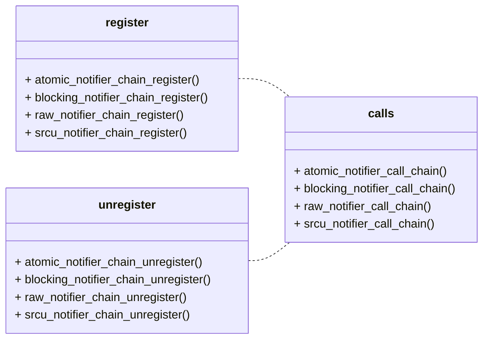

# Linux Notifier

## Abstract

我们简单研究一下内核的 notify 机制。

大多数内核子系统都是相互独立的，但是某个子系统可能会对其他子系统产生的事件感兴趣。为了满足这个需求，让某个子系统在发生某个事件的时候通知其他的子系统，Linux kernel 提供了**通知链**的机制，通知链表只能够在内核的子系统之间使用，而不能够在内核与用户空间之间进行事件的通知。

:::tip

本文分析的代码主要集中于：`notifier.c` 和 `notifier.h` 中。

:::

## Notifier Struct

## notifier_chain(notifier_head)

我们需要了解到，通知链可以分为 4 种[^1]，如下表所示：

| 通知链(notifier.c)                  | 定义                                                         | 备注 |
| ----------------------------------- | ------------------------------------------------------------ | ---- |
| 原子通知链 atomic_notifier_head     | 采用**自旋锁**，通知链元素的回调函数（当事件发生时要执行的函数）在中断或原子操作上下文中运行，不允许阻塞。 |      |
| 可阻塞通知链 blocking_notifier_head | 通知链使用**信号量**实现回调函数的加锁，通知链元素的回调函数在进程上下文中运行，允许阻塞。 |      |
| 原始通知链 raw_notifier_head        | 对通知链元素的回调函数**没有任何限制**，所有锁和保护机制都由调用者维护。 |      |
| SRCU 通知链 srcu_notifier_head      | 可阻塞通知链的一种变体，采用**互斥锁**和叫做 **可睡眠的读拷贝更新机制** (Sleepable Read-Copy UpdateSleepable Read-Copy Update)。 |      |

这几种通知链的区别是在**执行通知链上的回调函数时是否有安全保护措施**。

### atomic_notifier_head

```c
struct atomic_notifier_head {
	spinlock_t lock;
	struct notifier_block __rcu *head;
};
```

其中 `spinlock_t` 在 kernel 中表示自旋锁。自旋锁是用来避免竞争条件的一种机制。

要初始化这个 head, 我们可以这么做：

```c
#define ATOMIC_NOTIFIER_HEAD(name)				\
	struct atomic_notifier_head name =			\
		ATOMIC_NOTIFIER_INIT(name)

#define ATOMIC_NOTIFIER_INIT(name) {				\
		.lock = __SPIN_LOCK_UNLOCKED(name.lock),	\
		.head = NULL }
```

或者使用对象直接初始化：

```c
#define ATOMIC_INIT_NOTIFIER_HEAD(name) do {	\
		spin_lock_init(&(name)->lock);	\
		(name)->head = NULL;		\
	} while (0)
```


### blocking_notifier_head

```c
struct blocking_notifier_head {
	struct rw_semaphore rwsem;
	struct notifier_block __rcu *head;
};
```

`blocking_notifier_head` 基于信号量的机制，本文不加以深入研究了。

初始化类似于上文：

```c
#define BLOCKING_NOTIFIER_HEAD(name)				\
	struct blocking_notifier_head name =			\
		BLOCKING_NOTIFIER_INIT(name)

#define BLOCKING_NOTIFIER_INIT(name) {				\
		.rwsem = __RWSEM_INITIALIZER((name).rwsem),	\
		.head = NULL }

#define BLOCKING_INIT_NOTIFIER_HEAD(name) do {	\
		init_rwsem(&(name)->rwsem);	\
		(name)->head = NULL;		\
	} while (0)
```


### raw_notifier_head 

其定义如下：

```c
struct raw_notifier_head {
	struct notifier_block __rcu *head;
};
```

比较纯粹的调用链，其初始化过程如下：

```c
#define RAW_NOTIFIER_HEAD(name)					\
	struct raw_notifier_head name =				\
		RAW_NOTIFIER_INIT(name)

#define RAW_NOTIFIER_INIT(name)	{				\
		.head = NULL }

#define RAW_INIT_NOTIFIER_HEAD(name) do {	\
		(name)->head = NULL;		\
	} while (0)
```

### srcu_notifier_head

其定义如下：

```c
struct srcu_notifier_head {
	struct mutex mutex;
	struct srcu_struct srcu;
	struct notifier_block __rcu *head;
};
```

这个能不能用依赖于宏定义：

```c
#ifdef CONFIG_TREE_SRCU
#define _SRCU_NOTIFIER_HEAD(name, mod)				\
	static DEFINE_PER_CPU(struct srcu_data, name##_head_srcu_data); \
	mod struct srcu_notifier_head name =			\
			SRCU_NOTIFIER_INIT(name, name##_head_srcu_data)

#else
#define _SRCU_NOTIFIER_HEAD(name, mod)				\
	mod struct srcu_notifier_head name =			\
			SRCU_NOTIFIER_INIT(name, name)

#endif
```

定义后其初始化过程为：

```c
#define SRCU_NOTIFIER_INIT(name, pcpu)				\
	{							\
		.mutex = __MUTEX_INITIALIZER(name.mutex),	\
		.head = NULL,					\
		.srcu = __SRCU_STRUCT_INIT(name.srcu, pcpu),	\
	}
```

暂时研究到这，以后如果有使用了再加以研究。

### notifier_block

通知链表(也称作通知块，挂在通知链上面) `notifier_block` 的数据结构定义如下：

```c
struct notifier_block
{
    int (*notifier_call)(struct notifier_block *self, unsigned long, void *);
    struct notifier_block *next;
    int priority;
};
```

我们对参数进行分析：

| 参数          | 类型             | 含义                                                         |
| ------------- | ---------------- | ------------------------------------------------------------ |
| notifier_call | 函数指针         | 表示这个节点所对应的要运行的那个函数                         |
| next          | notifier_block * | 指向下一个节点，当前事件发生时还要继续指向的节点             |
| priority      | int              | 表示该通知的优先级，同一条链上面的 notifier_block 是按照优先级排列的，数字越大，优先级越高。 |

注意到在 5.17.4 内核中，我们对结构体的定义发生了变化：

```c
// notifier.h
struct notifier_block {
	notifier_fn_t notifier_call;
	struct notifier_block __rcu *next;
	int priority;
};

// notifier_fn_t
typedef	int (*notifier_fn_t)(struct notifier_block *nb,
			unsigned long action, void *data);
```

我们对这个版本的参数也进行分析：

| 参数          | 类型            | 含义                                                         |
| ------------- | --------------- | ------------------------------------------------------------ |
| notifier_call | notifier_fn_t   | 宏定义的一个函数指针，对原来的 int (*notifier_call) 进行了一个封装 |
| next          | notifier_block* | 还是指向下一个节点的 notifier_block                          |
| priority      | int             |                                                              |

我们可以看到，新版的内核对函数指正进行了封装。个人理解这样做的好处在于，在阅读源码的时候，能更加方便的理解参数的含义。

## APIs

### Abstract

API 主要可以分为三类，如下图所示：




### notifier_chain_register

通知链需要进行注册，对于一个链表的注册，需要一个表头，指向这个通知链表的第一个元素，注册函数的定义如下（Linux 内核中有很多的注册函数，我们拿一个举例）：

```c
// notifier.c
// Returns 0 on success, %-EEXIST on error
int atomic_notifier_chain_register(struct atomic_notifier_head *nh,
		struct notifier_block *n)
{
	unsigned long flags;
	int ret;

	spin_lock_irqsave(&nh->lock, flags);
	ret = notifier_chain_register(&nh->head, n);
	spin_unlock_irqrestore(&nh->lock, flags);
	return ret;
}
```

这个函数的作用是 *Add notifier to an atomic notifier chain*, 就是在原子调用链中增加一个 notifier, 参数含义如下：

| 参数 | 类型                  | 含义                                                         |
| ---- | --------------------- | ------------------------------------------------------------ |
| nh   | atomic_notifier_head* | Pointer to head of the atomic notifier chain. <br />指向调用链头部的一个指针。 |
| n    | notifier_block*       | 前文分析过的 notifier_block                                  |

atomic_notifier_head 的定义如下：

```c
struct atomic_notifier_head {
    spinlock_t lock;
    struct notifier_block __rcu *head;
};
```

具体分析见上文。


### notifier_chain_unregister

类似的，我们还有一个卸载函数 `notifier_chain_unregister`， 其定义如下：

```c
static int notifier_chain_unregister(struct notifier_block **nl,
		struct notifier_block *n);
```

其含义是将节点 n 从 nl 指向的链表中删除。

### notifier_call_chain

> notifier_call_chain - Informs the registered notifiers about an event.
>
> notifier_call_chain returns the value returned by the last notifier function called.

`notifier_call_chain` 的作用是：当有事件发生的时候，使用该函数通知链表发送消息。

```c
// notifier.c
static int notifier_call_chain(struct notifier_block **nl,
			       unsigned long val, void *v,
			       int nr_to_call, int *nr_calls)
{
	int ret = NOTIFY_DONE;
	struct notifier_block *nb, *next_nb;

	nb = rcu_dereference_raw(*nl);

	while (nb && nr_to_call) {
		next_nb = rcu_dereference_raw(nb->next);

#ifdef CONFIG_DEBUG_NOTIFIERS
		if (unlikely(!func_ptr_is_kernel_text(nb->notifier_call))) {
			WARN(1, "Invalid notifier called!");
			nb = next_nb;
			continue;
		}
#endif
		ret = nb->notifier_call(nb, val, v);

		if (nr_calls)
			(*nr_calls)++;

		if (ret & NOTIFY_STOP_MASK)
			break;
		nb = next_nb;
		nr_to_call--;
	}
	return ret;
}
NOKPROBE_SYMBOL(notifier_call_chain);
```

函数比较长，但是比较重要，我们首先分析这个函数的参数：

| 参数       | 类型              | 含义                                                         |
| ---------- | ----------------- | ------------------------------------------------------------ |
| nl         | notifier_block ** | Pointer to head of the blocking notifier chain<br />这个是指向链表头结点 |
| val        | unsigned long     | Value passed unmodified to notifier function<br />如何理解这个 passed unmodified? ❓❓❓ |
| v          | void*             | Pointer passed unmodified to notifier function               |
| nr_to_call | int               | Number of notifier functions to be called. Don't care value of this parameter is -1.<br />要调用的通知函数的数量。 |
| nr_calls   | int*              | Records the number of notifications sent. Don't care value of this field is NULL. |

我们这个函数实现大致可以概括如下：

1. 遍历链表 nl, 拿到当前的 notifier_block `nb` 和下一个 `next_nb`

2. 对于当前的 `nb`, 调用 `nb->notifier_call` 函数指针，我们结合这个函数的指针来看：

   ```c
   // notifier_fn_t notifier_call in notifier_block
   typedef	int (*notifier_fn_t)(struct notifier_block *nb,
   			unsigned long action, void *data);
   
   // notifier_call_chain
   ret = nb->notifier_call(nb, val, v);
   ```

   这样参数就可以对应起来了，🔴🔴🔴 还需要根据调用继续理解。

3. 当前的通知过后，继续通知下一个。

## Usage

### Usage: init

在上文研究了 notifier 的基本机制以后，我们现在来研究如何使用。

在前面我们提到，通知链有四种，我们在使用的时候，需要了解到我们的场景中，需要使用哪个调用链。

我们在 `notifier.h` 文件中搜索通知链的大写名称即可看到不同类通知链的初始化函数，我们拿 `ATOMIC_NOTIFIER_HEAD` 举例：

```c
#define ATOMIC_NOTIFIER_HEAD(name)				\
	struct atomic_notifier_head name =			\
		ATOMIC_NOTIFIER_INIT(name)

#define ATOMIC_NOTIFIER_INIT(name) {				\
		.lock = __SPIN_LOCK_UNLOCKED(name.lock),	\
		.head = NULL }
```

以上两者是等价的，我们初始化的方式要对比定义来看比较直观：

```c
struct atomic_notifier_head {
    spinlock_t lock;
    struct notifier_block __rcu *head;
};
```

哈哈哈，十分巧妙！

 如果我们有一个现成的 `atomic_notifier_head` 通知链对象，我们可以调用以下的初始化方法：

```c
#define ATOMIC_INIT_NOTIFIER_HEAD(name) do {	\
		spin_lock_init(&(name)->lock);	\
		(name)->head = NULL;		\
	} while (0)
```


一般而言，我们要使用通知链的话，是这么玩的：

```c
static struct atomic_notifier_head dock_notifier_list;
ATOMIC_INIT_NOTIFIER_HEAD(&dock_notifier_list);
```

这样，我们就拥有通知链了。

### Usage: register, unregister and call

init 通知链以后，我们还需要往通知链上面注册、卸载通知块，或者遍历通知块。这里的通知块指的是 `notifier_block`, 内核提供的通知链的接口我们在上文已经进行了研究，为了方便理解，我们再对其进行一个归类总结，主要可以分为三类，其源码定义如下：

```c
extern int atomic_notifier_chain_register(struct atomic_notifier_head *nh,
		struct notifier_block *nb);
extern int blocking_notifier_chain_register(struct blocking_notifier_head *nh,
		struct notifier_block *nb);
extern int raw_notifier_chain_register(struct raw_notifier_head *nh,
		struct notifier_block *nb);
extern int srcu_notifier_chain_register(struct srcu_notifier_head *nh,
		struct notifier_block *nb);

extern int atomic_notifier_chain_unregister(struct atomic_notifier_head *nh,
		struct notifier_block *nb);
extern int blocking_notifier_chain_unregister(struct blocking_notifier_head *nh,
		struct notifier_block *nb);
extern int raw_notifier_chain_unregister(struct raw_notifier_head *nh,
		struct notifier_block *nb);
extern int srcu_notifier_chain_unregister(struct srcu_notifier_head *nh,
		struct notifier_block *nb);

extern int atomic_notifier_call_chain(struct atomic_notifier_head *nh,
		unsigned long val, void *v);
extern int blocking_notifier_call_chain(struct blocking_notifier_head *nh,
		unsigned long val, void *v);
extern int raw_notifier_call_chain(struct raw_notifier_head *nh,
		unsigned long val, void *v);
extern int srcu_notifier_call_chain(struct srcu_notifier_head *nh,
		unsigned long val, void *v);

extern int blocking_notifier_call_chain_robust(struct blocking_notifier_head *nh,
		unsigned long val_up, unsigned long val_down, void *v);
extern int raw_notifier_call_chain_robust(struct raw_notifier_head *nh,
		unsigned long val_up, unsigned long val_down, void *v);
```


### Usage: example

上述这四类通知链的基本 API 又构成了内核中其他子系统定义、操作自己通知链的基础。例如 Netlink 定义了一个原子通知链，所以，它对原子通知链的基本API又封装了一层，以形成自己的特色:

```c
static ATOMIC_NOTIFIER_HEAD(netlink_chain);

int netlink_register_notifier(struct notifier_block *nb)
{
        return atomic_notifier_chain_register(&netlink_chain, nb);
}
EXPORT_SYMBOL(netlink_register_notifier);

int netlink_unregister_notifier(struct notifier_block *nb)
{
        return atomic_notifier_chain_unregister(&netlink_chain, nb);
}
EXPORT_SYMBOL(netlink_unregister_notifier);
```

网络事件也有一个原子通知链 `net/core/netevent.c`, 只列举接口名称：

```c
int register_netevent_notifier(struct notifier_block *nb);
int unregister_netevent_notifier(struct notifier_block *nb);
int call_netevent_notifiers(unsigned long val, void *v);
```

## How notifier works

通知链的运作机制包括两个角色：

1. 被通知者：对某一事件感兴趣的一方。定义了当事件发生的时候，相应的处理函数，即回调函数，被通知者将其注册到通知链中。

2. 通知者：事件的通知者。检测到某个事件或者产生某个事件的时候，通知所有对该事件产生兴趣的一方，通知者需要**定义一个通知链**，并在其中保存每一个被通知者对事件的回调函数。

   通知这个过程本质上就是遍历通知链中的每一项，然后调用相应的回调函数。

## Reference

[^1]:  [linux内核通知链](https://learning-kernel.readthedocs.io/en/latest/kernel-notifier.html)

