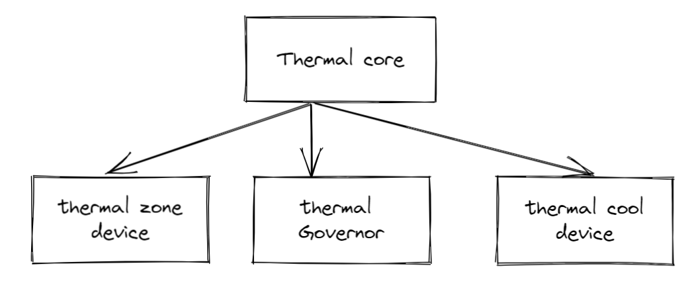

# Thermal

## Abstract

Linux Thermal 是 Linux 系统下温度控制相关的模块，主要用来控制系统运行中芯片产生的热量。配合 ic 内部温度传感器，对 ic 温度进行管控，保证系统稳定性[^1]。

其基本的架构可以简单概括为下图：



Thermal 中有一些基础概念，下文对其进行分析。

## Thermal Zone

Thermal Zone 代表一个温控区间，将其看成一个虚拟的温度 sensor, 但是需要有物理 sensor 与其关联才可以发挥作用。 需要注意的是，一个 Thermal zone 最多可以关联一个 sensor, 但是一个 sensor 可以是多个硬件 Sensor 的混合。

🤔🤔🤔 为什么一个 Thermal zone 只能关联一个 sensor? 系统中会有多个 Thermal zone 吗？

### Thermal Zone Device

Thermal Zone Device 在 Thermal 框架中理解为**获取温度的设备**。

### Trip point

> The binding of the cooling devices to the trip point is left for the user.

触发点由 Thermal Zone 维护，每个 Thermal Zone 可以维护多个 Trip Point, 其包含的信息有：

- temp: 当前温度

- type: 类型，有以下方式：passive、active、hot、critical

- cooling device: 绑定信息。

    这个绑定信息指的是 Trip Point 和 cooling device 的绑定关系，即当 Trip Point 触发后由哪个 cooling device 去实施冷却措施。每个 Trip Point 要与 cooling device 绑定，才有其实际意义。

    cooling device 是实际对系统实施冷却措施的驱动，是温控的执行者。cooling device 维护一个 cooling 等级 state, state 越高则表示系统的冷却需求越高（注意到 cooling device 只根据 state 进行冷却操作）。

    🤔🤔🤔 state 这个取值是由谁决定的？state 的计算由 Thermal Governor 完成。

### Source Code

dts 的配置：

@[code{1-13}](./code/thermal_zone.dts)

上述代码为拷贝过来的，具体的理解，目前如下：

1. 轮询时间有 2 个，如果超过了温度阈值，则缩短轮询的时间。
2. @todo

## Thermal Governal

Thermal Governal 是降温策略的一个抽象，与 cpufreq 的 governal 概念类似。

内核实现的策略定义如下：

```c
/**
 * struct thermal_governor - structure that holds thermal governor information
 * @name:       name of the governor
 * @throttle:   callback called for every trip point even if temperature is
 *              below the trip point temperature
 * @governor_list:      node in thermal_governor_list (in thermal_core.c)
 */
struct thermal_governor {
        char name[THERMAL_NAME_LENGTH];
    /* 策略函数 */
        int (*throttle)(struct thermal_zone_device *tz, int trip);
        struct list_head        governor_list;
};
```

## Thermal Cooling Device

Thermal Cooling Device 是可以降温设备的抽象，如风扇。除此之外，还会包括CPU、GPU 这些，如何理解呢？

散热的方式有两种，一种是加快散热，一种是降低产热量，CPU、GPU 就是后者的体现。

```c
struct thermal_cooling_device {
    int id;
    char type[THERMAL_NAME_LENGTH];
    struct device device;
    struct device_node *np;
    void *devdata;
    /* cooling device 操作函数 */
    const struct thermal_cooling_device_ops *ops;
    bool updated; /* true if the cooling device does not need update */
    struct mutex lock; /* protect thermal_instances list */
    struct list_head thermal_instances;
    struct list_head node;
};

struct thermal_cooling_device_ops {
    int (*get_max_state) (struct thermal_cooling_device *, unsigned long *);
    int (*get_cur_state) (struct thermal_cooling_device *, unsigned long *);
    /* 设定等级 */
    int (*set_cur_state) (struct thermal_cooling_device *, unsigned long);
};
```

## Thermal Core

Thermal Core 作为中枢注册 Governor, 注册 Thermal 类，并且基于 Device Tree 注册 Thermal Zone;

除此之外，提供 Thermal Zone 注册函数、Cooling Device 注册函数、提供将 Cooling 设备绑定到 Zone 的函数，一个 Thermal Zone 可以有多个 Cooling 设备；

提供了核心函数 thermal_zone_device_update 作为 Thermal 中断处理函数和轮询函数，轮询的时候会根据不同 Trip Delay 调节。

## Reference

[^1]: [Linux电源管理（五）thermal](https://www.it610.com/article/1288705954065489920.htm)
