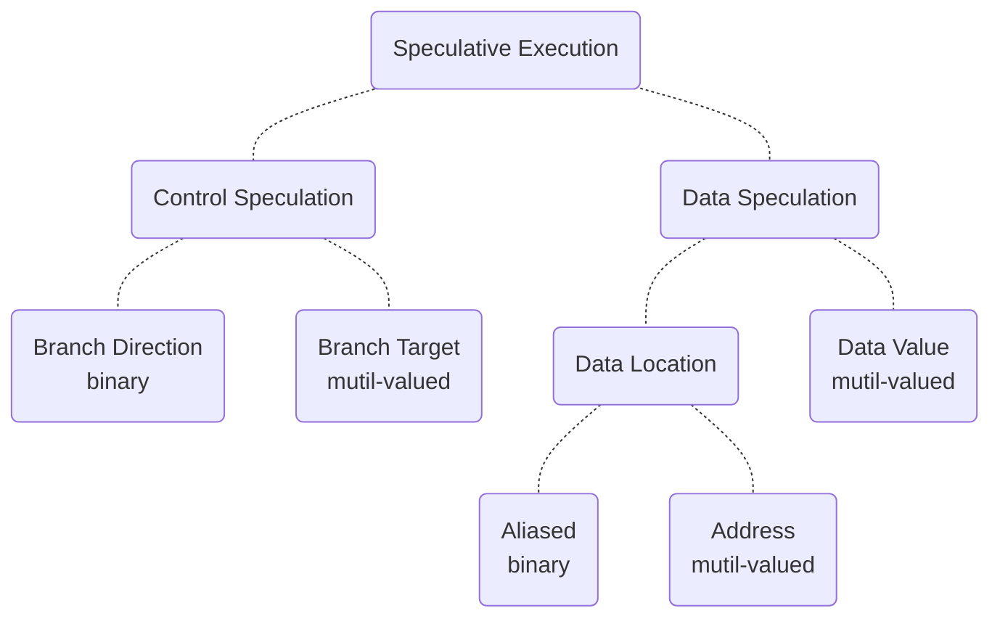
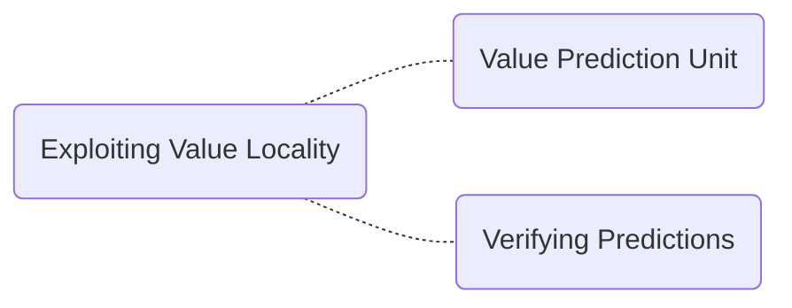
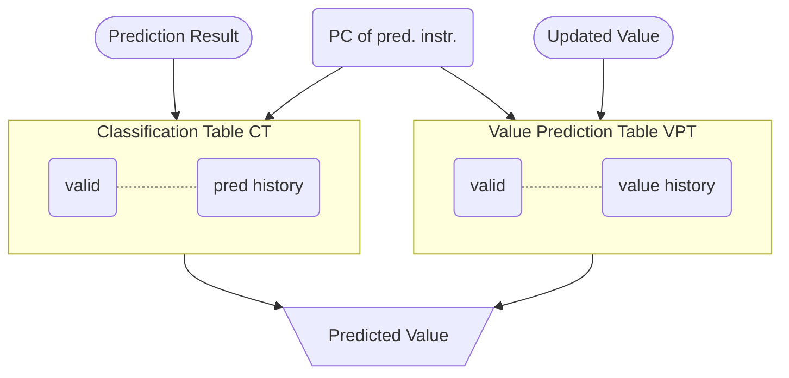

# Value Prediction

## Value Prediction in a Nutshell

> Value Prediction (VP) is a microarchitectural technique that speculatively breaks true data dependency to increase instruction level parallelism in out-of-order processor cores.[^1]

- branch prediction but for values

MICRO Test of Time Award[^2] 是一个十分具有分量的奖项，收录了微体系结构中经典的具有影响力的论文，关于 VP 的论文 <[ Exceeding the Dataflow Limit Via Value Prediction](http://dl.acm.org/citation.cfm?id=243889)>[^3] 就是 2017 年被该奖项收录。

## MICRO 29

### Abstract

本章节主要研究 *Exceeding the dataflow limit via value prediction* 这篇文章，这篇文章作为经典的 VP 的顶尖著作之一，具有很高的研究价值。

### Taxonomy of Speculative Execution

- 对于 Data Speculation 而言，我们分类：预测是否与数据的**位置**或者**值**有关。

- 对于 binary vs mutil-valued 而言，binary 表示的是预测的两种结果，0-1 或者 token vs not-token(branch 中表示 branch 的方向)，mutil-valued 表示的是 brach 的目标，这个目标可能是存在于程序地址的任何空间中的。

### Data Speculation

可以分为两类：

1. those that speculate on the storage location of the data: 存储位置
2. those that speculate on the actual value of the data: 实际的值

对于推测存储位置存在两种 flavor:

1. those that speculate on a specific attribute of the storage location
2. those that speculate on the address of the storage location

### Value Locality

> previously-seen value recurring repeatedly within a storage location.

以前看的的值在存储位置中重复出现。

> Although the concept is general and can be applied to any storage location within a computer system, we have limited our current study to examine only the value locality of general-purpose or floating point registers immediately following instructions that write to those registers.

目前限制了这个 Value Locality 的范围在通用寄存器或者浮点寄存器紧跟着写到这些寄存器指令之后的场景。

不过哪怕是寄存器，以 32-bit 举例，也可能会存在超过 2^32 的值，我们要怎么才能做到预测下一个可能出现的值呢？

> As it turns out, if we narrow the scope of our prediction mechanism by considering each **static instruction** individually, the task becomes much easier and we are able to accurately predict a significant fraction of register values being written by machine instructions.

这篇文章使用了 20 个 benchmark 总结出来了寄存器的 value locality,  特别是 signal cycle 的指定操作寄存器的 value locality 更加明显。

### Exploiting Value Locality

### Value Prediction Unit

文章提出了 VP 单元的两级预测结构：

我们对这张图片进行分析：

> The PC of the instruction being predicted is used to index into the VPT to find a value to predict.

PC 中的指令用于 index 进去 VPT, 找到需要预测的值。与此同时，CT 也被 Index 用于用于决定是否进行预测。当指令完成的时候，*pred histstory* 和 *value history* 两个字段都被更新了。

#### CT

- valid

> The valid field, which consists of either a single bit that indicates a valid entry or a partial or complete tag field that is matched against the upper bits of the PC to indicate a valid field.

这句话主要的意思是：由单个 bit 位组成，表示一个有效的 entry 或者一部分或完整的 tag 字段，与 PC 的高比特位匹配，表示有效的 field.

- prediction history

​		1 bit 或者更多位的 saturating counter(饱和计数器)， 某个预测正确或者错误的时候，这一位的字段增加或者减少。

​		除此之外，还可以将指定分类为可预测和不可预测；这种预测用于决定是否预测特定指令的结果。换言之，CT 将指令分为了两类：通过 VPT 预测和指令和不通过 VPT 预测的指令。

#### VPT

VPT 的这两个字段的含义说明如下：

- tag

  同 CT，由单个 bit 有效位或者完整或者部分标记。

- value history

  包括 32-bit 或者 64 bit 的值，这些值由 LRU 策略维护（that are maintained with an LRU policy）；当第一次产生指令结果或者预测不正确的时候，这个字段被替换掉。

  需要注意的是，VPT 的替换策略收到 CT 预测历史的影响，以免用了不那么有用的值替换掉有用的值。

### Verifying Predictions

由于值预测本来就是投机性的，所以需要一种机制来验证预测的正确性，并且从错误预测中恢复过来。

## Words

| Words      | 含义               |      | Words       | 含义       |
| ---------- | ------------------ | ---- | ----------- | ---------- |
| impose     | 强制实行、强制推行 |      | Speculation | 推测、猜测 |
| narrow     | 有限的、小的       |      | saturating  | 饱和       |
| hysteresis | 回差、滞后         |      | speculative | 投机性的   |

## Reference

[^1]: [Championship Value Prediction (CVP)](https://www.microarch.org/cvp1/index.html)
[^2]: [MICRO Test of Time Award](https://www.microarch.org/tot/index.html#winners)
[^3]: M. H. Lipasti and J. P. Shen, "Exceeding the dataflow limit via value prediction," Proceedings of the 29th Annual IEEE/ACM International Symposium on Microarchitecture. MICRO 29, 1996, pp. 226-237, doi: 10.1109/MICRO.1996.566464.
