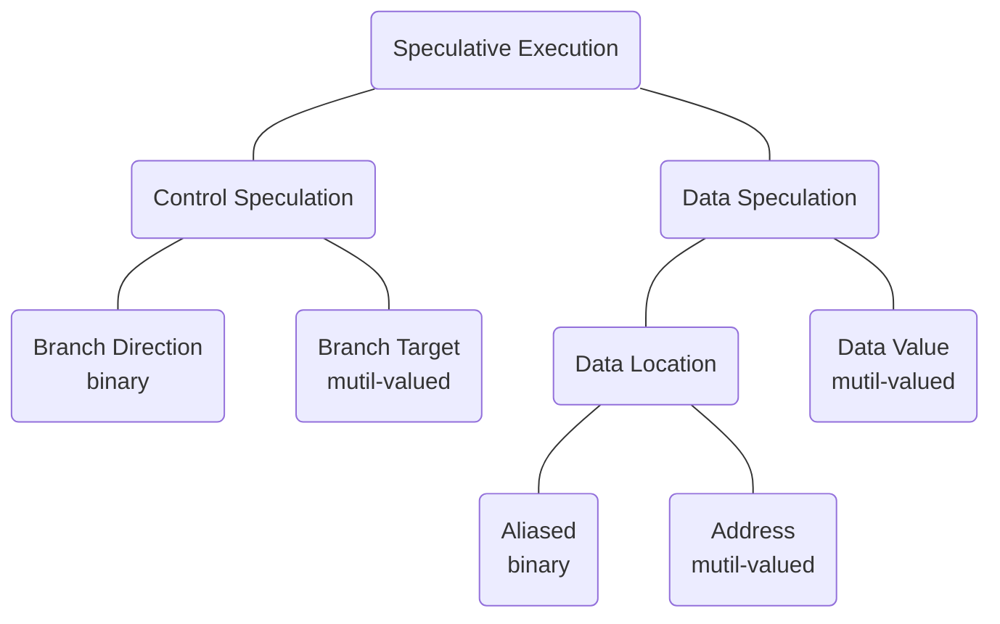
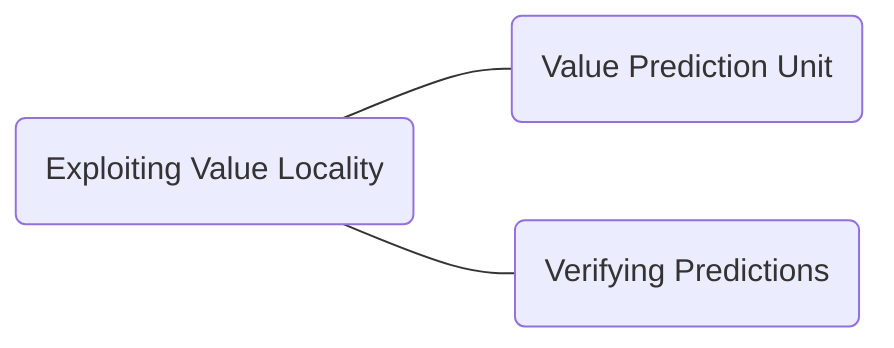

# Value Prediction

## Value Prediction in a Nutshell

> Value Prediction (VP) is a microarchitectural technique that speculatively breaks true data dependency to increase instruction level parallelism in out-of-order processor cores.[^1]

- branch prediction but for values

MICRO Test of Time Award[^2] 是一个十分具有分量的奖项，收录了微体系结构中经典的具有影响力的论文，关于 VP 的论文 <[ Exceeding the Dataflow Limit Via Value Prediction](http://dl.acm.org/citation.cfm?id=243889)>[^3] 就是 2017 年被该奖项收录。

## MICRO 29

### Abstract

本章节主要研究 *Exceeding the dataflow limit via value prediction* 这篇文章，这篇文章作为经典的 VP 的顶尖著作之一，具有很高的研究价值。

### Taxonomy of Speculative Execution

投机执行的分类：

- 对于 Data Speculation 而言，我们分类：预测是否与数据的**位置**或者**值**有关。

- 对于 binary vs multi-valued 而言，binary 表示的是预测的两种结果，0-1 或者 token vs not-token(branch 中表示 branch 的方向)，mutil-valued 表示的是 brach 的目标，这个目标可能是存在于程序地址的任何空间中的。

### Data Speculation

可以分为两类：

1. those that speculate on the storage location of the data: 存储位置
2. those that speculate on the actual value of the data: 实际的值

对于推测存储位置存在两种 flavor:

1. those that speculate on a specific attribute of the storage location：根据存储位置的特定属性进行推测
2. those that speculate on the address of the storage location：根据存储位置的地址进行推测

### Value Locality

> previously-seen value recurring repeatedly within a storage location.

以前看到的值在存储位置中重复出现。

> Although the concept is general and can be applied to any storage location within a computer system, we have limited our current study to examine only the value locality of general-purpose or floating point registers immediately following instructions that write to those registers.

目前限制了这个 Value Locality 的范围在通用寄存器或者浮点寄存器的值局部性，这些寄存器紧跟在写入指令之后。

不过哪怕是寄存器，以 32-bit 举例，也可能会存在超过 2^32 的值，我们要怎么才能做到预测下一个可能出现的值呢？

> As it turns out, if we narrow the scope of our prediction mechanism by considering each **static instruction** individually, the task becomes much easier and we are able to accurately predict a significant fraction of register values being written by machine instructions.

这篇文章使用了 20 个 benchmark 总结出来了寄存器的 value locality,  特别是 signal cycle 的指定操作寄存器的 value locality 更加明显。

### Exploiting Value Locality

### Value Prediction Unit

文章提出了 VP 单元的两级预测结构：

我们对这张图片进行分析：

> the Classification Table (CT) and the Value Prediction Table (VPT), both of which are direct-mapped and indexed by the instruction address (PC) of the instruction being predicted.

> The PC of the instruction being predicted is used to index into the VPT to find a value to predict.

PC 中的指令用于 index 进去 VPT, 找到需要预测的值。与此同时，CT 也被 Index 用于用于决定是否进行预测。当指令完成的时候，*pred histstory* 和 *value history* 两个字段都被更新了。

#### CT

- valid

> The valid field, which consists of either a single bit that indicates a valid entry or a partial or complete tag field that is matched against the upper bits of the PC to indicate a valid field.

这句话主要的意思是：由单个 bit 位组成，表示一个有效的 entry 或者一部分或完整的 tag 字段，与 PC 的高比特位匹配，表示有效的 field.

- prediction history

​		1 bit 或者更多位的 saturating counter(饱和计数器)， 某个预测正确或者错误的时候，这一位的字段增加或者减少。

​		除此之外，还可以将指定分类为可预测和不可预测；这种预测用于决定是否预测特定指令的结果。换言之，CT 将指令分为了两类：通过 VPT 预测和指令和不通过 VPT 预测的指令。

> Increasing the number of bits in the saturating counter adds hysteresis to the classification process and *can help avoid erroneous classifications by ignoring anomalous values and/or destructive interference.*

​	需要注意，增加饱和计数器的 bit 位可能会增加分类过程中的 hystersis(迟滞)；这个迟滞可能的意思是说，增加 bit 位导致的预测结果集后移，这种迟滞，如以前 2-bit, 2 and 3 是预测，3-bit 而言 可能需要 4 以后才可以预测，这就是迟滞。

对于 CT 和 VPT 的相互关系：

> The VPT replacement policy is also governed by the CT prediction history to introduce  hysteresis and avoid replacing useful values with less useful ones.

VPT 的替换策略受到 CT 预测历史的影响，这是为了避免引入不必要的错误值。

总结：

1. 用于在预测正确或者错误的时候饱和计数器自增或者自减
2. 用于对某个指令分类，该指令是否可预测

#### VPT

VPT 的这两个字段的含义说明如下：

- tag

  同 CT，由单个 bit 有效位或者完整或者部分标记。

- value history

  包括 32-bit 或者 64 bit 的值，这些值由 LRU 策略维护（that are maintained with an LRU policy）；当第一次产生指令结果或者预测不正确的时候，这个字段被替换掉。

  需要注意的是，VPT 的替换策略受到 CT 预测历史的影响，以免用了不那么有用的值替换掉有用的值。

### Verifying Predictions

由于值预测本来就是投机性的，所以需要一种机制来验证预测的正确性，并且从错误预测中恢复过来。

## HPCA 19

### Abstract

本章主要研究 HPCA 19 的 *Efficient Load Value Prediction using Multiple Predictors and Filters[^4]*.

首先阐述 VP 的重大意义：

> Value prediction has the potential to break through the performance limitations imposed by true data dependencies.

然后提出了仅预测 load value 是最高效的方式，特别是在硬件预算不高的情况下（虽然说预测所有指令类型的值是可以做到的）。

📌📌📌 todo，需要研究一下原文的 3 和 4 引用，搞清楚 load value 具体的意义。

目前自己理解的 load value 的含义为：load 指令取值，这个值来自于内存中。

在此先引用一下一篇论文中的解释[^6]，但是不一定是准确的：

> The LVPT is used to predict the value being loaded from memory by associating the load instruction with the value previously loaded by that instruction.

🤔🤔🤔 这句话阐述了一个观点：load value 指的是指令从内存中加载出来的值，load 指令中有访存的操作，这时候就是从内存中取出来要使用的值。

> While predicting values of all instruction types is possible, prior work has shown that predicting just load values is most effective with a modest hardware budget.

然后概述使用了比较多的篇幅来说明提升 VP 的预测精度需要硬件帮助，因此本文提出了一种：

>  In this paper, we **analyzed four state-of-the-art load value predictors**, and found that they complement each other.

基于上述的 load value, 作者提出了一个新的复合预测器。

> Based on that finding, we evaluated a **new composite predictor** that combines all four component predictors. 

### Summary

这块做一个简单的总结，从总体上对这篇文章有一个了解。

1. 本文使用了 4 个先进的预测器，并且提出了一种 Smart Training 的方法对这四种预测器进行有机的结合（后文 Smart Training 中进行详细的研究）
2. 增加 AM(Accuracy Monitor) 技术，这个技术通过屏蔽 produce mis-prediction 的预测器，来减少错误预测带来的损失。AM 可以分为两种：M-AM 和 PC-AM
3. 使用 Heterogeneous Predictor Tables 技术，也可以称作动态融合预测器表，将资源从性能不佳的预测器重新分配到性能更好的预测器
4. 深入分析比较了这种融合的方式对于预测准确度的提升，并和最先进的模型进行了对比

### Introduction

more ILP, true data limit.

ILP 指的是 Instruction Level Parallelism, 指令级并行。

> In the case of load instructions, it is also possible to predict a load memory address, followed by a data cache access, to generate a speculative value that does not necessarily exhibit value locality.

这个技术可以再研究一下。

### 4 Predictors

本文使用了 4 个先进的预测器，并对他们进行了融合，融合过后的组合预测器性能得到了很大的提升，这 4 个预测器如下表所示：

|                  | Predicts                       | Predicts                         |
| ---------------- | ------------------------------ | -------------------------------- |
|                  | Load values                    | Load addresses                   |
| Context agnostic | Last Value Prediction (LVP)    | Stride Address Prediction (SAP)  |
| Context aware    | Context Value Prediction (CVP) | Context Address Prediction (CAP) |

从表中我们可以看出，本文一共使用的四个预测器，并且可以分类为基于地址的、基于 value 的、上下文是否感知的，本文对这些预测器进行了一个排序（使用顺序，在预测的时候先使用哪个，后使用哪个），我们根据这个排序对这 4 个预测器进行简单的介绍：

1. LVP[^5]
2. CVP
3. SAP
4. CAP

> All four components train inparallel.

注意到其并行性。

#### LVP

LVP[^5]这个预测器的原理在于：*that consecutive dynamic instances of a static load will often produce the same value*, 翻译过来就是说静态 load 的连续动态实例通常会产生相同的值。

这个预测器是对上下文不感知的。

这边举了两个例子，还需要再深入理解一下，或者去阅读一下原文。

第一个例子（接上面的英文原文）：

> This commonly occurs, for example, with PC-based loads that read large constants.

第二个例子：

> The pattern can also occur when dynamic instances of a static load produce different addresses, such as when sequencing through an array just initialized with memset.

上述两个例子都是举例说明了 LVP 的一些场景。

LVP uses a PC-indexed, tagged prediction table. 其结构如下：

| 14-bit | 64-bit | 3-bit                         |      | 81 bits(total) |
| ------ | ------ | ----------------------------- | ---- | -------------- |
| tag    | value  | saturating confidence counter |      | a entry        |

> LVP is trained when a load executes by hashing the PC bits of a load to access an entry and then updating the entry’s tag and value.

❌❌❌ load PC 的关系不明确，导致这段话不能理解。

目前可以看出来的是，PC 中的一些比特位通过 hash 的方式索引到 LVP 表中的 entry,  一般而言，是对比 tag, 然后看其对应的置信值是否大于阈值。

这个预测器如果遇到了 tag/value 匹配的话，我们就增加置信值，否则不匹配的话，置信值归零。

#### CVP

**77bits: tag(14-bit) + virtual address(49-bit) + saturating confidence counter(2-bit)**
saturating confidence counter: 饱和置信计数器。

#### CVP

**81bits: tag(14-bit) + value(64 bit) + counter(3-bit)**

> CVP is inspired by branch prediction, which has long observed that branch behavior is correlated with the path history leading to the branch.

其灵感来源于分支预测，分支的行为往往与导致分支行为的路径历史有关，对于 VP, 这个结论也同样适用。

当 load 执行的时候，CVP 适用表中最长历史、最高置信的字段。

#### CAP

**67bits:tag(14-bit) + virtual address(49-bit) + confidence(2-bit) + load size(2-bit)**

CAP 预测器在 4 个预测器中拥有最小的置信阈值。

CAP 预测器的工作方式如下：

1. load 完成的时候，更新 table
2. 新的 tag, value 和 size 和已知的 entry 匹配，则增加置信值
3. 其他情况，置信值置 0

### Value Prediction

#### FPC Strategies

使用一个 forward probabilistic counter(FPC) 可以减少数字的比特，这个在其他论文中提到了。

目前的理解：使用标量构建置信度，然后再计算出对应的 FPC 矢量。

### Smart Training

使用 Smart Training  的时候，我们在训练和预测时候使用的预测器的数量是减少的，figure 7 阐述了这个结论。

Smart Training 目的在于合理地对 4 中预测器进行组合，其工作方式如下：

1. 如果没有预测发生，所有的预测器都用做最小化获得置信预测的最小时间；
2. 如果一个或者多个预测发生了，那么我们只训练以下的预测器：
   1. mispredicted
   2. 参考 heuristic 中拥有最小代价的，简而言之，就是按照顺序对预测器进行训练。

📌📌📌 todo：深入研究这个策略，其前置条件是什么，策略是什么，什么条件下对应使用什么策略。

### Accuracy Monitor(AM)

#### AM

可以分为两种：

1. M-AM
2. PC-AM

AM 的概念介绍如下：

> In a composite predictor, we can also throttle an entire component predictor when it is producing a high misprediction rate overall. We studied two different throttling mechanisms, which we call Accuracy Monitors (AM).

AM 是一种机制，其保证了当整个组合预测器产生了较高的总体误预测率时，我们可以对其进行限制。可以翻译为一种“节流机制”。

#### AM Q&A

Q：AM 使能的时间节点是哪个？

A：在 fetch 阶段，原文是 At prediction time (Fetch)，在这个阶段 AM 与预测器同时查找。

Q: AM 通过什么样的方式使能的？

A：AM 会产生一个预测值，并且 AM 是与预测器关联的，AM 可以指示该预测器的预测不可靠，依据这个我们可以对预测器的预测结果进行压缩(squash).

Q: M-AM 和 PC-AM 有何不同？

A: 先说相同点，两者都是衡量的可信指标；M-AM 是 epoch 维度，而 PC-AM 是指令维度。

#### M-AM

M-AM 跟踪每个组件执行期间的错误预测率，这个预测错误率有一个计算的方法，以每一个 epoch 为单位，大概 100W 个指令。

#### PC-AM

不同于 M-AM，PC-AM 跟踪每一个 PC 的预测错误率，精度更高。

PC-AM 包括几个字段：tag + counters.

PC-AM 中的 narrow counter 的增加策略是，每一次触发了流水线的 flush, PC-AM 的 counter 就增加。

PC-AM 追踪每一个 PC 以便于实施更有针对性的沉默。

#### Heterogeneous Predictor Tables

## Words

| Words              | 含义               |      | Words       | 含义       |
| ------------------ | ------------------ | ---- | ----------- | ---------- |
| impose             | 强制实行、强制推行 |      | Speculation | 推测、猜测 |
| narrow             | 有限的、小的       |      | saturating  | 饱和       |
| hysteresis         | 回差、滞后         |      | speculative | 投机性的   |
| saturating counter | 饱和计数器         |      | govern      | 统治、管理 |
| composite          | 组合、复合         |      | probed      | 探测       |
| mitigate           | 使缓和、使减轻     |      | redundancy  | 冗余       |

饱和计数器理解：对于 2-bit 计数器来说，0 or 3 就是到了饱和的状态，此时自增或者自减都是不会改变值的，所以就饱和了。

## Reference

[^1]: [Championship Value Prediction (CVP)](https://www.microarch.org/cvp1/index.html)
[^2]: [MICRO Test of Time Award](https://www.microarch.org/tot/index.html#winners)
[^3]: M. H. Lipasti and J. P. Shen, "Exceeding the dataflow limit via value prediction," Proceedings of the 29th Annual IEEE/ACM International Symposium on Microarchitecture. MICRO 29, 1996, pp. 226-237, doi: 10.1109/MICRO.1996.566464.
[^4]: R. Sheikh and D. Hower, "Efficient Load Value Prediction Using Multiple Predictors and Filters," 2019 IEEE International Symposium on High Performance Computer Architecture (HPCA), 2019, pp. 454-465, doi: 10.1109/HPCA.2019.00057.
[^5]: Mikko H. Lipasti, Christopher B. Wilkerson, and John Paul Shen. 1996. Value locality and load value prediction. In Proceedings of the seventh international conference on Architectural support for programming languages and operating systems (ASPLOS VII). Association for Computing Machinery, New York, NY, USA, 138–147. https://doi.org/10.1145/237090.237173
[^6]: [Value Locality and Load Value Prediction](https://course.ece.cmu.edu/~ece740/f10/lib/exe/fetch.php?media=valuelocalityandloadvalueprediction.pdf)
