## 1. 引言：GPU 架构设计哲学

### 1.1 CPU vs GPU：设计目标的根本差异

CPU 和 GPU 的架构差异源于其设计目标的根本不同：

```mermaid
graph TB
    subgraph CPU["🖥️ CPU: 追求低延迟"]
        direction TB
        C_GOAL["🎯 目标: 单任务最快完成"]
        C_GOAL --> C_CTRL["🧠 复杂控制逻辑"]
        C_GOAL --> C_CACHE["💾 大容量缓存 (MB级)"]
        C_GOAL --> C_BRANCH["🔮 分支预测器"]
        C_GOAL --> C_OOO["⚡ 乱序执行"]
        C_CTRL --> C_RESULT["少量强核心<br/>4-64 cores"]
    end
    
    subgraph GPU["🎮 GPU: 追求高吞吐"]
        direction TB
        G_GOAL["🎯 目标: 总任务量最大"]
        G_GOAL --> G_CTRL["📋 简单控制逻辑"]
        G_GOAL --> G_CACHE["💨 小容量流式缓存"]
        G_GOAL --> G_SIMT["🔄 SIMT 执行"]
        G_GOAL --> G_HIDE["🎭 延迟隐藏"]
        G_CTRL --> G_RESULT["大量弱核心<br/>数千 cores"]
    end
    
    style CPU fill:#4a90d9,stroke:#6ab0ff,stroke-width:2px,color:#fff
    style GPU fill:#d97b4a,stroke:#ffab6b,stroke-width:2px,color:#fff
    style C_GOAL fill:#3d7ab8,stroke:#5a9bd4,color:#fff
    style G_GOAL fill:#b8663d,stroke:#d4895a,color:#fff
    style C_RESULT fill:#2d5a8a,stroke:#4a90d9,stroke-width:2px,color:#fff
    style G_RESULT fill:#8a4a2d,stroke:#d97b4a,stroke-width:2px,color:#fff
```

| 特性 | CPU | GPU |
|------|-----|-----|
| 设计目标 | 最小化单任务延迟 | 最大化总体吞吐量 |
| 核心数量 | 少量复杂核心（4-64） | 大量简单核心（数千） |
| 缓存策略 | 大容量多级缓存 | 小容量流式缓存 |
| 线程管理 | 操作系统软件调度 | 硬件自动调度 |
| 分支处理 | 复杂分支预测器 | 谓词执行/分支分化 |
| 适用场景 | 复杂逻辑、低延迟任务 | 数据并行、高吞吐任务 |

### 1.2 GPU 并行性的四个层次

GPU 通过多层次并行实现高吞吐量计算：

```mermaid
graph TB
    subgraph "并行层次"
        L1["① 指令级并行 (ILP)<br/>流水线、指令调度"]
        L2["② 数据级并行 (DLP)<br/>SIMD/SIMT 执行"]
        L3["③ 线程级并行 (TLP)<br/>Warp 调度、延迟隐藏"]
        L4["④ 任务级并行<br/>多 Stream 并发"]
    end
    L1 --> L2 --> L3 --> L4
```

---

## 2. SIMT 执行模型：GPU 的核心范式

### 2.1 SIMT 定义与特征

**SIMT（Single Instruction, Multiple Threads）** 是 NVIDIA 定义的 GPU 执行模型，区别于传统 SIMD：

```mermaid
graph TB
    subgraph SIMD["SIMD (AVX-512, NEON)"]
        direction LR
        S_IN["向量寄存器<br/>v[0:7]"] --> S_OP["单条向量指令<br/>VADD v1,v2,v3"]
        S_OP --> S_OUT["固定宽度输出<br/>编译时确定"]
    end
    
    subgraph SIMT["SIMT (CUDA, ROCm)"]
        direction LR
        T_IN["32 标量线程<br/>各有独立 PC/寄存器"] --> T_OP["同一指令广播<br/>硬件自动向量化"]
        T_OP --> T_OUT["灵活分支处理<br/>运行时掩码"]
    end
    
    SIMD -.->|"程序员管理向量"| SIMT
    SIMT -.->|"硬件管理并行"| SIMD
    
    style SIMD fill:#e3f2fd,stroke:#1976d2,stroke-width:2px
    style SIMT fill:#fff3e0,stroke:#f57c00,stroke-width:2px
```


| 特性 | SIMD | SIMT |
|------|------|------|
| 编程模型 | 显式向量操作 | 标量线程编程 |
| 向量宽度 | 编译时固定 | 运行时由硬件管理 |
| 分支处理 | 需要显式掩码 | 硬件自动处理分化 |
| 线程独立性 | 无独立状态 | 每线程独立寄存器/PC |
| 典型实现 | AVX-512, NEON | CUDA, ROCm |

### 2.2 SIMT 的核心优势

1. **编程简化**：开发者编写标量代码，硬件自动向量化执行
2. **灵活分支**：支持线程级条件执行，无需手动管理掩码
3. **硬件抽象**：向量宽度对程序员透明，代码可跨代运行

> [!tip] SIMT 本质
> SIMT 的本质是**将 SIMD 硬件暴露为多线程编程模型**，让程序员以标量思维编程，由硬件完成向量化执行。

---

## 3. GPU 编程模型：Grid、Block、Thread 层次结构

### 3.1 三层抽象模型

GPU 编程采用三层线程组织结构：

```mermaid
graph TB
    subgraph Grid["Grid (网格)"]
        subgraph Block1["Block (0,0)"]
            T1["Thread<br/>(0,0)"]
            T2["Thread<br/>(1,0)"]
            T3["..."]
        end
        subgraph Block2["Block (1,0)"]
            T4["Thread<br/>(0,0)"]
            T5["Thread<br/>(1,0)"]
            T6["..."]
        end
        subgraph Block3["Block (0,1)"]
            T7["..."]
        end
        subgraph Block4["..."]
            T8["..."]
        end
    end
    
    style Grid fill:#e1f5fe
    style Block1 fill:#fff3e0
    style Block2 fill:#fff3e0
    style Block3 fill:#fff3e0
    style Block4 fill:#fff3e0
```


| 层次 | 定义 | 硬件映射 | 资源共享 |
|------|------|----------|----------|
| **Grid** | 整个计算任务 | 整个 GPU | 全局内存 |
| **Block** | 协作线程组 | 单个 SM | 共享内存、同步原语 |
| **Thread** | 最小执行单元 | CUDA Core | 私有寄存器 |
| **Warp** | 调度单元（32线程） | Warp Scheduler | 指令流 |

### 3.2 Kernel 启动配置

```cpp
// Kernel 启动语法
kernel<<<gridDim, blockDim, sharedMem, stream>>>(args...);

// 示例：处理 N 个元素
int N = 1000000;
int blockSize = 256;
int gridSize = (N + blockSize - 1) / blockSize;
vectorAdd<<<gridSize, blockSize>>>(d_a, d_b, d_c, N);
```

### 3.3 线程索引计算

```mermaid
graph LR
    subgraph "全局线程索引计算"
        A["blockIdx.x"] --> C["globalIdx"]
        B["blockDim.x"] --> C
        D["threadIdx.x"] --> C
    end
```

```cpp
// 1D 索引
int globalIdx = blockIdx.x * blockDim.x + threadIdx.x;

// 2D 索引
int row = blockIdx.y * blockDim.y + threadIdx.y;
int col = blockIdx.x * blockDim.x + threadIdx.x;
```

---

## 4. 核心概念关系详解：Kernel、Grid、Block、Thread、Warp、Stream

本节详细阐述 GPU 编程中各核心概念之间的关系，这是理解 GPU 架构的关键。

### 4.1 概念层次总览

```mermaid
graph TD
    %% 软件逻辑层
    subgraph Software_Level [软件逻辑层 / 程序员视角]
        Stream[<b>Stream 流</b><br/>管理任务排队和异步执行]
        Kernel[<b>Kernel 算子</b><br/>一次具体的函数启动]
        Grid[<b>Grid 网格</b><br/>整个任务的逻辑布局]
        Block[<b>Block 线程块</b><br/>逻辑上的协作小组]
        Thread[<b>Thread 线程</b><br/>最基本的逻辑单元]
    end

    %% 硬件执行层
    subgraph Hardware_Level [硬件执行层 / GPU内部视角]
        GPU[<b>GPU 显卡</b><br/>整个计算工厂]
        SM[<b>SM 流多处理器</b><br/>独立的车间]
        Warp_Sched[<b>Warp Scheduler 调度器</b><br/>指挥 PC 跳动, 翻牌子]
        PC[<b>PC 程序计数器</b><br/>Warp 的行动指挥棒]
        Warp[<b>Warp 线程束</b><br/>32个线程组成的最小执行单元]
        Cores[<b>执行核心</b><br/>CUDA Cores / Tensor Cores]
    end

    %% 数据层
    subgraph Data_Level [数据层]
        VRAM[(<b>VRAM 显存</b>)]
        Tensor[<b>Tensor 张量</b><br/>多维数据矩阵]
        Reg[<b>Registers 寄存器</b><br/>线程私有数据区]
    end

    %% 关系连接
    Stream -- 包含一组 --> Kernel
    Kernel -- 表现为 --> Grid
    Grid -- 划分成多个 --> Block
    Block -- 包含多个 --> Thread

    GPU -- 包含多个 --> SM
    SM -- 管理多个 --> Warp
    SM -- 调度中心 --> Warp_Sched
    Warp_Sched -- 控制 --> PC
    PC -- 广播指令给 --> Warp
    Warp -- 映射到硬件 --> Cores

    %% 软硬件映射关系
    Block -. 被分发到 .-> SM
    Thread -. 组合成 .-> Warp
    Thread -. 通过 ID 索引 .-> Tensor
    Tensor -. 存储在 .-> VRAM
    VRAM -. 加载数据到 .-> Reg
    Reg -. 供核心计算 .-> Cores

    %% 样式美化
    style Stream fill:#f9f,stroke:#333,stroke-width:2px
    style SM fill:#bbf,stroke:#333,stroke-width:2px
    style Warp fill:#dfd,stroke:#333,stroke-width:2px
    style Tensor fill:#ffd,stroke:#333,stroke-width:2px
    style PC fill:#f96,stroke:#333,stroke-width:2px
```

### 4.2 各概念定义与关系

| 概念 | 层次 | 定义 | 与其他概念的关系 |
|------|------|------|------------------|
| **Kernel** | 软件 | 在 GPU 上执行的并行函数 | 启动时创建一个 Grid |
| **Stream** | 软件 | GPU 命令的执行队列 | 可包含多个 Kernel，控制执行顺序 |
| **Grid** | 软件 | Kernel 的所有线程集合 | 由多个 Block 组成，对应一次 Kernel 调用 |
| **Block** | 软件/硬件 | 协作线程组 | 包含多个 Thread，绑定到一个 SM 执行 |
| **Thread** | 软件 | 最小执行单元 | 32 个 Thread 组成一个 Warp |
| **Warp** | 硬件 | 调度和执行的基本单位 | SM 以 Warp 为单位调度执行 |
| **SM** | 硬件 | 流多处理器 | 执行分配给它的 Block |

> 一个 Stream 里包含了一串 Kernel（也就是 Grid），而一个 Grid 里包含了一堆 Block。

### 4.3 从 Kernel 到 Warp：完整执行流程

```mermaid
sequenceDiagram
    participant Host as Host (CPU)
    participant Driver as CUDA Driver
    participant TBS as Thread Block Scheduler
    participant SM as SM (流多处理器)
    participant WS as Warp Scheduler
    
    Host->>Driver: kernel<<<grid, block, 0, stream>>>(args)
    Driver->>Driver: 创建 Grid (gridDim.x × gridDim.y × gridDim.z 个 Block)
    Driver->>TBS: 提交 Grid 到 GPU
    
    loop 对每个 Block
        TBS->>TBS: 检查 SM 资源 (寄存器、共享内存)
        TBS->>SM: 分配 Block 到空闲 SM
        SM->>SM: 将 Block 的线程划分为 Warp (每 32 个线程)
        
        loop 对每个 Warp
            WS->>WS: 选择就绪的 Warp
            WS->>SM: 发射指令执行
        end
    end
    
    SM->>TBS: Block 执行完成
    TBS->>Driver: Grid 执行完成
    Driver->>Host: Kernel 返回
```

具体的调用关系可能是：

```mermaid
flowchart TB
    A["你 (Python Code)"] -->|调用| B["PyTorch (Framework)"]
    B -->|"kernel<<<...>>><br/>(调用 CUDA Runtime API)"| C["CUDA Driver (.so/.dll)"]
    C -->|PCIe 传输指令| D["GPU 硬件 (Scheduler)"]
    
    B -.- B1["这里计算 Grid/Block，决定用哪个 Stream"]
    C -.- C1["这里把任务塞进 Stream 队列"]
    D -.- D1["这里真正把 Kernel 放到 SM 上跑"]
```

### 4.4 具体示例：向量加法的执行过程

假设我们要对 100,000 个元素执行向量加法：

```cpp
// Kernel 定义
__global__ void vectorAdd(float* A, float* B, float* C, int N) {
    int idx = blockIdx.x * blockDim.x + threadIdx.x;
    if (idx < N) {
        C[idx] = A[idx] + B[idx];
    }
}

// Kernel 启动
int N = 100000;
int blockSize = 256;                              // 每个 Block 256 个线程
int gridSize = (N + blockSize - 1) / blockSize;   // = 391 个 Block
vectorAdd<<<gridSize, blockSize>>>(d_A, d_B, d_C, N);
```

**执行分解**：


| 层次 | 数量 | 计算方式 |
|------|------|----------|
| **Grid** | 1 | 一次 Kernel 调用 |
| **Block** | 391 | ceil(100000 / 256) |
| **Thread/Block** | 256 | 程序员指定 |
| **Warp/Block** | 8 | 256 / 32 |
| **总 Thread** | 100,096 | 391 × 256 (略多于 N) |
| **总 Warp** | 3,128 | 391 × 8 |

### 4.5 Stream 与 Kernel 的关系

**Stream** 是独立于 Grid/Block/Thread 层次的**执行队列**概念：

```mermaid
graph TB
    subgraph Host["Host 端"]
        S1["Stream 1"]
        S2["Stream 2"]
        S0["Stream 0 (Default)"]
    end
    
    subgraph S1_Ops["Stream 1 操作队列"]
        S1_H2D["H2D Copy"]
        S1_K1["Kernel A"]
        S1_K2["Kernel B"]
        S1_D2H["D2H Copy"]
    end
    
    subgraph S2_Ops["Stream 2 操作队列"]
        S2_H2D["H2D Copy"]
        S2_K1["Kernel C"]
        S2_D2H["D2H Copy"]
    end
    
    S1 --> S1_Ops
    S2 --> S2_Ops
    
    S1_H2D -->|"顺序"| S1_K1 -->|"顺序"| S1_K2 -->|"顺序"| S1_D2H
    S2_H2D -->|"顺序"| S2_K1 -->|"顺序"| S2_D2H
    
    S1_Ops -.->|"并行"| S2_Ops
```

| 特性 | Stream | Grid/Block/Thread |
|------|--------|-------------------|
| **作用** | 控制操作的执行顺序和并发 | 组织并行计算的线程 |
| **粒度** | Kernel 级别 | 线程级别 |
| **并行方式** | 不同 Stream 间并行 | 同一 Kernel 内线程并行 |
| **同步** | cudaStreamSynchronize | __syncthreads() |
| **资源** | 命令队列 | 计算资源 (SM, 寄存器) |

### 4.6 Warp 与 Block/Thread 的关系

**Warp 是硬件概念，Block/Thread 是软件概念**：


**Warp 划分规则**：
- Thread 按 `threadIdx` 顺序划分到 Warp
- 1D Block: `Warp i` 包含 `Thread [32i, 32i+31]`
- 2D/3D Block: 先线性化 threadIdx，再按 32 划分

```cpp
// 2D Block 的 Warp 划分示例
// blockDim = (16, 8) = 128 threads
// 线性化: linearIdx = threadIdx.y * blockDim.x + threadIdx.x
// Warp 0: linearIdx 0-31   (y=0,x=0-15) + (y=1,x=0-15)
// Warp 1: linearIdx 32-63  (y=2,x=0-15) + (y=3,x=0-15)
// ...
```

### 4.7 关键理解要点

:::tip[核心关系总结]
1. **Kernel → Grid**: 一次 Kernel 调用创建一个 Grid
2. **Grid → Block**: Grid 由多个 Block 组成，Block 数量由 `gridDim` 决定
3. **Block → Thread**: Block 由多个 Thread 组成，Thread 数量由 `blockDim` 决定
4. **Thread → Warp**: 每 32 个连续 Thread 自动组成一个 Warp（硬件行为）
5. **Block → SM**: 每个 Block 被分配到一个 SM 执行（不可跨 SM）
6. **Warp → 执行**: SM 以 Warp 为单位调度和执行指令
7. **Stream → Kernel**: Stream 控制多个 Kernel 的执行顺序和并发
:::

:::warning[常见误区]
- **误区 1**: Warp 是程序员创建的 → **错误**，Warp 由硬件自动划分
- **误区 2**: 一个 Block 只能有一个 Warp → **错误**，Block 可包含多个 Warp
- **误区 3**: Stream 影响 Block 内的并行 → **错误**，Stream 控制 Kernel 级并发
- **误区 4**: Block 可以跨 SM 执行 → **错误**，Block 绑定到单个 SM
:::

## 5. Warp：GPU 执行的基本单元

### 5.1 Warp 基本概念

**Warp** 是 GPU 调度和执行的基本单位：

| 厂商     | 名称        | 线程数                   | 特点         |
| ------ | --------- | --------------------- | ---------- |
| NVIDIA | Warp      | 32                    | 所有 CUDA 架构 |
| AMD    | Wavefront | 64 (CDNA) / 32 (RDNA) | 架构相关       |
| Intel  | EU Thread | 8-16                  | Xe 架构      |

### 5.2 Warp 执行机制

```mermaid
sequenceDiagram
    participant WS as Warp Scheduler
    participant RF as Register File
    participant ALU as Execution Units
    participant MEM as Memory System
    
    WS->>WS: 选择就绪 Warp
    WS->>RF: 读取操作数
    RF->>ALU: 发射指令
    ALU->>ALU: 32 线程并行执行
    ALU->>RF: 写回结果
    
    Note over WS,MEM: 若遇内存访问
    ALU->>MEM: 发起内存请求
    WS->>WS: 切换到其他 Warp
    MEM->>RF: 数据返回
    WS->>WS: Warp 重新就绪
```

### 5.3 分支分化（Branch Divergence）

当 Warp 内线程执行不同分支时，发生**分支分化**：

```mermaid
graph TB
    subgraph "分支分化示例"
        A["if (threadIdx.x < 16)"]
        B["Path A: 线程 0-15"]
        C["Path B: 线程 16-31"]
        D["汇合点"]
    end
    A --> B
    A --> C
    B --> D
    C --> D
    
    style B fill:#90EE90
    style C fill:#FFB6C1
```

| 执行阶段 | 活跃线程 | 执行效率 |
|----------|----------|----------|
| Path A | 0-15 (16/32) | 50% |
| Path B | 16-31 (16/32) | 50% |
| 总体 | 串行执行两路径 | 50% |

:::tip[优化建议]
- 尽量让同一 Warp 内线程执行相同分支
- 使用谓词执行替代短分支
- 重组数据布局减少分化
:::


---

## 6. SM（Streaming Multiprocessor）微架构

### 6.1 SM 架构概览

SM 是 GPU 的核心计算单元，集成了计算、存储、调度等功能模块：

```mermaid
graph TB
    subgraph SM["Streaming Multiprocessor"]
        subgraph Scheduler["调度单元"]
            WS1["Warp Scheduler 0"]
            WS2["Warp Scheduler 1"]
            WS3["Warp Scheduler 2"]
            WS4["Warp Scheduler 3"]
        end
        
        subgraph Compute["计算单元"]
            subgraph FP["FP32 Units"]
                CUDA1["CUDA Cores"]
            end
            subgraph INT["INT32 Units"]
                INT1["INT Cores"]
            end
            subgraph TC["Tensor Cores"]
                TC1["Tensor Core"]
            end
            subgraph SFU["特殊函数"]
                SFU1["SFU"]
            end
        end
        
        subgraph Memory["存储单元"]
            RF["Register File<br/>64K x 32-bit"]
            SMEM["Shared Memory<br/>可配置"]
            L1["L1 Cache"]
            TEX["Texture Cache"]
        end
        
        subgraph Control["控制单元"]
            IC["Instruction Cache"]
            CC["Constant Cache"]
        end
    end
    
    Scheduler --> Compute
    Compute --> Memory
    Control --> Scheduler
```

我们拆开 GPU 的一个 **SM (Streaming Multiprocessor)** 看看。一个 SM 内部通常被分成 4 个 **Processing Blocks (Sub-Partitions)**。

每个子块里都有自己的：

- **Warp Scheduler (调度器)**：负责盯着哪些 Warp 准备好干活了。
- **Dispatch Unit (分发单元)**：负责把指令发出去。
- **执行单元 (Execution Units)**：
    - **CUDA Cores**：处理基础数学运算（加减乘除、浮点 $FP32$、$INT32$）。
    - **Tensor Cores**：专门处理混合精度的矩阵乘法（$D = A \times B + C$）。
    - **Special Function Units (SFU)**：处理正余弦、对数等复杂函数。

### 6.2 SM 架构演进

| 架构 | 年份 | CUDA Cores/SM | Tensor Cores/SM | 共享内存 | 关键特性 |
|------|------|---------------|-----------------|----------|----------|
| **Volta** | 2017 | 64 | 8 (第1代) | 96KB | 首次引入 Tensor Core |
| **Turing** | 2018 | 64 | 8 (第2代) | 96KB | RT Core, INT8 推理 |
| **Ampere** | 2020 | 128 | 8 (第3代) | 164KB | TF32, 稀疏化支持 |
| **Hopper** | 2022 | 128 | 8 (第4代) | 228KB | FP8, Transformer Engine |
| **Ada Lovelace** | 2022 | 128 | 8 (第4代) | 128KB | DLSS 3, AV1 编码 |
| **Blackwell** | 2024 | 128 | 8 (第5代) | 256KB | FP4, 第二代 Transformer Engine |

### 6.3 计算单元详解

#### 6.3.1 CUDA Core vs Tensor Core

```mermaid
graph TB
    subgraph CUDA["CUDA Core"]
        C1["标量运算单元"]
        C2["FP32/FP64/INT32"]
        C3["每周期 1 FMA"]
        C4["通用计算"]
    end
    
    subgraph Tensor["Tensor Core"]
        T1["矩阵运算单元"]
        T2["FP16/BF16/TF32/FP8/INT8"]
        T3["每周期 4x4x4 MMA"]
        T4["AI 加速"]
    end
```

| 特性 | CUDA Core | Tensor Core |
|------|-----------|-------------|
| **计算类型** | 标量 FMA | 矩阵 MMA (D = A×B + C) |
| **精度支持** | FP64, FP32, INT32 | FP16, BF16, TF32, FP8, INT8, INT4 |
| **单周期吞吐** | 1 FMA | 64 FMA (4×4×4) |
| **典型应用** | 通用计算、图形渲染 | 深度学习训练/推理 |
| **编程接口** | 直接使用 | WMMA API / cuBLAS / cuDNN |


#### 6.3.2 Tensor Core 工作原理

Tensor Core 执行 **混合精度矩阵乘累加（MMA）** 操作：

```
D[4×4] = A[4×4] × B[4×4] + C[4×4]
```

```mermaid
graph LR
    subgraph Input["输入矩阵"]
        A["A (FP16)<br/>4×4"]
        B["B (FP16)<br/>4×4"]
        C["C (FP32)<br/>4×4"]
    end
    
    subgraph TC["Tensor Core"]
        MMA["MMA 运算<br/>64 FMA/cycle"]
    end
    
    subgraph Output["输出矩阵"]
        D["D (FP32)<br/>4×4"]
    end
    
    A --> MMA
    B --> MMA
    C --> MMA
    MMA --> D
```

**各代 Tensor Core 性能对比**：

| GPU | 架构 | FP16 Tensor (TFLOPS) | FP8 Tensor (TFLOPS) | 稀疏加速 |
|-----|------|---------------------|---------------------|----------|
| V100 | Volta | 125 | N/A | 无 |
| A100 | Ampere | 312 | N/A | 2× |
| H100 | Hopper | 989 | 1979 | 2× |
| H200 | Hopper | 989 | 1979 (3958 sparse) | 2× |
| B200 | Blackwell | 2250 | 4500 (9000 sparse) | 2× |

### 6.4 SM 资源分配

每个 SM 的资源是有限的，Block 调度时需要考虑资源约束：

| 资源类型 | Ampere (A100) | Hopper (H100) | 影响因素 |
|----------|---------------|---------------|----------|
| 最大线程数 | 2048 | 2048 | Block 大小 |
| 最大 Block 数 | 32 | 32 | Grid 配置 |
| 最大 Warp 数 | 64 | 64 | 占用率 |
| 寄存器文件 | 64K × 32-bit | 64K × 32-bit | 每线程寄存器使用 |
| 共享内存 | 164 KB | 228 KB | 每 Block 共享内存 |

:::warning[占用率计算]
SM 占用率 = 实际活跃 Warp 数 / 最大 Warp 数

影响占用率的因素：
- 每线程寄存器使用量
- 每 Block 共享内存使用量
- Block 大小配置
:::


---

## 7. 内存层次结构

### 7.1 GPU 内存层次概览

```mermaid
graph TB
    subgraph "内存层次 (延迟递增, 容量递增)"
        R["寄存器 Register<br/>~1 cycle | 256KB/SM"]
        L1["L1 Cache / 共享内存<br/>~30 cycles | 128-228KB/SM"]
        L2["L2 Cache<br/>~200 cycles | 40-60MB"]
        HBM["HBM / GDDR<br/>~400 cycles | 24-192GB"]
    end
    
    R --> L1 --> L2 --> HBM
    
    style R fill:#90EE90
    style L1 fill:#87CEEB
    style L2 fill:#DDA0DD
    style HBM fill:#FFB6C1
```

### 7.2 各级内存特性对比

| 内存类型 | 作用域 | 生命周期 | 延迟 | 带宽 | 典型用途 |
|----------|--------|----------|------|------|----------|
| **寄存器** | 线程私有 | 线程 | ~1 cycle | 最高 | 局部变量、中间结果 |
| **共享内存** | Block 内共享 | Block | ~30 cycles | 高 | 线程协作、数据复用 |
| **L1 Cache** | SM 私有 | 自动管理 | ~30 cycles | 高 | 自动缓存 |
| **L2 Cache** | 全局共享 | 自动管理 | ~200 cycles | 中 | 跨 SM 数据共享 |
| **全局内存** | 全局 | 应用 | ~400 cycles | 低 | 大规模数据存储 |
| **常量内存** | 全局只读 | 应用 | ~4 cycles (cached) | 高 (广播) | 常量参数 |
| **纹理内存** | 全局只读 | 应用 | ~400 cycles | 中 | 2D 空间局部性数据 |


### 7.3 内存合并访问（Memory Coalescing）

**合并访问**是 GPU 内存优化的关键：

```mermaid
graph TB
    subgraph Good["合并访问 ✓"]
        G1["Thread 0 → Addr 0"]
        G2["Thread 1 → Addr 4"]
        G3["Thread 2 → Addr 8"]
        G4["..."]
        G5["Thread 31 → Addr 124"]
        G6["1 次内存事务"]
    end
    
    subgraph Bad["非合并访问 ✗"]
        B1["Thread 0 → Addr 0"]
        B2["Thread 1 → Addr 128"]
        B3["Thread 2 → Addr 256"]
        B4["..."]
        B5["Thread 31 → Addr 3968"]
        B6["32 次内存事务"]
    end
    
    style Good fill:#90EE90
    style Bad fill:#FFB6C1
```

| 访问模式 | 内存事务数 | 带宽利用率 | 示例 |
|----------|------------|------------|------|
| 完全合并 | 1 | 100% | `data[threadIdx.x]` |
| 部分合并 | 2-4 | 25-50% | `data[threadIdx.x * 2]` |
| 完全分散 | 32 | 3% | `data[random[threadIdx.x]]` |

### 7.4 共享内存 Bank Conflict

共享内存被划分为 32 个 Bank，每个 Bank 宽度为 4 字节：

```mermaid
graph LR
    subgraph Banks["共享内存 Banks"]
        B0["Bank 0<br/>Addr 0,128,256..."]
        B1["Bank 1<br/>Addr 4,132,260..."]
        B2["Bank 2<br/>Addr 8,136,264..."]
        B31["Bank 31<br/>Addr 124,252,380..."]
    end
```

| 访问模式 | Bank Conflict | 性能影响 |
|----------|---------------|----------|
| 每线程访问不同 Bank | 无冲突 | 最优 |
| 多线程访问同一 Bank 不同地址 | N-way conflict | 串行化 N 次 |
| 多线程访问同一 Bank 同一地址 | 广播 | 无惩罚 |


---

## 8. 线程调度机制

### 8.1 双层调度架构

GPU 采用两级调度机制实现高效的线程管理：

```mermaid
graph TB
    subgraph Host["主机端"]
        K["Kernel Launch"]
    end
    
    subgraph GPU["GPU"]
        subgraph GigaThread["GigaThread Engine"]
            TBS["Thread Block Scheduler<br/>线程块调度器"]
        end
        
        subgraph SM1["SM 0"]
            WS1["Warp Scheduler"]
            W1["Warp 0-63"]
        end
        
        subgraph SM2["SM 1"]
            WS2["Warp Scheduler"]
            W2["Warp 0-63"]
        end
        
        subgraph SMN["SM N"]
            WSN["Warp Scheduler"]
            WN["Warp 0-63"]
        end
    end
    
    K --> TBS
    TBS --> SM1
    TBS --> SM2
    TBS --> SMN
```

### 8.2 Thread Block Scheduler

**职责**：将 Grid 中的 Block 分配到可用的 SM

```mermaid
sequenceDiagram
    participant K as Kernel
    participant TBS as Thread Block Scheduler
    participant SM0 as SM 0
    participant SM1 as SM 1
    
    K->>TBS: Launch Grid (64 Blocks)
    TBS->>TBS: 检查 SM 资源
    TBS->>SM0: 分配 Block 0, 2, 4...
    TBS->>SM1: 分配 Block 1, 3, 5...
    SM0->>TBS: Block 0 完成
    TBS->>SM0: 分配 Block 32
    Note over TBS: 动态负载均衡
```

**分配策略**：
- Round-robin 初始分配
- 动态负载均衡（Block 完成后分配新 Block）
- 资源约束检查（寄存器、共享内存）


### 8.3 Warp Scheduler

**职责**：在 SM 内部选择就绪的 Warp 发射执行

```mermaid
stateDiagram-v2
    [*] --> Ready: 指令就绪
    Ready --> Issued: 被调度器选中
    Issued --> Executing: 执行中
    Executing --> Ready: 指令完成
    Executing --> Stalled: 等待数据
    Stalled --> Ready: 数据就绪
    
    note right of Stalled: 内存访问延迟<br/>指令依赖<br/>同步等待
```

**调度决策因素**：

| 因素 | 说明 | 影响 |
|------|------|------|
| 指令就绪 | 操作数是否可用 | 必要条件 |
| 内存延迟 | 是否等待内存返回 | 跳过等待中的 Warp |
| 指令类型 | 计算/内存/特殊指令 | 资源可用性 |
| 公平性 | 避免饥饿 | 轮询策略 |
| 优先级 | 某些 Warp 优先 | 可配置 |

### 8.4 延迟隐藏机制

GPU 通过**大量并发 Warp** 隐藏内存访问延迟：

```mermaid
gantt
    title Warp 调度与延迟隐藏
    dateFormat X
    axisFormat %s
    
    section Warp 0
    计算    :w0c1, 0, 2
    内存等待 :w0m, 2, 10
    计算    :w0c2, 10, 12
    
    section Warp 1
    等待    :w1w, 0, 2
    计算    :w1c1, 2, 4
    内存等待 :w1m, 4, 12
    
    section Warp 2
    等待    :w2w, 0, 4
    计算    :w2c1, 4, 6
    内存等待 :w2m, 6, 14
    
    section Warp 3
    等待    :w3w, 0, 6
    计算    :w3c1, 6, 8
    内存等待 :w3m, 8, 16
```

**延迟隐藏公式**：

```
所需 Warp 数 = 内存延迟(cycles) / 指令吞吐(cycles/instruction)

示例：
- 内存延迟：400 cycles
- 指令吞吐：4 cycles/instruction
- 所需 Warp：400 / 4 = 100 Warps
```


---

## 9. Stream 与并发执行

### 9.1 Stream 概念

**Stream** 是 GPU 上的命令队列，实现异步执行和并发：

```mermaid
graph TB
    subgraph Host["Host (CPU)"]
        H1["cudaMemcpyAsync"]
        H2["kernel<<<>>>"]
        H3["cudaMemcpyAsync"]
    end
    
    subgraph Streams["GPU Streams"]
        subgraph S0["Stream 0 (Default)"]
            S0_1["同步执行"]
        end
        
        subgraph S1["Stream 1"]
            S1_1["H2D Copy"]
            S1_2["Kernel A"]
            S1_3["D2H Copy"]
        end
        
        subgraph S2["Stream 2"]
            S2_1["H2D Copy"]
            S2_2["Kernel B"]
            S2_3["D2H Copy"]
        end
    end
    
    H1 --> S1_1
    H2 --> S1_2
    H3 --> S1_3
```

### 9.2 Stream 并发模式

| 模式 | 描述 | 适用场景 |
|------|------|----------|
| **顺序执行** | 单 Stream，操作串行 | 简单应用 |
| **Compute-Copy 重叠** | 计算与数据传输并行 | 数据密集型 |
| **多 Kernel 并发** | 多个小 Kernel 并行 | 资源未饱和时 |
| **多 GPU 并行** | 跨设备并发 | 大规模训练 |

### 9.3 Compute-Copy 重叠示例

```mermaid
gantt
    title Stream 并发执行时间线
    dateFormat X
    axisFormat %s
    
    section Stream 1
    H2D Copy 1  :s1h2d, 0, 3
    Kernel 1    :s1k, 3, 8
    D2H Copy 1  :s1d2h, 8, 11
    
    section Stream 2
    H2D Copy 2  :s2h2d, 1, 4
    Kernel 2    :s2k, 4, 9
    D2H Copy 2  :s2d2h, 9, 12
    
    section Stream 3
    H2D Copy 3  :s3h2d, 2, 5
    Kernel 3    :s3k, 5, 10
    D2H Copy 3  :s3d2h, 10, 13
```

```cpp
// 多 Stream 并发示例
cudaStream_t streams[3];
for (int i = 0; i < 3; i++) {
    cudaStreamCreate(&streams[i]);
    cudaMemcpyAsync(d_in[i], h_in[i], size, 
                    cudaMemcpyHostToDevice, streams[i]);
    kernel<<<grid, block, 0, streams[i]>>>(d_in[i], d_out[i]);
    cudaMemcpyAsync(h_out[i], d_out[i], size, 
                    cudaMemcpyDeviceToHost, streams[i]);
}
```


---

## 10. 谓词执行与分支处理

### 10.1 谓词寄存器（Predicate Registers）

GPU 使用**谓词寄存器**实现条件执行，避免分支开销：

```mermaid
graph LR
    subgraph Traditional["传统分支"]
        T1["if (cond)"] --> T2["branch taken"]
        T1 --> T3["branch not taken"]
        T2 --> T4["merge"]
        T3 --> T4
    end
    
    subgraph Predicated["谓词执行"]
        P1["set predicate"] --> P2["exec if pred=1"]
        P1 --> P3["exec if pred=0"]
        P2 --> P4["both paths execute"]
        P3 --> P4
    end
```

### 10.2 谓词执行机制

| 架构 | 谓词寄存器 | 用途 |
|------|------------|------|
| NVIDIA CUDA | 7 个 1-bit 谓词 | 条件执行、循环控制 |
| AMD RDNA | EXEC mask (64-bit) | Wavefront 掩码 |
| Intel AVX-512 | k0-k7 (8 个) | SIMD 掩码操作 |

### 10.3 PTX 谓词指令示例

```
// PTX 谓词执行
setp.lt.s32 %p1, %r1, 10;     // 设置谓词: p1 = (r1 < 10)
@%p1 add.s32 %r2, %r2, 1;     // 条件执行: if (p1) r2++
@!%p1 sub.s32 %r2, %r2, 1;    // 条件执行: if (!p1) r2--
```

---

## 11. GPU 性能优化要点

### 11.1 优化层次

```mermaid
graph TB
    subgraph "优化层次 (影响递减)"
        A1["算法优化<br/>选择合适的并行算法"]
        A2["内存优化<br/>合并访问、共享内存"]
        A3["执行优化<br/>占用率、分支分化"]
        A4["指令优化<br/>指令选择、ILP"]
    end
    
    A1 --> A2 --> A3 --> A4
```


### 11.2 关键优化策略

| 优化方向 | 策略 | 预期收益 |
|----------|------|----------|
| **内存带宽** | 合并访问、向量化加载 | 10-30× |
| **内存复用** | 使用共享内存缓存 | 5-20× |
| **计算密度** | 提高算术强度 | 2-10× |
| **占用率** | 调整 Block 大小 | 1.5-3× |
| **分支效率** | 减少 Warp 分化 | 1.2-2× |
| **指令吞吐** | 使用快速数学函数 | 1.1-1.5× |

### 11.3 性能分析工具

| 工具 | 厂商 | 功能 |
|------|------|------|
| **Nsight Compute** | NVIDIA | Kernel 级性能分析 |
| **Nsight Systems** | NVIDIA | 系统级时间线分析 |
| **rocprof** | AMD | ROCm 性能分析 |
| **Intel VTune** | Intel | 跨平台性能分析 |

---

## 12. 现代 GPU 架构对比

### 12.1 主流数据中心 GPU 对比

| 规格 | H100 (Hopper) | H200 (Hopper) | MI300X (CDNA3) | B200 (Blackwell) |
|------|---------------|---------------|----------------|------------------|
| **SM/CU 数量** | 132 SM | 132 SM | 304 CU | 192 SM |
| **CUDA/Stream Cores** | 16,896 | 16,896 | 19,456 | 24,576 |
| **Tensor/Matrix Cores** | 528 | 528 | 1,216 | 768 |
| **显存** | 80GB HBM3 | 141GB HBM3e | 192GB HBM3 | 192GB HBM3e |
| **显存带宽** | 3.35 TB/s | 4.8 TB/s | 5.3 TB/s | 8 TB/s |
| **FP16 Tensor** | 989 TFLOPS | 989 TFLOPS | 1,307 TFLOPS | 2,250 TFLOPS |
| **FP8 Tensor** | 1,979 TFLOPS | 1,979 TFLOPS | 2,614 TFLOPS | 4,500 TFLOPS |
| **TDP** | 700W | 700W | 750W | 1000W |


### 12.2 架构特性对比

```mermaid
graph TB
    subgraph NVIDIA["NVIDIA Hopper/Blackwell"]
        N1["CUDA Core + Tensor Core"]
        N2["NVLink 互联"]
        N3["Transformer Engine"]
        N4["HBM3/HBM3e"]
    end
    
    subgraph AMD["AMD CDNA3"]
        A1["Stream Processor + Matrix Core"]
        A2["Infinity Fabric"]
        A3["AI Accelerator"]
        A4["HBM3"]
    end
    
    subgraph Intel["Intel Xe"]
        I1["EU + XMX"]
        I2["Xe Link"]
        I3["AMX 支持"]
        I4["HBM2e"]
    end
```

---

## 13. 总结

### 13.1 GPU 架构核心要点

```mermaid
mindmap
  root((GPU 架构))
    执行模型
      SIMT
      Warp/Wavefront
      分支分化
    计算单元
      CUDA Core
      Tensor Core
      SFU
    内存层次
      寄存器
      共享内存
      L1/L2 Cache
      HBM/GDDR
    调度机制
      Block Scheduler
      Warp Scheduler
      延迟隐藏
    并发执行
      Stream
      Compute-Copy 重叠
      多 GPU
```

### 13.2 关键设计原则

| 原则 | 实现方式 | 目标 |
|------|----------|------|
| **吞吐量优先** | 大量简单核心 | 最大化并行度 |
| **延迟隐藏** | 硬件多线程 | 掩盖内存延迟 |
| **SIMT 执行** | Warp 级调度 | 简化编程模型 |
| **内存层次** | 多级缓存 + 共享内存 | 减少带宽压力 |
| **专用加速** | Tensor Core | AI 计算加速 |

### 13.3 适用场景

GPU 架构特别适合以下计算任务：

- **深度学习**：矩阵运算密集，Tensor Core 加速
- **科学计算**：大规模数值模拟，高精度浮点
- **图形渲染**：并行光栅化，纹理采样
- **数据分析**：高吞吐量数据处理
- **密码学**：并行哈希计算

---

## 参考资料

1. NVIDIA CUDA Programming Guide
2. NVIDIA Hopper Architecture Whitepaper
3. AMD CDNA3 Architecture Whitepaper
4. Computer Architecture: A Quantitative Approach (Hennessy & Patterson)
5. Programming Massively Parallel Processors (Kirk & Hwu)

---

*本文档基于公开技术资料整理，如有疑问欢迎讨论。*