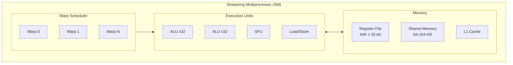
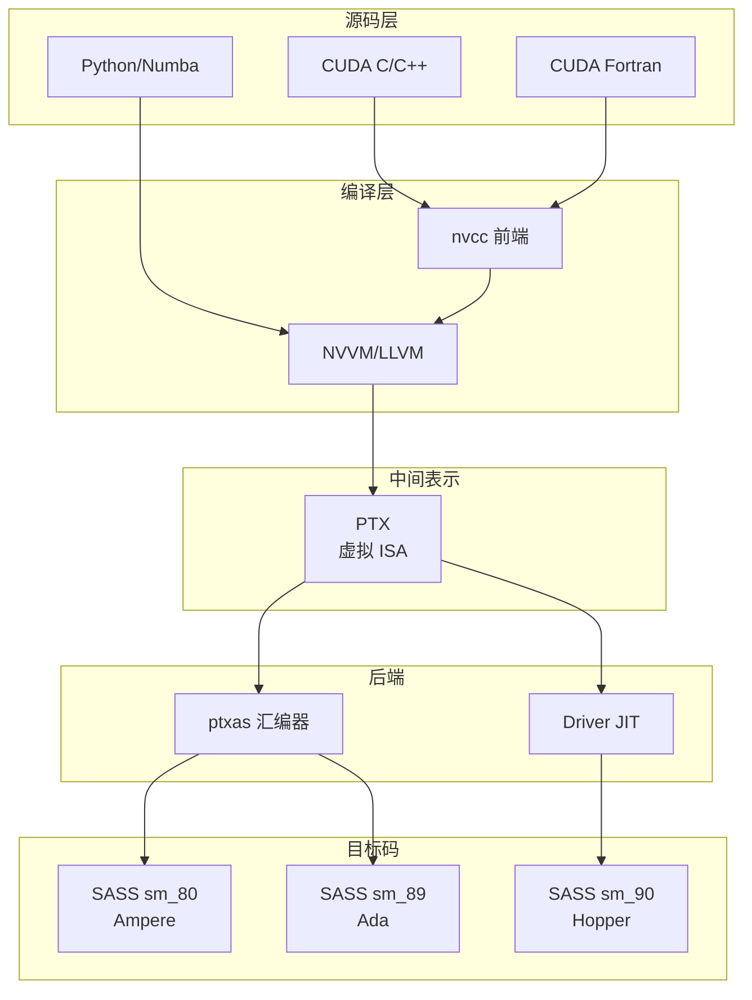
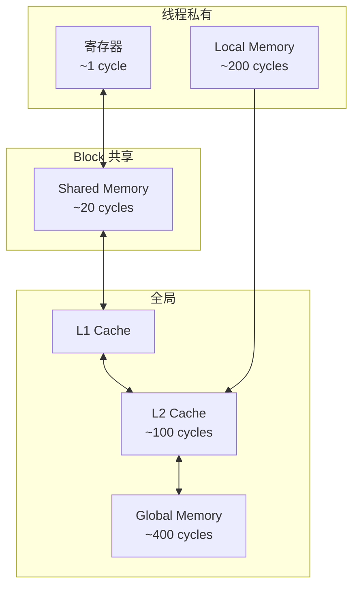

## 1. GPU 架构基础与 PTX 概述

### 1.1 GPU 与 CPU 架构对比

现代异构计算系统中，GPU 和 CPU 承担着本质不同的计算任务。理解两者的架构差异是掌握 GPU 编程的基础。

:::tip[CPU 架构特点]

- **核心数量**：4-16 个高性能核心，每核心具备复杂的乱序执行、分支预测单元
- **缓存层次**：大容量 L1/L2/L3 缓存（通常 > 32MB），优化数据局部性
- **控制逻辑**：约 50% 芯片面积用于控制单元，支持复杂分支和投机执行
- **内存带宽**：DDR5 内存，带宽约 50-100 GB/s
- **设计目标**：最小化单线程延迟（Latency-oriented）

:::

:::warning[GPU 架构特点]

- **核心数量**：数千个简单 CUDA Core（如 RTX 4090 拥有 16384 个）
- **ALU 占比**：> 80% 芯片面积用于计算单元，控制逻辑极简
- **内存带宽**：GDDR6X/HBM3 显存，带宽可达 1-3 TB/s
- **并行度**：单 GPU 可同时调度数十万线程
- **设计目标**：最大化吞吐量（Throughput-oriented）

:::

| 指标 | CPU (Intel i9-14900K) | GPU (RTX 4090) | 差异倍数 |
|------|----------------------|----------------|---------|
| 核心数 | 24 (8P+16E) | 16,384 CUDA Cores | ~680x |
| 内存带宽 | 89.6 GB/s | 1,008 GB/s | ~11x |
| 单精度算力 | ~1 TFLOPS | 82.6 TFLOPS | ~80x |
| 功耗 | 253W | 450W | ~1.8x |

> **核心洞察**：GPU 的性能优势来源于 **用面积换并行度**。相同芯片面积下，GPU 选择堆叠大量简单核心而非少量复杂核心，这种设计在数据并行场景下能获得数量级的性能提升。

### 1.2 SIMT 架构原理

SIMT（Single Instruction Multiple Threads）是 NVIDIA GPU 的核心执行模型，它在 SIMD 基础上引入了线程抽象，提供更灵活的编程模型。



#### 1.2.1 SIMT vs SIMD 关键区别

| 特性 | SIMD | SIMT |
|------|------|------|
| **执行粒度** | 向量寄存器（128/256/512-bit） | 32 线程组成的 Warp |
| **分支处理** | 需要 mask 操作，效率低 | 硬件支持分支发散（Branch Divergence） |
| **编程模型** | 显式向量化（intrinsics） | 标量代码自动并行化 |
| **线程独立性** | 无独立线程概念 | 每线程独立 PC（Volta+） |
| **典型代表** | AVX-512, ARM NEON | NVIDIA CUDA, AMD RDNA |

#### 1.2.2 Warp 执行机制

Warp 是 GPU 调度的基本单位，理解其执行机制对性能优化至关重要：

```
Warp (32 threads)
├── Thread 0-31 共享同一条指令
├── 每个线程有独立的：
│   ├── 寄存器状态（最多 255 个 32-bit 寄存器）
│   ├── 程序计数器（Volta+ 独立 PC）
│   └── 本地内存空间
└── 分支发散时：
    ├── 硬件序列化执行不同分支
    └── 通过 Predication 或 Re-convergence 处理
```

:::danger[性能陷阱：Warp Divergence]

当 Warp 内线程执行不同分支时，GPU 必须序列化执行所有分支路径，导致严重性能损失：

```cuda
// 糟糕的写法：50% 线程执行 if，50% 执行 else
if (threadIdx.x % 2 == 0) {
    // 分支 A
} else {
    // 分支 B  
}
// 实际执行时间 = 分支A时间 + 分支B时间

// 优化写法：按 Warp 边界划分
if (threadIdx.x < 32) {
    // Warp 0 全部执行此分支
} else {
    // Warp 1 全部执行此分支
}
```

:::

### 1.3 PTX 在 CUDA 生态中的地位

PTX（Parallel Thread Execution）是 NVIDIA 设计的虚拟 ISA，作为 CUDA 编译工具链的中间表示，它在源码与硬件之间提供了关键的抽象层。



#### PTX 设计目标

1. **跨代兼容**：PTX 代码可在未来 GPU 上通过 JIT 编译运行
2. **性能透明**：提供足够底层的控制，不牺牲性能
3. **机器无关**：屏蔽不同 GPU 架构的硬件差异
4. **可读性**：类汇编语法，便于调试和手工优化

#### PTX vs SASS

| 特性 | PTX | SASS |
|------|-----|------|
| **抽象级别** | 虚拟 ISA | 真实机器码 |
| **可移植性** | 跨 GPU 架构 | 特定 SM 版本 |
| **寄存器** | 虚拟寄存器（无限） | 物理寄存器（有限） |
| **指令调度** | 未调度 | 已优化调度 |
| **可读性** | 较好 | 需要反汇编 |

:::note[PTX 向后兼容性]

PTX 的核心价值在于 **向后兼容**：

```bash
# 使用 PTX 6.0 编译，可在任何 sm_70+ GPU 运行
nvcc -arch=sm_70 -ptx kernel.cu -o kernel.ptx

# 运行时 Driver 自动 JIT 编译为目标 GPU 的 SASS
# 无需重新编译源码即可支持新硬件
```

这意味着发布时只需包含 PTX，即可自动支持未来的 GPU 架构。

:::

## 2. PTX 指令集架构

### 2.1 PTX 程序结构

一个典型的 PTX 程序包含以下组成部分：

```asm
// PTX 版本和目标架构声明
.version 7.8
.target sm_80
.address_size 64

// 全局变量声明
.global .align 4 .b8 data[1024];

// Kernel 函数定义
.visible .entry vector_add(
    .param .u64 param_a,
    .param .u64 param_b,
    .param .u64 param_c,
    .param .u32 param_n
)
{
    // 寄存器声明
    .reg .pred p0;
    .reg .b32 r<10>;
    .reg .b64 rd<5>;
    
    // 指令体
    ld.param.u64 rd0, [param_a];
    ld.param.u64 rd1, [param_b];
    ld.param.u64 rd2, [param_c];
    ld.param.u32 r0, [param_n];
    
    // 计算线程索引
    mov.u32 r1, %tid.x;
    mov.u32 r2, %ctaid.x;
    mov.u32 r3, %ntid.x;
    mad.lo.u32 r4, r2, r3, r1;  // idx = blockIdx.x * blockDim.x + threadIdx.x
    
    // 边界检查
    setp.ge.u32 p0, r4, r0;
    @p0 bra EXIT;
    
    // 地址计算和数据加载
    mul.wide.u32 rd3, r4, 4;
    add.u64 rd0, rd0, rd3;
    add.u64 rd1, rd1, rd3;
    add.u64 rd2, rd2, rd3;
    
    ld.global.f32 r5, [rd0];
    ld.global.f32 r6, [rd1];
    
    // 计算和存储
    add.f32 r7, r5, r6;
    st.global.f32 [rd2], r7;
    
EXIT:
    ret;
}
```

### 2.2 核心指令类别

| 类别 | 指令示例 | 说明 |
|------|---------|------|
| **数据移动** | `ld`, `st`, `mov`, `cvt` | 内存访问、寄存器传输、类型转换 |
| **算术运算** | `add`, `mul`, `mad`, `fma` | 整数/浮点运算，融合乘加 |
| **逻辑运算** | `and`, `or`, `xor`, `not` | 位运算 |
| **比较分支** | `setp`, `bra`, `@p` | 谓词设置、条件跳转 |
| **特殊函数** | `sin`, `cos`, `rsqrt`, `lg2` | 超越函数（SFU 执行） |
| **同步原语** | `bar.sync`, `atom`, `membar` | 屏障、原子操作、内存栅栏 |
| **Tensor Core** | `mma`, `wmma`, `ldmatrix` | 矩阵运算（Volta+） |

### 2.3 内存层次与访问模式



PTX 内存访问指令示例：

```asm
// 全局内存访问
ld.global.f32 r0, [addr];           // 普通加载
ld.global.ca.f32 r0, [addr];        // Cache all levels
ld.global.cg.f32 r0, [addr];        // Cache at L2 only
ld.global.nc.f32 r0, [addr];        // Non-coherent (texture path)

// 共享内存访问
ld.shared.f32 r0, [smem_addr];
st.shared.f32 [smem_addr], r0;

// 原子操作
atom.global.add.f32 r0, [addr], r1;
atom.shared.cas.b32 r0, [addr], r1, r2;
```

## 3. 编译与优化

### 3.1 编译流程详解

```bash
# 生成 PTX（保留中间文件）
nvcc -ptx -arch=sm_80 kernel.cu -o kernel.ptx

# 生成 SASS（cubin）
nvcc -cubin -arch=sm_80 kernel.cu -o kernel.cubin

# 同时嵌入 PTX 和 SASS（推荐发布方式）
nvcc -arch=sm_80 -code=sm_80,compute_80 kernel.cu

# 查看 SASS 反汇编
cuobjdump -sass kernel.cubin
```

### 3.2 性能优化要点

:::tip[PTX 级别优化策略]

1. **指令级并行（ILP）**
   - 展开循环，增加独立指令
   - 使用 `mad`/`fma` 融合指令

2. **内存访问优化**
   - 确保 Coalesced Access（合并访问）
   - 使用 `ld.global.nc` 走纹理缓存路径

3. **寄存器压力控制**
   - 限制 kernel 寄存器使用：`-maxrregcount=N`
   - 权衡 Occupancy 与寄存器复用

4. **分支优化**
   - 使用 Predication 替代短分支
   - 按 Warp 边界组织条件逻辑

:::

## 4. 参考资料

- [PTX ISA Reference](https://docs.nvidia.com/cuda/parallel-thread-execution/)
- [CUDA C++ Programming Guide](https://docs.nvidia.com/cuda/cuda-c-programming-guide/)
- [NVIDIA GPU Architecture Whitepapers](https://www.nvidia.com/en-us/geforce/technologies/)
