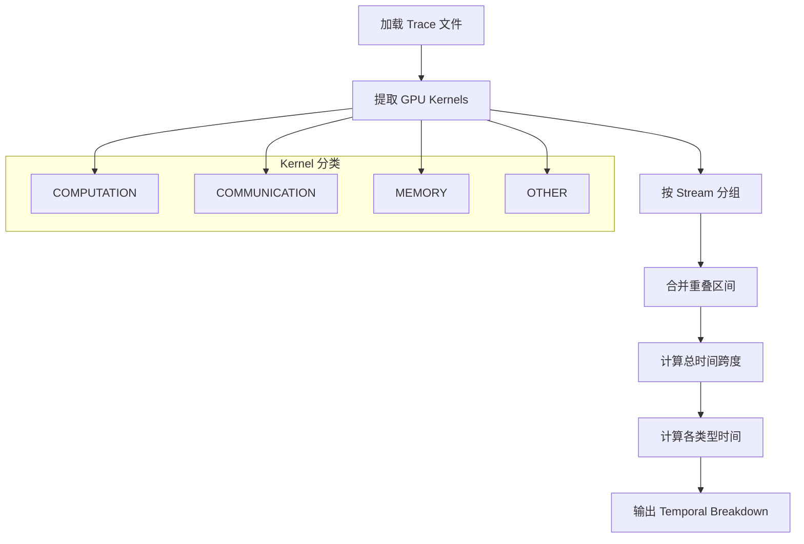
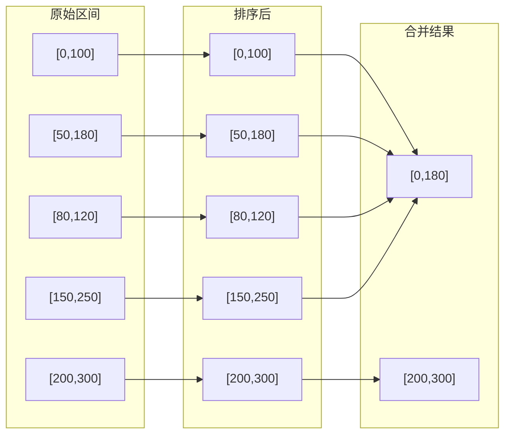
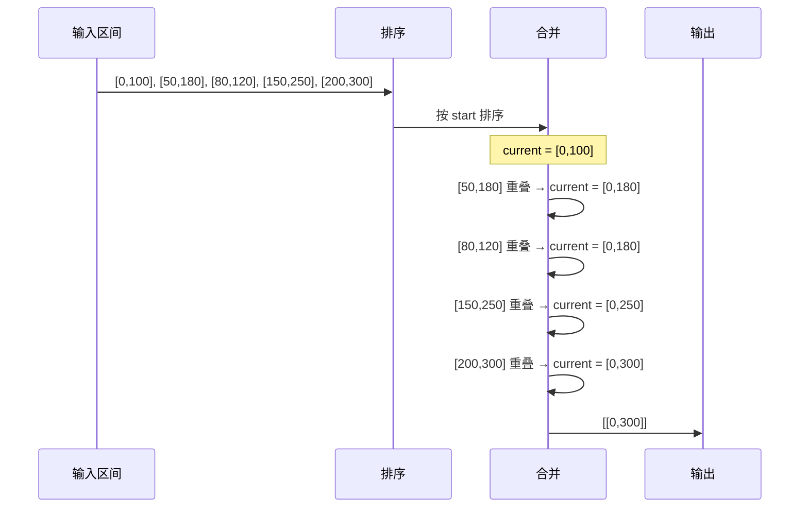
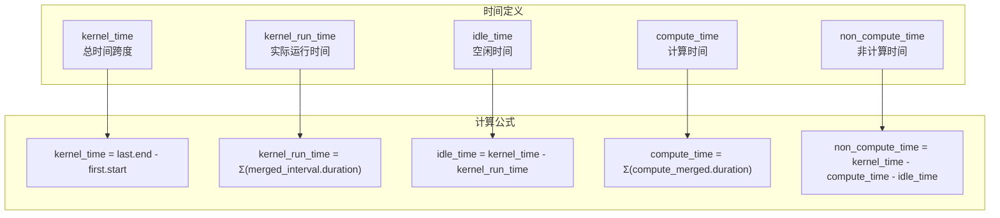
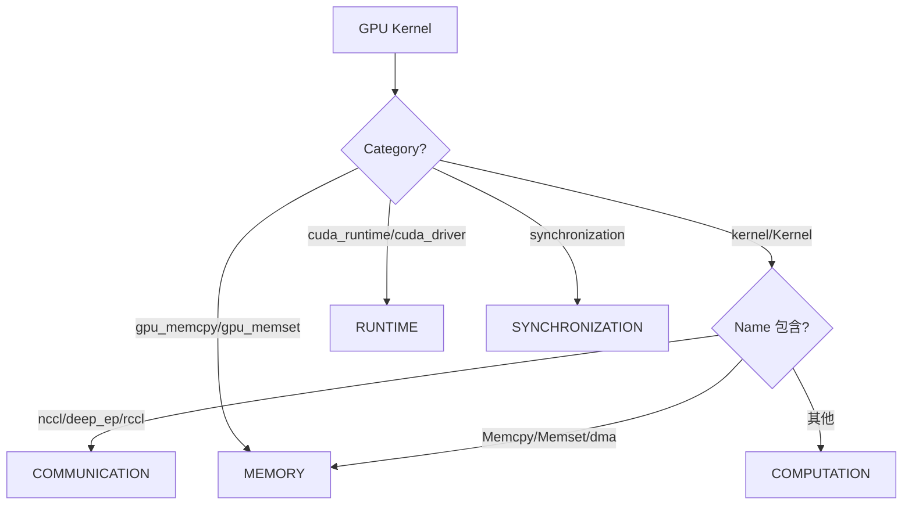

## 概述

`temporal_breakdown` 是 GPU trace 分析中的核心指标，用于将 GPU 执行时间分解为三个主要类别：
- **compute_time**: 计算时间（COMPUTATION 类型的 kernel）
- **non_compute_time**: 非计算时间（COMMUNICATION、MEMORY 等类型的 kernel）
- **idle_time**: 空闲时间（GPU 没有执行任何 kernel 的时间）

## 整体计算流程



## 核心代码分析

### 1. 入口函数 `get_temporal_breakdown`

```rust
// src/analyzer.rs
pub fn get_temporal_breakdown(&mut self) -> Result<TemporalBreakdown> {
    let gpu_kernels = self.get_gpu_kernels()?;

    if gpu_kernels.is_empty() {
        return Ok(TemporalBreakdown {
            compute_time: 0.0, non_compute_time: 0.0, idle_time: 0.0,
            compute_percent: 0.0, non_compute_percent: 0.0, idle_percent: 0.0,
        });
    }

    // 1. 合并所有 kernel 的时间区间
    let merged_intervals = merge_kernel_intervals(&gpu_kernels);
    
    // 2. 计算总时间跨度 (从第一个 kernel 开始到最后一个 kernel 结束)
    let kernel_time = if !merged_intervals.is_empty() {
        merged_intervals.last().unwrap().end - merged_intervals.first().unwrap().start
    } else { 0.0 };
    
    // 3. 计算实际运行时间 (合并后的区间总和)
    let kernel_run_time: f64 = merged_intervals.iter().map(|i| i.end - i.start).sum();
    
    // 4. 空闲时间 = 总跨度 - 实际运行时间
    let idle_time = (kernel_time - kernel_run_time).max(0.0);

    // 5. 筛选计算类型的 kernel 并合并
    let compute_kernels: Vec<GPUKernel> = gpu_kernels.iter()
        .filter(|k| k.kernel_type == KernelType::Computation)
        .cloned().collect();
    let compute_intervals = merge_kernel_intervals(&compute_kernels);
    let compute_time: f64 = compute_intervals.iter().map(|i| i.end - i.start).sum();
    
    // 6. 非计算时间 = 总跨度 - 计算时间 - 空闲时间
    let non_compute_time = (kernel_time - compute_time - idle_time).max(0.0);

    // 7. 计算百分比
    let (idle_percent, compute_percent, non_compute_percent) = if kernel_time > 0.0 {
        ((idle_time / kernel_time) * 100.0, 
         (compute_time / kernel_time) * 100.0, 
         (non_compute_time / kernel_time) * 100.0)
    } else { (0.0, 0.0, 0.0) };

    Ok(TemporalBreakdown {
        compute_time, non_compute_time, idle_time,
        compute_percent, non_compute_percent, idle_percent,
    })
}
```

### 2. 区间合并算法 `merge_kernel_intervals`

这是处理多 stream 重叠的核心算法：

```rust
// src/utils.rs
pub fn merge_kernel_intervals(kernels: &[GPUKernel]) -> Vec<TimeInterval> {
    if kernels.is_empty() { return Vec::new(); }

    // 1. 提取所有 kernel 的 (start, end) 时间对
    let mut times: Vec<(f64, f64)> = Vec::with_capacity(kernels.len());
    for k in kernels {
        times.push((k.start_time, k.end_time));
    }
    
    // 2. 按开始时间排序
    times.sort_unstable_by(|a, b| 
        a.0.partial_cmp(&b.0).unwrap_or(std::cmp::Ordering::Equal));

    // 3. 贪心合并重叠区间
    let mut merged = Vec::with_capacity(times.len() / 4 + 1);
    let mut current = TimeInterval { start: times[0].0, end: times[0].1 };

    for &(start, end) in times.iter().skip(1) {
        if start <= current.end {
            // 区间重叠，扩展当前区间
            current.end = current.end.max(end);
        } else {
            // 区间不重叠，保存当前区间，开始新区间
            merged.push(current);
            current = TimeInterval { start, end };
        }
    }
    merged.push(current);
    merged
}
```

## 多 Stream 处理机制

### 问题背景

GPU 可以有多个 CUDA Stream 并行执行 kernel。不同 stream 上的 kernel 可能在时间上重叠：

```mermaid
gantt
    title 多 Stream Kernel 执行示例
    dateFormat X
    axisFormat %s
    
    section Stream 0
    Kernel A    :a1, 0, 100
    Kernel C    :a2, 150, 250
    
    section Stream 1
    Kernel B    :b1, 50, 180
    Kernel D    :b2, 200, 300
    
    section Stream 2
    Kernel E    :c1, 80, 120
```



### 合并策略

算法将所有 stream 的 kernel 视为一个整体，合并重叠区间：



### 合并过程详解



## 时间计算公式



## Kernel 类型分类

```rust
// src/analyzer.rs - extract_kernels 函数中的分类逻辑
when(col("cat").eq(lit("kernel")).or(col("cat").eq(lit("Kernel"))))
.then(
    // Communication kernels: 包含 nccl, deep_ep, 或 rccl (不区分大小写)
    when(col("name").str().contains(lit("(?i)nccl"), false)
        .or(col("name").str().contains(lit("(?i)deep_ep"), false))
        .or(col("name").str().contains(lit("(?i)rccl"), false)))
    .then(lit("COMMUNICATION"))
    // Memory kernels: 以 Memcpy, Memset, dma 开头
    .when(col("name").str().starts_with(lit("Memcpy"))
        .or(col("name").str().starts_with(lit("Memset")))
        .or(col("name").str().starts_with(lit("dma"))))
    .then(lit("MEMORY"))
    // 其他都是 COMPUTATION
    .otherwise(lit("COMPUTATION"))
)
```



## 数据结构

```rust
// src/models.rs
#[derive(Debug, Clone, Serialize)]
pub struct TemporalBreakdown {
    pub compute_time: f64,        // 计算时间 (微秒)
    pub non_compute_time: f64,    // 非计算时间 (微秒)
    pub idle_time: f64,           // 空闲时间 (微秒)
    pub compute_percent: f64,     // 计算时间百分比
    pub non_compute_percent: f64, // 非计算时间百分比
    pub idle_percent: f64,        // 空闲时间百分比
}

#[derive(Debug, Clone)]
pub struct GPUKernel {
    pub name: String,
    pub start_time: f64,
    pub duration: f64,
    pub end_time: f64,
    pub stream: i32,
    pub kernel_type: KernelType,
    // ... 其他字段
}

pub struct TimeInterval {
    pub start: f64,
    pub end: f64,
}
```

## 输出示例

```json
{
  "temporal_breakdown": {
    "compute_time_us": 25402605.0,
    "non_compute_time_us": 1251970.0,
    "idle_time_us": 29603154.0,
    "compute_percent": 45.15,
    "non_compute_percent": 2.23,
    "idle_percent": 52.62
  }
}
```

## 多 Stream 场景的完整示例

```mermaid
gantt
    title 多 Stream 时间分解示例
    dateFormat X
    axisFormat %s
    
    section Stream 0
    GEMM (Compute)     :active, a1, 0, 100
    NCCL (Comm)        :crit, a2, 120, 180
    
    section Stream 1
    Softmax (Compute)  :active, b1, 50, 90
    Memcpy (Memory)    :done, b2, 200, 250
    
    section 合并后
    Active             :active, m1, 0, 100
    Active             :active, m2, 120, 180
    Active             :active, m3, 200, 250
    Idle               :m4, 100, 120
    Idle               :m5, 180, 200
```



**计算过程：**
1. 总时间跨度 = 250 - 0 = 250
2. 合并后运行时间 = (100-0) + (180-120) + (250-200) = 100 + 60 + 50 = 210
3. 空闲时间 = 250 - 210 = 40
4. 计算时间（仅 COMPUTATION）= 合并 [0,100] 和 [50,90] = [0,100] = 100
5. 非计算时间 = 250 - 100 - 40 = 110

## 性能优化

1. **避免完整克隆**: `merge_kernel_intervals` 只提取 `(start, end)` 元组，不克隆整个 `GPUKernel` 结构
2. **不稳定排序**: 使用 `sort_unstable_by` 减少内存分配
3. **预分配容量**: `Vec::with_capacity` 减少动态扩容
4. **并行处理**: 使用 `rayon` 进行并行统计计算

## 总结

`temporal_breakdown` 的计算核心是**区间合并算法**，它将所有 stream 的 kernel 执行时间合并为不重叠的区间，从而准确计算：
- GPU 实际工作时间（不重复计算重叠部分）
- GPU 空闲时间（没有任何 kernel 执行的间隙）
- 各类型 kernel 的时间占比
