## 1. 项目概述

本项目是一个基于深度学习的视频质量过滤系统，采用**生产者 - 消费者模式**实现高效的视频处理流水线。系统支持多种视频质量检测任务，包括 VFX 特效检测、静态帧检测、旋转异常检测、低质量评估以及异常区域检测。

### 1.1 核心特性

- **多进程并行**：使用 `torchrun` 支持多 GPU 分布式推理
- **流水线架构**：I/O 与计算解耦，最大化 GPU 利用率
- **模型实例池**：独占式模型分配，确保线程安全
- **多数据源支持**：CPFS、Alluxio、OSS 三级数据读取策略

---

## 2. 系统架构

### 2.1 整体架构图

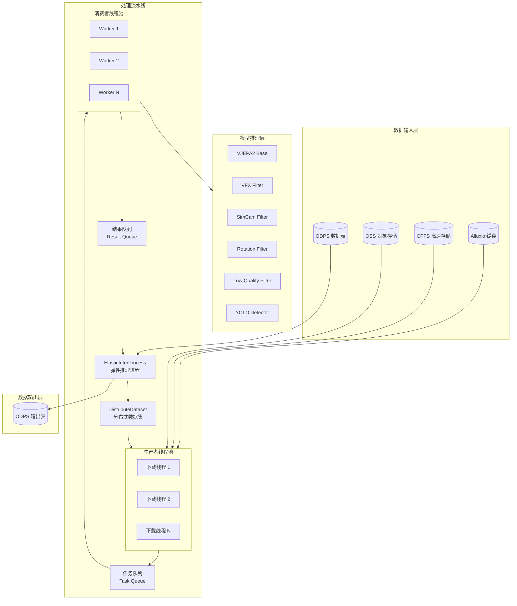

### 2.2 进程与线程模型

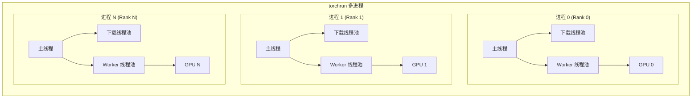

---

## 3. 数据处理流程

### 3.1 完整处理流程

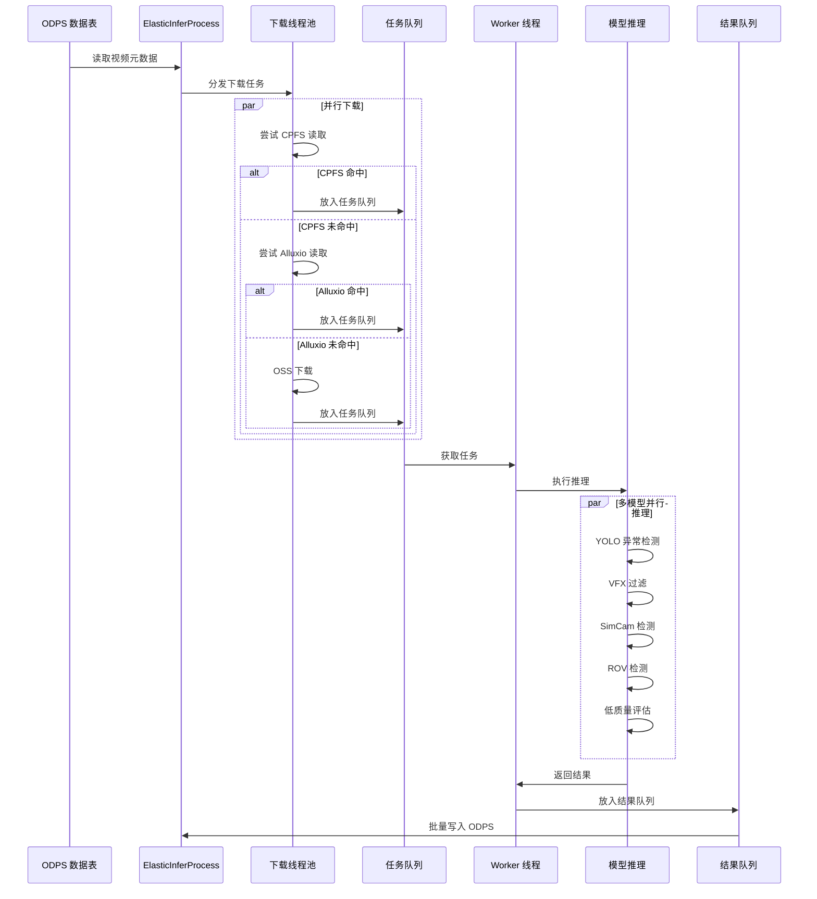

### 3.2 单视频处理流程

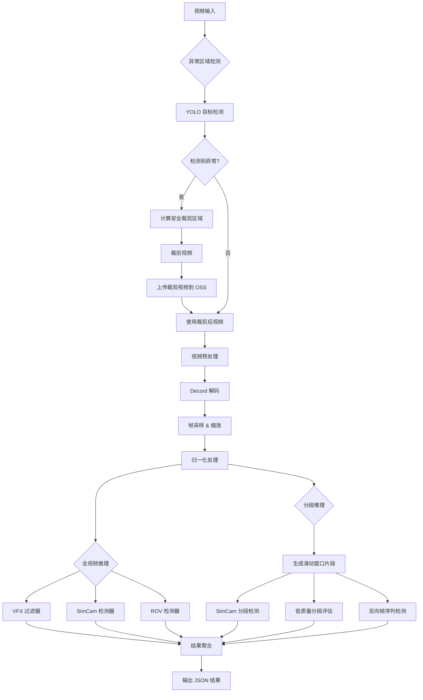

---

## 4. 模型架构

### 4.1 模型层次结构

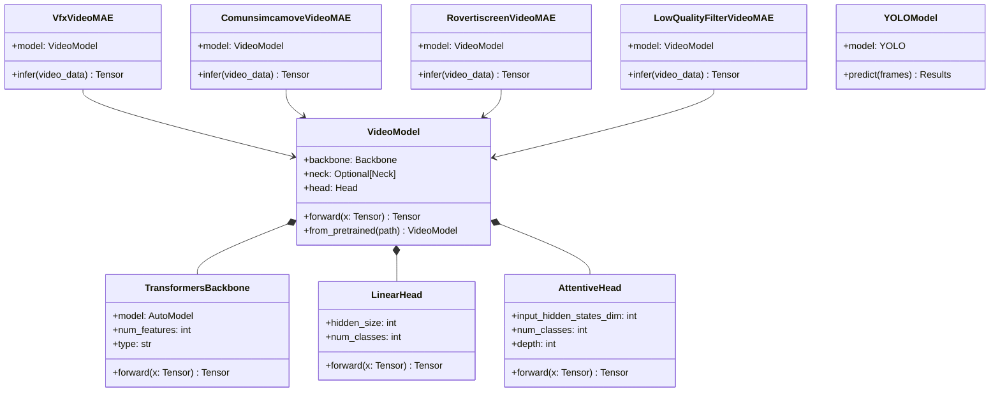

### 4.2 模型配置

| 模型名称          | Backbone        | Head          | 输入尺寸    | 帧数  | 任务类型 |
| ------------- | --------------- | ------------- | ------- | --- | ---- |
| VFX Filter    | VJEPA2-base     | LinearHead    | 256×256 | 48  | 二分类  |
| SimCam Filter | VJEPA2-base     | LinearHead    | 256×256 | 48  | 二分类  |
| ROV Filter    | VJEPA2-rov-base | LinearHead    | 256×256 | 48  | 二分类  |
| Low Quality   | VJEPA2-base     | AttentiveHead | 256×256 | 48  | 二分类  |
| YOLO Detector | YOLOv8          | -             | 960×960 | 1   | 目标检测 |

### cv2 vs. decord

> [!note] 核心差异  
> OpenCV 是为了“播放”设计的，而 Decord 是为了“随机访问”设计的。

两者的==随机访问机制 (Seeking Mechanism)==是造成性能差距最大的地方：
- **视频编码原理（GOP）：** 视频不是一张张独立的图片，而是由 **I 帧**（关键帧，完整的图）和 **P/B 帧**（预测帧，只记录变化）组成的。
	- 要解码第 100 帧（P 帧），通常需要先找到前一个 I 帧（比如第 60 帧），然后一路解码 61-99 帧，才能算出第 100 帧的样子。
- **OpenCV 的做法 (类似录像带)：**
	- OpenCV 的 `cv2.VideoCapture` 封装了 FFmpeg，但它的主要逻辑是**顺序读取**。
	- 当你调用 `cap.set(cv2.CAP_PROP_POS_FRAMES, 100)` 进行跳转时，OpenCV 底层往往执行的是“Seek 到最近的关键帧，然后一帧帧解码直到目标帧”。
	- 如果在训练中你需要随机采祥（例如：这个 batch 取第 100 帧，下个 batch 取第 5000 帧），OpenCV 每次跳转都要做大量的无效解码工作，CPU 都在空转。
- **Decord 的做法 (类似智能目录)：**
	- Decord 在初始化 `VideoReader` 时，会快速扫描整个视频容器，建立一个**关键帧索引表（Index Table）**。
	- 它精确知道每一帧在文件中的字节偏移量。
	- 当你请求第 100 帧时，它利用智能寻址算法，以最优路径解码，并且针对“随机访问”做了极深度的优化（Smart Seeking）。
	- **结果：** 在随机采样测试中，Decord 的速度通常是 OpenCV 的 **2 到 10 倍**。

除此之外，Decord 原生集成了 NVIDIA 的 Video Codec SDK，可以只需要一行代码 `ctx=decord.gpu(0)`，它就会直接调用显卡的 NVDEC 硬件解码单元。解码后的图像直接存在显存中，可以直接转换成 PyTorch/MXNet 的 Tensor，省去了 CPU 到 GPU 的搬运时间。而 OpenCV 的支持比较复杂。

在==批量处理==方面，OpenCV 只能 `cap.read()` 一帧一帧读。如果你要取 64 帧作为一个 Clip，你需要写个 Python `for` 循环读 64 次。Python 的循环开销加上 Python-C++ 的交互开销（GIL 锁），在大批量数据下是累赘。而 Decord 支持： `get_batch([frame_idx1, frame_idx2, ...])`。这一步操作在 C++ 底层通过多线程并行完成，一次性解码多帧，大大减少了 Python 层的开销。

对于==显存/内存与颜色空间优化==，OpenCV 默认输出 `BGR` 的 `uint8` NumPy 数组，进入深度学习模型前，你通常需要：`BGR转RGB` -> `uint8转float32` -> `除以255归一化` -> `HWC转CHW`。这些都在 CPU 上做，很慢。Decord 默认输出 RGB，可以直接输出 Tensor，结合 GPU 解码，很多预处理（Resize, Normalize）可以直接在 GPU 上接力完成，速度极快。

总结：

| **场景**                             | **推荐库** | **原因**                                                                                      |
| ------------------------------------ | ---------- | --------------------------------------------------------------------------------------------- |
| **视频播放、顺序流处理 (Streaming)** | **OpenCV** | OpenCV 对顺序读取 `read()` 做了极致优化，且 buffer 管理很好，这时候 Decord 优势不大甚至略慢。 |
| **深度学习训练 (Data Loading)**      | **Decord** | 训练数据通常是**随机打乱**的。Decord 的随机 Seek 性能吊打 OpenCV。                            |
| **视频剪辑/关键帧提取**              | **Decord** | 需要频繁跳转时间轴，Decord 更高效。                                                           |
| **复杂的传统图像算法**               | **OpenCV** | 如果读完要做高斯模糊、边缘检测，OpenCV 算法库更全。                                           |

#### 示例代码

```python
import cv2
import numpy as np
import time
from decord import VideoReader, cpu, gpu
from ultralytics import YOLO

def process_video_with_decord(video_path, model_path='yolov8n.pt', step=30, batch_size=8):
    """
    video_path: 视频路径
    model_path: YOLO 模型路径
    step: 采样间隔 (例如 30 代表每 30 帧检测一次，即 1 秒检测一次)
    batch_size: 每次送入 YOLO 的图片数量 (显存越大可以设得越大)
    """
    
    # 1. 加载 YOLO 模型
    print(f"正在加载模型: {model_path}...")
    model = YOLO(model_path)
    
    # 2. 初始化 Decord VideoReader
    # 如果你编译 Decord 时开启了 CUDA 支持，可以将 ctx 改为 gpu(0) 以获得极致速度
    # 但通常 cpu(0) 配合 get_batch 已经足够快，且兼容性最好
    ctx = cpu(0) 
    vr = VideoReader(video_path, ctx=ctx)
    total_frames = len(vr)
    fps = vr.get_avg_fps()
    
    print(f"视频加载成功: {video_path}")
    print(f"总帧数: {total_frames}, FPS: {fps:.2f}")
    print(f"采样间隔: 每 {step} 帧 (约 {step/fps:.2f} 秒)")
    
    # 3. 生成需要检测的所有帧索引
    # 例如: [0, 30, 60, 90, ...]
    indices = list(range(0, total_frames, step))
    print(f"待检测帧数: {len(indices)}")

    t0 = time.time()

    # 4. 分块处理 (Chunk Processing)
    # 我们不能一次性把所有帧读入内存，所以要按照 batch_size 切分
    for i in range(0, len(indices), batch_size):
        # 获取当前 batch 的帧索引，例如 [0, 30, 60, 90]
        current_batch_indices = indices[i : i + batch_size]
        
        # --- 核心性能点 A: Decord 并行解码 ---
        # get_batch 会利用多线程一次性解码多张图片，比 cv2 一张张 read 快得多
        # 返回格式: (Batch_Size, Height, Width, 3) 的 RGB 数组
        frames_rgb = vr.get_batch(current_batch_indices).asnumpy()
        
        # --- 核心坑点修正: RGB -> BGR ---
        # YOLO (Ultralytics) 期望输入是 BGR 格式。
        # 使用 Numpy 切片反转最后一维，这是一个 "View" 操作或极快的内存拷贝，
        # 比 cv2.cvtColor 快且代码更简洁。
        frames_bgr = frames_rgb[..., ::-1]
        
        # --- 核心性能点 B: YOLO 批量推理 ---
        # 不要写 for 循环一张张测，直接把整个 batch 扔进去
        # verbose=False 关闭大量的打印信息，提升速度
        results = model(frames_bgr, verbose=False)
        
        # 5. 处理结果
        for j, result in enumerate(results):
            original_frame_idx = current_batch_indices[j]
            
            # 这里演示简单的打印，实际项目中你可以保存结果或画图
            det_count = len(result.boxes)
            if det_count > 0:
                print(f"帧 {original_frame_idx}: 检测到 {det_count} 个物体")
                
                # 如果你想看图 (调试用，生产环境请注释掉):
                # annotated_frame = result.plot()
                # cv2.imshow("YOLO Preview", annotated_frame)
                # if cv2.waitKey(1) & 0xFF == ord('q'): return

    total_time = time.time() - t0
    print(f"\n处理完成!")
    print(f"耗时: {total_time:.4f} 秒")
    print(f"平均速度: {len(indices) / total_time:.2f} FPS (推理帧率)")

    cv2.destroyAllWindows()

if __name__ == "__main__":
    # 请替换为你的视频路径
    video_file = "path/to/your/video.mp4" 
    
    # 作为一个示例，如果没有视频文件，生成一个假的
    import os
    if not os.path.exists(video_file):
        print("未找到视频，正在生成测试视频...")
        video_file = "test_video.mp4"
        out = cv2.VideoWriter(video_file, cv2.VideoWriter_fourcc(*'mp4v'), 30, (640, 480))
        for _ in range(300): # 10秒视频
            frame = np.random.randint(0, 255, (480, 640, 3), dtype=np.uint8)
            out.write(frame)
        out.release()
        
    process_video_with_decord(video_file)
```

代码解析：为什么这样写更快？

1. **`indices = range(0, total, step)`**:
    - 如果你用 OpenCV，跳帧通常是 `grab()` 几十次或者 `set(POS_FRAMES)`。`set` 操作在很多视频编码格式（如 H.264）中非常慢，因为它要找关键帧。
    - Decord 提前建立了索引，直接通过 `get_batch([0, 30, 60])` 就能精准定位，**省去了中间 29 帧的解码开销**。
        
2. **`frames_rgb[..., ::-1]`**:
    - 这是最关键的一行。
    - `...` 代表前面的维度（Batch, H, W）全选。
    - `::-1` 代表最后一个维度（颜色通道）倒序读取。
    - 这比 `cv2.cvtColor` 在 Batch 模式下更高效，且代码极其简洁。
        
3. **Batch Size**:
    - GPU 计算是并行的。在这个脚本中，Decord 一次解出 8 张图，YOLO 一次算 8 张图。这比“读一张、算一张”的乒乓操作要充分利用 GPU 显存带宽。

---

## 5. CPU & GPU 交互

### 5.1 数据流转图

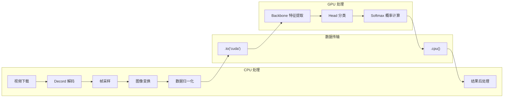

### 5.2 显存管理策略

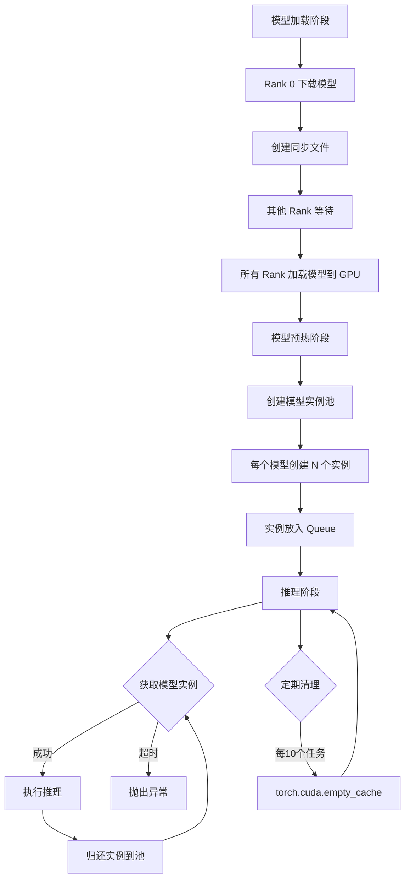

### 5.3 模型实例池机制

```python
# 独占式模型获取（上下文管理器）
@contextmanager
def acquire_model_instance(model_name, timeout=300):
    """
    以独占方式获取模型实例
    
    使用方法:
        with acquire_model_instance('VfxFilterInfer') as model:
            output = model.infer(video_data)
    """
    pool = _model_instance_pools[model_name]
    model = pool.get(timeout=timeout)  # 阻塞等待
    try:
        yield model
    finally:
        pool.put(model)  # 归还实例
```

---

## 6. 关键模块说明

### 6.1 模块依赖关系

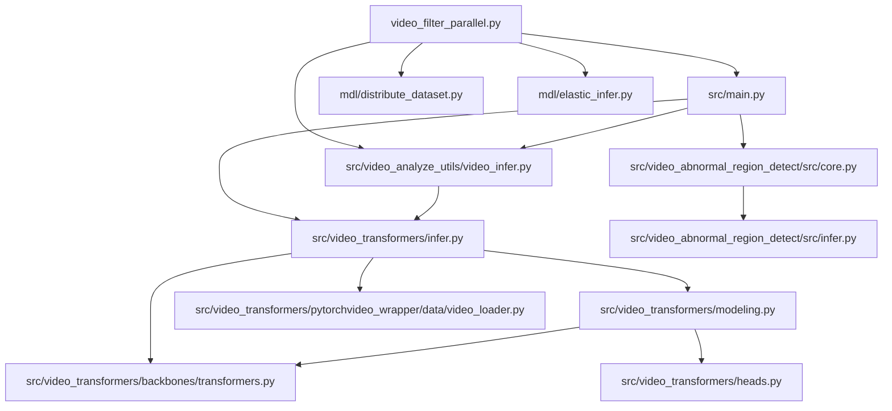

### 6.2 核心模块功能

| 模块                                               | 功能描述                            |
| -------------------------------------------------- | ----------------------------------- |
| `video_filter_parallel.py`                         | 入口文件，实现生产者 - 消费者流水线 |
| `src/main.py`                                      | 单视频处理核心逻辑                  |
| `src/video_analyze_utils/video_infer.py`           | 模型实例池管理，推理任务封装        |
| `src/video_transformers/infer.py`                  | VideoMAE 模型封装，数据加载器       |
| `src/video_transformers/modeling.py`               | VideoModel 模型定义                 |
| `src/video_transformers/backbones/transformers.py` | VJEPA2 Backbone 实现                |
| `src/video_abnormal_region_detect/src/core.py`     | 异常区域检测与裁剪                  |
| `src/video_abnormal_region_detect/src/infer.py`    | YOLO 模型推理                       |

---

## 7. 配置参数

### 7.1 全局配置

```python
# 并发控制
MAX_CONCURRENT_DOWNLOADS = 6  # 最大下载并发数
MAX_CONCURRENT_WORKERS = 6    # 最大 Worker 数
MODEL_INSTANCES_NUM = 6       # 每种模型的实例数
MAX_QUEUE_SIZE = 16           # 任务队列最大深度

# 磁盘限制
DISK_LIMIT_BYTES = 180 * 1024**3  # 180 GB

# 模型下载
MOS_MAX_WORKERS = 16  # MOS 下载并发数
```

### 7.2 命令行参数

| 参数                   | 默认值 | 说明             |
| ---------------------- | ------ | ---------------- |
| `--tables`             | ""     | ODPS 输入表名    |
| `--outputs`            | ""     | ODPS 输出表名    |
| `--vfx_enable`         | "true" | 启用 VFX 过滤器  |
| `--com_enable`         | "true" | 启用运镜检测器   |
| `--rov_enable`         | "true" | 启用旋转检测器   |
| `--low_quality_enable` | "true" | 启用低质量评估器 |

---

## 8. 数据流格式

### 8.1 输入数据格式

```json
{
  "video_id": "string",
  "oss_bucket": "string",
  "video_path": "string",
  "video_tag": "string",
  "info": "{\"use_alluxio\": true, ...}"
}
```

### 8.2 输出数据格式

```json
{
  "video_id": "string",
  "oss_bucket": "string",
  "video_oss_url": "string",
  "video_tag": "string",
  "info": {
    "abnormal_region_info": {...},
    "abnormal_region_crop": {...},
    "vfx_filter": {
      "result": {"VFX_video": 0.1, "normal_video": 0.9},
      "label": "normal_video",
      "prob": 0.9
    },
    "simcam_filter": {...},
    "rotate_vertical_filter": {...},
    "seg_simcam_filter": {
      "0": {"duration": [0, 4], "simcam_filter": {...}},
      "1": {"duration": [3, 7], "simcam_filter": {...}}
    },
    "inverse_seg_simcam_filter": {...}
  },
  "result_info": {
    "succeed": "true",
    "start_time": "2025-01-15T10:00:00",
    "end_time": "2025-01-15T10:00:05",
    "avg_cost": 5.0,
    "device_name": "NVIDIA A100",
    "device_info": {...}
  }
}
```

---

## 9. 性能优化策略

### 9.1 I/O 优化

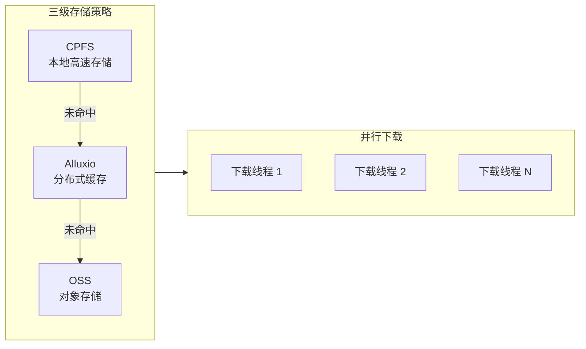

### 9.2 计算优化

1. **模型实例池**：预创建多个模型实例，避免推理时的模型加载开销
2. **FP16 推理**：使用半精度浮点数减少显存占用和计算时间
3. **批量处理**：多帧批量送入 YOLO 进行检测
4. **异步任务**：使用 `async_thread_tasks_with_name` 并行执行多个推理任务

### 9.3 内存优化

1. **定期显存清理**：每 10 个任务执行 `torch.cuda.empty_cache()`
2. **及时删除中间变量**：推理完成后立即 `del` 不需要的张量
3. **流式视频处理**：使用 Decord 流式解码，避免一次性加载整个视频

---

## 算法分析 - Convolution

### Convolution

要理解为什么 MIOpen 会导致 GPU 空闲，我们需要把 **“卷积（Convolution）”** 看作一个**数学定义**，而把 **“MIOpen 的算法搜索”** 看作**工程实现的选择过程**。

如果把卷积比作“**从 A 地开车到 B 地**”，那么 MIOpen 就是一个**导航软件**。它的工作不仅是让你到达目的地，还要根据当前的路况（硬件）、车型（显卡架构）和具体路线（卷积参数）选择一条**最快**的路。

---

以下是 MIOpen 算法搜索与卷积关系的详细技术解析：
### 1. 为什么卷积需要“搜索”算法？

在深度学习框架（如 PyTorch）中，`Conv2d` 只是一个逻辑指令。但在底层 GPU 硬件上，计算同一个卷积有多种完全不同的数学实现方式（Solvers）。

对于一张输入图片和卷积核，MIOpen 可以选择以下几种“解法”之一：

- **GEMM (General Matrix Multiply)**:
    
    - 原理：使用 `im2col` 将图片展开成大矩阵，然后用矩阵乘法计算。
        
    - 特点：通用性强，但内存占用大（显存消耗高）。
        
- **Winograd**:
    
    - 原理：通过数学变换减少乘法次数。
        
    - 特点：对于 $3 \times 3$ 卷积速度极快（计算量通常减少 2-4 倍），但精度有微小损失，且不适用于大卷积核。
        
- **Direct (直接卷积)**:
    
    - 原理：直接在 GPU 显存上按滑动窗口计算。
        
    - 特点：没有额外的内存开销，适合非标准尺寸或显存受限场景。
        
- **Implicit GEMM (隐式 GEMM)**:
    
    - 原理：无需 `im2col` 显式展开内存，直接在计算时通过索引映射进行矩阵乘法。
        
    - 特点：目前 NVIDIA Cutlass 和 AMD Composable Kernel 的主流方向，速度快且省显存。
        
- **FFT (快速傅里叶变换)**:
    
    - 原理：转换到频域计算。
        
    - 特点：仅对超大卷积核有效（现在的 CNN 中很少见）。
        

**关键点**：没有一种算法在所有情况下都是最快的。最佳算法取决于：

1. **Tensor Shape**: Batch Size, Channel 数, 图片 $H \times W$。
    
2. **Kernel Size**: $1 \times 1$, $3 \times 3$, $7 \times 7$ 等。
    
3. **Hardware**: Compute Unit 数量, 显存带宽。
    

### 2. MIOpen 的工作流程：从 Request 到 Execution

当你调用 `aten::miopen_convolution` 时，MIOpen 内部发生了以下步骤，这解释了你看到的“GPU 空闲”：

#### 阶段一：查表 (Heuristic / Cache Lookup)

MIOpen 首先会检查本地数据库（System PerfDb 或 User PerfDb）。

- **System PerfDb**: AMD 官方随驱动发布的数据库，记录了常见模型（ResNet, YOLO 等）在常见显卡上的最佳配置。
    
- **User PerfDb**: 用户本地运行产生的缓存文件（通常在 `~/.config/miopen/` 下）。
    

**如果查到了**：直接发射对应的 Kernel 到 GPU，**无延迟**。

#### 阶段二：搜索 (Search / Profiling) —— **性能杀手**

**如果没查到（Unknown Shape）**，MIOpen 必须现场寻找最佳算法。这就是你 Trace 中 GPU 空闲的原因。此时 CPU 正在做繁重的工作：

1. **筛选 (Applicability)**: 排除不支持当前参数的算法（例如 Kernel 是 $5 \times 5$，就不能用针对 $3 \times 3$ 的 Winograd）。
    
2. **编译 (JIT Compilation)**: **(最耗时)** 如果选中的算法（如基于 Composable Kernel 的解法）没有预编译好的二进制文件，MIOpen 会调用 LLVM/HIP 编译器在 CPU 上现场编译 C++ 代码生成 GPU汇编（GCN/CDNA ISA）。**这一步纯靠 CPU，GPU 是完全空闲的。**
    
3. **基准测试 (Benchmarking)**: 编译完成后，MIOpen 可能会在 GPU 上实际运行几个微小的 Dummy Kernel 来测量每个算法的速度。
    

#### 阶段三：缓存 (Save)

找到最快算法后，MIOpen 会将结果写入 **User PerfDb**。下次再遇到同样的 Input Shape，直接跳回阶段一。

### 3. 对应到你的 Trace 图

回到你之前的堆栈图：

- **现象**：`aten::miopen_convolution` 持续时间很长，但下方没有 GPU Kernel。
    
- **真相**：
    
    1. 你遇到的极有可能是 **JIT 编译阶段**。MIOpen 发现了一个新的卷积配置，正在调用编译器生成对应的 `.co` (Code Object) 文件。
        
    2. 或者是 **Solver 构建阶段**。CPU 正在遍历可能的解法列表。
        

### 4. 总结与建议

MIOpen 的算法搜索是为了**用一次性的 CPU 等待（编译/搜索耗时），换取后续无数次推理的 GPU 极速运行**。

- **如果不做 Warmup**：用户的第一次请求会因为等待 JIT 编译而感觉到巨大的延迟（几百毫秒甚至几秒）。
    
- **如果做了 Warmup**：编译在初始化阶段完成，推理时直接查表，延迟极低。
    

**给你的 Action Item：**

1. **确认缓存路径**：检查容器或系统中的 `~/.config/miopen/` 或 `/var/lib/miopen/` 是否有写入权限。如果无法写入，MIOpen 每次重启都要重新搜索。
    
2. **查看日志**：设置环境变量 `MIOPEN_ENABLE_LOGGING=1`，再次运行代码。你会看到 MIOpen 在控制台打印它正在尝试哪些 Solver，以及是否触发了 `Compile`。

## 10. 错误处理

### 10.1 错误处理流程

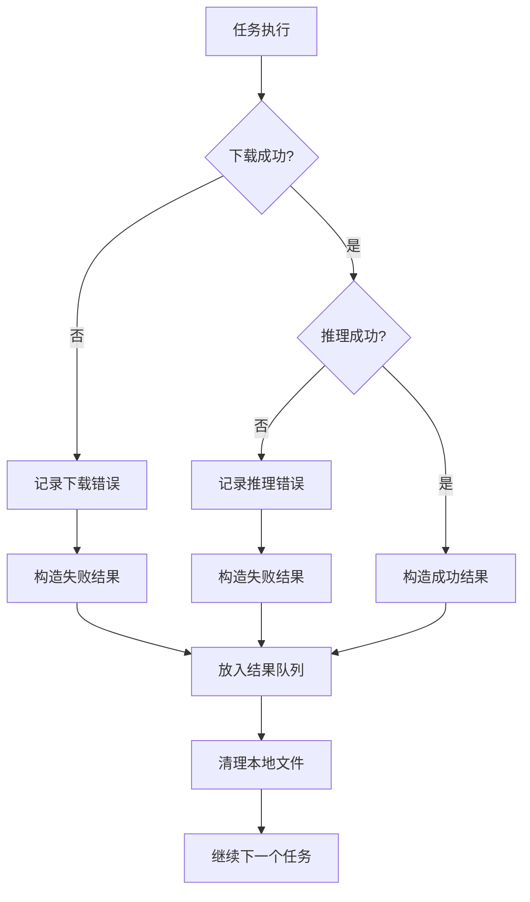

### 10.2 重试机制

- 模型推理任务继承 `RetryTask`，支持自动重试
- 模型实例获取支持超时机制（默认 300 秒）
- 任务队列操作支持超时（默认 1200 秒）

---

## 11. 部署架构

### 11.1 分布式部署

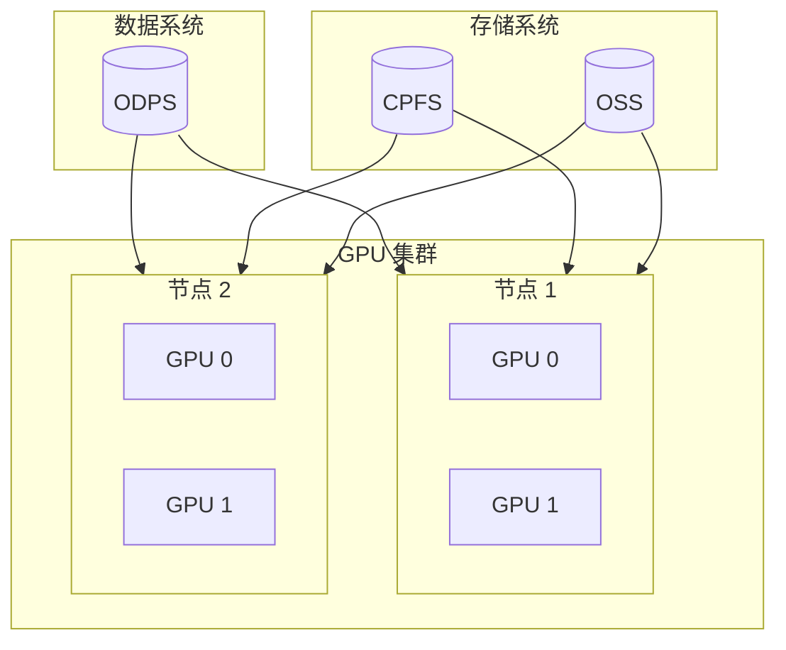

### 11.2 启动命令

```bash
# 单机多卡
torchrun --nproc_per_node=8 video_filter_parallel.py \
    --tables "odps://project/table/ds=20250115" \
    --outputs "odps://project/output_table/ds=20250115" \
    --vfx_enable true \
    --com_enable true \
    --rov_enable true \
    --low_quality_enable true
```

---

## 12. 总结

本项目实现了一个高效的视频质量过滤系统，主要特点包括：

1. **生产者 - 消费者架构**：解耦 I/O 和计算，最大化资源利用率
2. **多模型并行推理**：支持 VFX、SimCam、ROV、低质量等多种检测任务
3. **模型实例池**：独占式分配确保线程安全，预热机制减少冷启动开销
4. **三级存储策略**：CPFS → Alluxio → OSS，优化数据读取性能
5. **分布式支持**：基于 torchrun 的多进程多 GPU 推理
