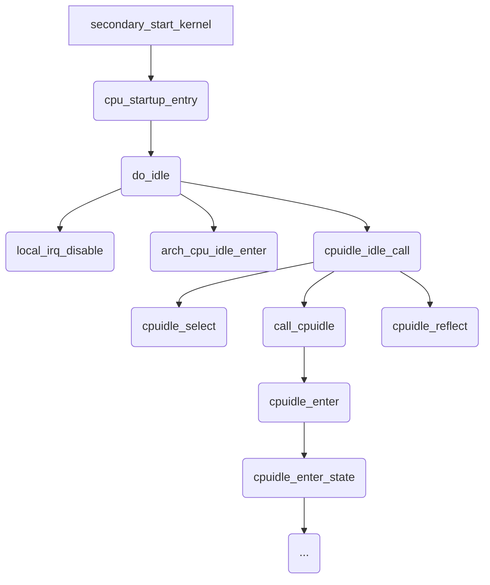
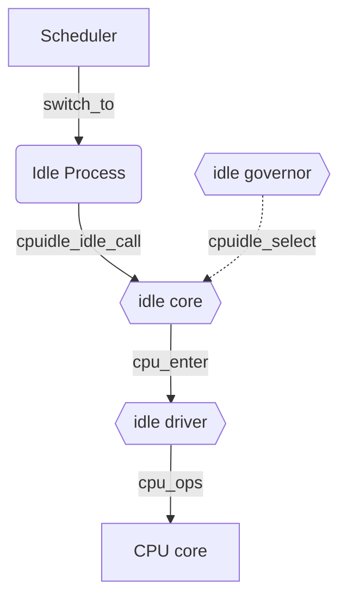

## 1. Abstract

本文主要研究 kernel 中的 idle 机制以及代码实现。

## 2. x86 idle state

来看一下 x86 的 idle state：

C-state 描述的是 CPU 处于空闲时的不同睡眠状态，包括 POLL C1 C1E和C6，它们统称为 C-states。CPU 的每种睡眠状态都消耗不同的功耗，并且对应用程序性能的影响也不同。这些状态的睡眠深度排序为 C6 > C1E > C1 > POLL。

POLL 状态表示 CPU 不睡眠，一直空跑或执行指令，这种状态下 CPU 性能最好，功耗也最大。

C1 状态是 CPU 的基本睡眠状态。当 CPU 没有任务需要处理时，会进入这个状态。这种状态下，CPU 的大部分电路会停止工作，从而降低功耗，但 CPU 可以迅速唤醒以继续处理任务。

==C1E（Enhanced C1）== 是 C1 状态的增强，进一步提高了节能效果。在 C1E 状态下，CPU 可以**动态降低其频率和电压**，以达到更低的功耗。

C6 状态是一个更深的节能状态，通常能将 CPU 的功耗进一步降低到非常低的水平。在这个状态下，CPU 的核心可能会关闭电源，从而实现更显著的节能效果。

当 CPU 从一个更深的 C-state 返回到运行状态时，CPU 被唤醒的时间也更长，对应用程序性能影响也更大。

|**状态**|**描述**|**延迟**|**功耗**|**说明**|
|---|---|---|---|---|
|**C0**|工作状态（非 Idle）|0|高|CPU 正在运行任务，不是空闲状态|
|**C1**|第一个 Idle 状态|低|中|快速响应，可立即唤醒|
|**C1E**|C1 Enhanced（增强型 C1）|低|更低|在 C1 的基础上降低电压/频率（一般 BIOS 控制）|
|**C2**|更深层 Idle|中|更低|延迟略高于 C1，现代系统中不常见|
|**C3**|停止 L2 缓存|更高|更低|停止更多组件，唤醒延迟变大|
|**C6**|Save 内核状态并切断供电|高|极低|将核心寄存器状态写入内存，彻底切断电源|
|**C7**|更深的 Idle，比 C6 更激进|非常高|最低|只有现代架构支持，如 Haswell/Broadwell 等|
|**POLL**|短暂空转等待状态（不是省电）|极低|高|通常为驱动内部逻辑，不建议启用为省电手段|

对比一下 C1E 和 C6 state 的区别：

| **特性** | **C1E**            | **C6**                 |
| ------ | ------------------ | ---------------------- |
| 功能     | 类似 C1，但更进一步降低电压/频率 | 将 CPU 核心电源关闭，状态写入内存    |
| 响应速度   | 非常快（<10 微秒）        | 慢得多（>100 微秒）           |
| 适用场景   | 高频次短暂 idle（频繁进出）   | 长时间空闲或低负载系统            |
| 由谁控制   | 多数时候由 BIOS 启用      | 由操作系统 + 硬件协同控制         |
| 对性能影响  | 非常小，几乎无影响          | 可能影响延迟敏感任务，尤其是高频唤醒场景   |
| 是否推荐开启 | 通常推荐开启             | HPC / 低延迟场景建议关闭以减少唤醒延迟 |

如果需要查看当下支持的 idle 状态：

```bash
cpupower idle-info
```

或者：

```bash
cat /sys/devices/system/cpu/cpu0/cpuidle/state*/name
```


## 3. Function Flow

我们先对大体上的函数调用栈进行一个简单的示意图总结：



cpuidle_enter_state() 之后的流程可以参考 tick_broadcast_oneshot_control() 的分析。

## 4. cpu_startup_entry

笔者在实际的业务场景中抓取过 idle 函数的调用栈，大概如下所示：

```text {4,6,7}
[] [pid:0,cpu6,swapper/6,0] show_stack+0x14/0x1c
[] [pid:0,cpu6,swapper/6,1] dump_stack_lvl+0xb8/0x108
[] [pid:0,cpu6,swapper/6,2] dump_stack+0x14/0x1c
[] [pid:0,cpu6,swapper/6,3] cpuidle_select+0x20/0x54
[] [pid:0,cpu6,swapper/6,4] 0xffffffe55f4d072c
[] [pid:0,cpu6,swapper/6,5] cpu_startup_entry+0x20/0x24
[] [pid:0,cpu6,swapper/6,6] secondary_start_kernel+0x1e8/0x208
[] [pid:0,cpu6,swapper/6,7]CPU: 6 PID: 0 Comm: swapper/6 VIP: 00
[] [pid:0,cpu6,swapper/6,8]TGID: 0 Comm: swapper/6
[] [pid:0,cpu6,swapper/6,9]Hardware name: xxx (DT)
```

这是一个很关键的调用栈，我们可以看到 `cpu_startup_entry` 会调用到 `cpuidle_select`, 在图中进行了高亮。

`start_kernel`  →  `rest_init`  →  `cpu_startup_entry`, 基本的调用关系可以如此理解，看 `cpu_startup_entry` 的实现：

```c
// in kernel/linux-5.10/kernel/sched/idle.c
void cpu_startup_entry(enum cpuhp_state state)
{
	arch_cpu_idle_prepare();
	cpuhp_online_idle(state);
	while (1)
		do_idle();
}
```

:::note cpu_startup_entry 流程

- `void cpu_startup_entry(enum cpuhp_state state)`
  - `arch_cpu_idle_prepare()`，进行 idle 前的准备工作，ARM64 中没有实现
    - cpu idle loop: 进入 cpuidle 的主循环；在上面代码中体现为 while loop
      - …
      - *下面的流程见 `do_idle()`*

:::

也就是说，idle 线程执行的时候，是一直在运行这个 `do_idle()` 的。

## 5. do_idle

`do_idle()` 会执行 CPU idle 的主要操作。

:::note cpu_idle_loop 调用流程 static void do_idle(void)

- `__current_set_polling()`: 后续研究
- `tick_nohz_idle_enter()`: 后续研究

- 如果系统当前不需要调度（`while (!need_resched())`），执行后续的动作
  - local_irq_disable()，关闭 irq 中断

  - arch_cpu_idle_enter()，arch 相关的 cpuidle enter，ARM64 中没有实现
  - **cpuidle_idle_call()**，main idle function
    - cpuidle_select，通过 cpuidle governor，选择一个 cpuidle state
    - cpuidle_enter，通过 cpuidle state，进入该 idle 状态
    - …
    - 中断产生，idle 返回（注意，此时irq是被禁止的，因此CPU不能响应产生中断的事件）
    - cpuidle_reflect，通知 cpuidle governor，更新状态
    - local_irq_enable，使能中断，响应中断事件，跳转到对应的中断处理函数
    - …            

- arch_cpu_idle_exit，和 enter 类似，ARM64没有实现

:::

## 6. local_irq_dis(en)able

这个函数涉及到中断处理的相关操作，`local_irq_disable()` 会禁止本地中断的传递，在这个地方有 4 个相似的接口，可以加以区分便于使用：

|        函数         |                       说明                       |
| :-----------------: | :----------------------------------------------: |
| local_irq_disable() |                 禁止本地中断传递                 |
| local_irq_enable()  |        激活本地中断传递（无条件激活中断）        |
|  local_irq_save()   | 保存本地中断传递的当前状态，然后禁止本地中断传递 |
| local_irq_restore() |           恢复本地中断传递到更定的状态           |

通常而言，我们会使用 `local_irq_save()` 和 `local_irq_restore()` 配合使用，这样做的好处在于：我们在此之前并不知道本地中断是开启还是关闭的，如果要使我们的代码对中断的原始状态不做过多的影响，用这两个接口是非常合适的。再多说一些，`local_irq_enable()` 是会无条件激活中断的，尽管这个中断可能在开始时就是关闭的。

再回到禁止中断这个事情本身，通过禁止中断，可以确保某个中断处理程序不会抢占当前的代码；此外，禁止中断还可以禁止内核抢占。但是需要注意的是，禁止中断并不能避免来自其他处理器的并发访问（使用锁来防止并发访问，或者使用核独占的数据结构）。

实现禁止中断只需要使用一条汇编指令即可，在 arm64 中使用的是 `msr daifclr, #2` 来禁止中断。

## 7. cpuidle_idle_call

在外围对是否进入该函数有一个判断：

```c
if (cpu_idle_force_poll || tick_check_broadcast_expired()) {
    tick_nohz_idle_restart_tick();
    cpu_idle_poll();
} else {
    cpuidle_idle_call();
}
```

`cpu_idle_force_poll` 表示是否开启强制轮询模式，关于 idle polling 可以见下面章节的描述；

`tick_check_broadcast_expired` 表示 tick 是否过期需要重新开始以免进入深度睡眠。

在进入 cpuidle_idle_call 之后，会有一段较长的逻辑：

```c {5,11,30}
static void cpuidle_idle_call(void)
{
	// ...

	if (need_resched()) {
		local_irq_enable();
		return;
	}


	if (cpuidle_not_available(drv, dev)) {
		tick_nohz_idle_stop_tick();

		default_idle_call();
		goto exit_idle;
	}


	if (idle_should_enter_s2idle() || dev->forced_idle_latency_limit_ns) {
		// ...
		call_cpuidle(drv, dev, next_state);
	} else {
		next_state = cpuidle_select(drv, dev, &stop_tick);

		if (stop_tick || tick_nohz_tick_stopped())
			tick_nohz_idle_stop_tick();
		else
			tick_nohz_idle_retain_tick();

		entered_state = call_cpuidle(drv, dev, next_state);

		cpuidle_reflect(dev, entered_state);
	}

exit_idle:
	__current_set_polling();
	// ...
}
```

 我们去除了一些复杂细节，专注于我们的主体流程研究。

cpuidle_idle_call 函数刚开始，先是两个判断：

1. need_resched(): 是否有任务过来需要调度？
2. cpuidle_not_available(drv, dev): 驱动是否支持？

这两个判断的结果比较明显，分支预测准确的概览也较大。

接下来的流程就是进行判断，根据策略的不同走不同的分支，最终都会调用到函数 call_cpuidle.

## 8. call_cpuidle

该函数的逻辑比较简单，就是一些特殊情况的判断，而后进行 **cpuidle_enter** 函数的调用：

```c
static int call_cpuidle(struct cpuidle_driver *drv, struct cpuidle_device *dev,
		      int next_state)
{
	if (current_clr_polling_and_test()) {
		// ...
		return -EBUSY;
	}

	return cpuidle_enter(drv, dev, next_state);
}
```

cpuidle_enter 的逻辑也是非常简单，进行一个判断：

```c{6,8}
int cpuidle_enter(struct cpuidle_driver *drv, struct cpuidle_device *dev,
		  int index)
{
	// ...
	if (cpuidle_state_is_coupled(drv, index))
		ret = cpuidle_enter_state_coupled(dev, drv, index);
	else
		ret = cpuidle_enter_state(dev, drv, index);
	
    // ...
	return ret;
}
```

无论哪种情况，都是会进行 cpuidle_enter_state 函数的调用。

## 9. cpuidle_enter_state()

>  函数位置：kernel/linux-5.10/drivers/cpuidle/cpuidle.c

为了方便我们理解记忆，将该函数进行分解：

```c{19}
int cpuidle_enter_state(struct cpuidle_device *dev, struct cpuidle_driver *drv,
			int index)
{
    // ...
	if (index < 0)
		return index;

	broadcast = !!(target_state->flags & CPUIDLE_FLAG_TIMER_STOP);

	if (broadcast && tick_broadcast_enter()) {
		// maybe return
	}

	if (target_state->flags & CPUIDLE_FLAG_TLB_FLUSHED)
		leave_mm(dev->cpu);

	if (!(target_state->flags & CPUIDLE_FLAG_RCU_IDLE))
		rcu_idle_enter();
	entered_state = target_state->enter(dev, drv, index);
	if (!(target_state->flags & CPUIDLE_FLAG_RCU_IDLE))
		rcu_idle_exit();

	/* The cpu is no longer idle or about to enter idle. */
	sched_idle_set_state(NULL);

	if (broadcast) {
		
	}

	if (!cpuidle_state_is_coupled(drv, index))
		local_irq_enable();

	if (entered_state >= 0) {
		
	} else {
	}

	return entered_state;
}
```

这个函数核心的逻辑是进入给定 index 的 idle 状态 `target_state->enter(dev, drv, index);`,  然后将这个状态返回；但是在实际的实现中，因为涉及到中断、tick、配置等逻辑，所以比较复杂。

下文是对代码中细节和原理的研究：

### 9.1. broadcast

```c
broadcast = !!(target_state->flags & CPUIDLE_FLAG_TIMER_STOP);
```

这行代码的作用是设置一个广播标志，判断是否需要停止定时器。其中，target_state  是一个指向 cpuidle_state 结构体的指针，该结构体描述了 CPU 的空闲状态，包括状态标识、所需的底层硬件支持、进入和退出该状态所需的操作等信息。

具体来说，target_state->flags 是一个位掩码，用于描述该空闲状态标识的一些特定属性。&运算符将该位掩码与 CPUIDLE_FLAG_TIMER_STOP 逐位进行 AND 运算，结果非零则表示 target_state 的 flags 属性中存在 CPUIDLE_FLAG_TIMER_STOP 标志，即需要停止定时器。*!!* 运算符则将结果转换为布尔类型，确保在任何情况下返回的都是 0 或 1 的布尔值，而不是整型数值（双重否定表示肯定）。

因此，这行代码最终会将广播标志设置为 true 或 false，表示需要或不需要停止定时器。在 CPU 进入空闲状态之前，内核会根据广播标志来决定是否向其他 CPU 广播空闲状态，并通知它们停止当前正在运行的定时器。

简单来说，如果 local timer 关闭的话（进入更深层次的 idle 状态），就需要使用 broadcast.

### 9.2. CPUIDLE_FLAG_TLB_FLUSHED

```c
if (target_state->flags & CPUIDLE_FLAG_TLB_FLUSHED) {
    leave_mm(dev->cpu);
}
```

这段代码的作用是，**在CPU进入指定的空闲状态之前检查该状态是否需要刷新TLB**，并在必要时执行离开当前进程的操作。（从实测的数据来看，基本上没有刷新 TLB 的操作，这段逻辑很少被执行）

其中，target_state 是一个指向 cpuidle_state 结构体的指针，描述了要进入的空闲状态，包括状态标识、所需的底层硬件支持和进入该状态所需的操作等信息。flags 字段表示该状态的一些特殊属性，如 CPUIDLE_FLAG_TLB_FLUSHED，表示在进入该状态前需要刷新 TLB（Translation Lookaside Buffer）。

如果检测到目标状态需要刷新 TLB，则调用 `leave_mm(dev->cpu)` 函数执行离开当前进程的操作。该函数的作用是在该 CPU 上的所有进程中暂停当前进程，并切换到空闲进程，以便操作系统在进入空闲状态之前刷新 TLB 高速缓存。

总之，这段代码的作用是确保在进入特定的空闲状态之前清除 TLB 以避免任何不必要的冲突，同时保证进程能够正确地切换。

### 9.3. sched_idle_set_state

```c
/* Take note of the planned idle state. */
sched_idle_set_state(target_state);

// 其实现如下：
void sched_idle_set_state(struct cpuidle_state *idle_state)
{
	idle_set_state(this_rq(), idle_state);
}
```

这段代码的作用是将当前 CPU 切换到指定的空闲状态，也就是进入一种较低功耗的状态以进行省电。注意到在我们的 cpuidle_enter_state 流程中，这个 sched_idle_set_state 函数被两次调用：

```c
/* Take note of the planned idle state. */
sched_idle_set_state(target_state);

// ...

/* The cpu is no longer idle or about to enter idle. */
sched_idle_set_state(NULL);
```

`sched_idle_set_state` 是一个内核函数，用于设置当前 CPU 的空闲状态，并让 CPU 进入相应的空闲状态。target_state 是一个指向 cpuidle_state 结构体的指针，描述了要进入的空闲状态，包括状态标识、所需的底层硬件支持和进入该状态所需的操作等信息。

`this_rq()` 表示*当前 CPU 所在的 CPU 运行队列*（runqueue），它的返回值是一个指向 `struct rq` 结构体的指针，该结构体描述了 CPU 调度器的运作情况和统计信息。

在调用该函数之前，内核通常会执行一些准备工作，如停止定时器、暂停当前进程、刷新 TLB 等。接着，调用该函数将当前 CPU 切换到目标状态，并执行目标状态所需的操作，如关闭某些设备、降低 CPU 主频等。

整个过程是由内核负责管理和控制的，程序员无法直接控制。当系统需要重新唤醒 CPU 时，内核会根据 CPU 的中断或事件触发来驱动 CPU 从空闲状态中返回，并恢复相关的设备和资源。

### 9.4. rcu_idle_enter

```c
if (!(target_state->flags & CPUIDLE_FLAG_RCU_IDLE))
    rcu_idle_enter();
```

这段代码用于判断当前进入空闲状态的目标状态是否需要进行**RCU（Read-Copy-Update）空闲处理**，如果需要，则调用 `rcu_idle_enter` 函数进行 RCU 空闲处理。

在Linux内核中，RCU是一种无锁机制，用于在多个进程间共享数据。当一个进程需要修改共享数据时，该进程会先创建出一个新的副本，对其进行修改，然后将新副本加入到RCU保护区中。此时，其他进程仍然可以访问旧的副本，不会受到影响。当所有对旧副本的访问都结束后，RCU保护区才会被清空，新副本才会变成有效的数据。

在进入空闲状态时，如果当前CPU正在进行RCU更新操作，就需要进行RCU空闲处理，即等待所有正在使用旧副本的进程完成访问后，再进行新副本的更新。这样一来，就可以避免数据的冲突和不一致性。

rcu_idle_enter函数用于启动RCU空闲处理，并进入RCU空闲状态。该函数会将当前CPU所在的调度器的状态设置为RCU空闲状态，然后等待所有正在使用旧副本的进程访问完毕，直到RCU保护区被清空。在此期间，该CPU不会执行任何其他任务，以避免对正在访问旧副本的进程产生干扰。

```c
void rcu_idle_enter(void)
{
	lockdep_assert_irqs_disabled();
	rcu_eqs_enter(false);
}
```

`rcu_idle_enter` 函数是用于启动RCU空闲处理并进入RCU空闲状态的函数。

其中，`lockdep_assert_irqs_disabled` 函数用于断言**当前中断已经被禁止**，在RCU空闲处理期间不会被重新打开。该函数会在执行时检查当前是否处于内核锁定状态，并通过锁依赖机制确保锁的正确性。如果当前存在锁冲突，则会抛出一个警告信息。

`rcu_eqs_enter` 函数则用于进入RCU空闲状态并等待所有正在使用旧副本的进程访问完毕。其中，参数false表示*不需要检查是否处于内核软件调试状态*（KDB或KGDB）。在该函数中，会调用rcu_prepare_for_idle函数进行RCU更新准备工作，并将当前CPU所在的调度器状态设置为RCU空闲状态。然后，该函数会启动一个RCU处理线程，在其中等待所有正在使用旧副本的进程访问完毕并结束。❓❓ 待处理线程结束之后，该函数会将当前CPU所在调度器状态设置为正常运行状态，并返回。

### 9.5. enter

```c
entered_state = target_state->enter(dev, drv, index);
```

进入 state, 待深入研究。❌❌❌

### 9.6. rcu_idle_exit

```c
if (!(target_state->flags & CPUIDLE_FLAG_RCU_IDLE))
    rcu_idle_exit();
```

这段代码用于判断目标状态是否为RCU空闲状态，并在不是RCU空闲状态时退出RCU空闲处理。

如果目标状态的flags字段中包含CPUIDLE_FLAG_RCU_IDLE标志，说明此时需要进入RCU空闲状态，即需要等待所有正在访问旧副本的进程结束后再进行新副本的更新。此时，不需要退出RCU空闲处理，代码直接跳过。

但如果目标状态的flags字段中不包含CPUIDLE_FLAG_RCU_IDLE标志，则代表当前并不需要进行RCU空闲处理。此时，需要通过rcu_idle_exit函数退出RCU空闲处理。该函数会将当前CPU所在的调度器状态设置为正常运行状态，并唤醒所有等待RCU更新的进程（如等待RCU更新的进程队列等）。这样一来，RCU更新操作就可以继续进行，而不会被阻塞在RCU空闲状态中。

需要注意的是，只有在完成了RCU更新操作之后，才能调用rcu_idle_exit函数退出RCU空闲状态。否则，会引起数据访问冲突和不一致性，导致系统出现异常。因此，在使用该函数时，需要保证系统支持RCU机制，并遵循相关的使用原则和规范。

### 9.7. critical_timings

```c
stop_critical_timings();
// ...
start_critical_timings();
```

`stop_critical_timings` 用于停止内核关键代码段的性能计数和统计，以便进行性能分析和优化。该函数通常在内核调试、性能测试等场景下使用，以了解内核关键代码段的耗时和执行情况，从而进行优化。

该函数会将内核当前的性能计数器（如TSC、APIC计数器等）停止，并记录下停止时的值，然后将所有的性能计数器状态都设置为暂停。这样一来，在停止之前和停止之后，所有关键代码段的执行时间就可以计算出来了。

`start_critical_timings` 的作用正好相反，就不过多赘述了。

## 10. idle polling

idle polling 是一个空闲轮询机制。

我们来看代码：

```c
#ifdef CONFIG_GENERIC_IDLE_POLL_SETUP
static int __init cpu_idle_poll_setup(char *__unused)
{
	cpu_idle_force_poll = 1;

	return 1;
}
__setup("nohlt", cpu_idle_poll_setup);

static int __init cpu_idle_nopoll_setup(char *__unused)
{
	cpu_idle_force_poll = 0;

	return 1;
}
__setup("hlt", cpu_idle_nopoll_setup);
#endif
```

`cpu_idle_poll_ctrl`可以作为一个调度器选项，对空闲轮询机制进行控制。其具体做法是：

- 当`cpu_idle_poll_ctrl=1`时，空闲轮询机制被启用，调度器会直接检查是否有可运行的进程；

- 当`cpu_idle_poll_ctrl=0`时，空闲轮询机制被禁用，CPU会挂起或执行某些简单指令以等待其他事件的发生。

在传统的CPU调度方案中，当CPU处于空闲状态时，调度器通常会挂起CPU或让CPU执行一些简单的指令，以避免CPU浪费过多的时间。而在空闲轮询机制下，调度器会在CPU空闲时，立即检查系统中是否有可运行的进程，如果有，则立即唤醒该进程并将CPU分配给它。

具体的 polling 实现可能会分成很多种，如 busy-waiting, 表示如果没有可以运行的进程的话，则调度器会继续等待下一次轮询；如 sleep, 当 CPU 空闲时，会将整个 CPU 设置为休眠状态，以节能。

## 11. DEFINE_PER_CPU

`DEFINE_PER_CPU` 是一个宏，用于定义一种特殊的变量类型，称为 "per-cpu 变量"。这种变量在 Linux 内核中广泛使用，用于跨多个 CPU 核心共享数据时保证数据的一致性。

使用 `DEFINE_PER_CPU` 宏定义的变量，会在每个 CPU 核心上都创建一个独立的副本，并通过内核提供的函数接口进行同步和访问。这样，在多核系统中，不同 CPU 核心上的代码可以同时访问该变量，而不会出现数据竞争或者锁竞争等问题。

具体来说，`DEFINE_PER_CPU` 宏的语法如下：

```c
DEFINE_PER_CPU(type, var);
```

其中，`type` 指定了变量的类型，`var` 是变量名。例如：

```c
DEFINE_PER_CPU(int, my_var);
```

上述代码定义了一个名为 `my_var` 的 per-cpu 整型变量。在汇编层面，编译器会自动生成对应的代码，以便为每个 CPU 核心上创建一个独立的 `int` 类型的变量，并对其进行初始化和管理。在 C 代码层面，程序员可以通过 `get_cpu_var()` 和 `put_cpu_var()` 等函数来访问和修改 per-cpu 变量的值，例如：

```c
int val = get_cpu_var(my_var);
put_cpu_var(my_var, val+1);
```

需要注意的是，per-cpu 变量仅适用于每个 CPU 核心独立使用的数据，并不适用于需要全局同步的数据结构。此外，需要注意内存分配和访问的开销，以避免影响系统的性能。

## 12. Idle Data Struct

### 12.1. Abstract

本章节主要针对性分析 Idle 中的数据结构。在 kernel 中的 cpuidle framework 主体包括三个模块：cpuidle core, cpudile governors 和 cpuidle drivers.

**cpuidle core**: 负责整体框架，对接 sched 模块，调度器发现没有任务在执行的时候，就切换到 idle 进程，通知就会给 cpuidle core; cpuidle core 负责向 cpuidle driver/governors 模块提供统一的注册和管理接口，向用户空间提供 governor 选择的接口。

**cpuidle governors**: 在该模块进行 cpuidle 的选择；

**cpuidle driver**: 负责具体 idle 机制的实现。

总的来说，这几个的关系大致如下图所示：



### 12.2. cpuidle core

cpuidle core 是 cpuidle framework 的核心模块，负责抽象出 cpuidle device、cpuidle driver 和 cpuidle governor三个实体。

其负责的功能有：

1. （如上阐述）向底层的 cpuidle driver 模块提供 cpudile devic e和 cpuidle driver 的注册/注销接口；
2. （如上阐述）向 cpuidle governors 提供 governor 的注册接口；
3. 提供全局的 puidle 机制的开、关、暂停、恢复等功能；
4. （如上阐述）向用户空间程序提供 governor 选择的接口；
5. 向 kernel sched 中的 cpuidle entry 提供 cpuidle 的级别选择、进入等接口，以方便调用。

### 12.3. cpuidle device

在现在的 SMP 系统中，每个 cpu core 都会对应一个 cpuidle device, 内核通过 `strcut cpuidle_device` 抽象 cpuidle device.


### 12.4. cpuidle driver

cpuidle driver 是一个 “driver", 其驱动的对象是 cpuidle device, 也就是 CPU；注意到在 SMP 系统中，有多个 CPU，也就意味着有多个 cpuidle device; 在实现 idle 的时候，如果这些 cpuidle device 的功能、参数相同，则可以使用一个 cpuidle driver 驱动，具体而言，kernel 中的宏 `CONFIG_CPU_IDLE_MULTIPLE_DRIVERS` 可以用来使能是否使用多个 cpu driver.  在实际的应用场景中，这个开关是被使能的。

代码可见 https://github.com/torvalds/linux/blob/master/include/linux/cpuidle.h

```c {10,17}
/****************************
 * CPUIDLE DRIVER INTERFACE *
 ****************************/

struct cpuidle_driver {
	const char		*name;
	struct module 		*owner;

        /* used by the cpuidle framework to setup the broadcast timer */
	unsigned int            bctimer:1;
	/* states array must be ordered in decreasing power consumption */
	struct cpuidle_state	states[CPUIDLE_STATE_MAX];
	int			state_count;
	int			safe_state_index;

	/* the driver handles the cpus in cpumask */
	struct cpumask		*cpumask;

	/* preferred governor to switch at register time */
	const char		*governor;
};
```

`bctimer:1`: 一个标志，用于指示在 cpuidle driver 注册和注销时，是否需要设置一个 broadcast timer;

`cpumask`: 一个 struct cpumask 结构的 bit map 指针，用于说明该 driver 支持哪些 cpu core;

`states`, `state_count`：该 driver 所支持的 idle state 及其个数。cpuidle driver 的主要任务就是定义所支持的 cpuidle state; 需要注意注释中所提到的，`states` 应该按照功耗大小降序排列。

cpuidle driver 的注册，我们在这边主演研究多个  cpu driver 的场景，主要是分为几个：

💄 `__cpuidle_get_cpu_driver`:

```c
static struct cpuidle_driver *__cpuidle_get_cpu_driver(int cpu)
{
    // 返回 pre_cpu 指针的值
	return per_cpu(cpuidle_drivers, cpu);
}
```

💄`__cpuidle_set_driver`

```c {14}
static inline int __cpuidle_set_driver(struct cpuidle_driver *drv)
{
	int cpu;

	for_each_cpu(cpu, drv->cpumask) {
		struct cpuidle_driver *old_drv;

		old_drv = __cpuidle_get_cpu_driver(cpu);
		if (old_drv && (old_drv != drv))
			return -EBUSY;
	}

	for_each_cpu(cpu, drv->cpumask)
		per_cpu(cpuidle_drivers, cpu) = drv;

	return 0;
}
```

- 对于每个 cpumask 的 cpu, 设置 drv; 条件是原有的 cpu 无 drv 或者是有 drv 并且和需要设置的不相等（不相等的话直接 return 不进行设置）
- 设置的方法如高亮行所示


## 13. Something Else

### 13.1. tickless

> In the context of operating systems, "tickless" refers to a power management feature that allows the system to reduce power consumption by dynamically adjusting the frequency of timer interrupts.

About "tick" interrupt:

> Traditionally, operating systems use a periodic timer interrupt, often called the "tick," to keep track of time and to perform various tasks such as updating the system clock, scheduling tasks, and handling interrupts. These timer interrupts are generated at a fixed frequency, regardless of whether there is any work to be done, which can consume a significant amount of power.

### 13.2. WFI

WFI 是英文 Wait for Interrupt 的缩写，意为等待中断。WFI 指令是 ARM 处理器提供的一种指令，用于将处理器置于等待状态，直到下一个中断事件发生后才会继续执行。

Arm64 提供了 WFI 指令，使得 CPU 一旦执行该指令就进入低功耗状态，该状态会关闭 CPU 时钟，从而降低动态功耗。

如果我们想实现一个简单的 idle 的话，需要以下的流程即可[^1]：

```c
while (1) {
	if (condition)
		break;
}
```

在上述代码中，我们的 CPU 空转一直等待某个条件成立；这是最简单的实现方法。

而 Arm64 提供的 WFI 指令可以帮助系统降低功耗。此外，操作系统还可以通过 WFI 指令实现快速唤醒，以保证系统的响应速度和实时性。

---


[^1]: https://zhuanlan.zhihu.com/p/539722367
[^2]: http://kernel.meizu.com/linux-tick-and-tickless.html
[^3]: https://zhuanlan.zhihu.com/p/374902282

